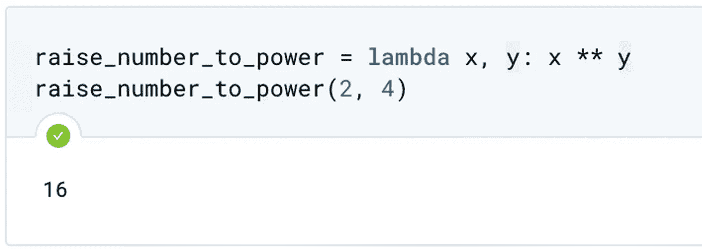
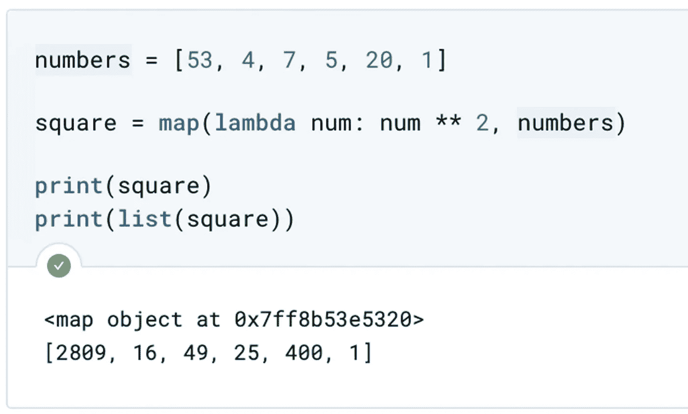
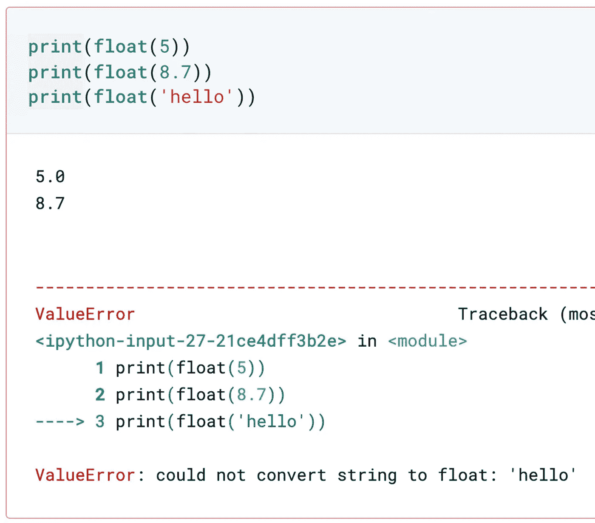
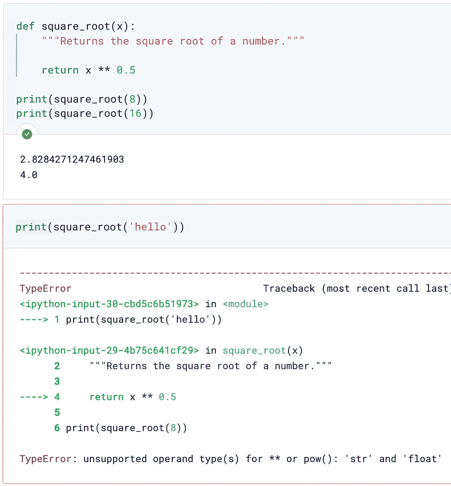
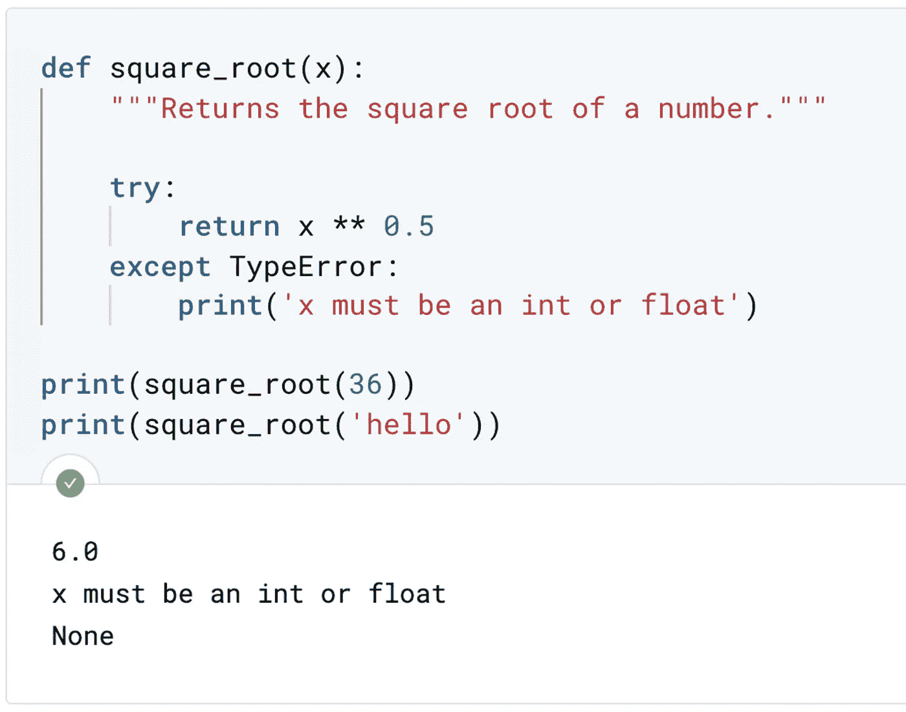
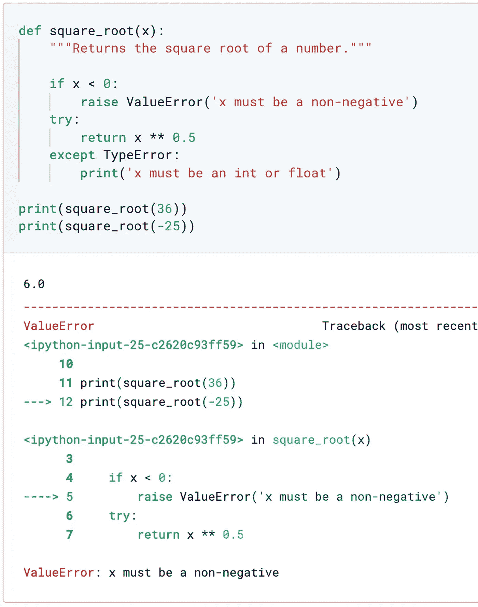

# Lambda 函数示例和错误处理

> 原文：<https://towardsdatascience.com/lambda-functions-with-example-and-error-handling-d9d3ec0b30d4?source=collection_archive---------11----------------------->


Lambda 函数和错误处理。照片由 [Pexels](https://www.pexels.com/photo/person-using-macbook-pro-1181373/?utm_content=attributionCopyText&utm_medium=referral&utm_source=pexels) 的[克里斯蒂娜·莫里洛](https://www.pexels.com/@divinetechygirl?utm_content=attributionCopyText&utm_medium=referral&utm_source=pexels)拍摄

## 给 PYTHON 开发者的提示

## 用肮脏的方式编写即时函数。不建议在所有情况下都这样做，但是这样很方便

## 先决条件

在经历这些之前，你需要熟悉在 Python 中定义自己的函数；否则，你会迷失在中间。下面的文章将会给你更多关于如何定义你自己的函数的信息。

[](/writing-your-own-functions-40d381bd679) [## 编写自己的函数

### 数据科学家需要具有特定功能的函数

towardsdatascience.com](/writing-your-own-functions-40d381bd679) [](/scope-of-variable-and-legb-rule-4d44d4576df5) [## 变量范围和 LEGB 规则

### 变量的作用域指的是你可以看到或访问变量的地方

towardsdatascience.com](/scope-of-variable-and-legb-rule-4d44d4576df5) [](/function-arguments-default-keyword-and-arbitrary-9588b5eaaef3) [## 函数参数:默认值、关键字和任意值

### 定义一个接受可变数量参数的函数

towardsdatascience.com](/function-arguments-default-keyword-and-arbitrary-9588b5eaaef3) 

Lambda 函数语法。图片由[作者](https://medium.com/@wiekiang)

有一种更灵活的方式来动态编写函数，这种方式被称为 lambda 函数。这是因为我们使用了关键字`lambda`。例如，我们编写一个名为`raise_number_to_power`的函数作为 lambda 函数。在关键字 lambda 之后，我们指定参数的名称，即`x`和`y`。然后，我们使用一个冒号，后面是定义我们希望函数返回什么的表达式。

Lambda 函数允许你以肮脏的方式编写即时函数，所以我不建议你一直使用它们，但是在某些情况下它们会非常有用。例如，map 函数有两个参数。一个函数和一个序列，比如一个列表，以及这个函数对序列中所有元素的作用。



映射函数中的λ。图片作者[作者](https://medium.com/@wiekiang)

我们甚至可以不命名 lambda 函数来映射，在这种情况下，我们称它们为匿名函数。例如，我们在一个 lambda 函数上使用一个 map，它对一个列表中的所有元素进行平方运算，你将把结果存储在一个`square`变量中。在打印`square`变量的同时，揭示了它是一个 map 对象。为了查看它包含的内容，我们使用函数列表将其转换为列表并打印结果。正如所料，这是一个包含原始列表中元素的方块的列表。

## 错误处理

当你误用一个函数时，它会抛出一个错误。例如，检查从数字或字符串返回浮点的函数 float。当您向函数 float 传递一个整数值时，会返回相应的 float。类似地，如果你给它一个字符串`8.7`，它将返回浮点值。



不正确地使用函数将返回错误。图片作者[作者](https://medium.com/@wiekiang)

但是，如果您向它传递字符串`hello`，Python 将抛出一个错误，告诉您它无法将字符串转换为 float。在这种情况下，它抛出了一个`ValueError`，并且有许多类型的错误。当我们编写函数时，我们可能希望发现特定的问题并编写特定的错误消息。让我们来看看计算数字平方根的用户定义函数。它像预期的那样处理整数。如果我们给它传递一个字符串，比如`hello`，会有什么结果？它会抛出一个错误，对应于函数定义中的一行代码。



将字符串转换为浮点错误。图片作者[作者](https://medium.com/@wiekiang)

这个错误说它是一些`TypeError`，但是这个消息可能对我们函数的用户不是特别有帮助，所以我们应该尝试为我们编写的函数提供有用的错误消息。

捕捉此类异常的主要方法是 try-except 子句，在该子句中，Python 尝试在尝试之后运行代码，如果可以，一切正常。如果由于异常而无法工作，它将运行异常代码。现在让我们重写我们的`square_root`函数，但是这一次捕捉任何引发的异常。在这个例子中，我们试图执行`x`的`0.5`次方。使用 except，在出现异常的情况下，我们打印`x must be an int or float`。我们看到，结果函数对于整型和浮点型都工作得很好，并且打印出了我们想要的字符串。



用消息捕获 TypeError。图片作者[作者](https://medium.com/@wiekiang)

我们也可能只希望捕获`TypeError`并让其他错误通过，在这种情况下，我们将使用 except `TypeError`。可以检测到许多不同类型的异常，您可以查看在线提供的 Python 文档。您将希望通过使用关键字`raise`来引发一个错误，而不是简单地打印一个错误消息。



使用条件提高 ValueError。图片作者[作者](https://medium.com/@wiekiang)

例如，`square_root`函数在应用于负数时做了一些我们可能不想要的事情。它返回一个我们可能不想要的复数。假设我们不希望我们的函数适用于负数。使用 if 子句，我们可以在用户向函数传递一个负数的情况下引发一个`ValueError`。如果我们给我们的新函数一个负数，看它返回规定的`ValueError`。

```
**Other Interesting Articles**#1 [Function Arguments: Default, Keyword, and Arbitrary](/function-arguments-default-keyword-and-arbitrary-9588b5eaaef3)#2 [Scope of Variable and LEGB Rule](/scope-of-variable-and-legb-rule-4d44d4576df5)#3 [Writing Your Own Functions](/writing-your-own-functions-40d381bd679)#4 [Python: Procedural or Object-Oriented Programming?](/python-procedural-or-object-oriented-programming-42c66a008676)#5 [Data Science with Python: How to Use NumPy Library](/data-science-with-python-how-to-use-numpy-library-5885aa83be6b)#6 [Do you have the Software Engineer and Data Scientist skills?](/do-you-have-the-software-engineer-and-data-scientist-skills-probably-not-7e8fb069e067)
```

## 关于作者

**魏江**是一名研究员，负责收集、组织和分析意见和数据，以解决问题、探索问题和预测趋势。

他几乎在机器学习和深度学习的每个领域工作。他正在一系列领域进行实验和研究，包括卷积神经网络、自然语言处理和递归神经网络。

*连接上* [*LinkedIn*](https://linkedin.com/in/wiekiang)