# 登录代码:将登录页面应用到 Jupyter 笔记本中

> 原文：<https://towardsdatascience.com/landing-code-applying-landing-page-into-jupyter-notebook-4cdef561881f?source=collection_archive---------43----------------------->


**图一。**登陆代码亮点(图片作者， [Unsplash](https://unsplash.com/s/photos/data) ， [IRA 设计](https://iradesign.io/gallery/illustrations)，[多像素](https://www.manypixels.co/gallery/))

## 数据可视化

## 引入交互式 Python 编程的新概念

编译 Python 代码有很多选择。可以在终端、IPython、Spyder、Jupyter 笔记本等运行。如果你想要一个交互式编译器，也许你会选择 Jupyter 笔记本。但是，IPython(*交互式 Python* 的简称)是一个不错的选择。

有两种类型的 IPython 可以选择，IPython Shell 和 IPython Notebook。要打开 IPython Shell，只需在终端中写 ***ipython*** ，输入***ipython notebook***即可打开 IPython Notebook。那么，IPython 笔记本和 Jupyter 笔记本有什么区别呢？我没有把握回答它。但是，如果你通过终端启动 IPython 笔记本，会被建议输入 ***jupyter 笔记本*** ，而不是 ***ipython 笔记本*** ，如图 2 所示。我觉得 IPython 笔记本在和 Jupyter 笔记本迁移融合。

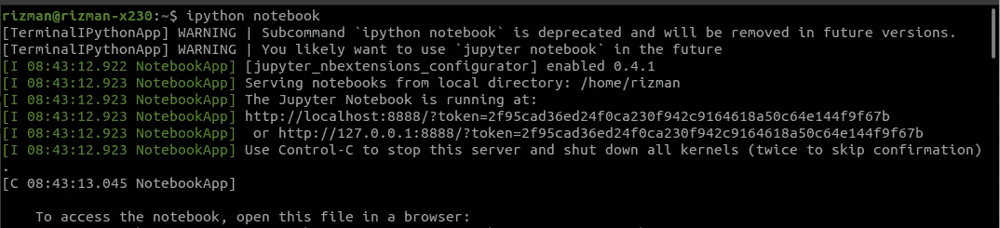

**图二。**终端中的 IPython 笔记本(图片由作者提供)

新的替代方案是 Jupyter 实验室，但我不熟悉它。我用 Jupyter 笔记本更方便。也许，我将来会写一个关于它的故事。

## **主要目标**

在这个故事中，我将与你分享一个用 Python 进行交互式编码的新概念。我给大家介绍 ***登陆代码*** ，一个将网站框架中的登陆页面应用到 Jupyter 笔记本中。您可以在图 1 中看到我制作的登录代码的突出部分。

Yups，我将分享如何在你的 Jupyter 笔记本(以下简称 Jupyter)中建立一个登陆代码。它将给你一个交互式 Python 编码的新体验，并以一种新的方式呈现你的代码，感受一种新的氛围。

在我们建立一个登陆代码之前，我想告诉你建立它的概念。着陆代码建立在 Jupyter 单元中，采用 Markdown 类型。我已经在 Jupyter 中解释了一些细胞类型；你可以在下面的链接中查看。

[](https://medium.com/@rizman18/how-can-i-customize-jupyter-notebook-into-dark-mode-7985ce780f38) [## 如何将 Jupyter 笔记本自定义为黑暗模式

### 一个关于自定义 Jupyter 笔记本主题和轻松调整 Maptlotlib 参数的故事

medium.com](https://medium.com/@rizman18/how-can-i-customize-jupyter-notebook-into-dark-mode-7985ce780f38) 

## 问题和解决方案

我们将在构建登陆代码时面临一些问题。当然，我会给你另外的解决方法。首先，我们不能在 Jupyter 单元格中运行 CSS，只能运行 HTML (Markdown)。我认为这是一个大问题。但是没关系。我们将用简单的图形设计技巧来介绍它。因为我们不能使用 CSS，所以我们不能建立一个像登陆页面响应登陆代码。同样，我们将使用一个奇特的 HTML 和图形设计范例来解决它，比如使用渐变、阴影效果、空白、统一概念等。

## 准备元素

我们将建立一个登陆代码和一些在登陆代码页提供的参考页面。登录代码由页眉、主图像、正文和页脚组成，而引用页面由页眉、主图像和一些代码单元格类型组成。要实现它，我们需要一些元素。图 3 显示了我们构建登陆代码所需的标题和主要图像元素。

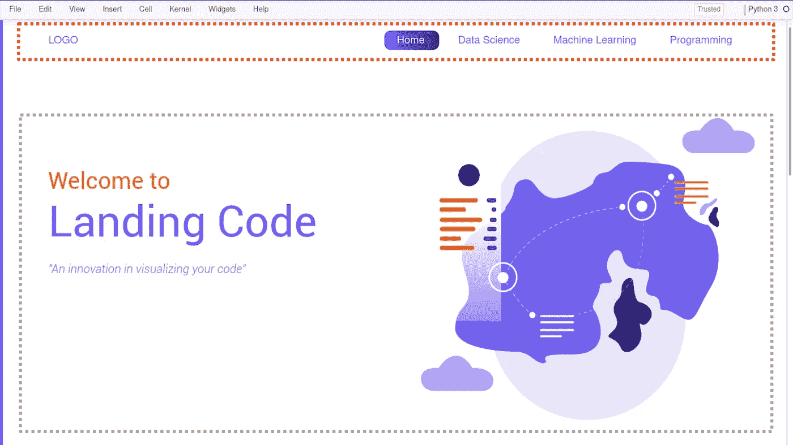

**图 3。**登陆代码中的页眉(红框)和主图片(灰框)元素(图片由作者和 [IRA 设计](https://iradesign.io/gallery/illustrations))。

我使用 HTML(包括超链接)创建标题文本(徽标、主页、数据科学、机器学习、编程)元素，并使用 Inkscape(像 Adobe Illustrator 这样的矢量图形软件)在主页中创建圆形蓝色按钮。主图像元素中的文本由 HTML 生成，图像从 [IRADesigns](https://iradesign.io/gallery/illustrations) 下载。感谢 IRADesigns，它提供了许多免费的插图。

主体元素由 6 篇文章及其标题、图片和副标题构成，如图 4 所示。每篇文章 6 张图片，从 [Unsplash](https://unsplash.com/s/photos/data) 下载，关键字“[数据](https://unsplash.com/s/photos/data)”。

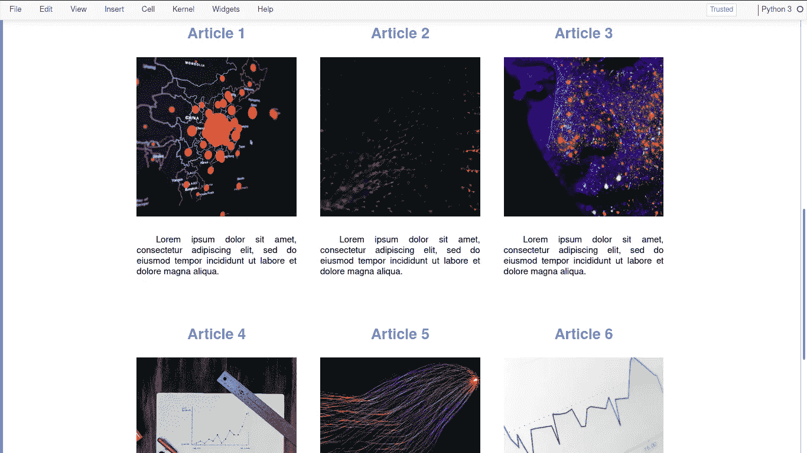

**图 4。**登陆代码中的主体元素(图片由作者和 [Unsplash](https://unsplash.com/s/photos/data) 带关键字“[数据](https://unsplash.com/s/photos/data)”)组成。

我使用简单的 HTML 为我的登录代码创建了一个简单的页脚，如图 5 所示。

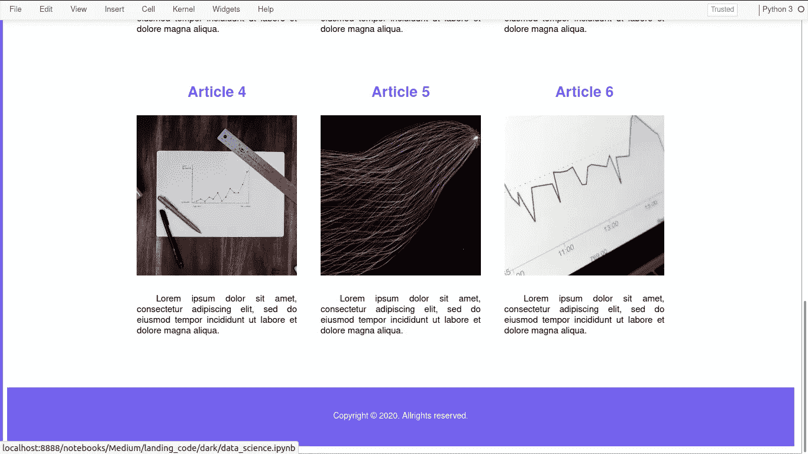

**图 5。**登陆代码和页脚元素中主体的某个部分(图片由作者和 [Unsplash](https://unsplash.com/s/photos/data) 带关键字“[数据](https://unsplash.com/s/photos/data)”)。

我创建了三个页面，数据科学页面，机器学习页面，以及参考页面的编程页面。它们的标题和主要图像元素如图 6 所示。

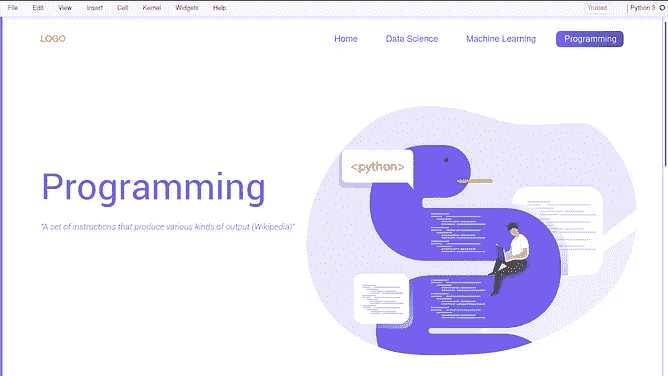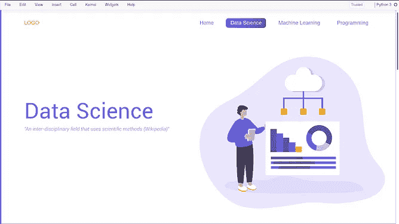

**图 6。**登陆码中每个引用页面的页眉和主图(图片作者和[多像素](https://www.manypixels.co/gallery/))。

每个引用页面的标题和主图像都由登录代码页中的相同概念构成。我从[多像素](https://www.manypixels.co/gallery/)下载图片。感谢[多像素](https://www.manypixels.co/gallery/)。在 Header 和 Main Image 之后，被引用的页面后面是代码单元，如图 7 所示。

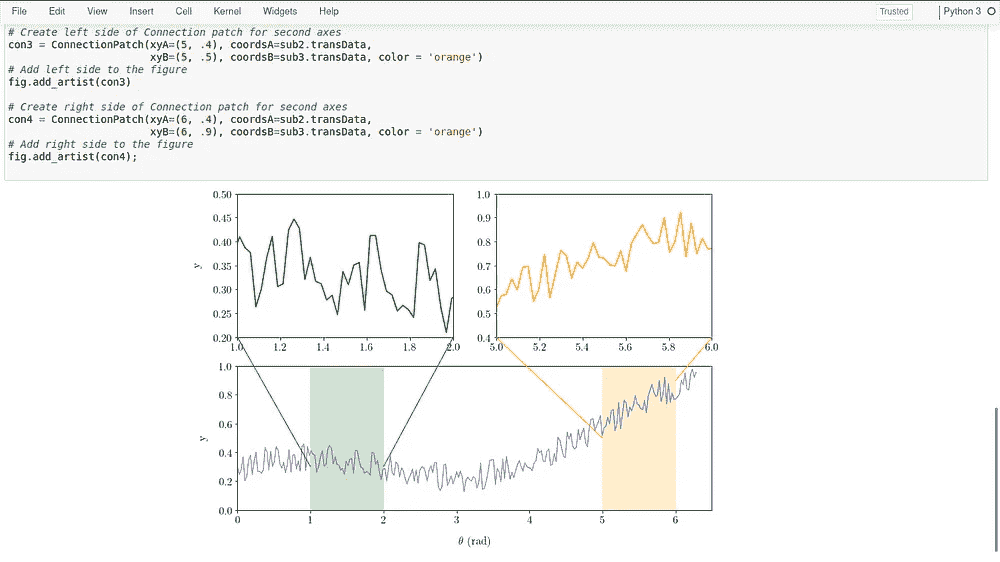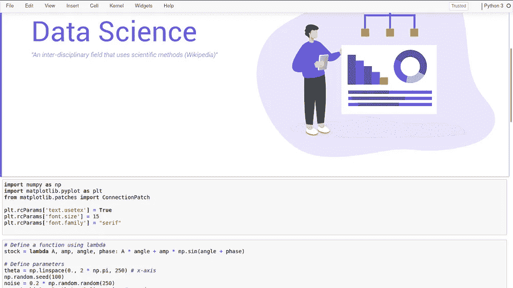

**图 7。**数据科学页面中的编码单元类型(图片由作者和[多像素](https://www.manypixels.co/gallery/)提供)。

## 程序

构建登陆代码的第一步是定制你的 Jupyter，使用 CSS 格式，而不是 jupyterthemes 库。您需要在 Jupyter CSS 文件中添加一些代码，命名为 ***custom.css*** 。可以在目录~/中获得。如果你找不到目录。朱庇特，也许它被你的背景隐藏了。可以通过按 Ctrl + H 查看隐藏的文件和目录，前缀**来解决。**(圆点)。如果您没有找到目录 custom 和文件 custom.css，您可以创建它们。custom.css 中包含的代码如图 8 所示。

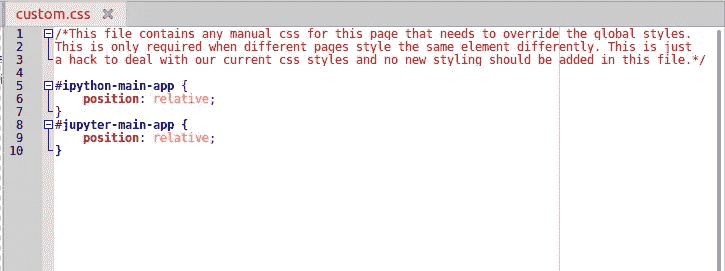

**图 8。**用 CSS 定制 Jupyter(图片由作者提供)。

如图 8 所示，custom.css 文件包含 Jupyter 页面的任何手动 css。我们只是在这里写附加的或者更新样式。在这一步的开始，我们将在 Jupyter 中隐藏 ***ln*** 容器，如图 9 所示。

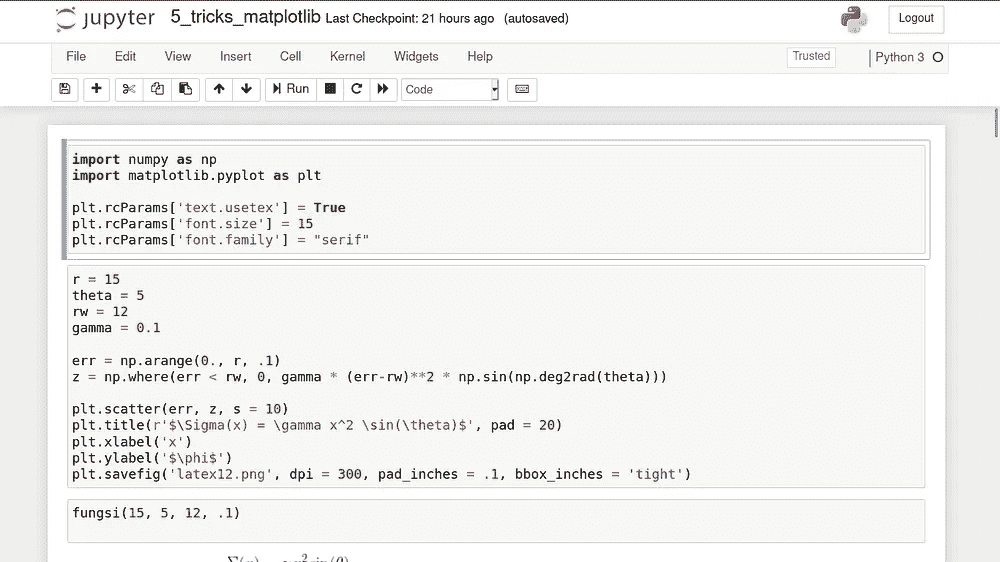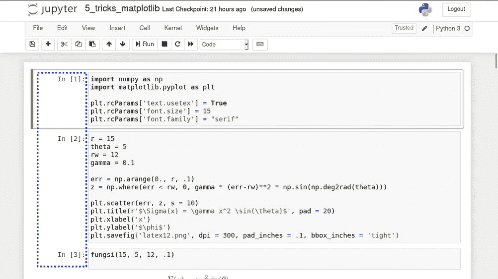

**图九。在 Jupyter 中隐藏 ***ln*** 容器(图片由作者提供)**

通过在 custom.css 中添加以下代码，可以隐藏 ***ln*** 容器并保存。

```
div.prompt,
div.tooltiptext pre {
    display:none
}
```

因此，更新后的 custom.css 如图 10 所示。

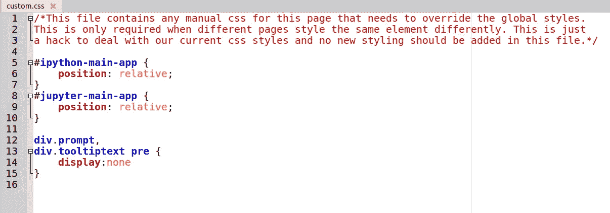

**图 10。**custom . CSS 中的附加样式(图片由作者提供)

保存后，请刷新您的 Jupyter 页面。你会得到 ***ln*** 容器现在是隐藏的，如图 9 的左面板所示。

下一步是使单元格容器适合显示器的宽度。您可以通过在 custom.css 中添加以下代码来实现

```
.container {
    width: 100% !important;
}
```

要使 Jupyter 中的 Notebook-container、Notebook_app 和 Body Header 变成白色(与背景相同)，可以添加以下代码

```
#notebook-container {
    padding: 0px;
    background-color: white;
}.notebook_app {
    background-color: white;
}body #header{
    background-color:white;
}
```

添加这些代码后，您将获得 Jupyter 的新显示，如图 11 所示。

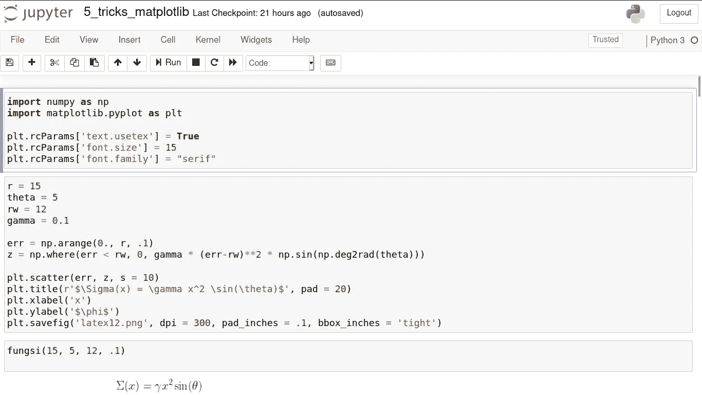

**图 11。**用 CSS 定制 Jupyter(图片由作者提供)。

接下来，通过添加以下代码来删除单元格之间的边框

```
#notebook {
 padding-top:0px !important; 
 padding-bottom:0px !important;
}.container { 
 width:100% !important;
}.end_space { 
 min-height:0px !important;
}
```

应用它之后，您将获得如图 12 所示的新外观。请将其与图 10 和图 11 进行比较。

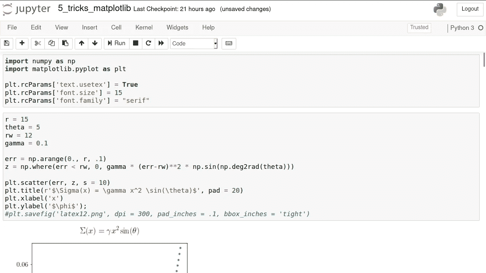

**图 12。**用 CSS 定制 Jupyter(图片由作者提供)。

修改 custom.css 的下一步是使图形结果与显示居中对齐。您可以看到图 12 中生成的图形是左对齐的。您可以通过添加以下代码来更改它

```
.output_png {
        display: table-cell;
        text-align: center;
        vertical-align: middle;
}
```

保存 custom.css 并刷新 Jupyter 页面后，您将得到结果，如图 13 所示。

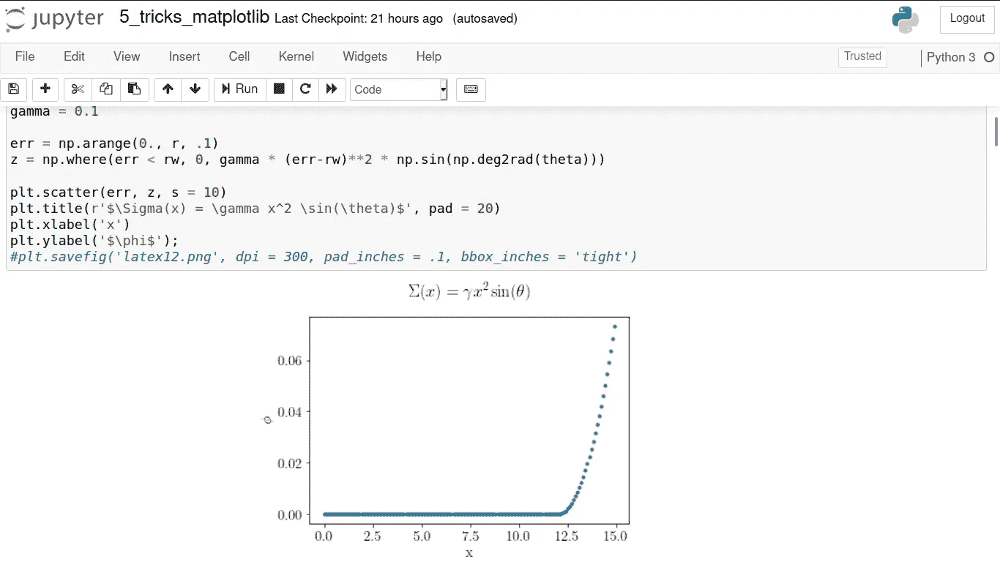

**图十三。**用 CSS 定制 Jupyter(图片由作者提供)。

接下来，您可以通过按 View(在左上角面板)隐藏切换标题和切换工具栏。然后按切换标题和切换工具栏。完成后，您将看到 Jupyter，如图 14 所示。

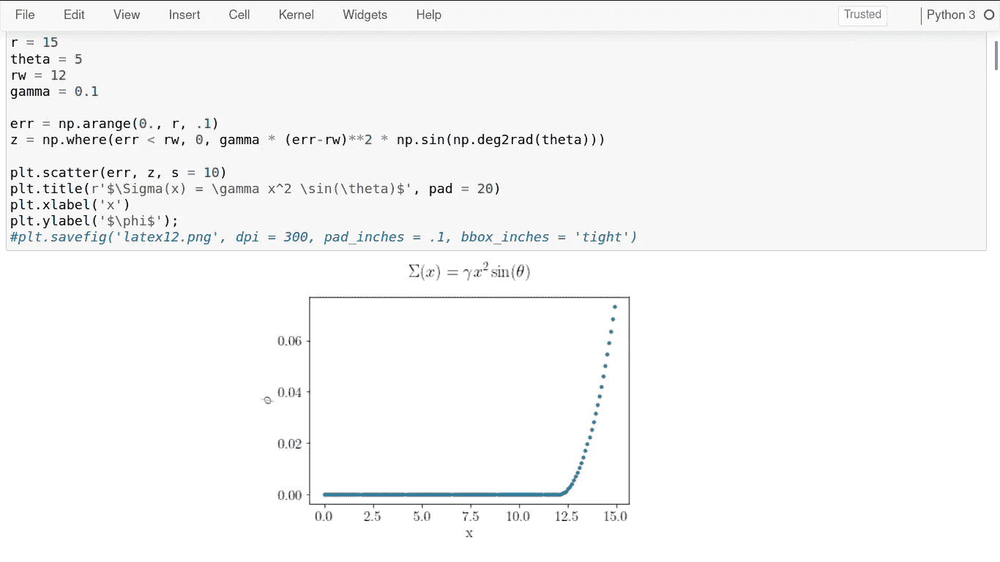

**图 14。**隐藏 Jupyter 中的切换标题和切换工具栏(图片由作者提供)。

下面是 custom.css 中的完整样式

在接下来的步骤中，我们将更多地讨论 HTML 框架。在登录代码页中，我在一个 div 标签中设置了页眉、主图像、主体和页脚。要创建 div，可以使用下面的代码

```
<div>
    Content of Your Div
</div>
```

所有的元素背景都是在 Inkscape 中设计的。图 15 显示了登录代码的主板。


**图 15。**登陆代码设计(图片由作者和 IRADesign 提供)

你明白了吗？Yups，图 15 中没有显示的每个元素，都是用 HTML 创建的。例如，我通过组合按钮和超链接标签来创建标题文本。您可以使用这段代码来创建它

如果你只想使用一个超链接标签，这是没问题的。标签***&emsp；*** 用于插入制表符。我们为什么需要它？答案是我们不能在 Jupyter 单元格中使用 CSS。只有 HTML :D .您需要通过按单元格- >单元格类型- > Markdown 来复制具有 Markdown 类型的 Jupyter 单元格代码。结果如图 16 所示。

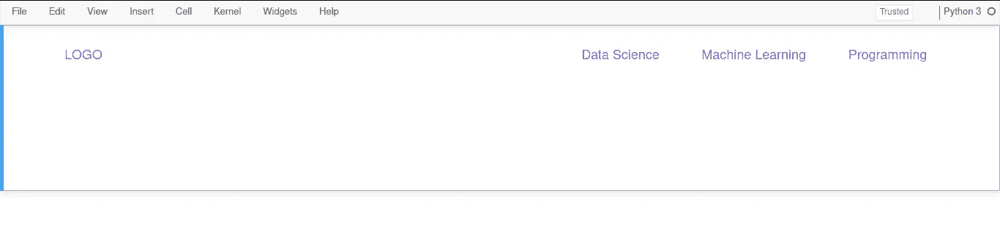

**图 16。**登陆代码中的标题元素(图片由作者提供)

我在后添加了一些中断标签
以使其更加清晰。如果您看到更多细节，在图 16 中看不到文本 Home。你看不到它，因为文本 Home 的颜色是白色的。您需要使用此代码在单元格中插入主板设计(图 15)。

您可以看到我在第 13 行插入了许多 break 标记。原因和前面一样，我们不能在 Jupyter 单元格中使用 CSS。尤普斯，着陆代码的概念是一个棘手的问题。如果您运行它，您将得到如图 17 所示的结果。

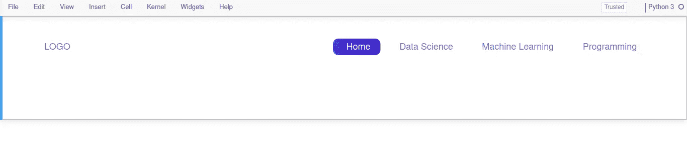

**图 17。**登陆代码中的头元素(图片由作者提供)

之后，您需要用这段代码创建欢迎文本。

结果如图 18 所示。


**图 18。**登陆代码中的标题和主要图片元素(图片由作者和 IRADesign 提供)

接下来，如何创建主体(图 4)？我使用一个表格标签来创建它。我创建了两个表。对于每个表，它由 1 行和 3 列组成。您可以使用这段代码来创建它。

您可以将代码添加到前面的代码中，在 break 标记之后和 div 的结束标记之前。结果如图 19 所示。我会在下一段给你提供完整的版本。

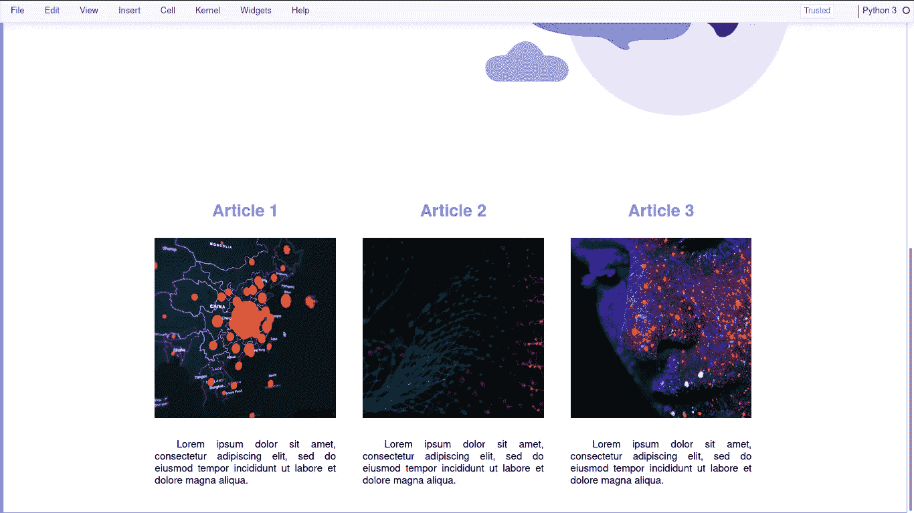

**图 19。**登陆代码中的主体元素(图片由作者和 IRADesign 提供)

您可以用相同的代码创建下一个表。之后，您需要使用这段代码创建一个简单的页脚

```
<span style="color: white"> Copyright &#169; 2020\. Allrights reserved. </span>
```

以下是创建登录页面的完整代码

运行之后，您将得到如图 20 所示的结果。


**图 20。**登录代码页面 1(图片由作者、IRADesign 和 Unsplash 提供)

接下来你需要创建引用的页面，分别命名为 data_science.ipynb、machine_learning.ipynb、programming.ipnyb，这里我只和你分享一页的代码。它在这里

所有的材料，包括网页设计，图片，和。ipynb 文件上传在我的 GitHub 里。您可以通过此链接访问

[](https://github.com/rizman18/landing_code) [## rizman18/landing_code

### 该代码创建登陆代码，一个应用程序的登陆页面到您的 Jupyter 笔记本 GitHub 是超过 50…

github.com](https://github.com/rizman18/landing_code) 

你可以在 YouTube 上观看集锦预览

## 结论

登陆代码是交互式编程(Python 或 R)中的新概念。这是我们建设未来准备的一部分，因为技术总是在发展。它不够有效，因为我们不能在 Jupyter 单元格中运行 CSS。在这个故事中，使用 Jupyter Notebook 进行更多的交互式编程是一个小小的努力。

有兴趣看我其他的故事吗？你可以点击访问我的简介[。如果你对创建登陆代码感兴趣但没有时间，你可以通过](https://medium.com/@rizman18) [Fiverr](https://www.fiverr.com/rizman_18) 联系我。

## 如果你喜欢这篇文章，这里有一些你可能喜欢的其他文章:

[](/visualizations-with-matplotlib-part-1-c9651008b6b8) [## 使用 Matplotlib 实现 Python 数据可视化—第 1 部分

### 完成了从基础到高级的 Python 绘图的 Matplotlib 教程，包含 90 多个示例

towardsdatascience.com](/visualizations-with-matplotlib-part-1-c9651008b6b8) [](/5-powerful-tricks-to-visualize-your-data-with-matplotlib-16bc33747e05) [## 使用 Matplotlib 可视化数据的 5 个强大技巧

### 如何使用 LaTeX 字体，创建缩放效果，发件箱图例，连续错误，以及调整框填充边距

towardsdatascience.com](/5-powerful-tricks-to-visualize-your-data-with-matplotlib-16bc33747e05) [](/matplotlib-styles-for-scientific-plotting-d023f74515b4) [## 用于科学绘图的 Matplotlib 样式

### 为您的科学数据可视化定制 Matplotlib

towardsdatascience.com](/matplotlib-styles-for-scientific-plotting-d023f74515b4) [](/creating-colormaps-in-matplotlib-4d4de78a04b8) [## 在 Matplotlib 中创建色彩映射表

### 从颜色列表中创建和定制自己的色彩映射表的指南

towardsdatascience.com](/creating-colormaps-in-matplotlib-4d4de78a04b8) [](/customizing-multiple-subplots-in-matplotlib-a3e1c2e099bc) [## 在 Matplotlib 中自定义多个子情节

### 使用 subplot、add_subplot 和 GridSpec 在 Matplotlib 中创建复杂 subplot 的指南

towardsdatascience.com](/customizing-multiple-subplots-in-matplotlib-a3e1c2e099bc) 

仅此而已。感谢您阅读这个故事。喜欢就评论分享。我还建议您关注我的帐户，以便在我发布新故事时收到通知。