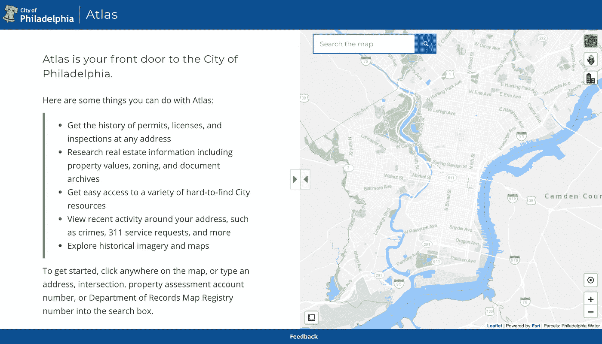
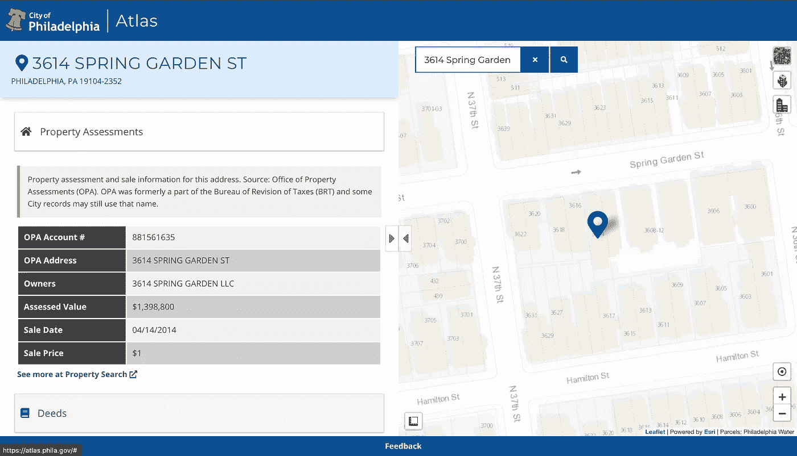
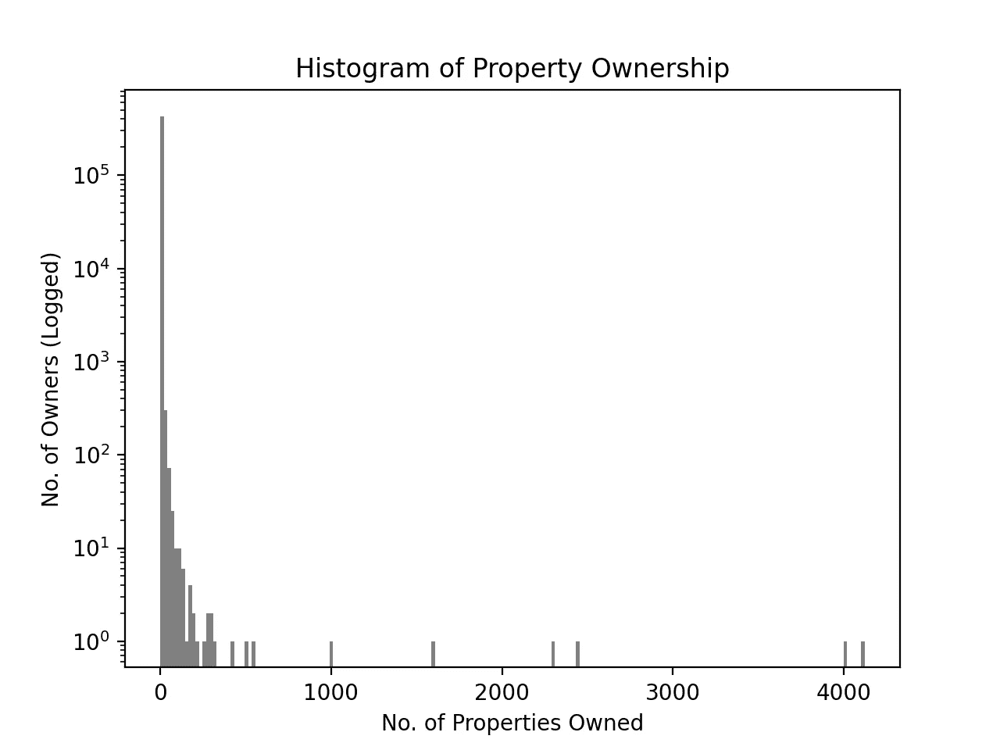
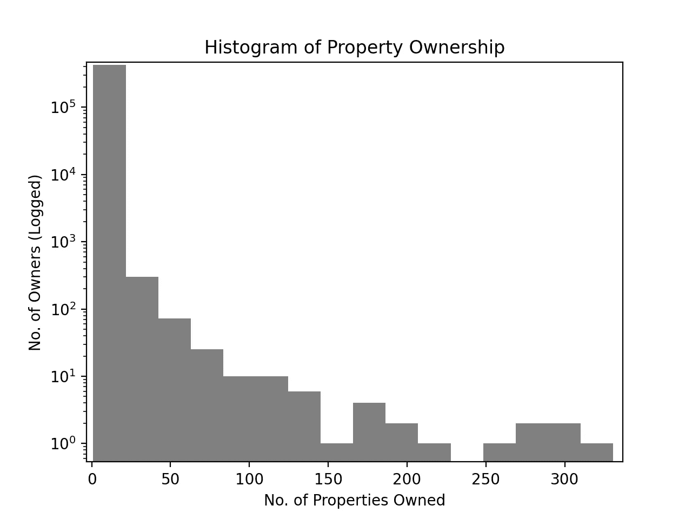
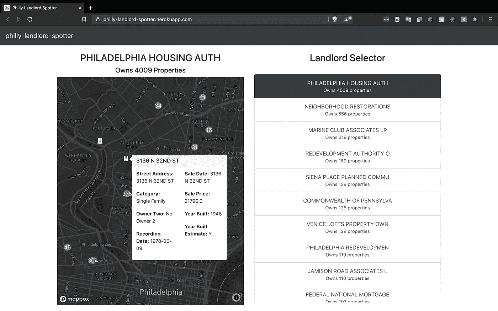

# 城市房产数据中的房东定位

> 原文：<https://towardsdatascience.com/landlord-spotting-in-city-data-e07fad2b5dc5?source=collection_archive---------52----------------------->

## 没有人应该被驱逐，句号。Python & React 可以帮助阻止它。

诺亚科特 2020

# 介绍

驱逐(Eviction)是一种根据法院命令，合法地将房客从他们的住所强行驱逐出去的过程，尽管通常是由自己动手的房东非法实施的。通常情况下，驱逐是一个滚动的过程，市政房东-房客法院处理大量案件，最后由警长敲你的门，但我们不是在正常时期。大多数人都很幸运，他们的房东遵守了法律，[一直等到法院重新开庭审理因持续的新冠肺炎危机而关闭了几个月的驱逐案。那些有幸拥有一个守法房东的人并不幸运；他们现在知道，在一段不可描述的时间内，他们将面临无家可归的问题。](https://www.inquirer.com/real-estate/housing/landlord-tenant-court-reopen-philadelphia-delay-coronavirus-20200702.html)

许多处理房东-房客问题的法院一开始就无法处理驱逐案件，更不用说在当前的经济衰退时期了。这些都不足为奇。法院不是为了帮助房客而设立的；它们是保护资本的堡垒，帮助土地所有者获得意外利润。租户通常准备不足，得不到政府机构的支持，在一个专为奸商建立的系统中无法获得足够的代表权。这种不公正留给了当地组织去对抗，包括租户联盟和同情的法律团体/服务，他们缺乏反击所需的工具和数据。很明显，租户组织是一门独立的科学，大多数这样的团体都做得很好。拥有更多信息和工具来筛选这些数据，将使租户组织者能够更准确、更深入地锁定社区和房东。

# 动机

作为费城租户联盟和德雷克塞尔学生租户联盟的租户组织者，我对其挑战有第一手的经验。第一步总是要弄清楚自己面对的是什么，这通常包括使用城市数据工具，如[费城地图。](https://atlas.phila.gov/)

费城地图集

图集工具绝不是无用的；它提供了相当多的洞察力，但仅针对单个属性。关于该房产的信息往往已经过时，或者缺少所有者的实际邮寄地址。这种数据的缺乏使得研究人员/组织者很难得出有意义的结论，除非进入一个可能空空如也的兔子洞，在谷歌上搜索附加了城市的名字。

我可以写一整篇关于土地所有者如何隐藏在系统生成的数据背后的文章。不过，现在，我将只解释一个相关的策略。房东，尤其是有问题的房东，会躲在看似无止境的空壳公司后面，这些公司几乎不知道谁拥有他们。这些空壳公司、有限责任公司和合伙企业这样做也带来了另一个问题，你怎么知道“123 Street Road APT 3 LLC”拥有什么？虽然大多数这些非常明确命名的公司只拥有他们描述的财产，但有时数据会暴露他们拥有多少和在哪里。费城地图集工具不会轻易为您提供这些信息。系统仅基于属性进行过滤。

费城阿特拉斯酒店视图

只有按单个地址过滤才是呈现属性数据的个人主义方法。这种方法描绘了这样一种情况:在一个有数百万人口的城市中，只有一个房客在一套公寓中遇到问题，而这个房客却独自承担责任。在没有足够的知识、支持和/或代理的情况下，创建一种类似于进入房东-房客法庭的感觉，我们可以开始假设这是同一系统的一部分。人们意识到法院不是为房客设立的。他们是遍布我们城市的中产阶级化发展机器的一部分，城市的工具也不能不受其影响。

我出发去看看我能做些什么来改变这一切。我想使用城市在地图集工具中使用的相同数据集，[*opa _ properties _ public . CSV*](https://www.opendataphilly.org/dataset/opa-property-assessments/resource/6d9ce508-b770-402d-ad84-94b36b0c7550)，并以一种更加民主化和集体化的方式呈现它。这是居住在费城的人们的数据，而不仅仅是土地所有者留下的痕迹。[随着可以与大萧条相媲美的驱逐危机的逼近](https://www.cnbc.com/2020/07/10/looming-evictions-may-soon-make-28-million-homeless-expert-says.html)，我们需要迅速创造工具，阻止土地所有者隐藏在混乱、不准确的数据中，并暴露他们拥有的一切，给租户和租户倡导者一个战斗的机会。

诺亚科特 2019

# 数据源和描述

几个月前，我被安排在德雷克塞尔大学开始我教育的最后一个合作模块。尽管如此，当新冠肺炎关闭一切，我的合作社被取消。由于找不到替代合作社，也没有资格参加整个学期的课程，我决定做点什么来弥补我从上一个合作社中获得的发展经验。通过我与费城租户联盟的合作，我知道该市有很多数据可供我们联盟中的租户和我们倡导的租户利用。

[费城开放数据](https://www.opendataphilly.org/)包含费城地区可用的数据集目录，确切地说是 379 个数据集。我很快浏览了他们的目录，找到了 Atlas 工具使用的城市房地产评估数据。这个数据集创建于 2015 年，包含数十万套房产，但这些是如何在费城的业主之间分配的？在该集合中的 581，456 个资产中，只有 429，983 个唯一拥有实体。

直方图 1

房东拥有多少房产的分布相当有趣。在*直方图 1* 中，我绘制了这个分布的直方图。直方图记录在 y 轴上，以便更好地显示数据。尽管如此，x 轴在这里看起来更有趣。右边尾巴上的条形之间的间隔，显示了财富差距是如何快速增长的。

直方图 2

起初，我很惊讶左边的拖尾有多严重，这表明这个数据集中的大多数拥有实体只拥有一个属性，但这是有意义的。根据调查城市中谁单独拥有财产的经验，我可以说这种分布是严重拖尾的，因为存在大量不稳定的专门命名的公司、有限责任公司和合伙企业，它们的存在仅仅是为了“拥有”这些财产。假设大多数人不拥有大量财产也是公平的，[美国消费者新闻与商业频道声称大多数人拥有 1 到 10 处财产](https://www.cnbc.com/2020/04/02/coronavirus-small-landlords-struggle-as-renters-stop-payments.html)，这是这个柱状图所描述的。

# 从 Python 开始

为了开始解释这个数据集，我需要从对数据进行排序和搜索开始。我选择使用 Python 3，我知道这种语言可以处理数据集中的 500，00 多个条目，并开始工作。我首先想知道的是:

*这个集合中有多少个唯一的拥有实体？*

*他们拥有多少房产？*

这个分布看起来像什么？

将它分解成更小的步骤，我开始创建一个只包含每个拥有实体一次的对象。如果它们出现不止一次，我需要更新那个拥有实体的计数。这些步骤转化为下面的 Python 3 代码。

意识到拥有大量实体并希望将这些数据用于 web 应用程序，我意识到我需要将这些数据分开。为此，我写了一个函数，为我认为的*重要房东*设置了一个下限。

我还编写了一些函数来编译来自原始 CSV 文件的仅包含房东和属性的 JSON 对象。

在这一点上，我开始考虑如何构建 React 使用的数据。JS 前端。我决定创建一个对象，通过房东和房产信息的子结构来组织数据。这段代码很大程度上受到我在前端呈现数据的方式的影响。尽管如此，这段代码应该提供其结构的一般要点。

如果你想更详细的看看我的数据处理或者想叉一下，[这里是 GitHub 的资源库。](https://github.com/ncote3/philly-landlord-horrors)

# 创建节点/快速 API

在处理完数据并创建了分割数据集的 JSON 文件后，我开始工作。我开始构建一个 [node.js](https://nodejs.org/en/) 服务器，它利用 [Express](http://expressjs.com/) 来创建 API 端点。(如果你想了解更多这方面的信息，[点击这里](https://www.robinwieruch.de/node-express-server-rest-api))。我意识到列出 400，000 多个拥有实体会使浏览器崩溃或速度极慢，所以我为不同的 JSON 文件创建了端点。

为了抑制呈现所有实体的数量，我创建了一个只服务于重要房东的端点。

然后，我编写了一个端点来侦听特定的房东，在更大的数据集中找到它，并返回一个只包含房东请求的数据的对象。

出于篇幅和表述的考虑，我已经截断了运行 node/express 服务器所需的代码量。如果你想看到完整的服务器代码，这里有 GitHub 库。

# 建立一个反应堆。JS 前端

小楼一座[反应过来。JS](https://reactjs.org/) frontend 是这个项目的自然发展。在被我的前两个 Drexel 合作伙伴启动后，我在过去几年里一直在学习并越来越擅长编写 React 应用程序。我知道这不是一个编程教程，所以我将描述和解释这个项目产生的屏幕。如果你对我的代码感兴趣，你可以点击查看[。](https://github.com/ncote3/philly-landlord-spotter)

为了可视化拥有实体的属性，我为 React 搜索了一个地图库，并选定了 [*react-map-gl*](https://visgl.github.io/react-map-gl/) 。这个库允许我使用 [MapBox](https://www.mapbox.com/) maps，这是一个由*优步*创建的高度可定制的地图界面。使用来自[字体牛逼](https://fontawesome.com/)的记号笔，我开始在地图上绘制房产数据。

对于较大的自有实体，尤其是费城住房管理局(Philadelphia Housing Authority)来说，绘制单个房产的效果并不太好，该机构拥有约 4000 多处房产。我想我必须使用聚类算法来解决缓慢的标记渲染。幸运的是，MapBox 已经花时间为 *react-map-gl* 开发了这个。别人开发了一个库来使用这个带有 [*反应钩子的*](https://reactjs.org/docs/hooks-intro.html) 。这两个库分别是 [*超级集群*](https://github.com/mapbox/supercluster) 和 [*用途-超级集群*](https://github.com/leighhalliday/use-supercluster) 。按照[一个很棒的教程](https://www.leighhalliday.com/mapbox-clustering)关于如何一起使用所有这些，我制作了如下所示的屏幕。

费城房东观察员

聚类使我能够将更多的信息打包到地图上的标记中。每一个标记都提供了关于该房产的信息，如*街道地址*、*类别、共有人、登记日期、销售日期、销售价格、*和*建造年份*。通过在地图上提供这些信息，用户可以了解附近发生了什么，以及如何最好地解决与特定所有实体相关的租户问题。

屏幕右侧的*地主选择器*就没那么让人印象深刻了。目前，我只显示拥有超过 50 个属性的所有实体。这主要是因为在浏览器中呈现冗长的列表需要很长时间，我正在积极寻找解决方案。

# 项目演进

我只是开始触及租户或租户维权者在费城房地产评估数据的不同表述中所能发现的皮毛。我一直在做一个列表，列出我和其他人认为可能有用或有趣的未来发展。

1.彩色涂层标记，显示何时建造的属性和描述每个时间段的关键。

2.更多特定于所有实体的统计数据，如*平均房龄*和*平均销售年份。*

3.交叉引用购买力平价数据。[(工资保护程序)](https://home.treasury.gov/news/press-releases/sm1052)

4.交叉引用费城驱逐文件数据。

5.将这个项目打包成一种其他城市可以开始以适合他们的方式可视化他们的数据的方式。

诺亚科特 2019

# 结论

在技术世界里，人们开始或创建项目，这些项目起初看起来有用，但最终不再有用或多余。我希望费城地主检举人 不属于这两类。很快，包括**家庭**在内的大量人口将被合法驱逐出他们的家园，在大多数情况下，他们无处可去。避难所要么已满，要么已被新冠肺炎摧毁，这是不可接受的。每个人都应该有一个称之为家的安全地方，如果他们目前没有，他们需要得到一个，如果他们有，他们需要留在那里。租户比以往任何时候都更需要团结起来，形成或加入租户联盟，以建立租户权力，并提供社区驱逐防御。

如果你在费城，我强烈推荐你加入费城租户联盟。PTU 为费城的租户争取权益，包括提供驱逐辩护。如果你有需要，不要犹豫，向他们伸出援手！

在费城之外，有一个租户联盟网络被恰当地称为 [**自治租户联盟网络**](https://atun-rsia.org/home-en) 。他们能够给你指出正确的方向，并且有一个他们与租户联盟合作的城市列表。

对于任何对这个项目的编程方面更感兴趣的人，有适合这个项目范围的想法，或者如果你只是想聊聊，我的电子邮件是[noah.cote3@gmail.com](mailto:noah.cote3@gmail.com)。

不然就看看我的 [Github](https://github.com/ncote3) 在 Twitter 上关注我: [@n_cote3。](https://twitter.com/n_cote3)