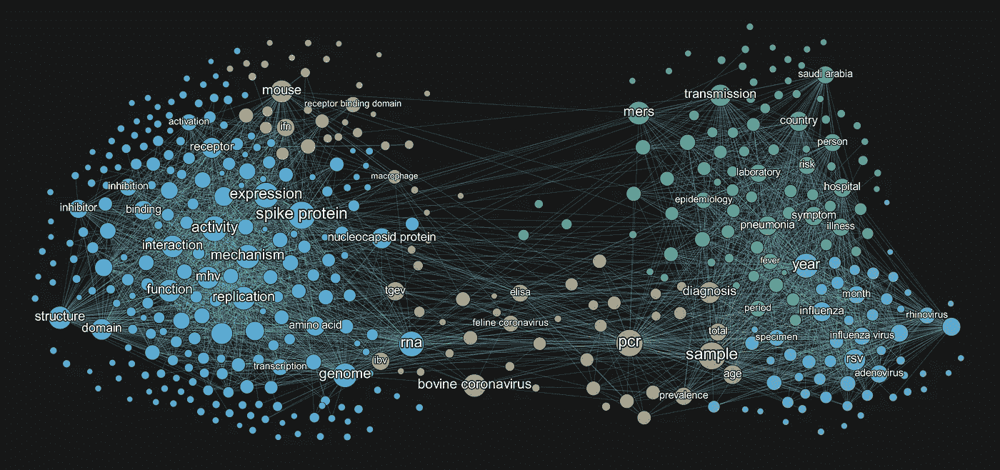
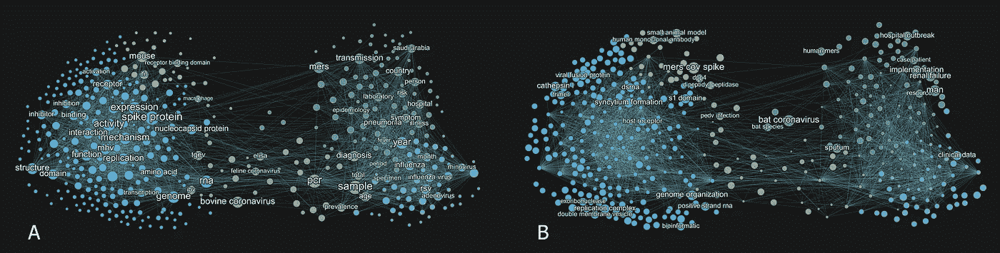
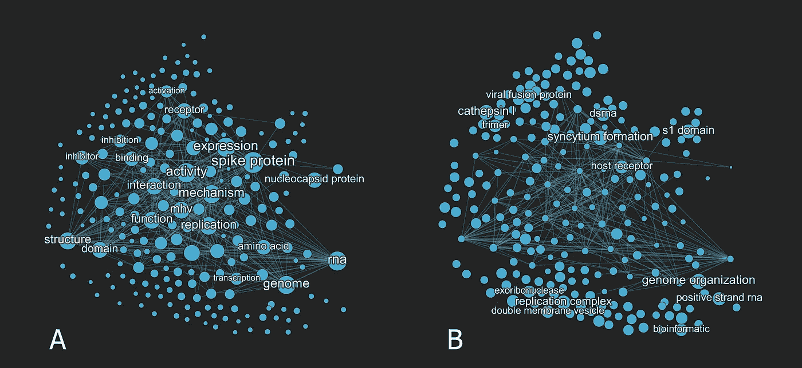
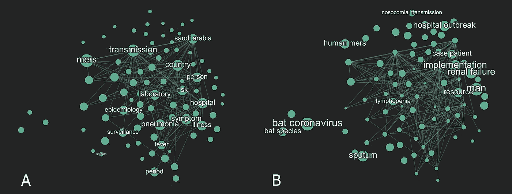
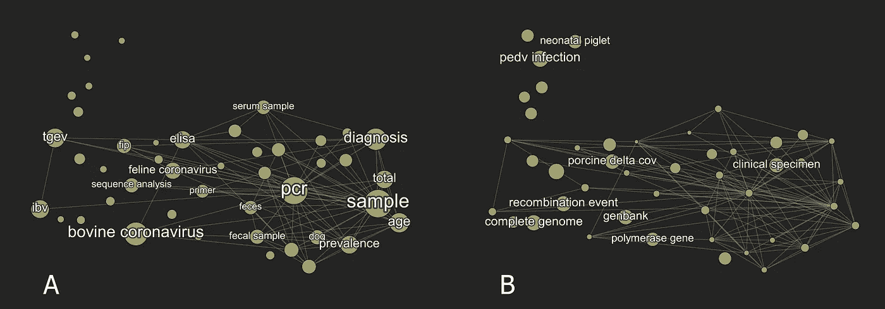
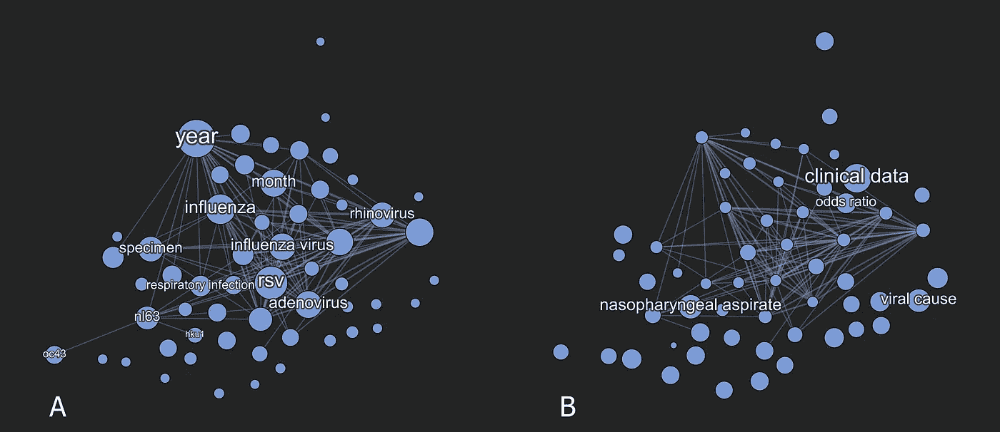
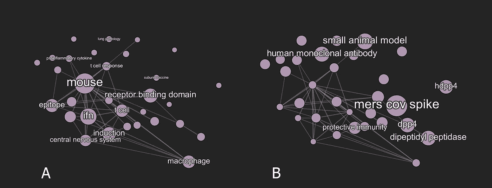
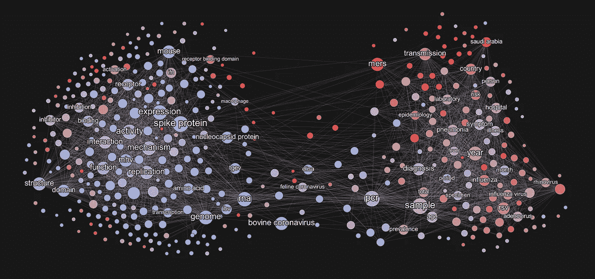

# 三十年来冠状病毒研究的概况

> 原文：<https://towardsdatascience.com/landscape-of-coronavirus-research-across-three-decades-9cf338968e18?source=collection_archive---------24----------------------->

## 语义之旅

2 月 10 日， [STAT+](https://www.statnews.com/2020/02/10/fluctuating-funding-and-flagging-interest-hurt-coronavirus-research/) 发表了一篇关于冠状病毒研究中波动的兴趣和资助的有趣文章。阅读这篇文章激励我进一步调查冠状病毒研究的状况，特别是为了了解截至 2019 年底的冠状病毒研究状况，就在新冠肺炎疫情在全球爆发之前。

在这篇文章中，我将分享我所做的一些初步探索，以获得该研究领域的概况，使用文本挖掘方法。

对于那些不熟悉文本挖掘的人来说，[这个网站](https://monkeylearn.com/text-mining/)提供了这项技术的简单介绍。文本挖掘的目的是将非结构化的文本数据转化为有价值的信息。在这项调查中， [VOS 浏览器](https://www.vosviewer.com/)应用程序使用的算法扫描了数千份摘要，并将常用术语(单词)放在二维地图上进行可视化，其中两个术语之间的距离表明了术语之间的相关程度。如果术语经常一起出现在同一摘要中，它们之间的距离会变小，最终，可能会看到术语簇。

这种技术是理解领域内话语的一种强有力的方法，因为词的聚类表明了该领域内讨论或研究的主题。这样，可以从数据中发现研究主题。如果没有这样的计算方法，很难(如果不是不可能的话)从现代研究产生的海量信息中获得一个结构。

# 构建冠状病毒研究术语图

使用从 1990 年 1 月 1 日到 2019 年 12 月 31 日的冠状病毒搜索词组合，从[Lens.org](https://www.lens.org)下载的 11，224 篇文章的元数据首先用于在 VOS 浏览器中生成术语网络图。随后使用 [OpenRefine](https://openrefine.org/) 和 [Gephi](http://gephi.org/) 进一步优化数据和网络。进行多次迭代，直到最终网络确定下来。

在图 1 的术语图中，已经生成了五个不同的集群；我认为这个模块级别对于早期的探索是合理的。同样有趣的是网络的结构，它揭示了与另一个相反的集群，在两侧之间有一个桥接集群。

可以根据各种参数设置节点(彩色圆圈)的大小。对于图 1 中的可视化，强调了最常用的术语，其中较大的节点表示该词出现的频率较高。只显示语料库(文章集合中的词的主体)中使用最频繁的术语的标签，以避免视觉过载。

*图 1:1990-2019 年冠状病毒研究文章标题和摘要的术语共现图。在对重复的术语进行协调并对不同的模数和截止值进行实验后，450 个节点和 3036 条边被选定用于最终的可视化。节点的大小设置为术语出现的数量，节点越大，术语出现的频率越高。只有出现最少 20 次(即在至少 20 篇文章中)的单词被包括在分析中。使用二进制计数，基于摘要中是否存在术语，而不是摘要中出现的全部数量。数据:***。**

*除了频率，我们还可以问网络中是否有特别重要的术语。引用计数通常被用来衡量研究工作的重要性。因此，可以假设来自高引用计数的文章的单词来自该领域其他研究人员认为重要的文章。*

**

**图 2:比较基于术语出现的术语图(A)和平均标准化引用(B)。数据:****Lens.org****。**

*在图 2 中，基于出现的术语图(左，A)和基于引用的术语图(右，B)之间的差异可以相互比较。请注意，当在引用图(B)中查看时，许多出现频率高的词(A)的大小显著减小，而以前在出现频率图(A)中不常见的新术语在引用图(B)中变得突出，如节点大小的变化所示。在描述下面的主题时，我们将更深入地研究这些不同术语图视图的使用，并揭示每个集群内的洞察力。*

# *冠状病毒研究的主题*

*为了确定主题，我检查了每个集群中流行的术语，并做了一些额外的研究来扩展一些术语，以展示如何使用这种方法来产生见解。以我的经验，给一个话题贴标签并不是一门精确的科学，需要一些该领域的知识才有意义。在这个过程中，我依靠我在临床传染病和疫苗研究方面的背景来帮助我，尽管来自冠状病毒研究领域专家的输入将有助于使标记更加准确。*

## *第一组:冠状病毒的分子和细胞生物学*

*图 3A 显示了组 1 中最常用的术语。这些术语中有许多涉及冠状病毒生物学的基础研究，如**刺突蛋白**、**复制**、**机制**、**结构**、**基因组**和 **rna** 。*

**

**图 3:基于术语出现(A)或平均标准化引用(B)可视化聚类 1 中最高排名的术语。数据:****Lens.org****。**

*一个有趣的术语， **mhv** 也可以在这组最频繁出现的术语中找到。什么是 **mhv** ？*

*在发现 SARS 冠状病毒之前，许多关于冠状病毒的研究都是使用*小鼠肝炎病毒* (MHV)进行的，这是一种鼠冠状病毒，根据其嗜性，它可以感染呼吸道、胃肠道或神经系统(见[本文综述](https://www.statnews.com/2020/02/10/fluctuating-funding-and-flagging-interest-hurt-coronavirus-research/))。由于亲神经 MHV 菌株能够引发脱髓鞘，因此已将其用于建立多发性硬化症的小鼠模型。因此，MHV 模型是我们今天理解冠状病毒感染生物学的基础。鉴于最近发现 SARS-COV-2 病毒会引起嗅觉丧失(嗅觉丧失)，重温一些关于 MHV 及其对中枢神经系统影响的旧文献可能是值得的。*

*将视图改为平均标准化引用计数(图 3B)，导致新术语如**组织蛋白酶 L** 和**同步形成**脱颖而出，表明这些术语存在于高被引文章中。*

*深入研究发现，**组织蛋白酶 L** 是一种重要的分子，因为它是 SARS 病毒利用其刺突蛋白激活其融合到宿主细胞中的宿主酶(见[本文](https://jvi.asm.org/content/82/17/8887))。**组织蛋白酶 L** 的抑制剂已经被证明可以阻止 SARS 冠状病毒的进入([文章](https://www.pnas.org/content/102/33/11876))，尽管据我所知，这种治疗策略目前还没有被考虑用于新冠肺炎的治疗。*

***Synctium 的形成**揭示了冠状病毒的一个特殊特征，如那些导致 SARS 和 MERS 的冠状病毒能够介导邻近的感染和未感染细胞之间的细胞融合，这种策略使病毒能够直接在细胞之间传播，并避免中和抗体([文章](https://virologyj.biomedcentral.com/articles/10.1186/s12985-019-1182-0))。*

## *第二组:冠状病毒爆发的公共卫生和临床研究*

*与第一组不同，这里倾向于将涉及临床和公共卫生研究的词聚集在一起(图 4A)。**传播**、**实验室**、**监测**和**流行病学**等词汇暗示了一种调查冠状病毒爆发的公共卫生方法。其他术语如**肺炎**、**发烧**、**症状**和**疾病**建议采用临床方法。到目前为止，许多人已经熟悉了术语 **mers** ，它代表*中东呼吸综合征*，这是最近在人类中爆发的冠状病毒。*

**

**图 4:基于术语出现(A)或平均标准化引用(B)可视化聚类 2 中最高排名的术语。数据:****【Lens.org】****。**

*为了找出这个集群中最重要的术语，使用了标准化引用视图(图 4B)。**蝙蝠冠状病毒**由于其与 SARS 和 MERS 冠状病毒的相似性以及随后的高度临床重要性，现在在这一群中表现突出。它与术语**蝙蝠物种**和**自然宿主**关系密切，这两个术语共同指向了解野生蝙蝠冠状病毒生态的研究。*

*另一个重要术语**肾衰竭**引发了进一步的调查。在 SARS 患者中，急性肾衰竭被发现是非常不利的结果，尽管相对不常见，为 6.7% ( [文章](https://www.kidney-international.org/article/S0085-2538(15)50506-1/pdf))。令人关注的是，根据两篇来自中国的预印文章(这篇[文章](https://www.medrxiv.org/content/10.1101/2020.02.18.20023242v1)和这篇[文章](https://www.medrxiv.org/content/10.1101/2020.02.08.20021212v2)，现在已经在新冠肺炎患者身上观察到了肾脏异常。这个例子强调了这样一个基于引用的术语图是如何将我们的注意力引向洞见的，否则这些洞见可能会迷失在信息的海洋中。*

## *第 3 组:动物冠状病毒感染*

*这个有趣的集群位于基础科学和临床研究集群之间，连接着两个群体(图 1)。仔细观察，这一分组丰富了关于动物冠状病毒疾病的术语，如**牛冠状病毒**和**猫冠状病毒**以及 **tgev** ，这是一种感染猪的冠状病毒(图 5A)。 **ibv** 是指*传染性支气管炎病毒*，一种在鸡群中高度传染性的冠状病毒疾病。在当前视图中不可见，但在较低算法阈值下存在于该集群中的其他术语，如**马冠状病毒**和**犬冠状病毒**，揭示了冠状病毒适应的动物宿主的惊人多样性。这也给公众带来了一个鲜为人知的事实，即所有冠状病毒都源于动物，最终适应人类并导致疾病。*

**

**图 5:基于术语出现(A)或平均标准化引用(B)可视化聚类 3 中最高排名的术语。资料:****Lens.org****。**

*诸如 **pcr** 和**样本**等高度流行的词反映了用于识别和表征这些病毒的方法，但由于其无处不在的特性，可能不一定是该群的特定特征。这可以在标准化引用视图(图 5B)中看到，其中这些术语的大小大大减少。*

*在这种观点中，术语 **pedv 感染**和**猪 delta cov** 脱颖而出。在 2013 年第一次爆发期间，这些冠状病毒在新生小猪中导致严重疾病，导致高死亡率和农民的重大经济损失，估计达 10 亿美元([文章](https://www.ncbi.nlm.nih.gov/pmc/articles/PMC6723174/))。*

## *第 4 组:病毒性呼吸道感染*

*描述其他呼吸道病毒如**流感**、**腺病毒**、 **rsv** 和**鼻病毒**的术语群表明冠状病毒也在病毒性呼吸道感染的背景下进行研究(图 6A)。常见和非特定术语，如**年**和**月**建议描述这些感染的时间。不太常见的术语如 **nl63** 、 **hku1** 和 **oc43** 原来是人类的冠状病毒感染，通常导致上呼吸道感染，表现为普通感冒。有趣的是，HKU1 冠状病毒来源于受感染的小鼠，而 OC43 被认为是从牛身上转移到人类身上的。*

**

**图 6:基于术语出现(A)或平均标准化引用(B)可视化聚类 4 中最高排名的术语。资料:****Lens.org****。**

*在图 6B 中，标准化引用视图允许我们观察到诸如**临床数据**、**鼻咽抽吸物**、**病毒原因**和**优势比**等术语变得突出。这表明，在这个集群的研究围绕临床研究，以确定和监测呼吸道病毒感染。*

## *聚类 5:小鼠模型中的免疫反应和病毒发病机理*

*这个小星团，看起来像是星团 1 的分支，通过更仔细的研究揭示了许多洞见。鼠标是一个主要术语，这表明鼠标模型是这个主题的核心。在小鼠模型中，似乎要研究各种角度，例如以诸如 **ifn** (干扰素) **t 细胞**、**巨噬细胞**、**表位**、**亚单位疫苗**和**促炎细胞因子**为特征的免疫反应，以及通过**肺病理学**和**中枢神经系统**所看到的其后果(图 7A)。**受体结合域**暗示了与冠状病毒进入研究相关的另一个方向，当我们使用图 7B 中的标准化引用视图查找高引用文章中出现的术语时，这一点变得更加明显。*

**

**图 7:基于术语出现(A)或平均标准化引用(B)可视化聚类 5 中最高排名的术语。资料:【Lens.org】**。****

*在图 7B 中，词语 **mers cov spike** 、**二肽基肽酶**、 **dpp4** 和 **hdpp4** 变得更加突出，表明这些术语已在被多次引用的论文中使用。 **dpp4** ，又称二肽基肽酶 4，是一种人类蛋白质，被发现是 MERS 冠状病毒刺突蛋白用来感染宿主细胞的受体([文章](https://www.nature.com/articles/nature12005))。将这些点连接起来，我们可以拼凑出或许 **mers cov spike** 与其受体 **dpp4** 结合，正在小鼠模型的背景下进行研究。事实上，这一点已被描述表达人类 dpp4 基因的转基因小鼠的发展的研究所证实，该转基因小鼠完全允许 MERS 冠状病毒感染([文章](https://jvi.asm.org/content/89/7/3659))。术语 **hdpp4** (人 dpp4)的出现，现在可以用小鼠 **dpp4** 不能很好地结合 **mers cov spike** 蛋白的事实来解释，这就需要开发一种表达人类版本 **dpp4** 基因的小鼠品系。*

# *术语什么时候最常用？*

*作为最后的探索，我想获得一个场随时间演变的潜在动力的概念。为了探索这一点，修改了图 1 中基于出现次数的术语映射，其中节点根据平均使用年份进行着色(图 8)。*

**

**图 8:根据平均年份可视化研究文章中的术语频率。红色=最新，蓝色=最早。数据:***。***

**视觉为我们提供了这些术语最流行时的快照。看这张图，在颜色上似乎有一个总的渐变，最新的术语用红色表示，而最老的术语用蓝色表示。我们可以看到，网络左侧和中间的基础科学和动物研究聚类中的大多数术语都用蓝色阴影表示，而网络右侧的临床聚类中的术语则用红色表示。**

**这表明该领域最近的许多研究都倾向于临床研究，而不是基础科学和动物冠状病毒研究。**

**虽然不在本文的范围之内，但是追踪近年来流行的术语(例如红色的)可能是值得做的，并且可能揭示新兴的研究领域。**

# **最后的想法**

**术语“图谱探索”揭示了过去三十年冠状病毒研究领域的结构。我们了解到冠状病毒研究大致分为三个主要领域:基础科学研究、临床/公共卫生研究和动物冠状病毒研究。还观察到基础科学和临床研究中的细分，例如专注于小鼠模型和病毒性呼吸道感染的细分。使用基于出现或引用的不同观点揭示了不同术语的重要性，这取决于它们的常用程度，如**小鼠**，或它们的重要性，如**蝙蝠冠状病毒**。**

**数据还表明，在过去的几年里，临床和公共卫生研究比基础科学更受关注。同样，除了猪δ冠状病毒和猪流行性腹泻病毒最近死灰复燃之外，动物冠状病毒研究的近期活动似乎较少。这种印象可以使用引文分析进行跟踪，引文分析可以更清楚地揭示该领域的发展。**

**这些初步发现指出了未来几年在基础科学和动物健康研究领域可以填补的知识空白。鉴于动物冠状病毒在自然界中无处不在，并且由于生态破坏以及可能由于密集的动物养殖，从动物到人类的跳跃总是有可能的，这可能是特别重要的。这将是一个有趣的调查线索。**

**此外，考虑到我们对新疫苗的迫切需求，我注意到与该领域的疫苗和免疫学研究相关的术语很少。这是一个简单的印象还是一个真实的事实，需要通过进一步的分析来确定，因为它可能对新冠状病毒疫苗的实际开发速度产生影响。**

**术语图谱分析使研究领域的结构能够以“自下而上”的方式从数据中展现出来。尽管这种方法很强大，但它也有局限性。**

**首先，构建当前地图依赖于 VOS 浏览器应用程序中产生的算法，其中用于计算术语之间的链接的固定标准已经在程序中制定。为了更深入地探索术语之间的联系，将需要进一步试验替代的链接计算，这些计算可能揭示本术语图分析中不存在的关系。**

**其次，本文中提出的见解只是可从地图中获得的潜在信息的一小部分，因此不能被视为该领域的完整描述。地图的显示依赖于各种分界点和参数，这意味着数据可以以不同的方式切片和切块，以揭示新的见解。这既是新发现的机会，也是主观解释的可能来源。**

**考虑到这一点，重要的是要认识到，这种方法并不意味着替代对该主题的深入研究，而是作为一种在相对较短的时间内“增加智力”的方式。将这种方法与阅读斯坦利·帕尔曼等顶尖专家的深度评论结合起来，是我快速了解该领域的方法。**

**在疫情的掌控下，许多研究都集中在新疫苗和治疗方法的研发上。然而，为了在短时间内设计出这些解决方案，我们需要建立一个知识体系，避免重复发明轮子。如果使用得当，来自数据科学和人工智能的新工具可以帮助我们构建信息，并将我们的资源导向最重要的地方。将更多的这些见解带到前沿将是我随后关于这个主题的探索的重点。**

***鸣谢:感谢* [*MA3X*](http://ma3x.com) *对数据处理的协助。***