# 卫星图像滑坡尺度预测

> 原文：<https://towardsdatascience.com/landslide-scaling-prediction-from-satellite-image-5358ccda7978?source=collection_archive---------33----------------------->

滑坡是一种自然灾害，被定义为斜坡上的大量岩石、碎片或泥土。滑坡是指土壤和岩石在重力的直接影响下向下倾斜的运动。术语“滑坡”包括五种斜坡运动模式:跌落、倾倒、滑动、蔓延和流动[1][2][3]。

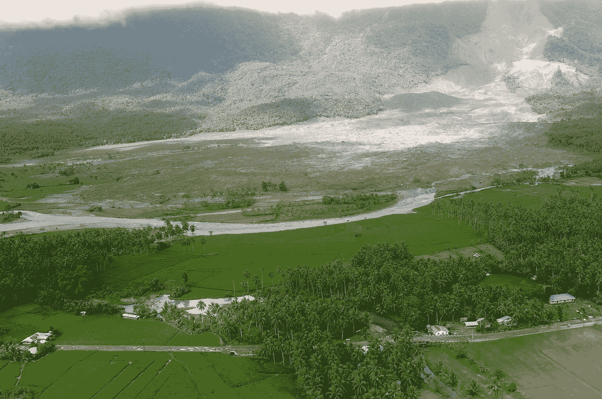

图一。菲律宾的一个城镇遭到山体滑坡袭击——图片来自[皮克斯拜](https://pixabay.com/?utm_source=link-attribution&utm_medium=referral&utm_campaign=image&utm_content=79691)的[大卫·马克](https://pixabay.com/users/12019-12019/?utm_source=link-attribution&utm_medium=referral&utm_campaign=image&utm_content=79691)

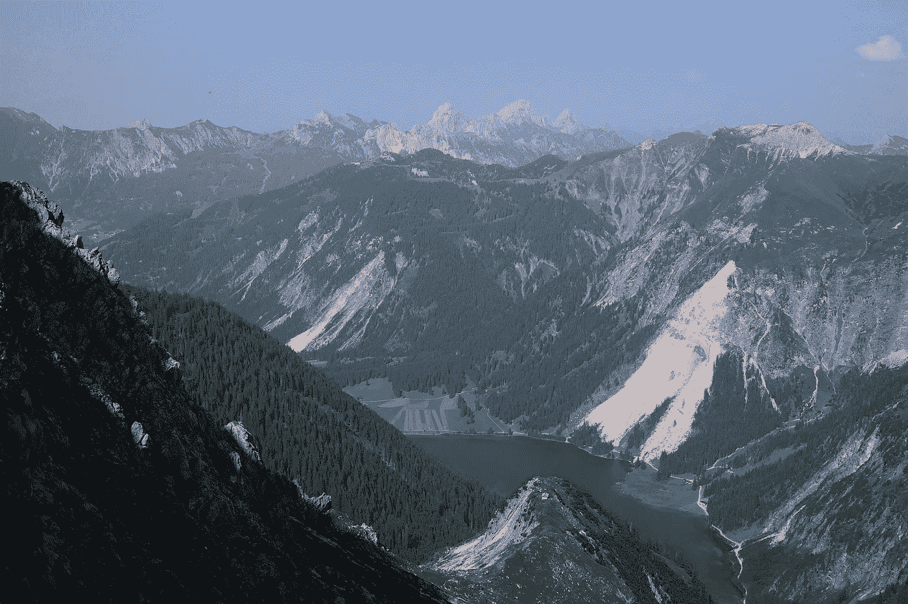

图二。滑坡事件——图片由[汉斯·布拉克斯米尔](https://pixabay.com/users/hans-2/?utm_source=link-attribution&utm_medium=referral&utm_campaign=image&utm_content=1837745)从[皮克斯拜](https://pixabay.com/?utm_source=link-attribution&utm_medium=referral&utm_campaign=image&utm_content=1837745)拍摄

近年来，卫星技术和遥感技术发展迅速。应用卫星遥感捕捉地球的数量和图像质量正在迅速提高。它在地球表面监测中发挥着重要作用。

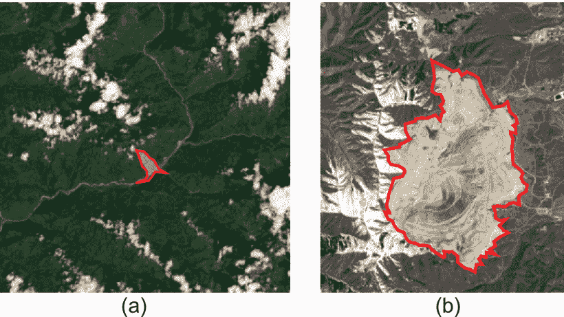

图 3。卫星图像中的滑坡区域—图像来源于[4]

我们的主要目标是理解和实现从卫星图像检测滑坡的方法。根据在不同时间检测到的滑坡区域，给出了滑坡标度(滑坡正在发展或减少)。本文是我题为“卫星架构中滑坡识别的深度学习”的公开论文的解释版本如何做的细节和实现我的论文的第二部分介绍。此外，我还分享了我的出版物的分步源代码。我希望我能把一个从研究论文到现实世界实施的解决方案。本着这个目的，如果你打算发表一篇研究论文，请分享我的文章或参考我的出版物。

T.A. Bui，P. J. Lee，K. Y. Lum，C. Loh 和 K. Tan，**“卫星体系结构中滑坡识别的深度学习”，** *IEEE Access* ，第 8 卷，第 143665–143678 页，2020 年，doi:[10.1109/Access . 200205](https://doi.org/10.1109/ACCESS.2020.3014305)。2006.868636060003

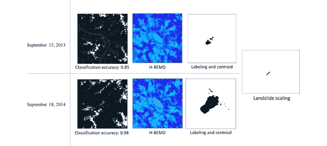

图 4。卫星架构中用于滑坡识别的深度学习—图形摘要[4]

图 4 示出了通过引入 CNN 模型和 H-BEMD 算法之间的组合的滑坡检测的简短过程。从不同时间(2013 年 9 月 15 日和 2014 年 9 月 18 日)捕获的卫星图像，我们可以宣布滑坡发生了更显著的变化，并且易于检测滑坡规模(滑坡方向)。

# **1。基于 H-BEMD 的滑坡区域检测**

色调——二维经验模式分解(H-BEMD)是文献[4]中介绍的一种算法。

## **1.1。为什么在卫星图像中使用色调通道来检测物体？**

HSV 将亮度从色度中分离出来，也称为图像强度。卫星图像受天气影响，尤其是每次拍摄的光照条件不同。图 5 显示了同一地点在其他光照条件下的 RGB 卫星图像。

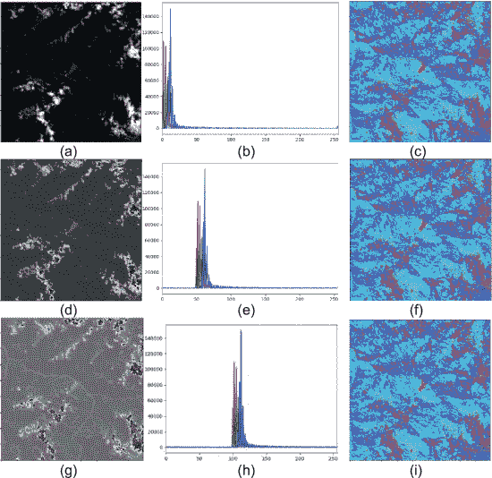

图 5。RGB、直方图和色调通道[4]

虽然三个图像(a、d、g)之间的直方图值不同，但是色调通道是相同的。因此，选择色调图像通道来检测卫星图像中的滑坡目标。

要将 RGB 图像转换为色调通道图像，OpenCV 是一个很好的简单方法。基本上，OpenCV 以 8 位/值(np.uint8 —从 0 到 255)改变 RGB 到 HSV 通道。但是，色调值由一个圆圈表示(从 0 度到 360 度)。因此，下面的代码显示了将 RGB 转换为 HSV 的方法，并给出了完整的取值范围。在这种情况下，无符号整数 16 位应用于全色调值。

用全值把 RGB 换成 HSV。

## **1.2。** **H-BEMD 流程图及源代码**

在这一部分，我将介绍详细的 H-BEMD 算法。首先，图 6 显示了如何通过 H-BEMD 获得变换图像的过程。

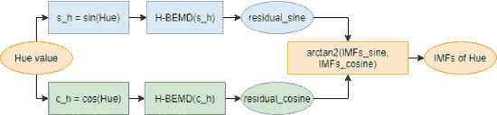

图 6。H-BEMD 流程图[4]

***什么是 H-BEMD？***
*H-BEMD 是 BEMD 算法的改进版本。原始 BEMD [5]应用于来自 RGB 的灰色图像，其具有从 0 到 255 的值范围(以 8 位/值计)。然而，为了应用于色调通道，BEMD 没有得到校正的结果(滑坡区域),因为 BEMD 的主要重要关键点是检测图像信号的极值。因此，色调的正弦和余弦值应用于色调值。然后，检测正弦和余弦的极值。最后，使用反正切 2 合并正弦和余弦极值。它是色调通道的极值。*

BEMD 源代码

接下来，我将详细介绍 H-BEMD 如何获得 *imfs_cos_hue* 和 *imf_sin_hue* 。

BEMD 的细节是什么？

*sin(色调)和 cos(色调)值分别用θ和φ表示。H-BEMD 通过 H-BEMD 筛选过程自适应分解色调图像的正弦和余弦(θ和φ)，流程如下:*

*   **第一步:**通过形态学算法检测θ的极值(最大值和最小值)点。
*   **步骤 2:** 用径向基函数(RBF)[23]分别连接θ的最大值和最小值点，以生成新的 2D 包络
*   **步骤 3:** 如第 2.2.2 节所示，将 2D‘包络线’标准化。
*   **步骤 3:** 通过对两个包络求平均值来确定局部均值 mθ。
*   **第四步:**从图像中减去均值:ϑi=θ−mθ；
*   **步骤 5:** 对φ，ωI =φmφ，遵循步骤 1 至 4
*   **步骤 6:** 用θ=ϑi 和φ=ωi 重复筛选过程，i:=i+1

BEMD 源代码

图 7 是上述源代码的结果。

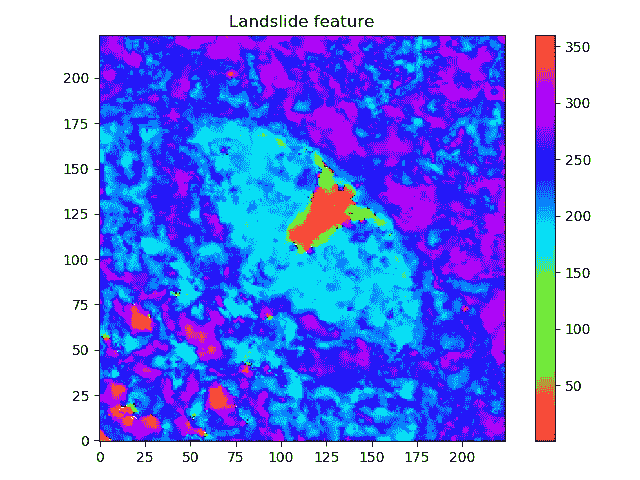

图 7。通过 H-BEMD 检测滑坡区域[4]

# **2。滑坡区域分割**

首先，我们集中于色调通道的简短回顾。图 8 显示了色调值的架构。

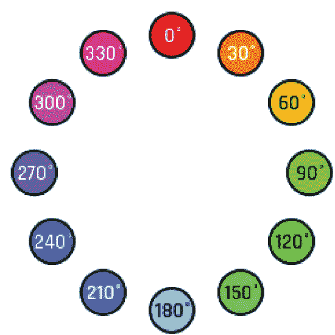

图 8。色调通道[4]

本文介绍用 330° ~ 90°的数值范围来定义滑坡区。python 代码定义滑坡的细节是:

# **3。滑坡大小和方向检测**

在不同时间拍摄的两幅卫星图像用于显示本节中的测试流程图。

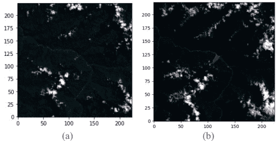

图 9。从卫星图像滑坡物体。(a)2013 年 9 月 15 日拍摄到的尼泊尔 Jure 滑坡——t1 时间。(b)2014 年 9 月 18 日拍摄的尼泊尔 Jure 滑坡——时间 t2 [4]

图 10 是图 9 的 H-BEMD 结果。

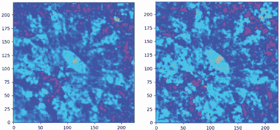

图 10。H-BEMD 结果[4]

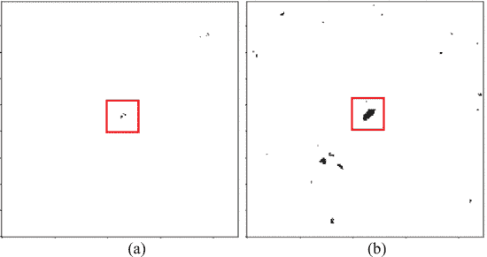

图 11。图 10 的滑坡标记[4]

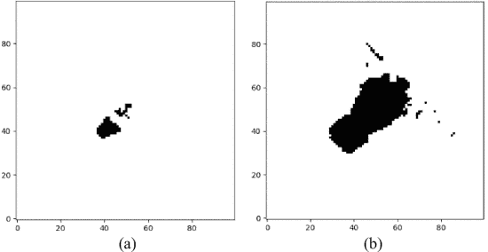

图 12。滑坡区域位置。[4]

从图 12 中，定义了每个滑坡区域的质心点。图 13 和下面的源代码详细显示了质心点以及如何在 python 代码中获得质心点。

源代码:质心点和滑坡缩放方向

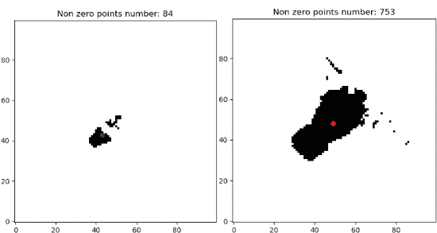

图 13。滑坡区域的质心。[4]

滑坡缩放的方向由绿点和红点定义。下面是详细的源代码。图 14 显示了源代码的结果。

滑坡方向

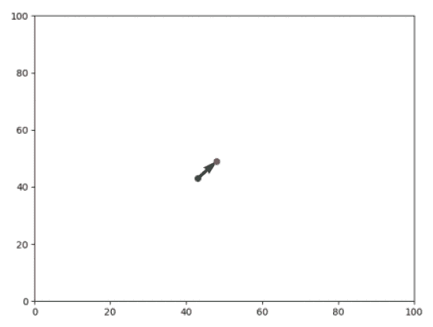

图 14。滑坡方向[4]

根据滑坡方向，我们可以很容易地确定什么区域是危险的，容易受到其影响。由此可以准确预测生活在受影响地区的人们。

我希望这篇文章能对你有所帮助，并对卫星数据在生活中的应用做一个简要的介绍。

**参考资料:**
【1】[https://www . USGS . gov/FAQs/what-a-slide-and-what-causes-one](https://www.usgs.gov/faqs/what-a-landslide-and-what-causes-one)
【2】[https://www.taiwannews.com.tw/en/news/1238060](https://www.taiwannews.com.tw/en/news/1238060)
【3】[https://vov . VN/en/society/massive-slides-bury-residents-and-houses-in-lai-chau-377950 . vov](https://vov.vn/en/society/massive-landslides-bury-residents-and-houses-in-lai-chau-377950.vov)
【4】t . a . Bui，p
【5】j . c . nu nes，Y. Bouaoune，E. Delechelle，O. Niang 和 P. Bunel，“二维经验模式分解的图像分析”，*图像 Vis。计算机。*，第 21 卷，第 12 期，第 1019-1026 页，2003 年 11 月。