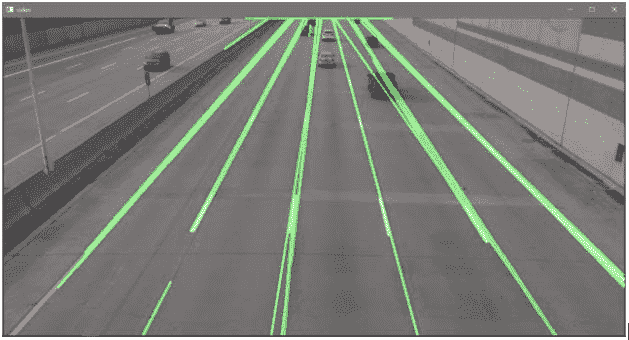
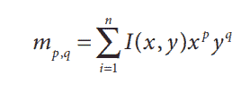
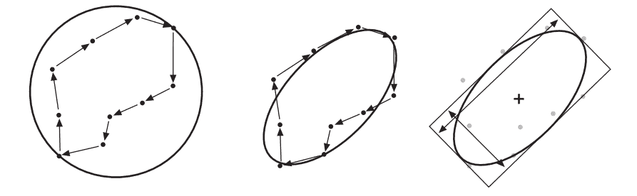
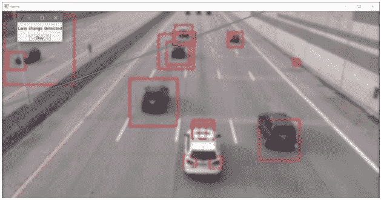
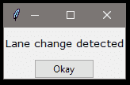
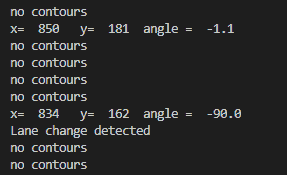

# 车道变换检测——下一阶段的计算机视觉

> 原文：<https://towardsdatascience.com/lane-change-detection-computer-vision-at-next-stage-914973f96f4b?source=collection_archive---------39----------------------->

## OpenCV 和图像处理领域的领先创新

计算机视觉(图片由来自 Pixabay 的[奥莰·卡里斯坎提供)](https://pixabay.com/illustrations/ai-future-intelligence-brain-4846063/)

嘿，伙计们，兴奋起来吧，因为在本教程中，我们将了解如何使用计算机视觉和图像处理来检测汽车是否在道路上变道，所以不再拖延，让我们开始-

你一定听说过使用 OpenCV haar cascade 文件检测人脸、眼睛或汽车、公共汽车等物体。可以做到，但接下来呢？所以让我们用这个简单的检测方法来建立一些很酷的东西。

# 1.资料组

在本教程中，道路上汽车的视频文件被用作数据集。此外，我们可以使用图像数据集检测图像中的汽车，但在这里，当汽车改变车道时，我们会通过弹出窗口发出警告，因此对于这些动态，视频输入更可行。

# 2.投入

第一步是给出教程中使用的输入 OpenCV 的 haar 级联文件，用于检测汽车的坐标，道路上汽车的视频文件

接受输入

cv2。VideoCapture()方法用于捕捉输入的视频，一段视频一般为每秒 25 幅图像/帧(fps)。在捕获输入后，使用循环提取帧，并使用汽车的 haar 级联文件检测到的坐标，我们在循环中围绕汽车绘制一个矩形，以在对捕获的帧执行其他操作时获得一致性。

检测汽车

在 OpenCV 中使用 BGR 而不是 RGB，所以(0，0，255)将在汽车上绘制一个红色矩形，而不是蓝色。

框架(图片由作者提供)

# 3.图像处理

我们使用该帧，但是如果该帧具有非常高的分辨率，它将减慢所执行的操作，此外，该帧包括可以使用模糊来减少的噪声，这里使用高斯模糊。

现在，让我们来看看一些图像处理的概念

# 3.1 HSV 框架

在这里，我们使用从 cv2 捕获的帧中获得的 HSV 帧。VideoCapture()仅突出显示汽车转弯的点，并封锁其余道路&汽车在道路上直行。设置上限和下限阈值来定义 HSV 中的颜色范围，以查看汽车改变车道的点，并用作帧的遮罩。下面是用来获得这个的代码片段-

# 3.2 侵蚀和膨胀

腐蚀和膨胀是图像处理中使用的两种基本形态学操作。侵蚀算子在核的区域上具有局部最小值的效果，核是模板或遮罩。腐蚀用于减少图像中的散斑噪声，散斑是从图像中的物体边界被腐蚀掉的。膨胀是图像和内核的卷积，它具有局部最大值算子的效果。当添加像素以平滑图像中对象的边界时，应用膨胀来重新获得一些丢失的区域。

从 HSV 帧中的第一步生成的遮罩现在用基本的形态学操作(腐蚀和膨胀)来处理。通过将帧和遮罩之间的按位 AND 运算应用于获取 ROI(感兴趣区域)来生成结果帧。

# 3.3 车道检测

canny 边缘检测器与 Hough 线变换一起用于车道检测。

Canny 边缘检测(图片作者提供)

# 4.轮廓

canny edge detector 之类的算法用于查找分隔图像边缘的边缘像素，但它没有告诉如何查找对象或实体，因为我们无法组合/组装一些点和边缘，这里我们可以使用 OpenCV 中实现的轮廓概念，如 cv2.findContours()。

定义—“轮廓是代表图像中曲线的点的列表。”轮廓由序列表示(序列是一个链表结构)，每个序列都编码了下一个点的位置信息。我们在 ROI 中多次运行 cv2.findContours()来获取实体，然后使用 cv2.drawContours()来绘制轮廓区域。轮廓可以是点、边、多边形等。所以在画等高线的时候，我们做多边形近似，找出一个区域的边长和面积。函数 cv2.drawContours()的工作原理是从根节点开始绘制一棵树(数据结构),然后连接后续的点、边界框和 freeman 链码。

找到轮廓后的另一个重要任务是匹配它们。匹配轮廓意味着我们有两个单独的计算轮廓来相互比较，或者有一个轮廓来与抽象模板比较。

# 5.朋友圈

我们可以通过计算轮廓矩来比较两个轮廓。"矩是轮廓的总特征，通过将轮廓的所有像素相加来计算."

(图片来自图书参考 1《学习 OpenCV》)

**力矩类型-**

***空间矩:*** m00，m10，m01，m20，m11，m02，m30，m21，m12，m03。

***中心矩:*** mu20，mu11，mu02，mu30，mu21，mu12，mu03。

*胡矩:*有七个胡矩(h0 — h6)或(h1 — h7)，两个符号都用。

我们计算力矩并使用 cv2.fitEllipse()在点上拟合椭圆。该角度是从轮廓和力矩中找到的，因为改变车道需要 45 度旋转，这被认为是汽车转弯角度的阈值。

拟合椭圆(图片来自参考书籍 1“学习 OpenCV”)

现在，我们可以使用 Tkinter 作为一个简单的弹出窗口来提醒变化，而不仅仅是打印变化车道的检测。

(图片由作者提供)

用画在车架上的矩形用绿线测量角度

弹出警告(图片由作者提供)

输出(图片由作者提供)

# 6.总结和未来范围

在本教程中，使用车道变换检测方法探索了智能汽车导航的一个小演示。

计算机视觉正在快速发展，其应用不仅在汽车的局部导航方面，而且在火星导航和产品检测领域都在进步，甚至正在开发医疗应用，并用于在早期阶段检测 X 射线图像中的癌症和肿瘤。

万岁，你坚持到了最后。太棒了。[点击这里](https://github.com/Hitesh-Valecha/Car_Opencv)获取我的 **GitHub** 账户的源代码。

请随意询问任何疑问，因为我们正在学习与机器一样的东西 [Hitesh Valecha](https://medium.com/u/83a321d1f956?source=post_page-----914973f96f4b--------------------------------) …

**参考文献—**

*   *Bradski，Gary 和 Kaehler，Adrian* ，*学习 OpenCV:使用 OpenCV 库在 C++中进行计算机视觉，O'Reilly Media，in C .第二版，2013 年，@10.5555/2523356，ISBN-1449314651。*
*   *Laganiere，Robert，OpenCV 计算机视觉应用编程食谱，Packt 出版社，2014 年第 2 版，@10.5555/2692691，ISBN — 1782161481。*

好吧，由于创新从未停止，我邀请您阅读另一篇关于 [***耳朵生物识别***](/ear-biometrics-machine-learning-a-little-further-1839e5d3e322) ***的创新博客。***