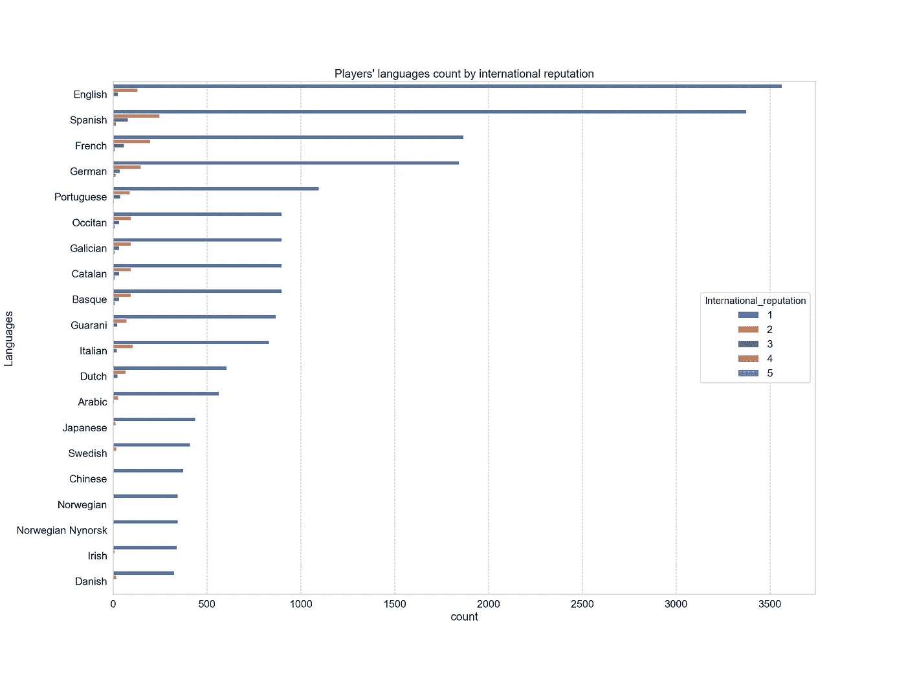
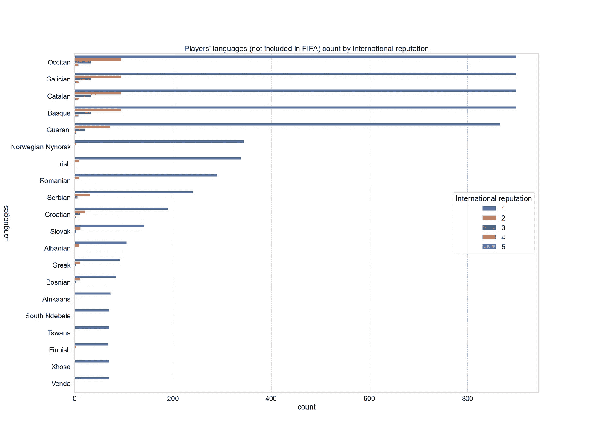
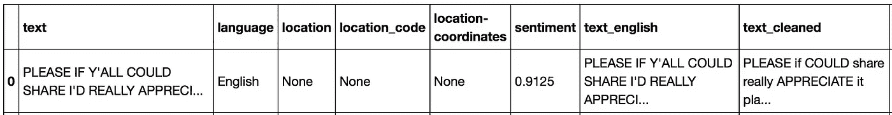

# 语言本地化:数据科学和 FIFA 20 的端到端项目

> 原文：<https://towardsdatascience.com/language-localization-an-end-to-end-project-on-data-science-and-fifa-20-9b467c636345?source=collection_archive---------43----------------------->

## 使用 Python 和 Plotly 可视化进行探索性数据分析和 Twitter 情感分析。


[JESHOOTS.COM](https://unsplash.com/@jeshoots?utm_source=medium&utm_medium=referral)在 [Unsplash](https://unsplash.com?utm_source=medium&utm_medium=referral) 上拍照

> “什么是语言本地化？”你可能会问。

L 语言本地化是将产品翻译适应特定国家或地区的过程。这是一个更大的产品翻译和文化适应过程(针对特定国家、地区、文化或群体)的第二阶段，以说明不同市场的差异，该过程称为国际化和本地化。如这里的[所解释的](https://en.wikipedia.org/wiki/Language_localisation):

> 本地化流程通常与软件、视频游戏和网站以及音频/画外音、视频或其他多媒体内容的文化适应和翻译相关，较少涉及任何书面翻译(也可能涉及文化适应流程)。本地化可以在人们讲不同语言或讲同一种语言的地区或国家进行。

所以在某个时候，我被提到了这个项目:*想象一下* [*电子艺界(EA)*](https://www.ea.com) *想知道什么是翻译未来版本的*[*FIFA*](https://www.ea.com/games/fifa)*视频游戏的好语言。这个任务依次分配给你，数据科学家，你没有资源，只有一个 Kaggle 数据集，里面有游戏中所有玩家的属性。*

在没有官方数据或任何先前研究的情况下，我们不得不利用玩家的数据集，或许收集我们自己的数据。但是没什么好害怕的，这是数据科学家在几乎每个新项目中必须处理的事情。

**TL；在这个过程中，我们使用了游戏中玩家的属性和技能的完整数据集。这个数据集包含一个名为*国际声誉(IR)* 的属性，它告诉我们一个球员在国际上的知名度。我们得出的结论是基于这样一个假设，即大量相同国籍、高 IR 的玩家可能会影响游戏在他们国家的可玩性。**

除此之外，我们收集并使用了一系列提到游戏的 Twitter 消息。通过计算推文文本的[情绪](https://en.wikipedia.org/wiki/Sentiment_analysis)得分，我们可以区分人们对游戏的评价更积极的地方。这当然可以为游戏的本地化提供更好的见解。

**为了可读性，这个故事没有代码。使用的完整 python 源代码和结果可以在下面的资源库中找到:**[**【https://github.com/hectoramirez/Language-localization_FIFA】**](https://github.com/hectoramirez/Language-localization_FIFA)

# 国际足联 20 种语言

我们从学习已经包含在 FIFA 20 中的语言开始。根据官方网站的消息， [FIFA 20](https://www.ea.com/games/fifa/fifa-20) 目前有以下 **21** 语言版本，并提供了特定地区的解说:

> 阿拉伯语、捷克语、丹麦语、德语(德国)、英语(美国)、西班牙语(西班牙)、西班牙语(墨西哥)、法语(法国)、意大利语、日语、韩语、荷兰语、挪威语、波兰语、葡萄牙语(巴西)、葡萄牙语(葡萄牙)、俄语、瑞典语、土耳其语、中文(简体)、中文(繁体)。

虽然这只是全球语言和玩家语言的一小部分，但我们可以肯定的是，由于这些语言的流行，大多数国家都包括在内。为了看到这一点，我通过连接来自这个公共存储库的数据构建了一个数据框架。头部看起来像这样:

然后，我过滤了游戏中包含的语言，并在地图中定位了相关的国家(在这里和所有地方，我使用了 [Plotly Express](https://plotly.com/python/plotly-express/) 来表示地图):

在地图中，只有一种语言与每个国家相关联，但是我们对那些没有语言的国家感兴趣。

我们可以看到，除了巴尔干地区、东南亚和几个其他国家，世界大部分地区都被覆盖了。因此，我们想调查一下那些被遗漏的国家，也许还想调查一下那些已经被调查过的国家所使用的第二种(或地区性)语言。

# 国际足联 20 名球员数据集

FIFA 20 球员数据集可以从这个 Kaggle [库](https://www.kaggle.com/stefanoleone992/fifa-20-complete-player-dataset?select=players_20.csv)中获得。如描述所述，数据集由 103 列和 18278 个条目组成，包含:

*   100 多个属性。
*   擦伤玩家的网址。
*   球员位置，在俱乐部和国家队中的角色。
*   球员属性，包括进攻、技术、防守、心态、GK 技能等。
*   球员个人资料，如国籍、俱乐部、出生日期、工资、薪水等。

可以从此数据集执行多种分析。然而，出于本分析的目的，我们可能只需要一名球员的*国籍*和*俱乐部*。让我们也保留*简称*以供识别，以及*整体*和*国际声誉*分数，因为它们肯定能提供一些见解。数据框的头部看起来像:

现在，这个分析中的一个关键思想是**一个球员越受欢迎，他对于一个国家就越有代表性**。换句话说，一个拥有更多优秀球员的国家会影响游戏的可玩性。以克罗地亚为例，在上一届世界杯上，他们以一队公认的球员名列第二；这一事实会影响整个国家游戏的可玩性，也许克罗地亚语是我们正在寻找的一种语言。

> 一个拥有更多优秀球员的国家会影响游戏的可玩性

我们有国际声誉领域来衡量这种影响。然而，首先我们需要向数据中添加一个语言字段。为此，我们使用国家/语言数据框架将语言与玩家的国籍联系起来。

然后，我们可以查看 *countplot* ，看看每种语言有多少玩家。请记住，我们对拥有更多国际声誉(IR)的玩家的语言感兴趣。以下是 IR 提供的全套语言:



顶级语言

请注意，IR 是一个可以取 1 到 5 的离散值的属性。现在，问题是大部分这些语言已经包含在游戏中了。仅保留未包含的语言:



国际足联尚未纳入的顶级语言

请记住，我们把一个国家的所有语言与这个国家联系起来。因此，考虑到一个国家使用多种语言，一些价值观是重复的。

为了过滤掉一些语言，我们注意到以下关于顶级国家的事实:

*   首先，我们假设所有的西班牙球员都会说巴斯克语、加泰罗尼亚语和加利西亚语，这显然不是真的(很多国家都是如此)。事实上，西班牙 19%的人说加泰罗尼亚语(或巴伦西亚语)，5%的人说加利西亚语，2%的人说巴斯克语。[ [参考。](https://en.wikipedia.org/wiki/Languages_of_Spain) ]
*   法国南部、摩纳哥、意大利的奥克西坦山谷以及西班牙的瓦勒达兰地区使用奥克西坦语，共有 10 万到 80 万人使用这种语言。参考文献。 ]
*   瓜拉尼语是南美洲的一种土著语言。它是巴拉圭的官方语言之一，大多数人口都讲这种语言。邻国的社区也说这种语言，包括阿根廷东北部、玻利维亚东南部和巴西西南部的部分地区，它是阿根廷科连特斯省的第二官方语言。尽管它有 485 万(引用于 1995 年)的母语使用者。【[参。](https://en.wikipedia.org/wiki/Guarani_language) ]
*   挪威语是挪威语的两种书面标准之一。【[参。](https://en.wikipedia.org/wiki/Nynorsk) ]
*   尽管英语在爱尔兰的其他地方是更普遍的第一语言，但爱尔兰语在很多地区被作为第一语言使用。爱尔兰语在爱尔兰共和国的官方地位仍然很高，2016 年 4 月，回答会说爱尔兰语的总人数为 1，761，420 人，占爱尔兰共和国 4，921，500 人口(2019 年估计数)的 39.8%。在北爱尔兰，1，882，000 人口中有 104，943 人被认定会说爱尔兰语(2018 年估计)。【[参考。](https://en.wikipedia.org/wiki/Irish_language) ]

考虑到这些事实，我们将采取以下考虑因素:

*   对于说加泰罗尼亚语的人，我们只会让西班牙球员继续在巴塞罗那踢球，主要是因为他们的政策是教他们的球员加泰罗尼亚语。参考文献。 ]
*   对于说瓜拉尼语的球员，我们将只保留巴拉圭球员，因为这种语言在其他国家的大多数人口中都是一样的。
*   我们保留所有说爱尔兰语的人。
*   我们放弃巴斯克语、加利西亚语、奥克西坦语和尼诺斯克语。
*   并保留其他使用人数较少的语言。

这给我们留下了一批拥有不同国籍和语言的球员，我们现在想按照国际声誉对他们进行分类。

## 国际声誉

我们现在想对玩家的语言进行分析。

> 国际声誉，也称为国际认可，是根据球员所在俱乐部在当地和国际上的声望来影响球员评级的属性。它本质上是基于两者的受欢迎程度、历史和结果。基本上，IR 的建立是为了调整球员的评分，相对于所有与他的技术、身体和精神能力无关的事情。它被人为地收敛，以至于在全球拥有最多粉丝的球员总是获得最高的收视率，但实际上并没有真正的效果。参考文献。 ]

通过对每种语言的 IR 进行平均，我们最终得出了游戏中尚未包含的语言之间的关系，这些语言是根据玩家的平均国际声誉排序的。看一看:

顶级玩家的语言按 IR 排序

这里我们做了几处改动。首先，为了避免偏见，我们放弃了少于 15 个玩家的语言。我们还对 IR 分数进行了标准化，现在范围在[0，1]之间。最后，我们为每种语言附加了最具代表性的国家和国家代码(这是为了绘图)。

因此，我们最终得出了一个视频游戏中尚未包含的语言的关系，这些语言是根据玩家的平均 IR 排序的。看了一下可以得出结论，**加泰罗尼亚语**、**斯洛文尼亚语**、**克罗地亚语**、**波斯尼亚语**和**匈牙利语**是最突出的语言。

让我们最终在地图上定位这些语言:

请注意**巴尔干国家**是最突出的语言本地化给玩家的 IR。

# 社交媒体分析

在第二部分中，我们进行了社交媒体分析，以了解人们对游戏的评价，特别是在 [Twitter](https://twitter.com/search?q=%23FIFA20&src=typeahead_click&f=live) 上。

Twitter 允许使用 [tweepy](http://docs.tweepy.org/en/latest/index.html) 来收集推文，tweepy 是一个用于访问 Twitter API 的 Python 库。我不打算给出如何收集推文的教程；然而，遵循文档是非常简单的。你也可以看看我的[剧本](https://github.com/hectoramirez/Language-localization_FIFA/blob/master/Twitter%20(git)/TwitterStreamer.py)，但是记住你需要用你自己的[凭据](https://developer.twitter.com/en/docs/basics/authentication/overview)。

每个 [*tweet 对象*](https://developer.twitter.com/en/docs/tweets/data-dictionary/overview/tweet-object) 以 JSON 格式出现，*混合了“根级”属性和子对象(用* `*{}*` *符号表示)*。Twitter 开发者页面给出了以下例子:

```
{
 "created_at": "Wed Oct 10 20:19:24 +0000 2018",
 "id": 1050118621198921728,
 "id_str": "1050118621198921728",
 "text": "To make room for more expression, we will now count all emojis as equal—including those with gender‍‍‍ ‍‍and skin t… https://t.co/MkGjXf9aXm",
 "user": {},  
 "entities": {}
}
```

当然，这只是组成每条推文的庞大字典中的一小部分。

很明显，出于我们的目的，我们只需要这些属性中的几个:文本、文本语言和 tweet 位置。不幸的是，这些属性并没有一个清晰的格式，相反，它们分布在 JSON 的各个层次上——*例如*，tweet 位置坐标位于

```
tweet_object['place']['bounding_box']['coordinates']
```

正是由于这一事实，收集的推文需要一个大的清洗和转换过程。事实上，我写了一个单独的故事来解释字典变平的过程；选择、清洗、翻译和计算文本的情感；清理文本语言字段；并使用*位置*字段或*用户位置*字段分配 tweet 的适当位置。你可以在这里找到这个故事:

[](/twitter-json-data-processing-3f353a5deac4) [## Twitter JSON 数据处理

### 使用 python 库清理和润色用于社交媒体分析的推文数据帧。

towardsdatascience.com](/twitter-json-data-processing-3f353a5deac4) 

一旦我们有了处理过的 tweets 数据框架，我们就准备继续我们的研究。请注意，Twitter 不允许公开 tweet 数据，因此我不会发布任何数据帧的示例，而只是一行快照来显示字段(我们将在全文中解释):



我在几天的时间里收集了 **52830 条**类似图片中的推文，包含以下关键词: **'#FIFA20'** ，' **#FIFA21'** ， **'FIFA20'** ， **'FIFA21'** ， **'FIFA 20'** ， **'FIFA 21'** 和**'如前所述，所有这些推文都根据我们的需求进行了相应的处理。因此，最终数据集带有关于推文位置(国家和坐标)、文本英文版本的情感(在[-1，1]范围内变化)以及文本被推文使用的语言的相关数据，但是请记住，这种语言是“检测到的”，因此可能会被错误地分配，正如我们将看到的那样。**

在下文中，我们将遵循四条路径:

1.  我们将研究带有准确位置(带坐标)的推文，因为它们是关于其位置的最可靠的推文。
2.  然后，我们通过推特上写的语言来研究推特。
3.  然后，通过手动设置用户位置。
4.  最后，我们根据国际声誉(在上一节中获得)回到最著名的语言，并研究来自使用这些语言的国家的推文的情绪。

## 带坐标的推文(确切位置)

不幸的是，世界上只有大约 1%的推文带有精确的地理位置，主要是因为用户必须启用这个选项。

> 在我们的 52830 条推文中，只有 485 条推文提供了坐标级别的位置。

通过过滤这些推文，我们可以按语言对它们进行分组，并计算它们的平均情绪。这是我们的发现:

推文的语言(有确切的位置)按平均情绪排序

查看数据框架，我们可以清楚地看到，除了*他加禄语/菲律宾语*、*印尼语*和*捷克语*之外的所有语言都已经包含在游戏中。然而，这些数字和情绪并不能真正说明问题。因此，我们可以得出结论，这个 tweet 样本没有提供足够的洞察力，因此我们需要研究其他 tweet 属性。

## 按推特语言分类的推特

让我们转到*语言*领域。这个字段取自 Twitter JSON 中的`lang`属性，并将其更改为语言标准名称。如文档中所述:

> 如果存在，则指示与机器检测到的 Tweet 文本语言相对应的 BCP 47 语言标识符，如果没有检测到语言，则指示`und`。

因此，我们按这一列对数据集进行分组，并按语言计算平均情绪。此外，为了分析这些语言的本地化，我们根据这些语言在哪里被最频繁地使用**来给它们分配一个国家。以下是我们的发现:**

**Tweets 检测到的语言和位置按平均情绪排序**

**我们来看一些异常情况:**海地语多在加纳使用**；**立陶宛语、爱沙尼亚语和他加禄语/菲律宾语，在巴西**；还有**斯洛文尼亚人在津巴布韦**！这实际上只意味着语言检测器不能正常工作。**

**这些异常很难是异常值，因此我们可以得出结论，Twitter `lang`属性对于我们的分析来说不够可靠，因此我们需要相信手动设置的用户位置字段。**

## **按用户位置分类的推文**

**如前所述，Twitter JSON 中的用户位置字段是用户用原始文本填充的字段。这意味着该字段可能会也可能不会给出实际位置，如果是这样，它可能是一个城市、州或省，而不是一个国家。**

**为了解决这个问题，在清理这个字段的过程中，我们使用 [GeoPy](https://geopy.readthedocs.io/en/latest/#) 来识别一个位置(可能是一个地址)并为其分配一个国家。因此，在数据集中，`location`字段提供 GeoPy 的“检测到的”国家。然而，非空值的样本大约是整个数据集的一半，这意味着要么用户没有提供位置，要么提供的文本不包含实际位置。**

**我们根据位置对集合进行分组，并再次计算平均情绪。由于我们实际上对语言感兴趣，我们添加了这些国家的语言，然后我们按照上一节的步骤删除游戏中已经包含的国家和其他国家(巴斯克，加利西亚，欧西坦等)。).为了避免偏见，我们还删除了少于 20 条推文的条目(`count`)。以下是我们的发现:**

**按平均情绪排序的推文语言和用户位置**

> **这个数据集显然比以前的案例提供了更多的信息！**

**在顶级语言中，我们可以突出**保加利亚**、**希伯来**、**印地语**和**爱尔兰语**。新西兰的毛利人和玻利维亚的艾马拉人可能不太有趣，因为他们是土著居民。还要注意，除了希腊和捷克共和国，所有国家都有积极的平均情绪。**

**让我们最终在地图上定位这些语言:**

**我们获得了人们对这款游戏持积极态度的顶级国家。然而，这些国家使用的语言与分析球员国际声誉时使用的语言不同。鉴于这一事实，让我们看看这些语言在最后一节中是如何在 tweets 集合中得分的。**

## **国际声誉对顶级语言的感悟**

**在上一节中，我们通过玩家的国际声誉获得了顶级语言。为了完成分析，我们想知道这些语言的情感，并看看是否有一种语言在其他语言中既有 IR 又有情感。**

**然后，我们将“按 IR 排序的顶级玩家语言”数据集与“按平均情绪排序的推文语言和用户位置”数据集合并，以获得:**

**IR 和情感排名靠前的语言，按情感排序**

**上面的数据框架是按情感分类的，第一列代表了各种语言在国际上的声誉。这允许对两种情况进行简单快速的比较。**

**也许最好的例子是希伯来语的,它以高于平均水平的情感分数排名第二，IR 排名第十。然后**乌克兰**。另一方面，**加泰罗尼亚**此前拥有迄今为止最好的 IR，但它在人气方面表现不佳，尽管我们要记住这个分数涉及整个西班牙，而不仅仅是加泰罗尼亚。**

**让我们最后来看看地图上的这些语言:**

# **结论**

**在这个项目中，我们旨在对 FIFA 视频游戏的语言本地化提出见解。**

**我们首先展示了国际足联游戏中使用一种或多种语言的国家。我们注意到**巴尔干国家**和**东南亚**没有被当前可用的语言覆盖。**

**然后在第一部分，我们本地化了游戏中没有的语言，并通过使用该语言的玩家的国际声誉(IR)来突出显示它们。这说明像**加泰罗尼亚语**、**斯洛文尼亚语**、**克罗地亚语**、**波斯尼亚语**或**匈牙利语**这样的语言是由知名玩家使用的，这可能会影响游戏在这些国家/地区的可玩性。**

**关于社交媒体分析，世界上只有一小部分推文(几乎 1%)包含准确的地理位置。在我们的数据集中，他们总结了近 500 条推文。我们表明这个子集不够大，不足以得出结论。**

**然后，我们通过手动设置的用户位置处理推文，找到归属国家并关联该国家的主要语言。然后，我们在地图上定位这些语言，并根据情绪给它们着色。我们发现**保加利亚语**、**希伯来语**、**印地语**和**爱尔兰语**是这些国家的语言——不包括在游戏中——在这些国家，人们说话更积极。**

**最后，我们发现通过 IR 进行本地化的一些语言很突出，而通过情感进行本地化的另一些语言则很突出。在最后一部分，我们的目标是选择一种或多种同时具备这两种属性的语言。有趣的是，**希伯来语**以高于平均水平的情感分数排名第二，IR 排名第十，因此是最突出的目标语言。**

**接下来的步骤将涉及使用非公开的，或 EA 的官方数据，以做出更专业的决定。**

## **关于作者**

**我最近获得了物理学博士学位，目前正在进入数据科学领域。非常感谢您对本项目的任何意见和/或建议。另外，看看我的其他故事:**

**[](/your-live-covid-19-tracker-with-airflow-and-github-pages-658c3e048304) [## 您的实时新冠肺炎跟踪与气流和 GitHub 网页

### 加载数据，用散景制作出色的可视化效果，将它们放在 GitHub Pages 网站上，让气流自动流动…

towardsdatascience.com](/your-live-covid-19-tracker-with-airflow-and-github-pages-658c3e048304) [](/twitter-json-data-processing-3f353a5deac4) [## Twitter JSON 数据处理

### 使用 python 库清理和润色用于社交媒体分析的推文数据帧。

towardsdatascience.com](/twitter-json-data-processing-3f353a5deac4) 

最后，请随时在 LinkedIn 与我联系:

[](https://www.linkedin.com/in/harr/) [## Héctor Ramírez -西班牙巴伦西亚地区|职业简介| LinkedIn

### 我最近获得了物理学博士学位，专攻实验数据分析和数学建模。我领导了…

www.linkedin.com](https://www.linkedin.com/in/harr/)**