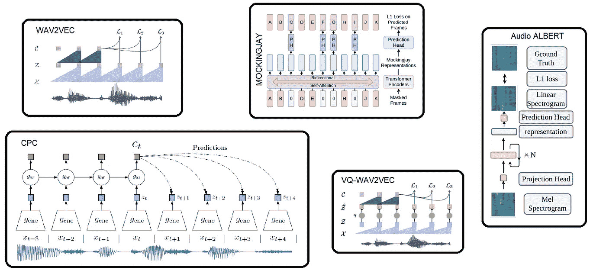
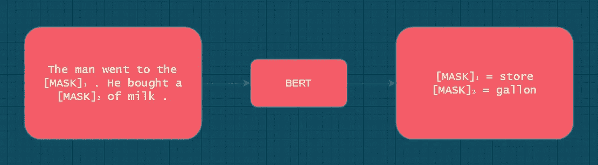
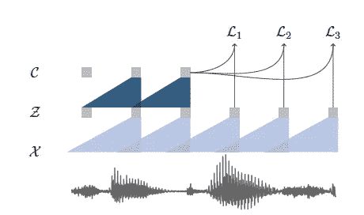

# 语言模型，如声学数据的预训练

> 原文：<https://towardsdatascience.com/language-model-like-pre-training-for-acoustic-data-f6057b3701ca?source=collection_archive---------30----------------------->

基于自监督表示学习的声学数据模型— wav2vec [1]，Mockingjay [4]，Audio ALBERT [5]，vq-wav2vec [3]，CPC[6]

密切关注自然语言处理(NLP)研究的人会知道，最近引入的语言模型，如伯特[7]，GPT，正在从根本上改变 NLP 领域。在自然语言处理中，无监督的语言模型预训练改善了许多任务，如文本分类、语义文本相似性、机器翻译。**你有没有想过，除了自由文本，这些无监督的语言模型预训练如何帮助序列时间序列数据？**

最近，我得到了一个处理声学数据的机会，我们必须根据记录的声音数据来识别机器的运行组件，比如电机或压缩机。由于没有用于尝试监督学习的标记数据，我不得不寻找替代方法。令我惊讶的是，我遇到了很多使用无监督语言模型(如预训练)即兴完成语音识别任务的研究工作。

如果你想对声学时间序列数据使用无监督语言模型预训练的能力，那么这篇文章就是为你准备的。

## 语言模型预训练

迁移学习现在相当流行，一个为一个任务训练的模型被重新用于另一个目标任务。在计算机视觉(CV)中，迁移学习广泛存在；例如，为了获得可靠的性能，通常会针对目标任务微调在 ImageNet 数据集上预先训练的模型。但这里的问题是，很难找到像 ImageNet 这样的 NLP 或声学时间序列数据的大规模标记数据集。

为了利用维基百科这样的在线免费文本数据，人们开始使用语言模型预训练。在传统的语言模型设置中，我们的目标通常是使用前面的上下文单词来预测序列中的 nᵗʰ单词。

伯特蒙面 LM 的描绘—作者照片

在当今时代，一个著名的语言模型预训练任务是伯特的蒙面 LM (MLM) [7]。在 MLM，目标是恢复句子中的屏蔽词。上面提到的图描述了 MLM，其中 BERT 试图根据上下文预测屏蔽的输入单词。从根本上说，在语言建模中，我们试图计算单词序列的联合概率分布。

语言模型预训练允许我们获得有用的基于上下文的单词嵌入，然后我们可以在任何目标任务中使用它。词语嵌入是一种表征方式，它能让意义相似的词语有相似的表征。更正式地，语言模型预训练将属于无监督/自监督表示学习。

## wav2vec

像预训练这样的语言模型开始在声学任务中显示出一些有希望的结果，如语音识别、音频分割或通过利用未标记的音频数据进行异常检测。wav2vec [1]，Audio ALBERT [5]，wav2vec 2.0 [2]，Mockingjay [4]，vq-wav2vec [3]是其中值得注意的一些。未标记的音频数据比标记的数据更容易访问。

在本文中，我们将简要地研究脸书的 wav2vec 模型。wav2vec 模型的预训练任务是从给定的信号上下文中预测未来的样本[1]。这项任务的目的基本上是训练模型，这些模型理解波形并生成有意义的声音嵌入。理想情况下，听起来相似的音频片段在这些模型生成的嵌入中具有相似的表示。

音频数据“X”的 wav2vec 预训练图[1]

wav2vec 架构由两个多层卷积神经网络叠加而成，如上图所示。编码器网络将原始音频输入*‘X’*映射到表示*‘Z’*，其中每个向量覆盖大约 30 毫秒的音频。上下文网络使用那些*‘Z’*向量来生成其表示*‘C’*，其覆盖了高达一秒的更大跨度【1】。有关 wav2vec 的更多信息，请访问此[链接](https://ai.facebook.com/blog/wav2vec-state-of-the-art-speech-recognition-through-self-supervision/)。

继 wav2vec 之后，脸书最近发布了 vq-wav2vec [3]和 wav2vec 2.0 [2]。wav2vec 2.0 模型的预训练任务与伯特的 MLM 非常相似[2]。

## 培训定制 wav2vec 模型

要基于您的未标记音频数据集训练您自己的定制 wav2vec 模型，我想推荐脸书 AI Research 的序列建模工具包，名为**[**fair seq**](https://github.com/pytorch/fairseq)。Fairseq 提供 CLI 工具来快速训练您自己的 wav2vec 系列模型。Fairseq 有 wav2vec，vq-wav2vec，wav2vec 2.0 的示例实现。有关 wav2vec 系列型号的 fairseq 的更多信息，请访问此[链接](https://github.com/pytorch/fairseq/blob/master/examples/wav2vec/README.md)。**

**对于其他模型架构，如 Mockingjay、Audio ALBERT 等。，我想提一下即将推出的名为自我监督语音预训练和表征学习工具包( [**S3PRL 语音工具包**](https://github.com/andi611/Self-Supervised-Speech-Pretraining-and-Representation-Learning) )的库。如果你打算研究除了 wav2vec 系列之外的上述任何型号，一定要看看它们。**

***2021 年 7 月 18 日更新:wav2vec 车型现提供* [*抱脸*🤗*变形金刚*](https://huggingface.co/blog/fine-tune-wav2vec2-english)**

**是时候让有标签的数据集休息一下，开始利用无标签的数据集了。在许多情况下，未标记的数据相对容易收集。**

**无监督/自我监督表示学习开始在 NLP 之外的任务中表现良好。正如本文所讨论的，它已经为声学数据显示了一些有希望的结果。甚至 CV 也开始使用像预训练一样的无监督语言模型，例如[图像 GPT](https://openai.com/blog/image-gpt/) 。**

## **参考**

**[1] Steffen Schneider，Alexei Baevski，Ronan Collobert 和 Michael Auli， [wav2vec:语音识别的无监督预训练](https://arxiv.org/abs/1904.05862) (2019)**

**[2] Alexei Baevski，Henry Zhou，Abdelrahman Mohamed，和 Michael Auli， [wav2vec 2.0:语音表征的自我监督学习框架](https://arxiv.org/abs/2006.11477) (2020)**

**[3] Alexei Baevski，Steffen Schneider 和 Michael Auli， [vq-wav2vec:离散语音表示的自我监督学习](https://arxiv.org/abs/1910.05453) (2019)**

**[4] Andy T. Liu，，Po-Han Chi，Po-chun Hsu 和 hong-yi Lee， [Mockingjay:使用深度双向变压器编码器的无监督语音表示学习](https://arxiv.org/abs/1910.12638) (2019)**

**[5]迟宝汉、钟沛鸿、宗吴晗、谢春城、李尚文和李洪义，[音频阿尔伯特:一个用于音频表征自我监督学习的 Lite BERT](https://arxiv.org/abs/2005.08575)(2020)**

**[6] Aaron van den Oord，Yazhe Li，和 Oriol Vinyals，[使用对比预测编码的表征学习](https://arxiv.org/abs/1807.03748) (2018)**

**[7] Jacob Devlin，Ming-Wei Chang，Kenton Lee，和 Kristina Toutanova， [BERT:用于语言理解的深度双向转换器的预训练](https://arxiv.org/abs/1810.04805) (2018)**