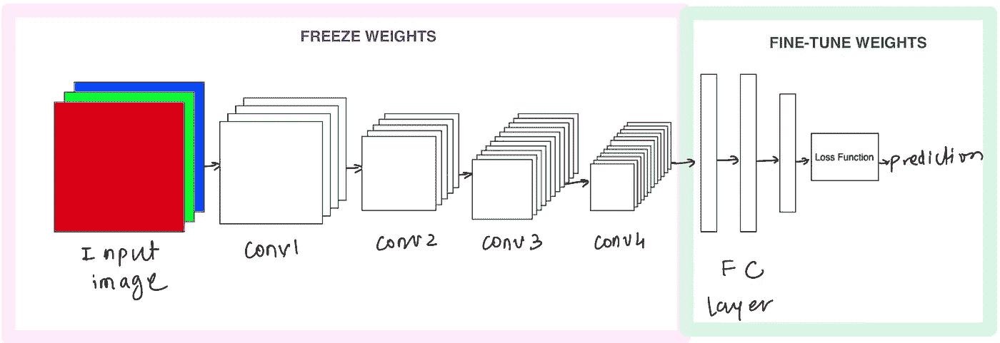
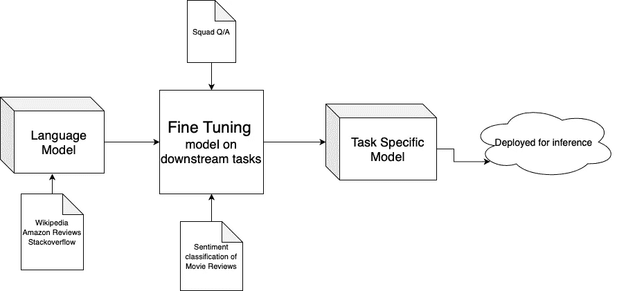

# 语言建模— I

> 原文：<https://towardsdatascience.com/language-modeling-c1cf7b983685?source=collection_archive---------27----------------------->

> 这是关于语言建模的第 5 部分系列的第 1 部分。

使用键盘中的语言模型预测下一个单词 [(Mandar Deshpande)](https://www.linkedin.com/in/mandardeshpande1995/)

# 介绍

现在你可能已经猜到了，语言建模是我们日常使用的一个用例，但它仍然是一个很难理解的概念。REALM(检索增强语言模型预训练)是该领域不断发展的研究的最新成果。这是一个很大的进步，这正是为什么它使这篇论文成为一篇具有挑战性的文章来阅读和评论。

这篇博客假设你对深度学习、词向量和嵌入空间有基本的了解，因为这些是掌握语言模型的先决条件。

训练(深度)计算机视觉模型的主要方法也逐渐到达了自然语言处理的领域。我们正在谈论迁移学习。

一旦我们理解了 NLP 中的模型预训练的情况，我们将会在一个舒适而混乱的地方去理解 REALM 做什么和如何做！

为了带领我们了解语言建模领域并掌握相关概念，我们将在这一系列博客中讨论以下内容:

*   迁移学习及其与模型预训练的相关性
*   开放领域问答(Open-QA)
*   语言理解双向转换器
*   Roberta(稳健优化的 BERT 预训练方法)
*   谷歌 T5
*   领域:检索增强语言模型预训练

这篇文章将特别尝试解释以下几点:

*   迁移学习
*   语言模型预训练

# 迁移学习

当我们有一个庞大的图像数据集，我们想解决一个图像分类和/或定位任务，我们明确利用图像像素作为特征。训练深度神经网络来解决这些任务需要我们利用海量的计算能力和数据。通常，从事该领域工作的大型科技公司和研究实验室已经从头开始训练了许多这样的网络，并在网上发布了预训练的权重。我们如何利用这一点？

使用卷积神经网络的迁移学习 [(Mandar Deshpande)](https://www.linkedin.com/in/mandardeshpande1995/)

让我们考虑一个简单的卷积神经网络(如上所示),它有 4 个卷积层(conv + relu +最大池),后面是一个全连接(FC)层，该层以 softmax 或 sigmoid 之类的损失函数终止。我们正在 ImageNet 数据集上训练该模型，该数据集是属于大约 1000 个类的大约 100 万个图像的集合。

现在，深度神经网络的任务是逐步提取特征，并将这些特征组合起来，以学习更复杂的特征。上图中显示的每一层都执行以下任务:

*   **con v1**-提取简单的边、曲线和直线
*   **Conv2** —使用这些学习到的特征来提取图像中的形状和几何线段
*   **con v3**——学习检测网格图案、光滑布料或道路等纹理
*   学习更复杂的特征，如眼睛、耳朵、椅子、门和其他帮助我们理解物体可能是什么的基本线索
*   **FC 层**——使用先前学习的特征找出组合，这些组合一起很好地给出待分类物体的连贯图像
*   **损失函数**—FC 层给出的这个组合被转换成一个分数，高分数/概率类作为预测返回

现在，如果我们仔细观察，模型在前几层中学习的特征对于任何图像都是非常通用的，并且可以被视为在一系列图像类别中是冗余的。帮助我们明确区分对象的唯一层是具有损失函数的全连接层。

一般来说，当我们谈论训练深度神经网络时，我们的意思是我们将**冻结大多数卷积层的权重**(用粉色标记),我们只是**用损失函数(用绿色标记)修改完全连接层的权重**。本质上，我们可以在冻结层之后改变整个网络，使其适合类似的基于图像的学习任务。通过对新的用例特定数据的训练，仅修改允许改变的权重部分。这种对预训练模型的权重的更新被称为**微调**。

> 例如，我们有一个用于图像分类的预训练模型，该模型具有特定的损失函数，我们希望解决图像分割的任务。因此，我们冻结 conv 层并修改 FC 层以优化与分割相关的损失函数，使得我们的模型学习预测边界框(位置)以及对象类别预测。

使用在学习任务的特定领域训练的模型，并重新利用学习到的权重来解决另一个类似的学习任务，这被称为**迁移学习。**

由于使用迁移学习训练的模型不需要从头开始学习，它可以很容易地被训练到相同或更高的性能指标(例如准确性)，而不需要太多的计算成本和时间。

# 语言模型预训练

当我们处理大量的文本数据时，了解单词序列彼此跟随的概率以及理解这种相关性需要哪些特定的特征是有帮助的。

**语言建模**是理解单词序列的概率分布的任务。这有助于我们创建能够根据句子和短语出现的上下文来区分它们的特征。

**与单词嵌入的比较** 每当我们想要在我们的模型中使用单词或文本数据作为特征时，我们通常将它们转换成稀疏向量，如一键编码，或者称为**嵌入**的密集向量。尽管预先训练的嵌入也已经在早期广泛地用于 NLP 任务，语言模型预先训练的新颖性在于它们是为特定的下游任务微调的，而不像嵌入那样广泛地用于文本。像 word2vec 和 GloVe 这样的嵌入是单词或句子的向量表示，它捕捉每个单词的上下文和语义特征。预先训练的语言模型进一步将这些嵌入提取为特定于任务的表示，从而通过在特定于任务的数据集上进行训练来实现特定的目标。

预培训语言模型使用管道 [(Mandar Deshpande)](https://www.linkedin.com/in/mandardeshpande1995/)

实际上，我们将大量未标记/未标注文本的语料库(维基百科、Quora)输入语言模型，并期望它学习不同上下文和主题之间内在的单词和句子级别的关系。一旦模型被训练，这实质上意味着模型已经学习了语言的结构，即语言已经在一些潜在向量/嵌入空间中被建模。一旦我们有了预先训练的语言模型，我们就可以利用它来完成任何下游任务，例如文本分类、文本生成和情感分类。

长期以来，预训练语言模型的使用一直是自然语言处理中最令人兴奋的消息，许多即将到来的研究都建立在这个概念上。这个领域可以通过以下预训练语言模型的开创性工作来突出:

1.  [**ul mfit**](https://arxiv.org/abs/1801.06146)**:**通用语言模型微调方法
2.  [**ELMo**](https://arxiv.org/abs/1802.05365)**:**来自语言模型的嵌入
3.  **变形金刚:** [**注意力是你所需要的**](https://arxiv.org/abs/1706.03762)
4.  [**伯特**](https://arxiv.org/abs/1810.04805) **:** 变压器的双向编码器表示

[我们将回顾其中的一些](/language-modelingii-ulmfit-and-elmo-d66e96ed754f)，并在[的后续帖子](/language-modelingii-ulmfit-and-elmo-d66e96ed754f)中继续讨论专门针对 REALM 的语言建模。

[链接到第一部分](/language-modeling-c1cf7b983685):语言建模 I [链接到第二部分](/language-modelingii-ulmfit-and-elmo-d66e96ed754f):语言建模 II: ELMo 和 ULMFiT
[链接到第三部分](/the-transformer-a-quick-run-through-ce9b21b4f3ed):变压器:快速浏览

继续学习和成长，直到那时！

在推特上与我联系:[https://twitter.com/mandroid_6](https://twitter.com/mandroid_6)

> 以上所有图片都是我在我的 iPad 上创作的，我有权使用它们