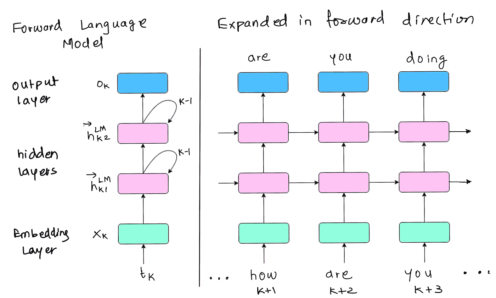
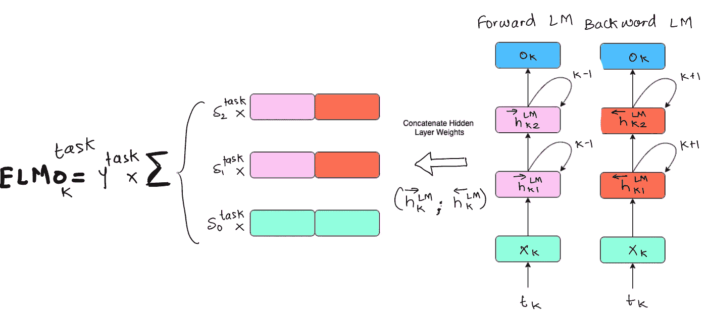
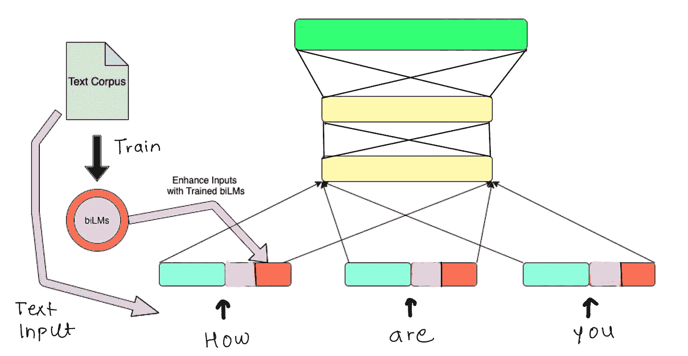
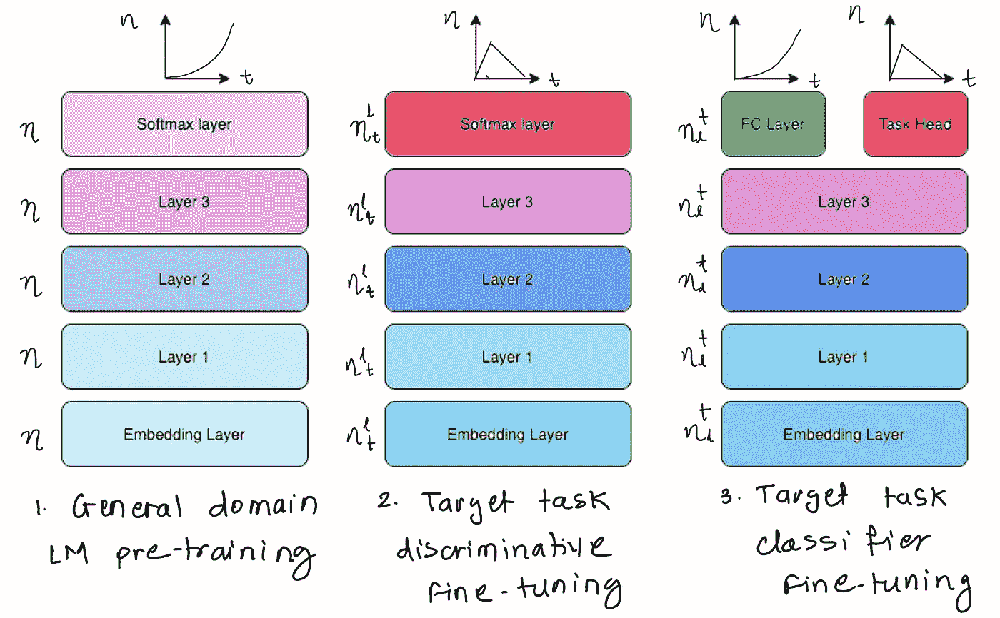

# 语言建模 II: ULMFiT 和 ELMo

> 原文：<https://towardsdatascience.com/language-modelingii-ulmfit-and-elmo-d66e96ed754f?source=collection_archive---------27----------------------->

> 这是语言建模 5 部分系列的第 2 部分。

搜索引擎中常用的语言模型

# 介绍

在之前的[帖子](/language-modeling-c1cf7b983685)中，我们了解了语言建模的概念，以及它与 word2vec 和 GloVe 等常规预训练嵌入的不同之处。

在我们迈向 REALM(检索增强语言模型预训练)的旅程中，我们将简要浏览这些关于语言模型的开创性著作:

1.  [**ELMo**](https://arxiv.org/abs/1802.05365) **:** 来自语言模型的嵌入
2.  [**ul mfit**](https://arxiv.org/abs/1801.06146)**:**通用语言模型微调方法

# ELMo:来自语言模型的嵌入(2018)

像 word2vec 和 GloVe 这样的预训练单词嵌入是许多神经语言理解模型中的关键元素。如果我们坚持在语言建模任务中使用手套嵌入，那么无论单词“major”是否出现在任何上下文中，它都将具有相同的表示。**语境对人类理解一个单词的意思起着重要作用。**

例如,“少校:高级军官”和“少校:重要的、严肃的或重要的”,根据 GloVe vectors，对于单词“少校”,具有相同的嵌入。

创造如此高质量的作品是一项艰巨的任务。具体来说，任何单词表示都应该模拟:

1.  **句法和语义:**用词的复杂特征
2.  一词多义:一个词或短语在不同的语言环境中有多种可能的含义

ELMo 引入了一个**深度上下文化的单词表示**，它解决了我们上面定义的任务，同时仍然很容易集成到现有的模型中。这在一系列高要求的语言理解问题上取得了最先进的成果，如问答、NER、Coref 和 SNLI。

**语境化的单词嵌入** 既捕捉单词含义又捕捉语境中可用信息的表征被称为语境嵌入。与使用静态单词表示的 word2vec 或 GloVe 不同，ELMo 使用双向 LSTM 来完成特定任务，在对单词进行编码之前查看整个句子。

很像我们在[上一篇文章](插入链接)中观察到的，ELMo 的 LSTM 是在一个巨大的文本数据集上训练的(与我们的下游任务使用相同的语言)。一旦这个[预训练](/language-modeling-c1cf7b983685)完成，我们就可以重用这些提取的单词嵌入作为另一种语言或 NLP 任务的构建块。

ELMo [(Mandar Deshpande)](https://www.linkedin.com/in/mandardeshpande1995/) 中使用的展开的前向语言模型

**我们如何在这个庞大的数据集上训练模型？** 我们简单地训练我们的模型来预测给定单词序列的下一个单词，即语言建模本身。此外，我们可以很容易地做到这一点，因为我们已经有了这个数据集，而不需要像其他监督学习任务中需要的显式标签。

**ELMo 架构** 由一个正向和一个反向语言模型组成，ELMo 的隐藏状态可以访问下一个单词和上一个世界。每个隐藏层都是一个双向 LSTM，因此它的语言模型可以从任一方向查看隐藏状态。您可以查看上图，了解这个 LSTM 如何访问其他隐藏状态。

ELMo 中第 k 个令牌特定嵌入的隐藏层连接和求和( [Mandar Deshpande)](https://www.linkedin.com/in/mandardeshpande1995/)

一旦前向和后向语言模型被训练，ELMo 将隐藏层权重连接在一起成为单个嵌入。此外，每个这样的权重串联乘以基于被解决的任务的权重。

正如您在上面看到的，ELMo 将这些串联的嵌入相加，并将其分配给正在从输入文本中处理的特定标记。ELMo 将令牌 t_k 表示为相应隐藏层的线性组合(包括其嵌入)。这意味着输入文本中的每个标记都有 ELMo 分配的个性化嵌入。

通过串联嵌入将 EMLo 集成到其他 NLP 任务中 [(Mandar Deshpande)](https://www.linkedin.com/in/mandardeshpande1995/)

一旦 ELMo 的 biLMs(双向语言模型)在一个巨大的文本语料库上被训练，它可以通过简单地连接到嵌入层而被集成到几乎所有的神经 NLP 任务中。

较高层似乎学习语义，而较低层可能捕捉句法特征。此外，ELMo 增强模型可以更有效地利用小数据集。

你可以在这里阅读更多关于 ELMo 的信息。

# 乌尔姆菲特(2018 年)

在 ULMFiT 之前，归纳迁移学习广泛用于计算机视觉，但 NLP 中的现有方法仍然需要针对特定任务的修改和从头开始的训练。ULMFiT 提出了一种有效的迁移学习方法，可以应用于任何 NLP 任务，并进一步展示了微调语言模型的关键技术。

代替模型参数的随机初始化，我们可以获得预训练的好处并加速学习过程。

常规的 LSTM 单元被用于 ULMFiT 的 3 层架构，从 [AWD-LSTM](https://arxiv.org/pdf/1708.02182.pdf) 得到启示。

ULMFiT 的**三个阶段**包括:

1.  **通用领域 LM 预训练:**在通用领域语料库上训练语言模型，以捕获不同层面的语言的通用特征
2.  **目标任务区别微调:**使用*区别微调*和学习速率表(倾斜三角形学习速率)在目标任务数据集上对训练的语言模型进行微调，以学习特定于任务的特征
3.  **目标任务分类器微调:**使用*逐步解冻*并重复阶段 2，对目标任务上的分类器进行微调。这有助于网络保留低级表示并适应高级表示。

乌尔姆菲特的三个阶段[(曼达尔·德什潘德)](https://www.linkedin.com/in/mandardeshpande1995/)

正如我们在上面看到的，阶段 1 在所有层上使用相同的学习速率，而阶段 2 和 3 具有逐层的三角形学习速率表。此外，请注意层权重如何在三阶段过程中逐渐达到最佳值。(较深的颜色最适合于表示目的)

**区别性微调**(具有倾斜三角形学习率的阶段 2/3 的学习时间表)是本文的主要启示，因为它来自于模型中的不同层捕获不同类型的特征的直觉。因此，对他们中的每一个有不同的学习速度是有意义的。像计算机视觉一样，即使在语言建模任务中，初始层也捕捉关于语言的最一般的信息，因此一旦预先训练，就需要最低量的微调。

在该过程的阶段 2 之后，该模型已经非常接近指定任务所需的最佳权重，因此目标任务分类器微调据说非常敏感。如果微调过程在此阶段显著改变了权重，那么模型预训练的所有好处都将丢失。为了解决这个问题，本文提出了**逐步解冻**:

*   首先，解冻最后一个 LSTM 图层，并对模型进行一个时期的微调
*   接下来，上一层之前的层被解冻并微调
*   对每一层重复类似的过程，直到收敛

你可以在这里 **看论文[。](https://arxiv.org/abs/1801.06146)**

希望这篇博客有助于你对这个令人兴奋的预训练语言模型领域有一个基本的了解！

在下一篇博客中，我们将讨论用于学习可微调预训练模型的 Transformers 和 BERT。

[链接到第一部分](/language-modeling-c1cf7b983685):语言建模 I [链接到第二部分](/language-modelingii-ulmfit-and-elmo-d66e96ed754f):语言建模 II: ELMo 和 ULMFiT
[链接到第三部分](/the-transformer-a-quick-run-through-ce9b21b4f3ed):变压器:快速浏览

继续学习和成长，直到那时！

在推特上和我联系:[https://twitter.com/mandroid_6](https://twitter.com/mandroid_6)

> *以上所有图片均由我创作，我有权使用它们*