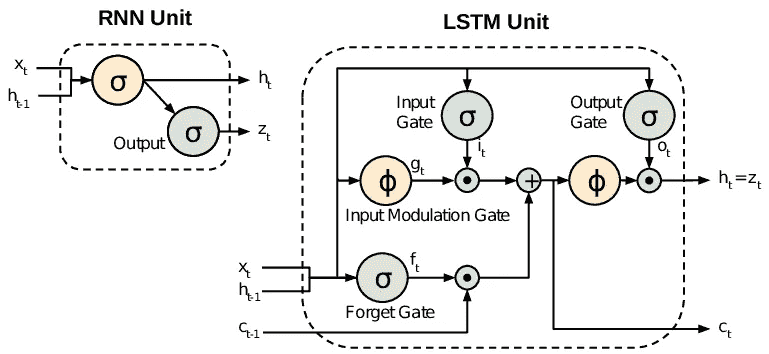
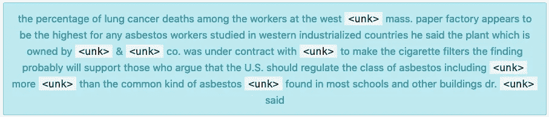
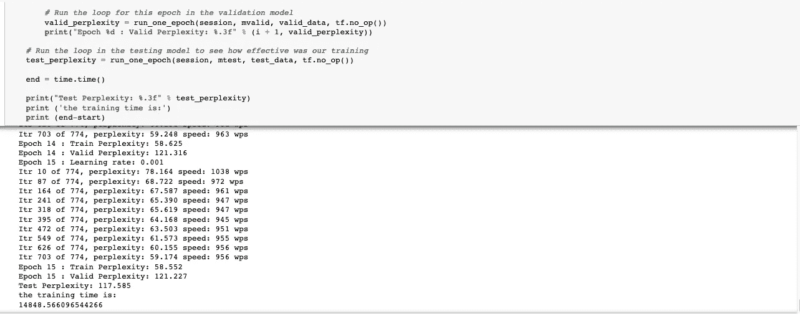
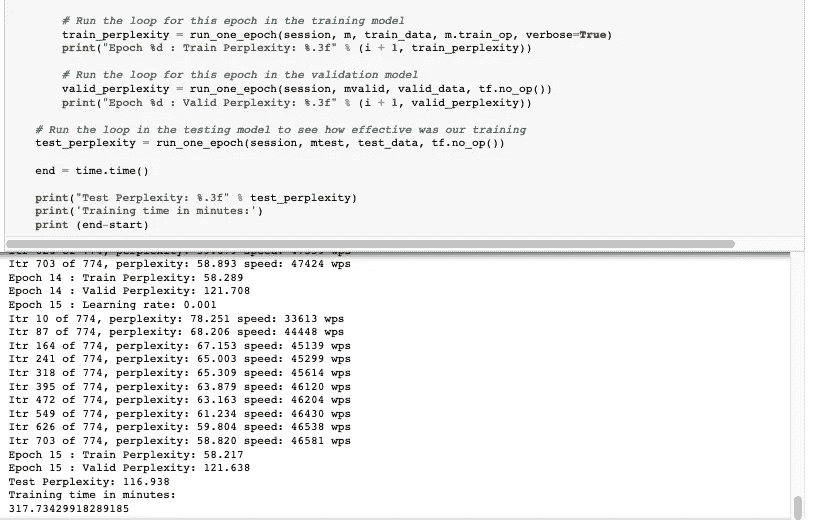

# 用 Penn Treebank 语言建模

> 原文：<https://towardsdatascience.com/language-modelling-with-penn-treebank-64786f641f6?source=collection_archive---------27----------------------->

## 使用堆叠 LSTMs 进行上下文和单词预测——以及深度学习基础设施的比较。

[递归神经网络](https://en.wikipedia.org/wiki/Recurrent_neural_network) (RNNs)在历史上是解决顺序问题的理想选择。当数据集中的一个点依赖于其他点时，该数据被称为*序列。*一个常见的例子是时间序列，如股票价格或传感器数据，其中每个数据点代表某个时间点的观察结果。

RNN 比传统的前馈神经网络更适合于顺序建模，因为它能够通过保持状态或上下文来记住直到给定点所做的分析。这种状态，或者说“记忆”，随着每一个新的输入而重现。

**长短期记忆——解决 rnn 中的间隙**

需要 rnn 来跟踪状态，这在计算上是昂贵的。此外，还有训练的问题，如消失梯度和爆炸梯度。因此，RNN，或者准确地说，香草 RNN 不能很好地学习长序列。解决这些问题的一个流行方法是一种特殊类型的 RNN，它被称为[长短期记忆](https://en.wikipedia.org/wiki/Long_short-term_memory) (LSTM)。

LSTM 在许多时间步长上保持很强的梯度。这意味着你可以用相对较长的序列来训练 LSTM。递归神经网络中的 LSTM 单元由四个主要元件组成:存储单元和三个逻辑门。

*存储单元负责保存数据。*

*写入、读取和忽略门定义了 LSTM 内部的数据流。写门负责将数据写入存储单元。*

*读取门从存储单元读取数据，并将该数据发送回递归网络，以及*

*遗忘门，保持或删除信息单元中的数据，或者换句话说，决定要遗忘多少旧信息。*

事实上，这些门是 LSTM 中的运算，它对网络输入、网络先前的隐藏状态和先前的输出的线性组合执行某种功能

传统 rnn 和 LSTMs 的比较见下图:

传统 RNN 单元和 LSTM 单元的比较，具有使 LSTM 计算成本更低且更鲁棒的门

**自然语言处理(NLP)** 是一个经典的序列建模任务:特别是如何编程计算机*处理*和分析大量*自然语言*数据。NLP 的最终目标是以一种有价值的方式阅读、破译、理解和理解人类语言。NLP 的常见应用是机器翻译、聊天机器人和个人语音助理，甚至是呼叫中心使用的交互式语音应答。

从历史上看，对于自然语言处理来说，足够大的数据集很难获得。这在一定程度上是因为需要对句子进行分解，并标记一定程度的正确性——否则，在此基础上训练的模型将缺乏有效性。这意味着我们需要**大量的数据，由人类注释或者至少由人类修正**。

宾夕法尼亚树库，简称为 PTB，是由宾夕法尼亚大学维护的数据集。它是巨大的——里面有超过四百八十万条注释文字，全部由人类更正。

数据集被分成不同种类的注释，如词类、句法和语义框架。对于这个例子，我们将简单地为我们的模型使用一个干净的、无注释的单词样本(除了一个标签— `<unk>`，它用于罕见的单词，比如不常见的专有名词)。

数据集的示例

**神经网络结构**

*   在这个网络中，LSTM 细胞的数量是 2。为了使模型更具表现力，我们可以添加多层 LSTMs 来处理数据。第一层的输出将成为第二层的输入，以此类推。
*   200 个输入单元--> [200x200]权重--> 200 个隐藏单元(第一层)->[200 x200]权重矩阵--> 200 个隐藏单元(第二层)-> [200]权重矩阵--> 200 个输出单元
*   假设每个单词由嵌入向量表示，嵌入向量的维数 e=200。每个像元的输入层将有 200 个线性单位。这些 e=200 个线性单元连接到隐藏层中的 h=200 个 LSTM 单元中的每一个(假设只有一个隐藏层，尽管我们的例子有 2 层)。
*   输入形状是[批量大小，步数]，即[30x20]。嵌入后会变成[30x20x200]，然后是 20x[30x200]

隐藏层:

*   每个 LSTM 有 200 个隐藏单元，这相当于嵌入单词和输出的维数。

**代码:**[https://github . com/Sunny-ML-DL/Natural _ language _ Penn _ tree bank/blob/master/Natural % 20 language % 20 processing . ipynb](https://github.com/Sunny-ML-DL/natural_language_Penn_Treebank/blob/master/Natural%20language%20processing.ipynb)

(改编自 PTB 培训模块和认知类. ai)

**商品云对比 WML-CE**

在这个托管服务的时代，有些人往往会忘记底层计算架构仍然很重要。例如，下面的截图显示了使用 A)公共云和 b)沃森机器学习-社区版(WML-CE)的同一模型的训练时间

使用商用云—培训时间 14848.5 秒(4.1 小时)

使用沃森机器学习-社区版:训练时间 317.7 秒(5.2 分钟)

**沃森机器学习加速器**

一个企业机器学习和深度学习平台，具有流行的开源包、最有效的扩展和 IBM Power Systems 独特架构的优势。看看下面的视频:

**结论:**

本文和相关代码的目的有两个:

a)演示用于语言和上下文敏感建模的堆叠 LSTMs 和

b)底层基础设施对深度学习模型训练效果的非正式演示。

感谢您的宝贵时间！