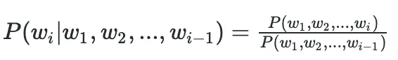
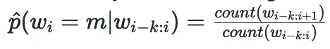
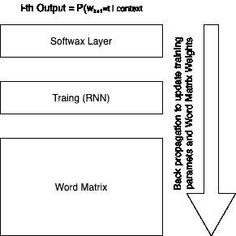

# 语言模型

> 原文：<https://towardsdatascience.com/language-models-1a08779b8e12?source=collection_archive---------34----------------------->

## 语言模型是许多自然语言任务的基础。本文是对统计语言模型的直观介绍

# 定义

我在一次电话会议中，有人说“项目 A 的风险增加了 __”我听不到 of 后面的那个词，但我知道那个词是什么。我相信你也知道这个词。

我们有一个语言模型。我们的内部语言模型告诉我们，句子“项目 A 有延迟的高风险”的概率比句子“项目 A 有高风险的水”的概率高得多

这篇文章是关于统计学习语言模型(LM)——它们是什么，它们是如何被评估的，以及它们是如何被学习的。语言建模本身并没有直接的实际用途，但它是机器翻译和自动语音识别等现实应用中的一个重要组成部分。翻译系统可能会生成同一目标句子的多种翻译，语言模型会对所有句子进行评分，以选择最有可能的一个。

从形式上来说，语言建模的任务就是简单地给任何单词序列分配一个概率。或者，我们也可以把这个问题提出来作为猜词问题。填空: ***狗 ____*** 。下面的等式从数学上显示了这种等价性。

# 衡量绩效

您将如何衡量该模型的性能？最常见的**内在**指标是困惑。困惑衡量语言模型在预测一个看不见的单词序列中的下一个单词时有多困惑。Ravi Charan 的[博客](/the-relationship-between-perplexity-and-entropy-in-nlp-f81888775ccc)中有一个很好的关于困惑的中级概述。

但是，对于大多数实际目的来说，外在的措施更有用。LM 的外在度量是使用 LM 的底层任务的准确性。例如，使用给定语言模型的翻译任务的 BLEU 分数。

困惑是特定于语料库的度量。只有在相同的语料库上计算度量时，我们才能比较两个 LMs 的复杂度。困惑的改善并不能保证外在指标如 BLEU 评分的改善。

# 构建语言模型

语言模型从一个**马尔可夫假设**开始。这是一个简化的假设，即第 k+1 个字依赖于前 k 个字。二阶假设导致二元模型。使用现有语料库的最大似然估计(MLE)来训练模型。MLE 方法只是工作计数的一部分。

使用传统的 n 元语言模型有一些优点。

1.  它们很容易在大型语料库上训练
2.  他们在大多数任务中表现惊人的好！！

然而，它们也有一些缺点

1.  零概率:如果我们有一个包含两个单词的三元语言模型，并且拥有 10000 个单词的词汇量。我们有 10 个三胞胎。如果我们的训练数据有 10 个⁰词，那么在训练数据中有许多三元组将永远不会被观察到，因此基本 MLE 将把零概率分配给那些事件。零概率意味着无限的困惑。为了克服这个问题，在平滑技术家族下开发了许多技术。在[的这篇论文](https://dl.acm.org/doi/pdf/10.3115/981863.981904?download=true)中对这些技术进行了很好的概述。
2.  **指数增长**:第二个挑战是 n 元文法的数量以词汇量的 n 次方指数增长。一个 10，000 单词的词汇表将有 10 个三元组，一个 100，000 单词的词汇表将有 10 个⁵三元组。
3.  一般化:MLE 技术的最后一个问题是缺乏一般化。如果模型在训练数据中看到术语“白马”，但没有看到“黑马”，MLE 将把零概率分配给“黑马”。(幸运的是，它也会将零概率分配给紫马)

# 神经语言模型

非线性神经网络模型解决了传统语言模型的一些缺点。例如，与传统模型相比，神经 LM 的参数数量增加缓慢。最早的这种模型之一是由 Bengio 等人在 2003 年提出的。在一篇名为[一种神经概率语言模型](http://jmlr.org/papers/volume3/bengio03a/bengio03a.pdf)的经典论文中，他们展示了使用 RNN 学习单词表示的基本结构。

引用这篇论文，他们提出了三个关键观点—

1.  将词汇表中的每个单词与分布式单词特征向量(n 维实值向量)相关联
2.  根据序列中这些单词的特征向量来表达单词序列的联合概率函数，以及
3.  同时学习单词特征向量和概率函数的参数。

# LMs 的副产品是单词表示

语言模型可以在原始文本上训练，比如来自维基百科的文本。为了训练 k 阶语言模型，我们从运行的文本中取出(k + 1)个字，并将第(k + 1)个字视为监督信号。因此，我们可以从任何语言的各种在线/数字化数据中生成大量的训练数据。

使用神经模型学习语言模型的一个特别重要的副产品是如下所示的单词矩阵。我们不仅更新训练参数，还更新单词矩阵。然后，字矩阵可以用于各种不同的监督任务。

# 结论

几乎所有的 NLP 任务都使用语言模型。语言模型用于语音识别、机器翻译、词性标注、语法分析、光学字符识别、手写识别和信息检索。

传统的语言模型在这些用例中表现得相当好。深度学习时代带来了新的语言模型，这些模型在几乎所有的任务中都优于传统模型。典型的深度学习模型是在大型数据语料库上训练的( [GPT-3 是在从网络上搜集的一万亿单词的文本上训练的](https://www.msn.com/en-us/news/technology/openai-e2-80-99s-gigantic-gpt-3-hints-at-the-limits-of-language-models-for-ai/ar-BB14RvVk))，具有很大的学习能力(GPT-3 有 1750 亿个参数)，并使用新颖的训练算法(注意力网络，BERT)。

尽管学习 LMs 的机制已经发生了变化，但是 LMs 背后的基本直觉仍然是一样的。