# 语言模型与假新闻:宣传的民主化

> 原文：<https://towardsdatascience.com/language-models-and-fake-news-the-democratization-of-propaganda-11b1267b3054?source=collection_archive---------55----------------------->

## 用开放的 GPT- 3 模型深度伪造信息

# 介绍

# “太危险了，不能释放。”

一个短语发布了 OpenAI 的[新闻声明](https://www.independent.co.uk/life-style/gadgets-and-tech/news/ai-artificial-intelligence-dangerous-text-gpt2-elon-musk-a9192121.html)，以配合他们在 2019 年 2 月发布的 GPT-2 语言模型。随着上周[发布更先进的 GPT-3](/gpt-3-the-new-mighty-language-model-from-openai-a74ff35346fc)，人工智能驱动的错误信息的可能性已经成为当今后事实信息景观中仍未解决的重大风险。

GPT-3 生成的诗歌(布朗等人。铝)

自 2016 年以来，“假新闻”一词在世界各地的政治领导层和普通民众中日益流行，作为一个不屑一顾的概念，用于不支持自己观点的报道。但是这个术语已经扩展到包括国家和非国家操作的错误信息运动。利用这种[活动影响全球事件](https://time.com/5565991/russia-influence-2016-election/)的努力已经大大加快，美国参议院两党委员会得出结论，俄罗斯在 2016 年美国总统选举期间的错误信息活动“通过俄罗斯控制的宣传渠道传播信息，以破坏公众对民主进程的信心”。罗伯特·穆勒也表达了类似的观点，他补充说，俄罗斯的干预是“全面和系统的”，并担心在即将到来的 2020 年总统选举中继续受到影响。研究人员现在认为，政治机器人和虚假信息在其他重大案件中发挥了作用，如英国退出欧盟公投和克里米亚危机。

这些具体的报告让人担心人工智能会被用作网络战的工具来支持错误信息活动。然而，[研究表明](https://www.technologyreview.com/2020/01/08/130983/were-fighting-fake-news-ai-bots-by-using-more-ai-thats-a-mistake/)大多数“人工智能支持的”解决方案只不过是机器人设计来重复特定标签下的特定短语和链接，以改变讨论的背景。这种方法更多地依赖于人类操作员理解在线话语心理的能力，而不是机器人本身的能力。最近，社交媒体平台上关于新冠肺炎危机的人工智能生成的内容的[激增，导致要求改进审查的呼声日益高涨。然而，人工审查既慢又粗糙，而人工智能对大量数据进行建模以进行训练。脸书首席技术官迈克·斯科洛普夫总结了为新的不可预见的威胁构建解决方案的基本挑战:](https://www.technologyreview.com/2020/01/08/130983/were-fighting-fake-news-ai-bots-by-using-more-ai-thats-a-mistake/)

> *“为一个能够理解前所未见内容的东西构建一个新颖的分类器需要时间和大量数据。”*

目前还没有关于人工智能产生的错误信息的普遍性的系统研究，很可能迄今为止大多数错误信息都是由人类行为者创造的。但是随着人工智能生成的虚假账户的扩散，加上语言模型的可用性和能力的增加，预计人工智能生成的文本错误信息将在未来遇到。如今观察到的事后、意见主导的信息格局加剧了这一问题。

**但是为什么对这些模型忧心忡忡呢？是什么让他们变得危险？我们正在见证真理的死亡吗？**要回答这个问题，我们需要深入研究它们的原理和运作方式。出于时间和范围的考虑，在本文中，我们将把注意力集中在 OpenAI 的 GPT 系列语言模型上。

# 变形金刚:现代自然语言处理的基石

我们已经在以前的文章中介绍了语言模型背后的一般理论，如递归神经网络( [RNNs](https://medium.com/gradientcrescent/applying-sentiment-analysis-to-e-commerce-classification-using-recurrent-neural-networks-in-keras-cd89b77baa60) )和长短期记忆(L [STM](https://medium.com/gradientcrescent/generating-swipeable-tinder-profiles-using-ai-adversarial-recurrent-neural-networks-in-dd68bd98c2f3) )架构，因此鼓励读者参考这些来详细了解这些架构。

自然语言模型的 GPT 家族是基于转换器模型的，其特征是重复的编码器架构加上一个*注意力*机制。 [Alammar 等人已经深入解释了变压器的一般架构。但是我们将在这里提供一个高层次的总结。](http://jalammar.github.io/illustrated-transformer/)

考虑变压器模型的一般结构，如下所示:

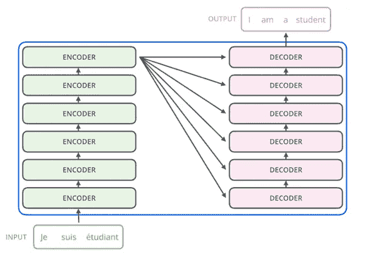

变压器型架构的抽象。铝)

编码器-解码器架构的工作原理是，通过编码器将输入数据缩减为潜在维度(表示单词的含义)，由解码器组件以目标语言重建。正因为如此，它们在机器翻译方面一直表现强劲。然而，Transformer-models 通过将*自关注*层整合到每个编码器和解码器模块中来构建这种架构，每个组件拥有自己的一组权重参数。*注意力*层的工作是将输入单词在句子中的位置与其含义联系起来，以便改进其编码。特别是，与传统的纯 RNN 和 LSTM 架构相比，变压器模型更能够捕捉序列中的长程相关性。

我们可以用一个例子来最好地形象化注意力对编码过程的影响。考虑下面的句子:

> *“这只动物没有过马路，因为它太累了”*

通过检查相应层的激活，我们可以用注意力来观察句子成分之间的关系。

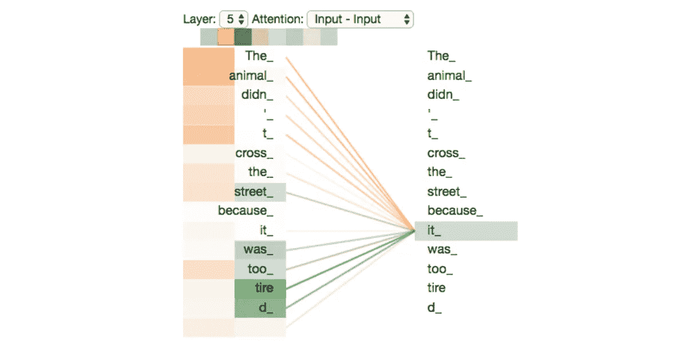

句子编码分析(Alammar 等。铝)

你会注意到单词*“它”*的编码表示拥有与概念*“动物”*和*“疲倦”*的强注意力链接，在这些对之间创建了一种意义关联的形式。这种关联的好处对于机器翻译应用程序特别有用，在机器翻译应用程序中，不同语言的语法可能需要完全不同的句子结构，但是这种关联也可以扩展到条件文本生成和其他应用程序。

# GPT 模式

OpenAI 的语义语言模型 GPT 家族[基于谷歌大脑](https://arxiv.org/pdf/1801.10198.pdf)的工作，完全去除了编码器组件，由一堆带有注意力层的解码器块组成。

GPT-2 体系结构的抽象(Alammar 等人)

虽然该模型被训练为在给定输入文本序列的情况下预测序列中的下一个单词，但它们的高参数复杂性导致了通过元学习(或仅用新任务的几个示例进行再训练)获得的显著扩展的能力，包括:

*   长期相关性分析
*   生词记忆
*   算术计算
*   机器翻译
*   摘要
*   语境分析

最初的 GPT-1 模型由变压器模型和预训练的 ELMO 语言模型组成，具有数亿个可训练参数。GPT-2 扩展到超过 15 亿个参数，是它的 10 倍以上，并在 10 倍以上的数据量上进行训练(来自互联网和文学来源)。

最近的 GPT-3 建立了超过 1750 亿个参数，提高了其语义性能，特别是在一次性或零次训练应用中。实现这种应用程序的高性能对于接近语言模型的人类水平的响应和性能是必要的。相比之下，典型的人脑有超过 100 万亿个突触，大约比最大的 GPT-3 模型大三个数量级。鉴于 OpenAI 花了大约一年左右的时间将他们模型的参数容量增加了两个数量级，在给定时间和资源的情况下，达到这个数量似乎是可行的任务。

各种 GPT-2 参数配置的体系结构的抽象。(阿拉玛等人。铝)

GPT-2 和 GPT-3 也在不同的参数配置中进行了测试，以评估其性能并防止潜在的误用。GPT-3 配置的配置和基准性能如下所示:

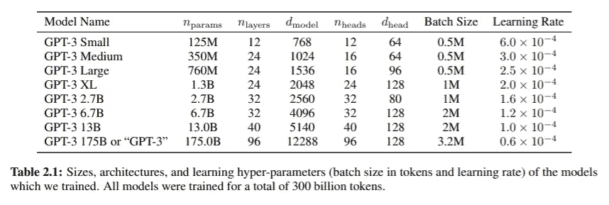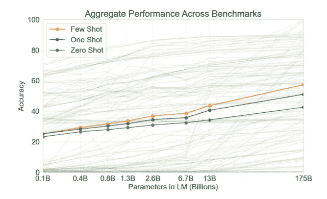

当配置不同数量的训练参数时，GPT-3 模型在零炮、一炮和少炮应用中的性能精度。

我们可以通过比较 GPT 3 号卫星输出结果的差异来最好地展示其性能的提高。下面是 GPT-2 生成的文本样本，正如 Brown 等人在最初的 OpenAI 论文中所报告的。艾尔。

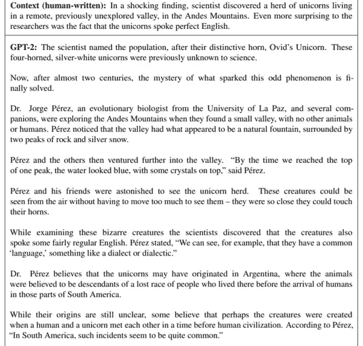

布朗等人报道的 GPT-2 文本输出。

虽然乍一看，这篇文章似乎语法正确，但仔细检查就会发现许多事实上的不一致。例如，考虑这个句子:

> "*这些银白色的四角独角兽此前并不为科学界所知。"*

鉴于独角兽被定义为拥有一只角，这是事实上的不一致。自然，模型不会明确知道单词的定义，也无法从训练数据中推断出它。

下一节显示了类似的不一致之处。

> 虽然它们的起源仍不清楚，但有人认为这种生物可能是在人类文明之前，人类和独角兽相遇时创造出来的

鉴于文章的主题是独角兽本身，这句话没有意义。然而，由于句子在语法上是正确的，这些错误需要大量的注意力和意识才能被识别出来。

相比之下，让我们举两个报道的 at GPT-3 输出的例子——第一个具有更高的逼真度，更能够冒充为人类生成的(88%),而第二个则明显不那么逼真(39%)。

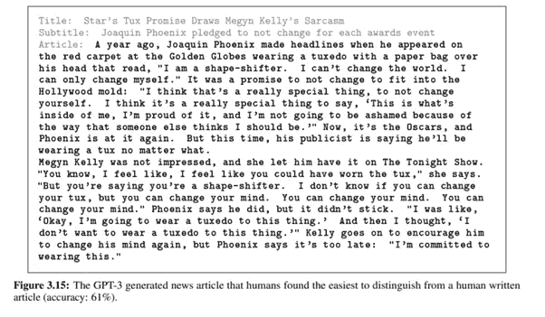

布朗等人报道的 GPT-3 文本输出。

与 GPT 新协议相比，GPT 新协议似乎抓住了词汇定义的微妙之处。然而，对这两个输出的分析表明，该模型仍然与扩展的对话片段作斗争。考虑摘录:

> *“一年前，乔阿金·菲尼克斯出现在金球奖红毯上，他穿着燕尾服，头上套着一个纸袋，上面写着，“我是变形人”，这成为头条新闻。我不能改变世界。我只能改变自己。这是一个不改变以适应好莱坞模式的承诺:“我认为这是一件非常特别的事情，不改变自己。我觉得说“*真的很特别

事实上，文本的真实性可以通过简单地固定每行周围的标点符号，并将它们连接在一起而得到显著提高。但是，这需要学习，而不是定义。**平均而言，由最大的(1750 亿)和最小的(1.25 亿)GPT-3 模型产生的检测物品的平均人类准确度为 *ca。*在 200 篇文章中分别为 52%和 76%。**

如前所述，GPT-3 在其他各种 NLP 任务中表现出色，进行了少量射击、一次射击或零射击训练。这些任务的选择如下所示，以供参考:

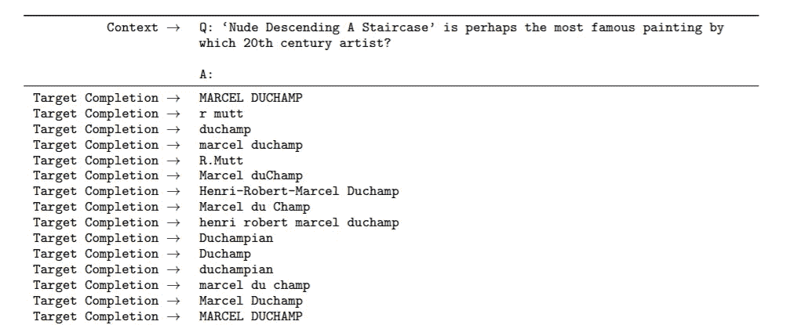

GPT-3 上下文分析示例。

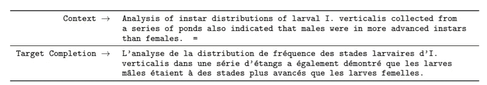

GPT-3 机器翻译示例。

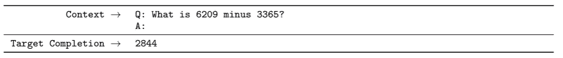

GPT-3 算术计算示例。

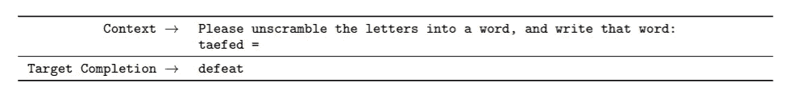

GPT-3 字解扰例子。

真正令人印象深刻的是该模型在这些新应用程序中显示的性能，因为它降低了商业应用程序(如聊天机器人或评论情感分析)的开发界限。

# 真理的死亡？

因此，考虑到性能改善的趋势，是否有可能将模型的规模和复杂性进一步提高几个数量级，并超越随机机会愚弄人类？

也许吧。虽然条件文本生成在模型复杂性方面表现出了显著的改善，但研究人员观察到，GPT-3 在分析句子之间的关系时表现不佳，并提出这里的问题与模型复杂性无关，而且方法本身可能是不正确的。他们的结论总结了这一点:

> *“对于自我监督的目标，任务规范依赖于将期望的任务强制转化为预测问题。然而最终，有用的语言系统(例如虚拟助手)可能更好地被认为是采取目标导向的行动，而不仅仅是做出预测。”*

提到目标导向的行动是特别有趣的，因为它表明[强化学习方法](https://www.google.com/search?q=reinforcement+learning+adrian+yijie+xu&rlz=1C1EJFA_enSG791SG791&oq=reinforcement+learning+adrian+yijie+xu&aqs=chrome..69i57.6802j0j7&sourceid=chrome&ie=UTF-8)将是一个更理想的解决方案。OpenAI 此前曾探索过利用人类偏好来微调 GPT-2 模型，但这种方法对于现实世界的应用来说过于粗糙和劳动密集型。一个真正的强化学习模型需要为它的应用仔细定义一个奖励函数，也许通过使用前馈鉴别器模型，正如在分子设计的[领域](http://OpenAI's GPT family of models)中所做的那样。

那么，我们注定会有一个错误信息的未来吗？也许不是。训练这些模型是极其耗费资源的，使用单个英伟达 RTX-8000 GPU 单元训练最大的 GPT-3 模型需要相当于 665 年的时间。此外，HarvardNLP、 [AllenAI](https://grover.allenai.org/) 和 [IBM Watson](https://www.technologyreview.com/2019/03/12/136668/an-ai-for-generating-fake-news-could-also-help-detect-it/) 等组织的研究人员已经利用 GPT-2 等生成语言模型的可用性来构建能够检测假冒输出的鉴别器。随着 GPT-3 和其他更复杂模型的发布，鉴别器必须类似地进化，[引发了对军备竞赛的恐惧，类似于对 deepfakes](https://medium.com/gradientcrescent/ai-truth-and-society-deepfakes-at-the-front-of-the-technological-cold-war-86c3b5103ce6) 的观察。此外，由于鉴别器模型的训练将需要发生器的输出，总会有一个窗口，在该窗口期间检测解决方案将是不充分的。

但是“假新闻”的真正风险不在于语言模型的能力，而在于我们在信息素养和批判性思维方面的退化技能。无论是由于社交媒体还是其他原因，两极分化已经成为话语的一个重要组成部分，导致了从极端主义观点的在线回音室到最高层治理缺乏两党合作的症状。

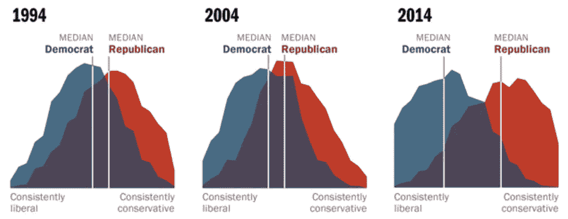

随着时间的推移，美国民主党和共和党的意识形态观点发生了转变。(皮尤研究中心)

**除非我们能够有意识地减少两极分化，并采取一种以事实信息和尊重话语为导向的文化，否则我们将继续容易受到错误信息的影响，无论这些错误信息是由人工智能还是人类行为者产生的。**

这就结束了我们对开放 GPT 模型理论进展的回顾。在我们即将发表的文章中，我们将讨论如何实现 GPT 模式来制造一些“假新闻”和诗歌。

我们希望你喜欢这篇文章，并希望你查看 GradientCrescent 上的许多其他文章，涵盖人工智能的应用和理论方面。为了保持对 [GradientCrescent](https://medium.com/@adrianitsaxu) 的最新更新，请考虑关注该出版物并关注我们的 [Github](https://github.com/EXJUSTICE/GradientCrescent) 资源库。

**参考文献**

 [## OpenAI 巨大的 GPT-3 暗示了 AI | ZDNet 语言模型的局限性

### 加州研究机构 OpenAI 带着另一个巨大的深度学习模型 GPT-3 回来了。虽然它表明…

www.zdnet.com](https://www.zdnet.com/article/openais-gigantic-gpt-3-hints-at-the-limits-of-language-models-for-ai/)  [## 根据人类偏好微调 GPT-2

### 我们已经对 774M 参数 GPT-2 语言模型进行了微调，在各种任务中使用了人类反馈，成功地匹配了…

openai.com](https://openai.com/blog/fine-tuning-gpt-2/)  [## 更好的语言模型及其含义

### 我们已经训练了一个大规模的无监督语言模型，它可以生成连贯的文本段落，实现…

openai.com](https://openai.com/blog/better-language-models/)  [## 用无监督学习提高语言理解

### 我们通过一个可扩展的、与任务无关的系统，在一系列不同的语言任务上获得了最先进的结果…

openai.com](https://openai.com/blog/language-unsupervised/)  [## 语言模型是一次性学习者

### 最近的工作已经证明了在许多自然语言处理任务和基准上的巨大收益。

arxiv.org](https://arxiv.org/abs/2005.14165)  [## 图解 GPT-2(可视化变压器语言模型)

### 讨论:黑客新闻(64 分，3 条评论)，Reddit r/MachineLearning (219 分，18 条评论)翻译…

jalammar.github.io](http://jalammar.github.io/illustrated-gpt2/)  [## 图示的变压器

### 讨论:黑客新闻(65 分，4 条评论)，Reddit r/MachineLearning (29 分，3 条评论)翻译…

jalammar.github.io](http://jalammar.github.io/illustrated-transformer/)  [## 揭秘 GPT-3——深度学习语言模型的最新成果

### 上周四，OpenAI 对语言建模的最新更新 GPT-3 出现在 arxiv 上。鉴于其影响力之大…

lambdalabs.com](https://lambdalabs.com/blog/demystifying-gpt-3/)