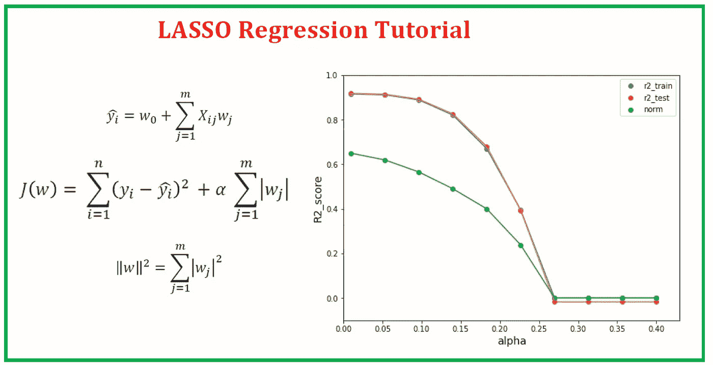
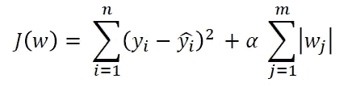
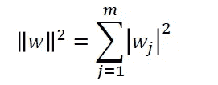
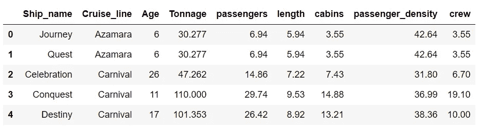
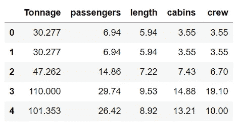
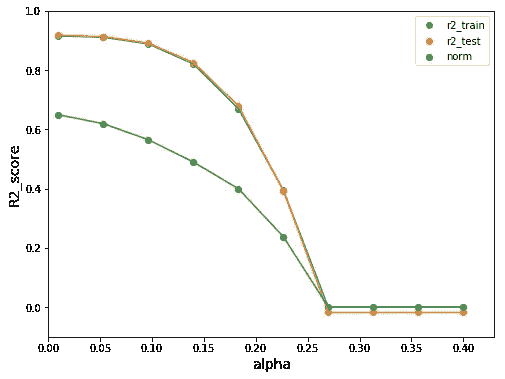

# 套索回归教程

> 原文：<https://towardsdatascience.com/lasso-regression-tutorial-fd68de0aa2a2?source=collection_archive---------16----------------------->

## 使用 LASSO 回归的偏差-方差评估-游轮数据集



Benjamin O. Tayo 拍摄的照片

L ASSO 回归是正则化回归的一个例子。正则化是一种通过添加额外信息来解决过度拟合问题的方法，从而缩小模型的参数值以导致对复杂性的惩罚。正则化线性回归的 3 种最流行的方法是所谓的岭回归、最小绝对收缩和选择算子(LASSO)和弹性网格法。

在本教程中，我将侧重于套索，但脊和弹性网的扩展是直截了当的。

假设我们想要在具有 n 个观测值和 m 个特征的数据集上构建一个正则化回归模型。

LASSO 回归是一种 L1 惩罚模型，我们只需将权重的 [L1 范数](http://mathworld.wolfram.com/L1-Norm.html)添加到最小二乘成本函数中:



在哪里


通过增加超参数α的值，我们增加了正则化强度并缩小了模型的权重。请注意，我们没有正则化截距项 w0。还要注意，alpha = 0 对应于标准回归分析。

根据正则化强度，某些权重可以变为零，这使得套索方法成为一种非常强大的降维技术。

# LASSO 伪代码

```
1) For given alpha, simply minimize the cost function to find the  weights or model parameters w.2) Then compute the norm of w (excluding w0) using the equation below:
```



# 案例研究:使用游轮数据集预测船员人数

我们将使用游轮数据集[**cruise _ ship _ info . CSV**](https://github.com/bot13956/ML_Model_for_Predicting_Ships_Crew_Size)**来说明套索技术。**

## 1.导入必要的库

```
import numpy as npimport pandas as pdimport matplotlib.pyplot as plt
```

## 2.读取数据集并显示列

```
df = pd.read_csv("cruise_ship_info.csv")df.head()
```



## 3.选择重要变量

在另一篇文章( [**利用协方差矩阵图进行特征选择和降维**](https://medium.com/towards-artificial-intelligence/feature-selection-and-dimensionality-reduction-using-covariance-matrix-plot-b4c7498abd07) )中，我们看到了协方差矩阵图可以用于特征选择和降维。使用游轮数据集[**cruise _ ship _ info . CSV**](https://github.com/bot13956/ML_Model_for_Predicting_Ships_Crew_Size)**，**我们发现，在 6 个预测特征[' **年龄**'、**吨位**'、**乘客**'、**长度**'、**舱室**、**乘客密度** ]中，如果我们假设重要特征的相关系数为 0 那么目标变量“**乘员**”与 4 个预测变量:“**吨位**”、“**乘客**”、“**长度**、“**车厢**”强相关。 因此，我们能够将特征空间的维数从 6 降低到 4。

```
cols_selected = ['Tonnage', 'passengers', 'length', 'cabins','crew']df[cols_selected].head()
```



```
X = df[cols_selected].iloc[:,0:4].values    # features matrix y = df[cols_selected]['crew'].values        # target variable
```

## 4.LASSO 回归实现

**a .将数据集分成训练集和测试集**

```
from sklearn.model_selection import train_test_splitX_train, X_test, y_train, y_test = train_test_split( X, y, 
                                      test_size=0.4, random_state=0)
```

**b .标准化特征**

```
from sklearn.preprocessing import StandardScalersc_y = StandardScaler()sc_x = StandardScaler()y_std = sc_y.fit_transform(y_train[:, np.newaxis]).flatten()X_train_std = sc_x.fit_transform(X_train)X_test_std = sc_x.transform(X_test)y_train_std = sc_y.fit_transform(y_train[:, np.newaxis]).flatten()
```

**c .实施套索回归**

```
from sklearn.linear_model import Lassofrom sklearn.metrics import r2_scorealpha = np.linspace(0.01,0.4,10)r2_train =[]r2_test =[]norm = []alpha = np.linspace(0.01,0.4,10)for i in range(10): lasso = Lasso(alpha = alpha[i]) lasso.fit(X_train_std,y_train_std) y_train_std = lasso.predict(X_train_std) y_test_std = lasso.predict(X_test_std) r2_train = np.append(r2_train,
              r2_score(y_train,sc_y.inverse_transform(y_train_std))) r2_test = np.append(r2_test,
              r2_score(y_test,sc_y.inverse_transform(y_test_std))) norm = np.append(norm,np.linalg.norm(lasso.coef_))
```

**d .输出的可视化**

```
plt.figure(figsize=(8,6))
plt.scatter(alpha,r2_train,label='r2_train')
plt.plot(alpha,r2_train)
plt.scatter(alpha,r2_test,label='r2_test')
plt.plot(alpha,r2_test)
plt.scatter(alpha,norm,label = 'norm')
plt.plot(alpha,norm)
plt.ylim(-0.1,1)
plt.xlim(0,.43)
plt.xlabel('alpha', size = 14)
plt.ylabel('R2_score',size = 14)
plt.legend()
plt.show()
```



我们观察到，随着正则化参数α的增加，回归系数的范数变得越来越小。这意味着更多的回归系数被迫为零，这往往会增加偏差误差(过度简化)。平衡偏差-方差权衡的最佳值是当 alpha 保持较低时，比如 alpha = 0.1 或更低。在决定使用哪种方法进行降维之前，应该将这种方法与主成分分析(PCA)进行比较。

岭回归和弹性网回归可以用同样的方式实现。更多信息，请参见以下书籍:拉什卡、塞巴斯蒂安和瓦希德·米尔贾利利**。** *Python 机器学习，第二版*。Packt 出版公司，2017 年。

# 参考

1.  [在具有高度相关特征的数据集上训练机器学习模型](https://medium.com/towards-artificial-intelligence/training-a-machine-learning-model-on-a-dataset-with-highly-correlated-features-debddf5b2e34)。
2.  [使用协方差矩阵图进行特征选择和降维](https://medium.com/towards-artificial-intelligence/feature-selection-and-dimensionality-reduction-using-covariance-matrix-plot-b4c7498abd07)。
3.  拉什卡、塞巴斯蒂安和瓦希德·米尔贾利利**。** *Python 机器学习，第二版*。Packt 出版公司，2017 年。
4.  Benjamin O. Tayo，*预测船只船员规模的机器学习模型*，[https://github . com/bot 13956/ML _ Model _ for _ Predicting _ Ships _ Crew _ Size](https://github.com/bot13956/ML_Model_for_Predicting_Ships_Crew_Size)。