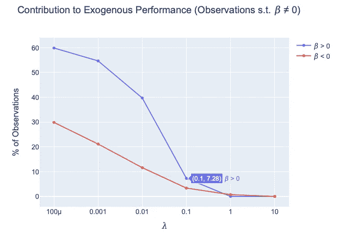
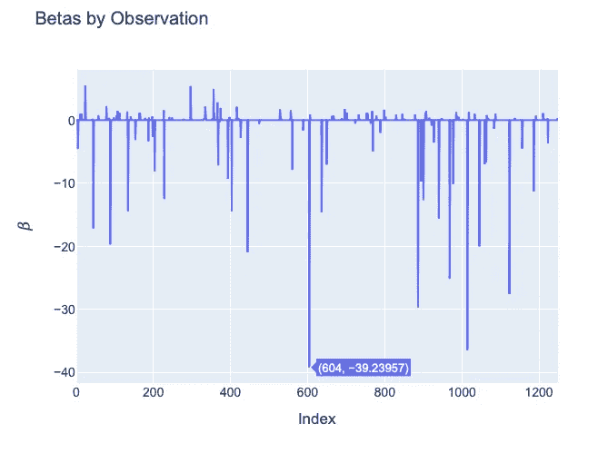

# 你的标签和数据有噪音？套索叛徒！

> 原文：<https://towardsdatascience.com/lasso-the-traitors-dd33ea5942bc?source=collection_archive---------40----------------------->

## 标签噪声是训练监督算法时经常遇到的问题。了解如何使用套索叛徒来减少标签噪声( **LTT** )。

由[马库斯·斯皮斯克](https://unsplash.com/@markusspiske?utm_source=medium&utm_medium=referral)在 [Unsplash](https://unsplash.com?utm_source=medium&utm_medium=referral) 上拍摄的照片

# TL；速度三角形定位法(dead reckoning)

这篇文章发展了套索叛徒( **LTT** )的方法。LTT 基于外部性能度量从数据集中过滤掉噪声观测值。LTT 显著提高了基于清理数据集的估计器的性能。LTT 速度快，易于应用，并且与任务无关。

**演职员表** : LTT 是我在北卡罗来纳大学教堂山分校做访问学者期间，与我的长期合著者和好朋友 *Daniel M. Ringel* 合作开发的。

***你可以在这个***[***Colab***](https://colab.research.google.com/drive/1E9FzjgezQDePtqvmMYdDBM7WL-1iL6JA?usp=sharing)***笔记本里找到这篇文章的可复制代码。***

如果你在研究中使用 LTT，请引用这篇文章:

# **简介**

在使用监督算法时，您会遇到数据 X 和标签 Y。我们的目标是找到一个映射 *f* : X → Y，它最好地概括了看不见的数据 X*。

映射函数 *f* 就是学习算法。该算法学习从数据将输入域 X 的值映射到输出域 Y。例如，最简单的情况是线性回归或逻辑回归。
迄今为止，如此标准。

但是，这个世界本来就**乱**(还是乱了更好？).如果您曾经接触过不包含在一些花哨的 API 中的数据集，您很可能会以这样或那样的方式烧伤自己的手指(我当然多次这样做过)。

这是我如何了解到的，了解到的映射的质量从根本上受到所提供标签的质量的影响。

更正式的说法是，这个原则也被称为“ [GIGO](https://en.wikipedia.org/wiki/Garbage_in,_garbage_out) ”:垃圾入——垃圾出。

虽然这种见解听起来非常平凡，但我认为它经常被忽视。

让我们只获取一些免费的可用数据，而不考虑它的细微差别，或者就此而言，错误，我们就可以走了。因为训练和调整一个算法比手动处理成千上万的观察结果更有意义和挑战性。

对数据的任何训练都强加了隐含的假设，即可用数据包含“信息”。或者至少是足以正确训练算法的信息。大部分时间可能都是这样。然而，数据中也可能存在一种特殊形式的噪声。错误，这有可能降低我们的映射功能的质量。

让我们考虑一些例子来说明这一点:

a)改编自 IMDb 情感分类[数据集](https://ai.stanford.edu/~amaas/data/sentiment/)。

> 这是一部精彩的纪录片，讲述了埃尔热和他创作的丁丁的生活。
> y = 0

b)改编自 IMDb 情感分类[数据集](https://ai.stanford.edu/~amaas/data/sentiment/)。

> 这是一部精彩的纪录片，讲述了埃尔热和他创作的丁丁的生活。我只是不喜欢这个配乐，因为它的平淡和不恰当的演奏。
> y = 1

c)改编自波士顿住房[数据集](http://lib.stat.cmu.edu/datasets/boston)。

> x1 = 0.00632(CRIM)
> x2 = 18.00(ZN)
> x3 = 2310(INDUS)
> x4 = 0(CHAS)
> X5 = 0.5380(NOX)
> X6 = 6.5750(RM)
> y = 24.00(MDEV)

D) 5 维句子嵌入。

> x1 = 1.162
> x2 =-1.134
> x3 = 0.105
> x4 =-1.279
> X5 = 0.938
> y = 1

这里有点不对劲。继续阅读每个案例的分析。

这就是我们在本文中要解决的问题:使用 LASSO 回归自动检测训练数据中的错误。我们本质上是在滥用 LASSO 作为一种数据清洗方法。这种方法叫做:
**L**T**T**何**T**RAITORS**【LTT】**。

子弹躲开了！它看起来不会很酷，但肯定会有那种感觉。

# **标签噪音的问题**

关于“**标签噪声**”的问题有一个完整的研究流程。见[1]中的调查。作者在[2]中将标签噪声定义为“任何模糊实例及其类的特征之间关系的东西”。[1]中讨论的文献基本上考虑了两种类型的标签噪声:

1.  类别噪声(影响标签的观察值，Y)
2.  特征噪声(影响特征的观测值，X)

如[1]中所述，已经开发了一大堆能够处理标签噪声的方法。出于我们的目的，我们认为这两种类型的噪声是不可区分的，因为由此产生的影响可能是以下两种之一:

*   *最佳情况*:标签噪声没有影响。
*   *最差情况*:在最差情况下，标签噪声会降低映射函数的质量，即降低分类器性能。

在我们开始对 **LTT** 进行实际描述之前，让我们先看看前面的例子中哪里出错了:

一)*直白*。只是贴错标签了。标签应该是 y = 1，因为这明显是正面评价。

B) *不那么直白*。在这里，我们有一个微妙的意见，它不容易被归类为积极或消极。只是介于两者之间。将每个句子单独分类可以达到这个目的，但是我们只有一个标签。因此，这个例子可能会因其模糊性而降低整体性能。

C) *这个比较难。*如果我们不知道数据规格，我们不会注意到我们在 x3 = 2.310 中遗漏了一个逗号。通过描述性分析，这一个显然可以被识别为异常值。但是很容易想到这样的情况，其中两个不同的变量在孤立时是有效的，但是在输入域中代表一个非法的，或者至少是非常不寻常的组合(年龄= 5，已婚= 1)。

D) *不可能*。我们在这里无法手动找到任何东西，因为我们不知道相应的句子，这导致了嵌入。没关系，如果我们的向量 **x** 由五个或者一千个潜变量组成。我们盲目地强加了一个假设，即源句子是有效的和“好的”训练材料。

# 套索叛徒

为了解决这些例子，我提出了一个新的方法，叫做 **LTT** 。为什么我要把这个贴在媒体上？

*   这种方法在过去的一年里对我很有帮助，只是一些其他研究的副产品。
*   该方法简单明了且普遍适用。
*   比我所知道的一些杂志更多的人在阅读 Medium。

(*:在简短的文献研究中找不到任何东西。如果你知道 **LTT** 不是新的，请通知我)。

我们考虑一个元组(x *d* ∈ X，y *d* ∈ Y)，一个排除变量 i *d* 用于观察 *d* 。排除变量 i *d* = 0 表示训练集中存在(x *d* ，y *d* )元组。如果 i *d* = 1，则元组被排除。

接下来，我们基于训练集定义外生性能度量 *r，*，它是**而不是**。这可能是验证数据集或更下游的性能。如果一个元组的包含对外生性能(I*d*= 0→*r*≤*r+∈*)和**噪声**)有积极贡献，如果它的包含使外生性能(I*d*= 0→*r*>*r+∈*)因某种贡献而恶化，则该元组被视为**干净**得到的排除向量**I**∈【0,1]^*d*是一个 *D* 维的单热点向量，并对 *D* 个观测值中哪些被排除(1)出训练集，哪些被包含(0)进行编码。

接下来，我们在不替换原始数据的情况下拟定了 *S* 个随机观测值:每个排除向量 **i** 是从具有参数*p*:**I**t38】sb(*p*)∀*s*∈1，…， *S.* 的伯努利分布中随机采样的，这取决于数据大小、排除概率*对于每个排除向量**I**s*，存在相应的外部性能度量 *rs* 。外生性能度量是在减少的数据集上训练估计器及其随后在外生任务上评估的结果。我们假设，元组的排除独立地影响外生性能。

我们最终得到一个排除矩阵**I**∈【0,1]^(*s*x*d*)和一个性能度量向量 **r** ∈ ℜ^ *S* 。接下来，我们使用套索[3]和正则化参数𝜆.的一些值来回归 **I** 上的 **r** 如果训练集中的观察值 *d* 为套索回归的估计参数向量 **𝛽** 所指示的，可以用变化的𝜆s.多次重复这个过程

*   增加外生任务的性能(𝛽*d*t83】0)，
*   降低外生任务的绩效(𝛽*d*t84】0)，或者
*   对外生任务的表现无关紧要(𝛽 *d* = 0)。

之后，我们可以手动或自动干预并处理相应的观察结果。 **LTT** 方法的优势在于它的简单，并且它是模型不可知的。它的缺点是——你可能已经猜到了——你必须训练许多模型来获得外生性能向量 **r.**

我们假设，从所述训练集中移除观察值可能会影响外源性任务的执行。这种假设不一定适用于每个应用或性能指标。如果这种假设成立，则由用户来检查。

虽然 **LTT** 旨在过滤掉降低性能的观察结果，但是您显然可以使用该方法来调查观察结果，从而提高性能。

# 模拟

***你可以在这个***[***Colab***](https://colab.research.google.com/drive/1E9FzjgezQDePtqvmMYdDBM7WL-1iL6JA?usp=sharing)***笔记本里找到这篇文章的可复制代码。***

为了演示 **LTT** 的应用和性能，我们继续进行模拟。我们用 2500 个观察值、25 个特征(其中 5 个是信息性的)和一个结果变量生成一个随机回归问题。我们将数据集分为训练集(50%)、验证集(25%)和测试集(25%)。这是我们的原始数据。训练数据集由 1250 个观察值组成。

对于训练集的结果变量 **y** (!)，我们反转了 5%的观察值的符号，将非常简单的标签噪声引入到训练数据中。我们最终得到两个数据集:**原始数据**和**噪声**。前者包含未接触的原始数据，后者包含数据加上 **y** 中的标签噪声。

我们使用[刀切](https://en.wikipedia.org/wiki/Jackknife_resampling)采样(不考虑)来评估两个数据集上线性回归的性能。我们丢弃 5%的观察值，不替换，拟合回归，并评估外生性能。起泡，冲洗，重复 1500 次。我们的外生性能是验证数据的均方误差(MSE)。因此，我们最终得到 1500 毫秒。描述性结果如下所示:

*   **RAW**:
    Mean MSE = 0.04
    Max MSE = 0.04
    Min MSE = 0.04
    Std。= 0.00
*   **噪声** :
    均值 MSE = 327.36
    最大 MSE = 372.80
    最小 MSE = 240.57
    Std。= 23.23

通过改变 **y，**中大约 5%标签的符号，我们将平均验证 MSE 从 0.04 增加到 **327.36** ！(TBH:这比我预想的要多得多)

让我们继续为 **LTT** 创建排除矩阵 **I** 。排除矩阵 **I** 仅仅是一个具有预定义密度的随机稀疏布尔矩阵。密度表示在每次 **LTT** 迭代中要丢弃的观测值的百分比。该值表示每行的预期值。

接下来，我们迭代排除矩阵的行。每一行都对应于一个实验，在这个实验中我们删除了一部分观察结果。重要的是，我们存储套索的排除矩阵 **I** 。对于每次迭代，我们将一个任意的估计量拟合到缩减的数据集，并存储它在外生任务上的性能。

如前所述，产生的外部性能数组是我们的向量 **r，**。性能度量可以是任何值。你也可以使用熵、对数损失、R2 或者任何你想要的方法，只要它与任务相关并且是训练过程的外部因素。

接下来，我们使用 LASSO 在我们的排除矩阵 **I** 上回归外生性能 **r** 的结果向量。我们对𝜆 = (10e-4，10e-3，10e-2，10e-1，10e1)重复这个过程。以这种或那种方式对外生性能有贡献的观测值百分比(𝛽 ≠ 0)如下所示:

该图如下所示:对于𝜆 = 0.1，7.28%的观察值对外生绩效有积极贡献(𝛽 > 0)。相反，3.36%恶化了外生性能(𝛽 < 0). In total, 10.64% of the observations contribute to the exogenous performance.

We also see, that the percentage of observations with a positive contribution declines rather rapidly, as we increase 𝜆. This indicates, that there are probably a few observations in the training data with a relatively strong negative contribution. Recall: we inverted the sign of only 5% of the labels in the training data **y.** 根据图表，0.1 和 1 之间的𝜆似乎是分析数据中标签噪声的相当好的选择。

如果我们看看𝜆 = 0.1 的𝛽向量，我们会对我们的训练数据中真正发生的事情有更多的了解。记住，每个𝛽对应于训练数据集中的每个观察值 *d* 。

该图如下所示:排除指数为 *d* = 604 的观察值(i = 1)，预期外生绩效 *r* 增加-39.23。更具体的说:排除观测值降低了验证数据上的 MSE，因为 MSE =∑ i *d* * 𝛽 *d* 。我们看到，多重观察对外生绩效有强烈的负面影响。

为了测试，如果我们正确地识别了标签，让我们执行一个健全性检查。我们根据𝛽的大小选择前 50 个系数，并将相应的指数与我们有意引入误差的标签的指数进行比较。

**LTT** 方法正确识别了顶部 **50** 噪声观测值中的 **39** 。显然还有改进和未来研究的空间。人们可以单独检查每个观察结果，或者编写一些定制的逻辑来进行更有效的过滤。但这取决于最终用户。

接下来，我们从训练数据中移除具有最大𝛽的 50 个观察值，并拟合新的估计量。根据新数据训练的估计器的外部性能(通过先前的刀切计算)如下:

*   **噪声(用于对比)** :
    均值 MSE = 327.36
    最大 MSE = 372.80
    最小 MSE = 240.57
    Std。= 23.23
*   **清洁后的** :
    平均 MSE = 4.75
    最大 MSE = 5.61
    最小 MSE = 2.25
    Std。= 0.5

通过使用 **LTT** 从训练数据中移除噪声观测值，我们能够显著提高外部性能。

之前验证 MSE 是 **327.36** ，现在是 **4.75** 。

满分是 0.04。然而，性能的提高已经非常显著，而且仅仅是通过从训练数据中删除了少得可怜的 50 个观察值而实现的。

复制测试数据的结果基本上复制了上面显示的结果，因此我在这里不再重复。

# 摘要

我们发展并实施了套索叛徒( **LTT** )的方法。 **LTT** 能够根据外部性能指标过滤掉噪声观测值。LTT 很容易应用，很容易获得，并且不知道潜在的问题。

如有疑问，请随时联系 [me](mailto:borchers@bwl.uni-mannheim.de) 。

# 附加说明

***你可以在这个***[***Colab***](https://colab.research.google.com/drive/1E9FzjgezQDePtqvmMYdDBM7WL-1iL6JA?usp=sharing)***笔记本里找到这篇文章的可复制代码。***

如果你在研究中使用 **LTT** ，请引用这篇文章:

# 参考

1.  B.Frenay 和 M. Verleysen，“标签噪声存在下的[分类:调查](https://ieeexplore.ieee.org/document/6685834)，”载于 *IEEE 神经网络和学习系统汇刊*，第 25 卷，第 5 期，第 845–869 页，2014 年。
2.  J.R. Quinlan，“决策树的[归纳”，载于*机器语言*，第 1 卷，第 1 期，第 81–106 页，1986 年。](https://dl.acm.org/doi/abs/10.1023/A%3A1022643204877)
3.  R.Tibshirani，[通过套索的回归收缩和选择](https://statweb.stanford.edu/~tibs/lasso/lasso.pdf)，皇家统计学会期刊*。系列 B(方法论)*，第 58 卷，第 1 期，第 267-288 页，1996 年。

# 放弃

*所表达的观点仅代表我个人，并不代表我的雇主的观点或意见。作者对本网站内容的任何错误或遗漏不承担任何责任或义务。本网站包含的信息按“原样”提供，不保证完整性、准确性、有用性或及时性。*