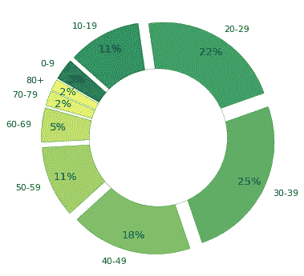

# 延迟支付行为:这是英国经济的定时炸弹吗？

> 原文：<https://towardsdatascience.com/late-payment-practices-is-this-the-ticking-time-bomb-of-the-uk-economy-5b958e4dd109?source=collection_archive---------38----------------------->

## 英国大企业支付实践数据分析

Jurica koleti 在 [Unsplash](https://unsplash.com?utm_source=medium&utm_medium=referral) 上拍摄的照片

对许多中小企业来说，延迟付款仍然是一个有争议的问题。大企业经常强加延长的条款或延迟付款，因为这使他们能够获得廉价的流动资金信贷。虽然这是常见的做法，但未能及时向供应商付款会对供应商的现金流和交易能力产生不利影响。在严重的情况下，延迟付款会危及企业的偿付能力。据估计，仅在英国，就有 260 亿英镑[被拖欠中小企业的供应商逾期付款所套牢。](https://www.gov.uk/government/news/late-payment-reporting-guidance-launched-for-large-businesses)及时付款每年可以避免 50，000 家企业死亡，这给英国经济造成了 25 亿英镑的损失。

为打击逾期付款行为，英国政府于 2017 年 4 月出台立法，要求英国大公司和有限责任合伙企业(LLP)每年发布两次关于其付款表现和政策的报告。不遵守这些规则是一种刑事犯罪，可能会导致巨额罚款。

# 延期付款是否会让企业感到羞愧，从而做出更好的行为？

丢人！丢人！

要回答这个问题，让我们看看商业能源部&产业战略(BEIS)发布的截至 2020 年 1 月 28 日的[支付实践报告。](https://check-payment-practices.service.gov.uk/search)

## 数据概述

迄今为止，7，887 家公司提交了 25，800 份报告。数据质量不高，数据准确性也值得怀疑。在这些报告中:

*   2632 份不完整，几乎没有任何有用的信息。
*   一些公司提交了相同的付款信息，一些公司在同一时期提交了几份文件，但包含不同的条目。
*   并非所有报告期都是六个月。例如，时间段的范围从 29 天到一整年。
*   公司报告的平均支付时间为 0 天和 1，000 天。

数据清理后，我们剩下一组来自 7287 家公司的***23028 份报告。并非所有这些公司都一贯提交报告。***

提交的报告不一致

一些公司在首次提交报告后，没有按照要求提交报告。或许对公司来说，未报告的罚款还不够大？

## **一个公司的平均支付时间是多少？**

公司向供应商付款的平均天数分布

*   平均而言，一家英国公司向供应商付款需要 ***37 天*** 。
*   64%的公司平均支付时间超过 30 天
*   9%的公司给出的平均支付时间超过 60 天

## 发票延迟支付的比例是多少？

所有报表中延迟支付发票的百分比分布

*   平均而言，30%的*款项比约定的期限晚支付*
*   *21%的公司报告延迟支付 50%或更多的发票*
*   *2%的公司报告延迟支付 90%或更多的发票*

## *那些签了即时支付码的公司怎么样？*

*即时支付代码(PPC)为支付实践设定了标准。它由 CICM 特许信用管理协会代表 BEIS 管理。守则要求在 60 天内支付至少 95%的发票。*

*   *只有 9%的公司称自己是 PPC 成员*
*   *PPC 的参与者报告平均支付时间为 34 天，25%的发票被延迟支付*
*   *相比之下，非参与者报告的平均支付时间为 37 天，30%的发票被延迟支付*

**

*PPC 签署方的合规性*

*上图显示，尽管他们是成员，但只有 47%的 PPC 参与者遵守《守则》的要求。*

## *提供金融解决方案的公司表现更好吗？*

*在他们的报告中，公司被要求公布他们是否提供电子发票或供应链融资。这些是什么？为什么它们会对支付实践产生影响？*

*一张 ***e(电子)发票*** 包含来自供应商的数据，其格式可以无缝接入买方的应付账款系统。这减少了手动处理时间和错误。*

****供应链融资*** 涉及三方:买方、卖方和金融机构。工作原理:*

1.  *供应商向买方开具发票*
2.  *买方向金融机构确认发票已被批准支付*
3.  *供应商直接获得价值(减去少量费用)*
4.  *付款到期时，买方向贷方付款。*

*因此，供应商很快得到付款，买方可以利用延长的付款条件。这有助于买家和供应商稳定和管理他们的日常现金流。*

**电子发票**

******

按电子发票可用性划分的主要支付行为分布** 

*   **24%的公司报告提供电子发票**
*   **那些不提供电子发票的公司报告平均支付时间为 36 天，并且延迟支付 30%的发票**
*   **对于提供电子发票的公司，虽然平均支付时间更长(40 天)，但他们更有可能按时支付，28%的发票被延迟支付。**

*****供应链融资:*****

******

按供应链融资的可用性划分的主要支付行为分布** 

*   **供应链融资的使用率很低，只有 7%的公司报告说他们提供供应链融资。**
*   **那些不提供供应链融资的公司报告平均支付时间为 36 天，30%的发票被延迟支付**
*   **对于提供供应链融资的公司，平均付款时间更长(49 天)，但延迟付款的比例仍保持在 30%**

## **随着时间的推移，我们会看到任何改进吗？**

**要求大型企业公布其支付方式的规定生效还不到三年。在这段时间内，没有证据表明大企业已经做了 180 度大转弯，但数据显示情况正在改善。**

*   **2017 年，公司支付的平均时间是 44 天。这一数字下降了一周多，公司报告 2019 年的平均时间为 36 天。**
*   **迟缴率的改善并不明显。发票延迟支付的比例从 2017 年的 30%降至 2019 年的 28%。**

****

**过去 3 年的付款等待时间**

**上图揭示了这一趋势。它表明，对于没有逾期的发票，付款时间有了较大的改善，但对于逾期的发票，变化较小。**

## **我们学到了什么？**

**尽管大型企业被要求提交其支付行为的报告，但这种做法似乎是不完整和不一致的。剔除异常报告后，我们分析了 2017 年 4 月至 2020 年 1 月期间收到的来自 7，287 家公司的 23，028 份完整的支付实践报告。**

*   **一家公司支付发票的平均时间是 37 天，30%的付款晚于商定的条款。**
*   **PPC 的参与者支付发票的速度更快(34 天),并且更及时地支付(25%)。然而，这些公司中不到一半符合 PPC 的要求，PPC 规定至少 95%的款项必须在发票开具后 60 天内支付。**
*   **提供电子发票的公司需要更长的时间来支付(40 天)，但更善于在商定的期限内支付(28%)**
*   **提供供应链融资的公司比平均支付时间(49 天)多花了 12 天，在及时支付方面也不比普通人强。**

**有证据表明支付表现略有改善，但这需要注意，因为 2019 年的数据尚未完全成熟。在撰写本报告时，公司还有几天时间提交截至 2019 年的财务报告。**

**显而易见的是，这种被公开点名羞辱的特殊威胁并不是大企业推动支付条款限制的灵丹妙药。也许 2019 年 9 月出台的[即时支付政策会让天平倾斜？也许 PPC 的签约国会被吓得顺从，因为去年](https://www.gov.uk/guidance/prompt-payment-policy) [CICM 开始暂停会员资格](http://www.promptpaymentcode.org.uk/suspended_signatories.htm)。或者，我们能否接触到足够数量的用脚走路的中小企业，让表现不佳的企业表现良好？**

**谁知道呢？但这确实值得一看。**

**[点击这里](https://github.com/bev-o-neill/DSND-p4-UK-payment-practices-blog)，查看我的工作笔记链接。要查看底层数据，[点击这里](https://www.gov.uk/government/statistical-data-sets/price-paid-data-downloads)。**

***除非另有说明，本支付实务报告数据受* [*开放政府许可 v3.0*](https://www.nationalarchives.gov.uk/doc/open-government-licence/version/3/) *许可。***