# 潜在的狄利克雷分配:直觉，数学，实施和可视化与 pyLDAvis

> 原文：<https://towardsdatascience.com/latent-dirichlet-allocation-intuition-math-implementation-and-visualisation-63ccb616e094?source=collection_archive---------11----------------------->

TL；DR — [潜在狄利克雷分配](https://en.wikipedia.org/wiki/Latent_Dirichlet_allocation) (LDA，有时 LDirA/LDiA)是在文本数据中寻找**主题的最流行和可解释的生成模型之一。我已经提供了一个基于网络搜集的职位描述数据的[示例笔记本](https://nbviewer.jupyter.org/github/Ioana-P/MLEng_vs_DScientist_analysis/blob/master/2_Topic_modelling.ipynb#topic=0&lambda=1&term=)。虽然在像 [20Newsgroups](https://scikit-learn.org/0.19/modules/generated/sklearn.datasets.fetch_20newsgroups.html#sklearn.datasets.fetch_20newsgroups) 这样的规范数据集上运行 LDA 会提供[更清晰的主题](https://nbviewer.jupyter.org/github/bmabey/pyLDAvis/blob/master/notebooks/sklearn.ipynb)，但重要的是要见证主题识别在“野外”有多么困难，以及你可能如何实际上找不到清晰的主题——使用无监督学习，你*永远无法保证找到答案！***

*   **致谢**:对我理解*最有帮助的*是路易斯·塞拉诺在 LDA (2020)上的两个视频。很多直觉部分都是基于他的解释，我强烈建议你访问他的[视频](https://www.youtube.com/watch?v=T05t-SqKArY)进行更深入的剖析。

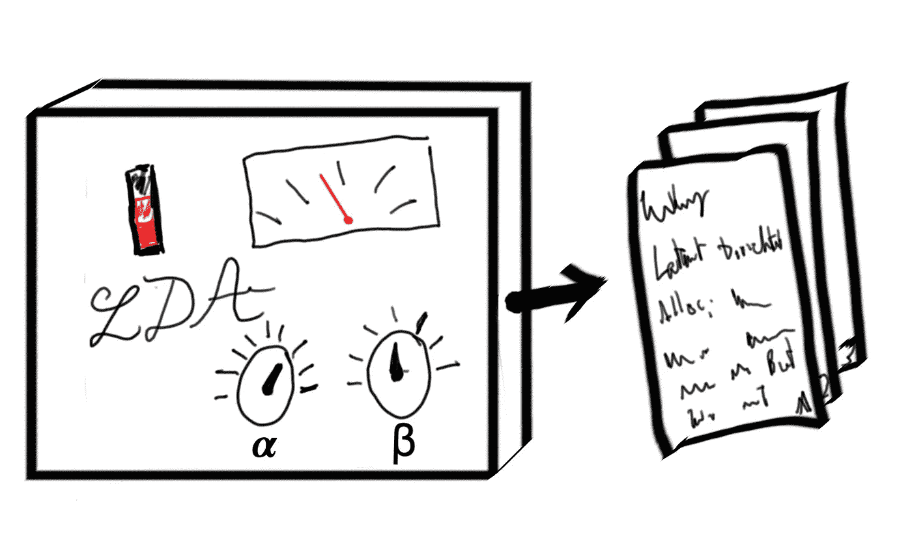

图 1.0 —生成文档的 LDA“机器”

# 内容:

[直觉](#f1d8)

[数学](#7b8f)

[实施和可视化](#b9d6)

# 直觉

假设您有一个不同新闻文章的集合(您的*文档*的*语料库*，并且您怀疑在所述语料库中有几个经常出现的主题——您的目标是找出它们是什么！为了达到这个目标，你需要做一些关键的假设

*   *d*[*分布假设*](https://en.wikipedia.org/wiki/Distributional_semantics#:~:text=The%20distributional%20hypothesis%20suggests%20that,occur%20in%20similar%20linguistic%20contexts.) *:* 频繁出现在一起的词，很可能意义相近；
*   每个题目都是不同单词的混合(图 1.1)；
*   每个文档都是不同主题的混合体(图 1.2)。

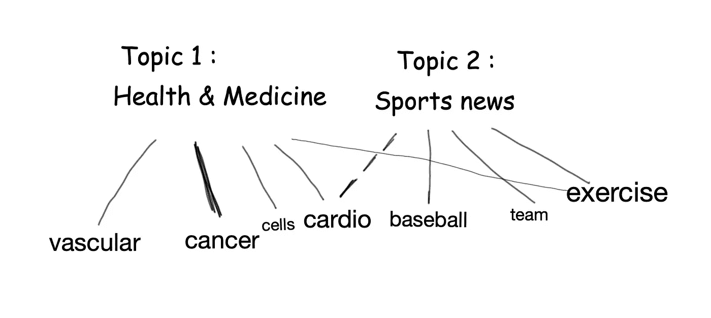

图 1.1 —混合单词的主题

在图 1.1 中，你会注意到主题“健康和医学”有各种各样的与之相关的词，其关联程度*(“癌症”比“血管”或“锻炼”更紧密)。请注意，不同的单词可以与不同的主题相关联，例如单词“cardio”。*

**

*图 1.2 —混合主题的文档*

*在图 1.2 中，你会看到一个单独的文档可能涉及多个主题(如左边的颜色代码所示)。像“受伤”和“恢复”这样的词也可能属于多个主题(因此我用了不止一种颜色)。*

*现在 LDA 是一个*生成模型*——它试图确定*生成*文章和话题的潜在机制。想象一下，如果有一台具有特定设置的机器可以输出文章，但我们看不到机器的设置，只能看到它产生的内容。LDA 创建一组具有不同设置的机器，并选择给出最佳拟合结果的机器(Serrano，2020)。一旦找到最好的一个，我们看一看它的“设置”,并从中推断出主题。*

*那么这些*设置*是什么呢？*

*首先，我们有一个叫做*狄利克雷*(发音像迪-里什-雷)*的东西，先于主题*。这是一个表明我们的话题有多稀疏或者有多混杂的数字。在 L Serrano 的视频里(我强烈推荐！)他阐述了如何在视觉上将其视为一个三角形(图 1.3)，其中点代表文档，它们相对于角的位置(即主题)代表它们与每个主题的关系(2020)。所以一个非常接近“运动”顶点的点将几乎完全是关于运动的。*

*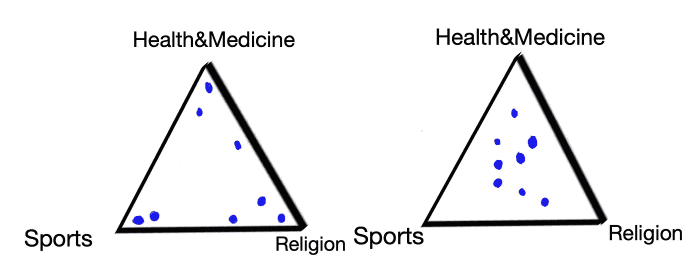*

*图 1.3 —主题的狄利克雷分布*

*在左边的三角形中，文档被很好地分开，大部分文档被整齐地塞到角落里(这对应于一个低的 Dirichlet 先验，alpha <1); on the right they are in the middle and represent a more even mix of topics (a higher Dirichlet prior, alpha> 1)。查看图 1.2 中的文档，考虑一下主题的组合，想想你认为它应该放在右边三角形的什么位置(我的答案是它应该是最靠近体育角的上方的点*)。**

*第二，我们有*项*(我们词汇表中的所有单词)的狄利克雷先验。这个数字(它的名字是*贝塔)*与阿尔法的功能几乎完全相同——除了它决定了**主题**如何在**术语** *中分配。**

*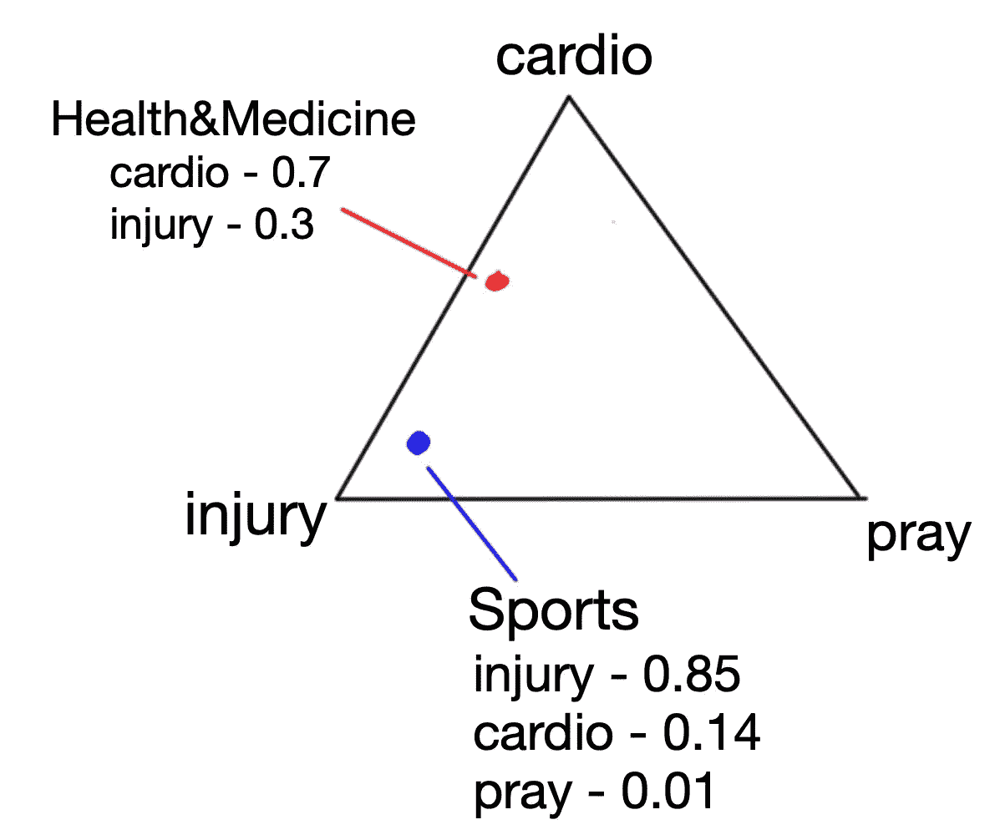*

*图 1.4 各项的狄利克雷分布；这些数字与每个单词与每个主题的关联程度成正比*

*正如我们之前所说的，主题被假设为不同术语的混合(更准确地说是*分布*)。在图 1.4 中，“运动”主要是指“伤害”。“健康&医学”在“心脏”和“损伤”之间徘徊，与“祈祷”一词毫无关联。*

**但是等等，我们的词汇不仅仅由三个单词组成！*你说得对！我们可以有一个由 *4 个单词*组成的词汇表(如图 1.5 所示)！麻烦在于，可视化一个典型的由 *N* 个单词组成的词汇表(其中 *N* 可能是 10000)需要一个[广义版本的三角形，](https://en.wikipedia.org/wiki/Simplex#The_standard_simplex)但是是在*N-1*维度中(这个术语是 n-1 *单形*)。这就是视觉效果停止的地方，我们相信更高维度的数学将会像预期的那样发挥作用。这也适用于主题——我们经常会发现自己有 3 个以上的主题。*

*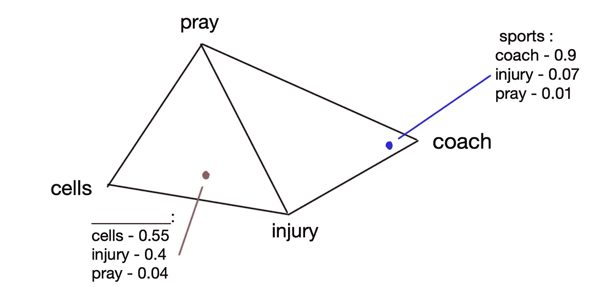*

*图 1.5-根据术语的分布，哪个主题是红色的？*

*一个重要的澄清:在 LDA 中，我们从α和β的值开始作为超参数，但是这些数字*仅仅*告诉我们我们的点(文档/主题)是否**通常**集中在它们三角形的中间或者更靠近角落。三角形(单纯形)内的*实际位置*由机器猜测——猜测不是随机的，它被狄利克雷先验加权。*

*因此，机器创建了两个狄利克雷分布，*将文档和主题分配给*，然后*基于这些分布生成*文档(图 1.6)。那么，最后一步是如何发生的，即*代*部分？*

**

*图 1.6 —生成文档的 LDA“机器”*

*还记得在开始时我们说过主题被看作是单词的混合/分布，文档被看作是主题的混合/分布吗？在图 1.7 中从左到右，我们从一个文档开始，在三角形的某个地方，在我们的 3 个主题之间撕裂。如果它在“体育”角附近，这意味着文档将主要是关于体育的，也会提到一些“宗教”和“健康医学”。所以我们知道文档的主题构成→因此我们可以估计会出现什么*单词*。我们将主要从体育中抽取(即随机抽取)单词，一些来自健康&医学，极少量来自宗教(图 1.7)。有个问题问你:看图 1.7 底部的三角形，你觉得*字 2* 会不会上来？*

*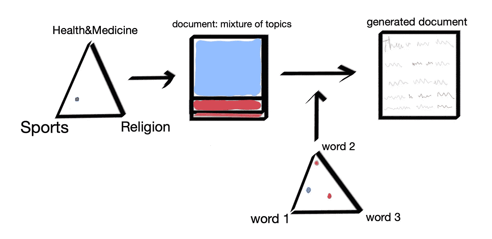*

*图 1.7 —两种狄利克雷分布如何影响我们的文档生成*

*答案是**它可能**:记住主题是单词的混合。你可能会想，*单词 2* 与黄色(宗教)主题有很强的相关性，由于这个主题在本文档中很少出现，*单词 2* 不会出现太多。但是要记住 a. *单词 2* 也与蓝色、体育话题和 b .单词是概率上的样本，所以每个单词都有一些非零的出现几率。*

*我们最终生成的文档中的单词(在图 1.7 的右端)将与原始文档中的单词进行比较。我们不会得到相同的文档，但是当我们将一系列不同的 LDA“机器”与一系列不同的发行版进行比较时，我们发现其中一个比其他的更接近于生成文档，这就是我们选择的 LDA 模型。*

# *数学*

*正常的统计语言模型假设您可以通过从单词的概率分布中进行采样来生成文档，即对于我们词汇表中的每个单词，都有一个该单词出现的关联概率。*

*LDA 给这种安排增加了一层复杂性。它假设了一个主题列表。每个文档 *m* 是这些 *k* 主题的概率分布，每个主题是我们词汇表 *V* 中所有不同术语的概率分布。也就是说每个词在每个题目中出现的概率是各种各样的。*

*生成文档的全概率公式如下图 2.0 所示。如果我们将它分解，在右边我们会得到三个乘积和:*

*   ***主题随词条的狄利克雷分布:**(对应图 1.4 和 1.5)对于每个主题 *i* 在 *K 个主题*中， *i.* 的词的概率分布是什么*
*   ***文档在主题上的狄利克雷分布:**(对应图 1.3)对于我们规模为 *M、*的语料库中的每个文档 *j、*的主题概率分布是什么*
*   ***给定文档中某个主题出现的概率 X 给定主题中某个单词出现的概率:**(对应图 1.7 中的两个矩形)某个主题、*、*出现在该文档中的可能性有多大，然后给定那些主题，某个单词、*、*出现的可能性有多大。*

*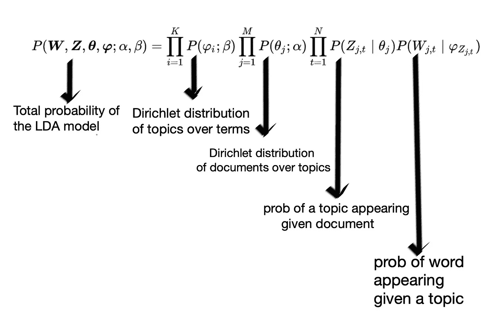*

*图 2.0 — LDA 公式*

*前两个和包含**对称**狄利克雷分布，这是我们的文档和主题的先验概率分布(图 2.1 显示了一组一般的狄利克雷分布，包括对称分布)。*

*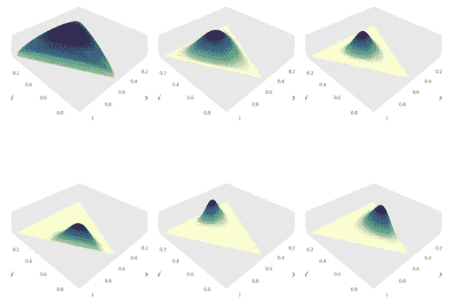*

*图 2.1-由 emperistor-Own 工作，CC BY-SA 4.0，[https://commons.wikimedia.org/w/index.php?curid=49908662](https://commons.wikimedia.org/w/index.php?curid=49908662)*

*第三个和包含两个多项式分布，一个针对主题，一个针对单词，即我们从主题的概率分布中抽取主题，然后对于每个主题实例，我们从该特定主题的单词的概率分布中抽取单词。*

*正如在直觉部分末尾提到的，使用最终概率，我们试图生成与原始文档中相同的单词分布。实现这一点的概率*非常非常低*，但是对于α和β的某些值，概率会更低。*

## *解读 LDA 模型及其主题*

*我们用什么标准来发现我们的潜在主题？正如雪莉和西维尔所说:*

> *“为了解释一个主题，人们通常检查该主题中最可能出现的术语的排序列表，[……]。以这种方式解释主题的问题是，语料库中的常用术语经常出现在多个主题的列表顶部附近，这使得很难区分这些主题的含义。”(2014)*

*这正是我们在下一节*实现*中遇到的问题。因此，我们使用另一种衡量标准来解释我们的主题— *相关性* (Shirley 和 Sievert，2014)。*

## *关联*

*这是一个可调整的指标，它可以平衡某个术语在特定主题中的出现频率与该术语在整个文档语料库中的出现频率。*

*换句话说，如果我们有一个在某个主题中非常流行的术语，相关性允许我们衡量它的流行程度有多少是因为它非常特定于该主题，有多少是因为它只是一个到处出现的作品。后者的一个例子是工作描述数据中的“学习”。当我们用一个较低的 lambda 调整相关性时(即惩罚那些碰巧在**所有**主题中频繁出现的术语)，我们看到“学习”并不是一个特别的术语，它之所以频繁出现只是因为它在语料库中普遍存在。*

*相关性的数学定义是:*

*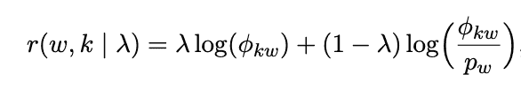*

*   **相关度**
*   **⍵——我们词汇中的一个术语**
*   **k —* 我们的 LDA 制作的主题之一*
*   **λ —* 可调权重参数*
*   *𝝓kw —某个术语出现在特定主题中的概率*
*   ****p****w—*一个词在整个语料库中出现的概率*

*除了λ， *λ，*所有项都是从 LDA 数据和模型中导出的。我们将在下一节中调整 lambda，以帮助我们获得更有用的见解。原论文作者将 lambda 保持在 0.3 到 0.6 的范围内(Shirley 和 Sievert，2014)。*

# *实现和可视化*

*sklearn 的 LatentDirichletAllocation 模型的实现遵循大多数 sklearn 模型的模式。在我的[笔记本](https://nbviewer.jupyter.org/github/Ioana-P/MLEng_vs_DScientist_analysis/blob/master/2_Topic_modelling.ipynb#topic=0&lambda=1&term=)中，我:*

1.  *预处理我的文本数据，*
2.  *将其矢量化(产生文档术语矩阵)，*
3.  *Fit _ 使用 LDA 转换它，然后*
4.  *检查结果，看看是否有任何紧急的，可识别的主题。*

*最后一部分是高度主观的(记住这是*无监督学习*)，并不能保证揭示任何真正有趣的东西。此外，识别主题(如聚类)的能力取决于您对数据的领域知识。我还建议修改 alpha 和 beta 参数，以符合您对文本数据的期望。*

*我使用的数据是来自 indeed.co.uk 的职位描述数据。除了文本，dataframe 还有许多其他属性，包括我是否使用了搜索术语“数据科学家”、“数据分析师”或“机器学习工程师”。我们可以在 LDA 主题中找到一些原始搜索类别吗？*

*在下面的要点中，你会看到我已经将我的数据矢量化，并将其传递给 LDA 模型(这发生在 data_to_lda 函数下)。*

*运行这段代码和 print_topics 函数将产生如下结果:*

```
*Topics found via LDA on Count Vectorised data for ALL categories:

Topic #1:
software; experience; amazon; learning; opportunity; team; application; business; work; product; engineer; problem; development; technical; make; personal; process; skill; working; science

Topic #2:
learning; research; experience; science; team; role; work; working; model; skill; deep; please; language; python; nlp; quantitative; technique; candidate; algorithm; researcherTopic #3:
learning; work; team; time; company; causalens; business; high; platform; exciting; award; day; development; approach; best; holiday; fund; mission; opportunity; problem

Topic #4:
client; business; team; work; people; opportunity; service; financial; role; value; investment; experience; firm; market; skill; management; make; global; working; support...*
```

*“print_topics”功能按概率降序给出每个主题的术语，其中**可以**提供信息。正是在这个阶段，我们可以**开始**尝试从我们的模型中标记出新出现的、潜在的主题。例如，主题 1 似乎与 ML 工程师的技能和需求关系不大(提到“amazon”与使用 AWS 有关——这是我在另一个笔记本中从项目的 EDA 阶段发现的)；与此同时，鉴于“市场”、“金融”、“全球”等术语，主题 4 显然更面向客户或面向业务。*

*现在这两个类别对你来说可能有点牵强，这是一个公平的批评。你可能已经注意到，使用这种方法来确定主题是很难的。所以，让我们转向 pyLDAvis！*

## *皮尔戴维斯*

*使用 pyLDAvis，LDA 数据(在我们的例子中是 10 维的)已经通过 PCA(主成分分析)被分解为仅 2 维的。因此，为了可视化的目的，它被展平了。我们有十个圆，每个圆的中心代表我们的主题在潜在特征空间中的位置；主题之间的距离说明了主题相似(不相似)的程度，圆圈的面积与每个主题对应的文档数量成正比。*

*下面我展示了如何在 pyLDAvis 中插入一个已经训练好的 sklearn LDA 模型。令人欣慰的是，负责将最初的 LDAvis (是 R 模型)改编成 python 的人让它与 sklearn 有效地通信。*

*在图 3.0 中是我们生成的图:*

*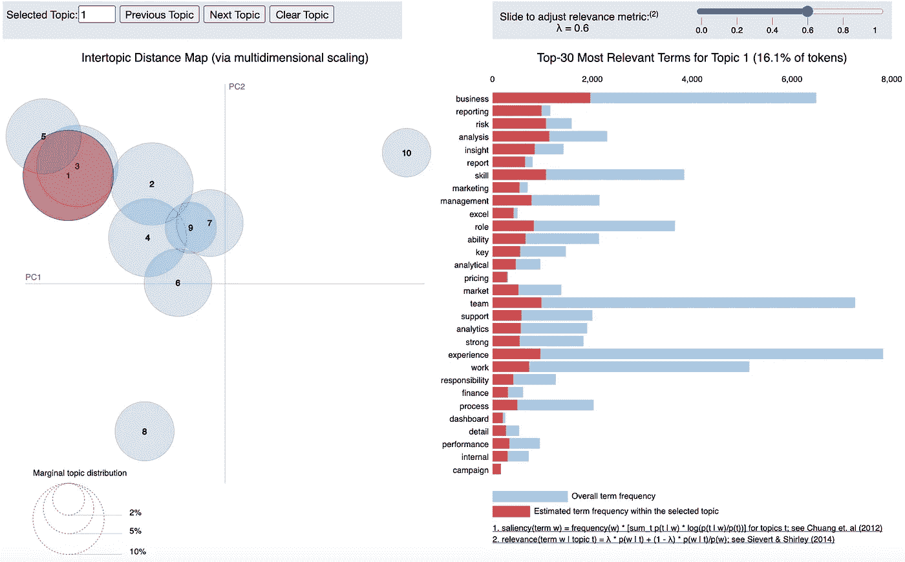*

*图 3.0 — pyLDAvis 交互图*

***解读皮尔戴维斯地块***

*LDAvis 图分为两部分——一部分是我们的 n 维 LDA 数据的二维“扁平”重绘图，另一部分是交互式的、变化的术语分布水平条形图。图 A1.0 显示了这两种情况。需要注意的一个重要特征是，右边的条形图以相关性递减顺序显示了*主题中的术语，但条形显示了术语的频率。红色部分代表纯粹在特定主题内的术语频率；红色和蓝色表示文档语料库中的总术语频率。**

***调整***λ(λ)**

*如果我们设置λ等于 1，那么我们的相关性完全由该词与该主题的概率给出。将它设置为 0 将导致我们的相关性由该词对主题的特异性决定-这是因为右边的词将某个词在特定主题中出现的概率除以该词一般出现的概率-因此，当我们使用较低的 *λ* 值时，高频词(如“团队”、“技能”、“业务”)的相关性将大大降低。*

*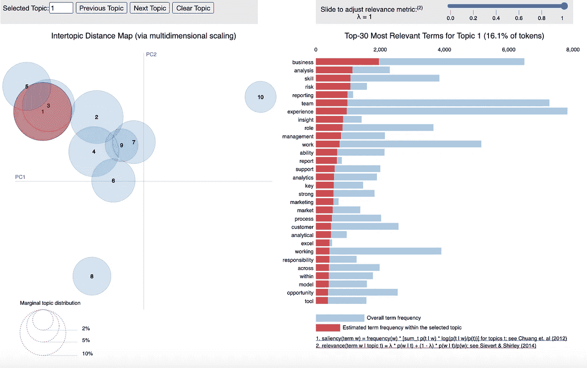*

*图 3.1-将λ设置为 1*

*在图 3.1 中 *λ* 被设置为 1，你可以看到这些术语通常与占主导地位的术语相匹配(例如，在我们打印出的每个主题的最流行术语中)。这只针对主题 1，但是当我改变主题时，前 30 个最相关的术语的分布几乎没有变化！*

*现在，在图 3.2 中 *λ* 被设置为 0，术语完全改变了！*

*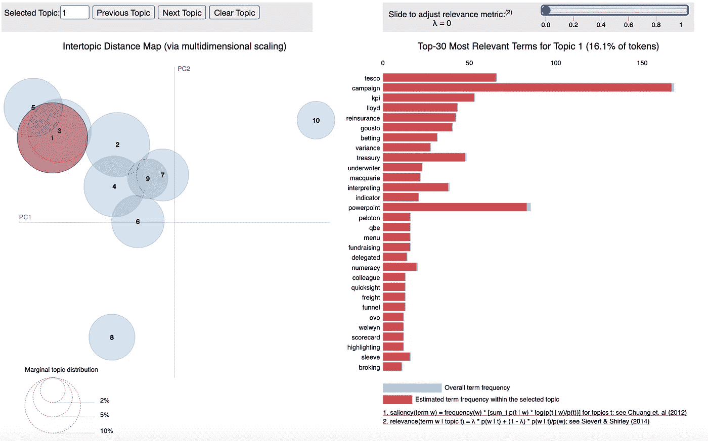*

*图 3.2-λ设置为 0*

*现在我们有了非常具体的术语，但是请注意顶部的刻度——最相关的词出现了大约 60 次。超过 6000 英镑后，下降幅度相当大！还有，这些话不一定会告诉我们什么有趣的东西。如果你用这个 lambda 值选择一个不同的主题，你将继续得到不一定那么重要的垃圾术语。*

*在图 3.3 中，我将 lambda 设置为 0.6，我正在探索主题 2。马上就有一个围绕工程师工作的重要主题，比如“aws”、“云”和“平台”。*

*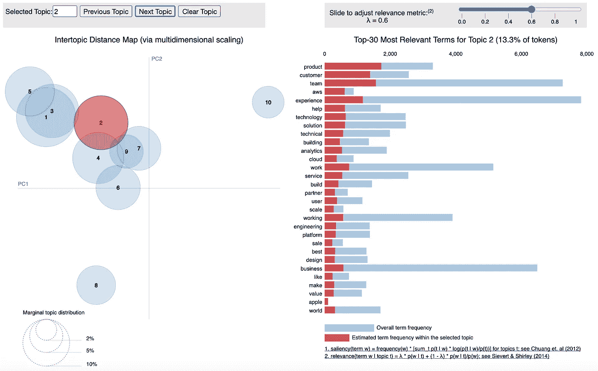*

*图 3.3-λ= 0.6*

*用 pyLDAvis 可以做的另一件大事是直观地检查给定单词的条件主题分布，只需将鼠标悬停在单词上即可(图 3.4)。下面我们可以看到有多少“NLP”被分成几个主题——不是很多！这让我更有理由相信主题 6 关注的是 NLP 和基于文本的工作(像“语音”、“语言”、“文本”这样的术语在这方面也有帮助)。对我来说，一个有趣的发现是“研究”和“博士”在这个话题中如此强烈地同时出现。*

*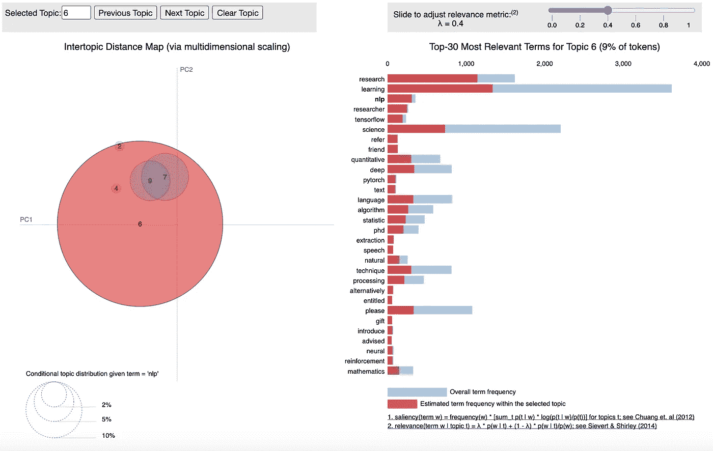*

*图 3.4——“自然语言处理”的条件主题分布*

*这是否意味着行业中 NLP 为重点的角色比其他角色需要更高的教育程度？他们是否比其他职位更需要以前的研究经验？NLP 的角色可能更专注于实验技术，因此需要具有前沿知识的人吗？*

*虽然生成的交互图不能提供具体的答案，但它可以为我们提供一个进一步研究的起点。如果你在一个可以运行主题建模的组织中，你可以使用 LDA 的潜在主题为调查设计、A/B 测试提供信息，甚至将其与其他可用数据相关联，以找到有趣的相关性！*

*祝你在话题建模上好运。如果你喜欢这篇冗长的文章，请给我你认为合适的掌声。如果你对 LDA 有所了解，并且认为我做了一些**甚至是部分错误的**的事情，请给我留言(反馈是一份礼物，诸如此类)！*

## ***参考文献***

1.  *Serrano L. (2020)。在线访问:[潜在狄利克雷分配(第 1 部分，共 2 部分)](https://www.youtube.com/watch?v=T05t-SqKArY)*
2.  *希沃特 c .和雪莉 K (2014)。LDAvis:一种可视化和解释主题的方法。在线访问:[交互式语言学习、可视化和界面研讨会会议录](https://nlp.stanford.edu/events/illvi2014/papers/sievert-illvi2014.pdf)*