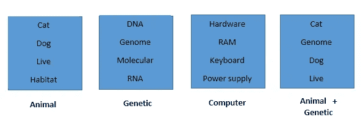
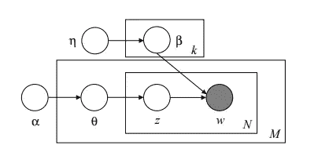
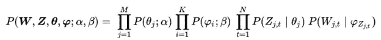
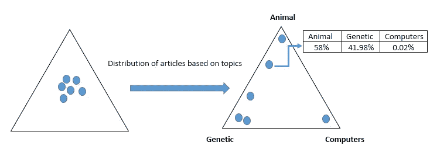
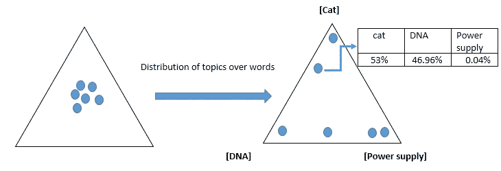
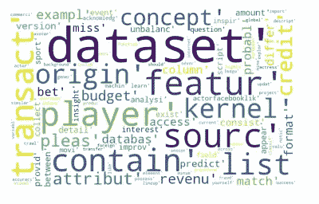
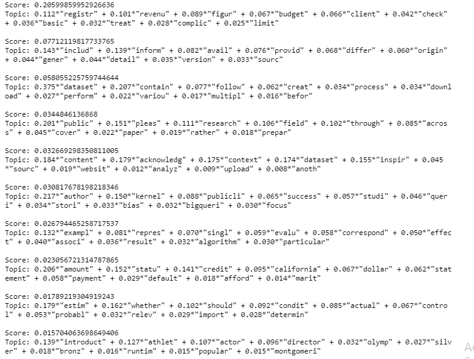

# 潜在狄利克雷分配(LDA):主题发现的概率建模方法指南

> 原文：<https://towardsdatascience.com/latent-dirichlet-allocation-lda-a-guide-to-probabilistic-modeling-approach-for-topic-discovery-8cb97c08da3c?source=collection_archive---------29----------------------->

## 潜在狄利克雷分配在 python 中的实现


[来源](http://www.widewallpapershd.info/preview/26253/3840x2160/newspapers.html)

潜在狄利克雷分配(LDA)是主题建模中最常用的算法之一。LDA 由 J. K. Pritchard、M. Stephens 和 P. Donnelly 于 2000 年提出，并由 David M. Blei、Andrew Y. Ng 和 Michael I. Jordan 于 2003 年重新发现。在这篇文章中，我将试着给你一个什么是主题建模的概念。我们将学习 LDA 如何工作，最后，我们将尝试实现我们的 LDA 模型。

# 什么是主题建模？

主题建模是机器学习和自然语言处理中最有趣的领域之一。主题建模意味着从文档集合中提取抽象的“主题”。自然语言处理的主要应用之一是在大量的文本文档中了解人们在谈论什么。通读所有这些文档并提取或编辑主题真的很难。在这些情况下，主题建模用于提取文档信息。为了理解主题建模的概念，让我们看一个例子。

假设你正在读报纸上的一些文章，在这些文章中,“气候”这个词出现得最多。所以，从正常意义上来说，你可以说这些文章更有可能是关于气候的。主题建模以统计的方式做同样的事情。它通过聚集相似的单词来产生话题。这里有两个术语:一个是“主题建模”，另一个是“主题分类”。虽然它们看起来相似，但它们是完全不同的过程。第一种是非监督机器学习技术，第二种是监督技术。
让我们详细阐述一下这个概念。

主题分类通常涉及互斥的类别。这意味着每个文档都标有特定的类别。另一方面，主题建模并不相互排斥。同一份文件可能涉及许多主题。由于主题建模是基于概率分布工作的，所以同一文档可能具有跨越许多主题的概率分布。

对于主题建模，您可以使用几种现有的算法。*非负矩阵分解(NMF)* 、*潜在语义分析或潜在语义索引(LSA 或 LSI)* 和*潜在狄利克雷分配(LDA)* 是这些算法中的一些。在本文中，我们将讨论潜在的狄利克雷分配，这是主题建模中最常见的算法之一。

# **潜在狄利克雷分配(LDA)**

"****潜在狄利克雷分配****(****LDA****)是一个生成统计模型，它允许观察集由未观察到的组来解释，这解释了为什么数据的某些部分是相似的。例如，如果观察是收集到文档中的单词，它假设每个文档都是少量主题的混合物，并且每个单词的出现都归因于文档的一个主题*。—维基百科*

*好吧，让我们试着理解这个定义。*

*L ***atent Dirichlet 分配****(****LDA****)*的基本思想是，文档被认为是各种主题的随机混合，主题被认为是不同单词的混合。现在，假设你需要一些与动物有关的文章，你面前有成千上万的文章，但你真的不知道这些文章是关于什么的。看完所有这些文章，要找出与动物相关的文章，真的很繁琐。让我们看一个例子。*

**

*作为一个例子，让我们考虑我们有四篇文章。第 1 条涉及动物，第 2 条涉及遗传类型，第 3 条涉及计算机类型，第 4 条是动物和遗传类型的组合。作为一个人类，你可以很容易地根据它包含的单词来区分这些主题。但是如果有几千条，每条有几千行，你会怎么做？答案会是这样的——“如果我们能在计算机的帮助下做到这一点，那么我们应该这样做”。是的，借助于*潜在的狄利克雷分配，计算机可以这样做。现在我们将试着理解 LDA 是如何工作的。首先，我们将看到 LDA 的图形表示，然后我们将看到概率计算公式。**

**

*上图是 LDA 的图示。在上图中，我们可以看到有六个参数-*

***α**(α)和**η**(η)——代表[狄利克雷分布](https://en.wikipedia.org/wiki/Dirichlet_distribution)。高 alpha 值表示每个文档包含大多数主题，相反，较低的 alpha 值表示文档可能包含较少数量的主题。与 alpha 相同，较高的η值表示主题可能覆盖大多数单词，相反，较低的 eta 值表示主题可能包含较少数量的单词。*

***β**(β)和**θ**(θ)——代表多项式分布。*

****z*** —代表一堆话题*

****w*** —代表一串单词*

**

*公式的左边表示文档的概率。在公式的右边，有四个术语。公式的第一项和第三项将帮助我们找到主题。第二个和第四个将帮助我们找到文章中的单词。公式右侧的前两项表示狄利克雷分布，右侧的其余部分是多项式分布。*

**

*我们假设，在上图中，左边的三角形中，蓝色的圆圈表示不同的文章。现在，如果我们将文章分布在不同的主题上，它将如直角三角形所示分布。蓝色圆圈将移动到三角形的角上，这取决于它在该主题中所占的百分比。这个过程是由公式右边的第一项完成的。现在，我们使用多项式分布根据第一个词的百分比生成主题。*

*现在，在得到主题后，我们会发现哪些单词与这些主题更相关。这是通过另一个狄利克雷分布来实现的。主题根据单词分布，如下所示。*

**

*现在，我们将使用另一个多项式分布来查找与这些主题更相关的单词，并使用该狄利克雷分布生成具有概率的单词。这个过程进行多次。*

*因此，我们将找到与主题更相关的词，并基于这些主题分发文章。*

# ***实施 LDA***

*你可以在 [GitHub](https://github.com/aawanRahman/latent-dirichlet-allocation/blob/master/topic_modelling_LDA.ipynb) 中找到代码。要实现 LDA，您可以使用 gensim 或 sklearn。这里，我们将使用 gensim。*

## *加载数据*

*为了实现的目的，我使用了 Kaggle [数据集](https://www.kaggle.com/canggih/voted-kaggle-dataset)。该数据集由 15 列 2150 个数据集信息组成:*

```
*dataset = pd.read_csv('/content/drive/My Drive/topic modelling/voted-kaggle-dataset.csv')*
```

## *数据预处理*

*为了处理数据，首先，我们选择对这个过程有意义的列。然后删除包含任何缺失值的行。*

```
*modified_dataset = modified_dataset.dropna()*
```

*然后，我们将计算标签列中唯一标签的数量，因为我们会将此视为模型的主题数量。*

```
*unique_tag = []
**for** i **in** range(len(tag_dataset)):
  tag_string = str(tag_dataset[i])
  **if** tag_string != "nan" :
    tag_word=convert(tag_string)
    **for** j **in** range(len(tag_word)):
      **if** tag_word[j] **not** **in** unique_tag:
        unique_tag.append(tag_word[j])
print(len(unique_tag))*
```

*删除标点符号并转换小写的整个文本使训练任务更容易，并提高了模型的效率。*

```
*remove_digits = str.maketrans('', '', string.digits)
exclude = '[!"#$%&**\'**()*+,-./:;<=>?@[**\\**]^_`{|}~]'
**for** column **in** ['Title','Subtitle','Description']:
  modified_dataset[column] = modified_dataset[column].map(**lambda** x : x.translate(remove_digits))
  modified_dataset[column] = modified_dataset[column].map(**lambda** x : re.sub(str(exclude), '', x))*
```

*我们需要标记数据集并执行词干操作。*

```
***import** **nltk**
nltk.download('punkt')
tokenized_dataframe =  modified_dataset.apply(**lambda** row: nltk.word_tokenize(row['Description']), axis=1)
print(type(tokenized_dataframe))**def** lemmatize_text(text):
    **return** [ps.stem(w)  **for** w **in** text **if** len(w)>5]ps = PorterStemmer() 
stemmed_dataset = tokenized_dataframe.apply(lemmatize_text)*
```

## *探索性数据分析*

*通过使用 [WordCloud](https://github.com/amueller/word_cloud) ，我们可以验证我们的预处理是否正确完成。单词云是由单词组合而成的图像，看起来像一个云状。它向我们展示了一个词在文本中出现的频率——它的频率。*

```
***from** **wordcloud** **import** WordCloud
**import** **matplotlib.pyplot** **as** **plt**
*#dataset_words=''*
*#for column in ['Title','Subtitle','Description']:*
dataset_words=''.join(list(str(stemmed_dataset.values)))
print(type(dataset_words))
wordcloud = WordCloud(width = 800, height = 500, 
                background_color ='white',  
                min_font_size = 10).generate(dataset_words) 

plt.figure(figsize = (5, 5), facecolor = **None**) 
plt.imshow(wordcloud) 
plt.axis("off") 
plt.tight_layout(pad = 0) 

plt.show()*
```

**

## *建立模型*

*对于 LDA 模型，我们首先需要构建一个单词字典，其中每个单词都有一个唯一的 id。然后需要创建一个包含 word_frequency — ->(word_id，word_frequency)的单词 id 映射的语料库。*

```
*dictionary_of_words = gensim.corpora.Dictionary(stemmed_dataset)word_corpus = [dictionary_of_words.doc2bow(word) **for** word **in** stemmed_dataset]*
```

*最后，训练模型。*

```
*lda_model = gensim.models.ldamodel.LdaModel(corpus=word_corpus,
                                                   id2word=dictionary_of_words,
num_topics=329, 
random_state=101,
update_every=1,
chunksize=300,
passes=50,
alpha='auto',
per_word_topics=**True**)*
```

*连贯性衡量一个主题中单词之间的相对距离。*

```
*coherence_val = CoherenceModel(model=lda_model, texts=stemmed_dataset, dictionary=dictionary_of_words, coherence='c_v').get_coherence()

print('Coherence Score: ', coherence_val)*
```

*一致性值:0.4*

## *估价*

```
***for**  index,score **in** sorted(lda_model[word_corpus[2]][0], key=**lambda** tup: -1*tup[1]):
    print("**\n**Score: **{}\t** **\n**Topic: **{}**".format(score, lda_model.print_topic(index, 10)))*
```

**

*顶部的主题获得了最高的概率，并且它与类似经济的东西相关。*

*你可以在 [**GITHUB**](https://github.com/aawanRahman/latent-dirichlet-allocation/blob/master/topic_modelling_LDA.ipynb) 上找到所有代码。*

# ***参考文献:***

1.  *[*潜伏的狄利克雷分配*](https://ai.stanford.edu/~ang/papers/jair03-lda.pdf) 作者大卫·m·布雷，安德鲁·y·Ng&迈克尔·乔丹。*
2.  *[潜伏的狄利克雷分配](https://youtu.be/T05t-SqKArY)路易斯·塞拉诺。*
3.  *[潜在狄利克雷分配(算法)](https://www.youtube.com/watch?v=VTweNS8GiWI)由 ML 论文讲解— A.I .苏格拉底圈— AISC。*

# *最后，感谢您的阅读。感谢任何反馈。*