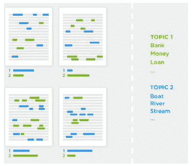
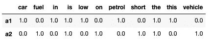
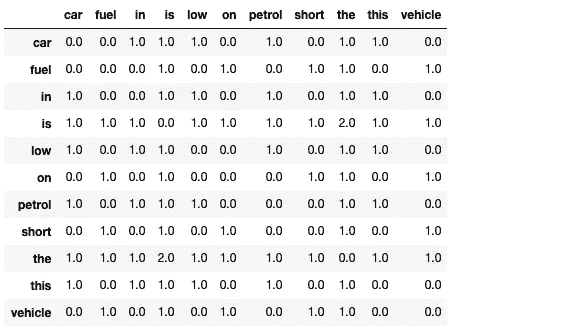
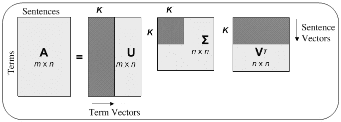
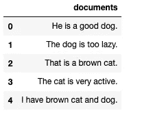
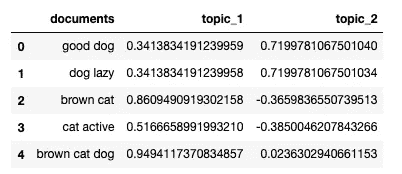
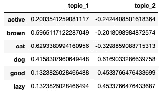

# 潜在语义分析—从文档中推断出隐藏的主题

> 原文：<https://towardsdatascience.com/latent-semantic-analysis-deduce-the-hidden-topic-from-the-document-f360e8c0614b?source=collection_archive---------4----------------------->

让计算机学习和理解人类语言仍然是最困难的任务。语言包含巨大的词汇，每部作品根据上下文有不同的含义，让计算机学习上下文是一个悬而未决的问题。在此，我们将尝试推导出文本所代表的隐藏主题，并将这些知识用于文档聚类。

# 主题模型



分析 vidhya —主题建模

主题模型是一种无监督的方式来推断隐藏的主题所代表的文本或文件。这个主题不是诸如体育、新闻或商业之类的实际主题，而是可以用来以最佳方式表示文本的词语。

这种技术非常强大，可以在无人监督的情况下用于文档聚类。如果你使用过谷歌新闻，那么你会看到不同来源的新闻聚集在一起，如果这些新闻代表相似的主题。这是主题建模的应用之一。

# 潜在语义分析

潜在语义分析是一种通过理解文本的上下文来分析文本和发现隐藏主题的有效方法。

潜在语义分析(LSA)用于发现由文档或文本表示的隐藏主题。这个隐藏的主题然后被用于将相似的文档聚集在一起。LSA 是一种无监督的算法，因此我们不知道文档的实际主题。

# 为什么是 LSA？

查找相似文档的最简单方法是使用文本的向量表示和余弦相似度。向量表示以向量的形式表示每个文档。这个向量被称为文档术语矩阵。

例如:

```
a1 = "the petrol in this car is low"
a2 = "the vehicle is short on fuel"
```

考虑以上两个字符串并形成上下文，我们可以理解这两个字符串是相似的。我们将尝试使用向量表示来找出这些字符串有多相似。

上述示例的文档术语矩阵为:



文档术语矩阵

文档-术语矩阵的大小是(文档数量)*(词汇大小)。词汇量是所有文档中出现的唯一单词的总数。这里的词汇量是 11，文档数是 2。

文档之间的相似性是使用文档之间的余弦相似性矩阵来找出的。文档`a1`和`a2`之间的相似度是 0.3086067，这太低了，因为文档在上下文中大多相似。这是文档术语矩阵的缺点，因此也是向量表示技术的缺点。另一个缺点是词汇量大，因为该语言具有巨大的词汇量，导致矩阵更大且计算成本高。

向量表示法的这一缺点导致了寻找文档间相似性和隐藏主题的新技术的需求。该技术可以解决同义词的问题，并且计算上也不昂贵。建议的技术是潜在语义分析。

# LSA 的工作

## 术语共现矩阵

这个矩阵的维数是(词汇大小)*(词汇大小)。它表示单词在数据集中出现的频率。矩阵帮助我们理解属于一起的单词。

对于上面的例子，术语共生矩阵是:



术语共现矩阵

正如我们所看到的，单词`the`和`is`是最常见的，但在句子的意思中不是很有用。我们将在本博客的后面看到如何使用这个矩阵及其好处。

## 概念

LSA 返回代表给定文档的概念而不是主题。概念是以最佳方式表示文档的单词列表。

例如，在体育文档的数据集中，概念可以是

> 概念 1:球、鞋、目标、胜利
> 
> 概念 2:球，球棒，得分，裁判

我们可以看到两个概念——概念 1 代表足球，概念 2 代表板球。但是我们可以看到，这些概念可以有重叠的词，因此，整个词集共同代表一个概念，而不是单个的词。LSA 试图使用术语共现矩阵来找到被称为概念的最佳单词集来表示文档。

> 概念也是通过降维来表示文档的一种方式。

## 奇异值分解

我们可以看到文档-术语矩阵非常稀疏并且大小很大。在如此大的矩阵上的计算是昂贵的，并且没有非常显著的结果，并且矩阵中的许多值是零。为了降低计算复杂度并获得更相关和有用的结果，使用了 SVD。

SVD 将矩阵分解成三个不同的矩阵:正交列矩阵、正交行矩阵和一个奇异矩阵。



研究之门

奇异值分解的主要优点是我们可以将矩阵的规模从数百万减少到 100 或 1000。上图中的`K`是矩阵的秩。类似地，如果我们仅使用 k 列和 k 行，那么我们也可以近似地计算矩阵 A，而没有任何大的损失。

在 SVD 计算期间，我们计算代表项共生矩阵的`A*(A'T)`。这意味着上面矩阵中带有索引`(i,j)`的值表示术语(I)和术语(j)在文档数据集中同时存在的次数。点击了解 SVD 更多信息[。](https://nlp.stanford.edu/IR-book/pdf/18lsi.pdf)

# 履行

实现是理解概念的最佳方式。我们将使用一个小例子来实现 LSA，这将有助于我们理解 LSA 的工作和输出。

我们将使用的文档是

```
a1 = "He is a good dog."
a2 = "The dog is too lazy."
a3 = "That is a brown cat."
a4 = "The cat is very active."
a5 = "I have brown cat and dog."
```

这里我们可以看到，必须生成两个概念，一个代表猫，另一个代表狗。

将此文档列表转换为数据帧:

```
import pandas as pd
df = pd.DataFrame()
df["documents"] = [a1,a2,a3,a4,a5]
df
```

`df`应该是这样的:



文档数据框架

## 预处理

任何机器学习算法最重要的部分就是数据预处理。数据中存在的噪声越多，模型的准确性越低。

我们将对数据执行四种类型的处理:

1.  删除文本中的所有特殊字符。
2.  删除所有少于 3 个字母的单词。
3.  小写所有字符。
4.  删除停用词。

```
#remove special characters
df['clean_documents'] = df['documents'].str.replace("[^a-zA-Z#]", " ")#remove words have letters less than 3
df['clean_documents'] = df['clean_documents'].fillna('').apply(lambda x: ' '.join([w for w in x.split() if len(w)>2]))#lowercase all characters
df['clean_documents'] = df['clean_documents'].fillna('').apply(lambda x: x.lower())
```

为了移除停用词，我们将对字符串进行标记，然后再次追加所有不是停用词的词。

```
import nltk
nltk.download('stopwords')
from nltk.corpus import stopwords
stop_words = stopwords.words('english')# tokenization
tokenized_doc = df['clean_documents'].fillna('').apply(lambda x: x.split())# remove stop-words
tokenized_doc = tokenized_doc.apply(lambda x: [item for item in x if item not in stop_words])# de-tokenization
detokenized_doc = []
for i in range(len(df)):
    t = ' '.join(tokenized_doc[i])
    detokenized_doc.append(t)df['clean_documents'] = detokenized_doc
```

经过预处理后，我们的数据将如下所示:


清洗完文件后

## 文档术语矩阵

我们将使用`sklearn`来生成文档术语矩阵。

```
from sklearn.feature_extraction.text import TfidfVectorizervectorizer = TfidfVectorizer(stop_words='english', smooth_idf=True)X = vectorizer.fit_transform(df['clean_documents'])
```

我们用`TfidfVectorizer`代替`CountVectorizer`，因为 tf-idf 是更有效的矢量器。你可以在这里了解传递给`TfidfVectorizer` [的各种参数，要了解 tf-idf 你可以](https://scikit-learn.org/stable/modules/generated/sklearn.feature_extraction.text.TfidfVectorizer.html)[查看这个链接](http://www.tfidf.com/)。

`X`的形状将是`(5,6)`，其中行代表文档数 5，列代表术语数 6。

要查看条款

```
dictionary = vectorizer.get_feature_names()
dictionary
```

这将给出一组单词

```
['active', 'brown', 'cat', 'dog', 'good', 'lazy']
```

## 奇异值分解

```
from sklearn.decomposition import TruncatedSVD# SVD represent documents and terms in vectors 
svd_model = TruncatedSVD(n_components=2, algorithm='randomized', n_iter=100, random_state=122)lsa = svd_model.fit_transform(X)
```

`TruncatedSVD`对文档-术语矩阵执行 SVD 函数，并给出降维后的向量。如果你想要矩阵不降维，你应该使用`fit`而不是`fit_transform`。

`n_components`是输出数据的维度。`n_components`的值代表不同主题的数量。可以在这里了解更多 [sklearn SVD。](https://scikit-learn.org/stable/modules/generated/sklearn.decomposition.TruncatedSVD.html)

现在，我们将检查分配给文档的主题

```
pd.options.display.float_format = '{:,.16f}'.format
topic_encoded_df = pd.DataFrame(lsa, columns = ["topic_1", "topic_2"])
topic_encoded_df["documents"] = df['clean_documents']
display(topic_encoded_df[["documents", "topic_1", "topic_2"]])
```

输出如下所示



电平移动放大器(Level Shift Amplifier)

我们可以看到分配给每个文档的主题。关于狗的文档由 topic_2 表示，关于猫的文档由 topic_1 表示。最后一个既有猫又有狗的文档更多地由 topic_1 表示，但也属于 topic_2。这与 topic_1 更相似，因为文档包含单词`brown`和`cat`，这两个单词在 topic_1 中的权重更高。

我们还可以看到每个主题中术语的权重。

```
encoding_matrix = pd.DataFrame(svd_model.components_, index = ["topic_1","topic_2"], columns = (dictionary)).T
encoding_matrix
```



术语-主题矩阵

从上面我们可以看到，术语`brown`和`cat`在 topic_1 中的权重都高于 topic_2。

我们已经看到了 LSA 的实施和运作。

# 应用程序

LSA 是 LSI 和降维算法的先驱。

1.  LSA 用于降维。我们可以在不丢失任何上下文的情况下，将向量的大小从数百万急剧减少到数千。这将有助于我们减少计算能力和执行计算所需的时间。
2.  LSA 用于搜索引擎。潜在语义索引(LSI)是在 LSA 上开发的算法。使用从 LSA 开发的向量来找到匹配搜索查询的文档。
3.  LSA 也可以用于文档聚类。正如我们看到的，LSA 为每个文档分配主题，基于分配的主题，我们可以对文档进行聚类。