# 潜在语义分析:直觉、数学、实现

> 原文：<https://towardsdatascience.com/latent-semantic-analysis-intuition-math-implementation-a194aff870f8?source=collection_archive---------4----------------------->

## 我们如何使用无监督学习从文本中提取主题和话题

TL；DR —文本数据深受高维度之苦。潜在语义分析(LSA)是一种流行的降维技术，遵循与奇异值分解相同的方法。LSA 最终根据 *r* **潜在***T5(即**隐藏**)特征来重构文本数据，其中 *r* 小于数据中的项数 *m* 。我将解释**概念上的**和**数学上的**直觉上的，并使用 [20 个新闻组](https://scikit-learn.org/stable/modules/generated/sklearn.datasets.fetch_20newsgroups.html)数据集在 [Scikit-Learn](https://scikit-learn.org/stable/index.html) 中运行一个基本的**实现**。*

语言不仅仅是你面前单词的集合。当你阅读一篇文章时，你的脑海中会浮现出一些图像和概念。当你阅读许多文本时，主题开始浮现，即使它们从未被明确地表达出来。我们理解和处理语言的天生能力挑战了算法表达式(目前)。LSA 是最流行的自然语言处理(NLP)技术之一，它试图用数学方法确定文本中的主题。LSA 是一种无监督的学习技术，它基于两个支柱:

*   分布假说，即意思相近的词频繁出现在一起。JR Firth 的名言“你应该从一个人交往的朋友那里知道一个词”很好地概括了这一点
*   奇异值分解(SVD——图 1)是一种数学技术，我们将更深入地研究它。

请注意，LSA 是一种无人监督的学习技术——没有基础真理。潜在的概念可能存在，也可能不存在！在我们稍后将使用的数据集中，我们知道有 20 个新闻类别，我们可以对它们进行分类，但这只是出于说明的目的。通常情况下，我们会在非结构化、无标签的数据上使用 LSA。

像所有的机器学习概念一样，LSA 可以分为 3 个部分:直觉、数学和代码。请随意使用目录中的链接，跳到与您最相关的部分。完整的代码可以在这个 [Github repo](https://github.com/Ioana-P/pca_and_clustering_for_edu_purposes/blob/master/newsgroups_LSA.ipynb) 中找到。

术语注释:通常，当对文本数据进行这种分解时，术语 SVD 和 LSA(或 LSI)可以互换使用。为了简单起见，从现在开始我将使用 LSA。

*本文假设对基本的自然语言处理预处理和单词矢量化有一些了解(特别是* [*tf-idf 矢量化*](/tf-term-frequency-idf-inverse-document-frequency-from-scratch-in-python-6c2b61b78558) *)。*

## 内容:

1.  [直觉](#0c85):用政治新闻话题解释
2.  [数学](#d570) : SVD 作为矩阵的加权有序和**或**作为一组 3 个线性变换
3.  [代码实现](#04db):python 3 中的 Scikit-Learn 和 20 个新闻组数据
4.  [参考文献](#a131)

# 1.直觉

([返回目录](#3ce3))

简单来说:LSA 把有意义的文本文件放在不同的地方重新创作，每一部分都表达了看待文本意义的不同方式。如果你把文本数据想象成一个想法，那么对于这个想法会有 *n* 种不同的方式*看待，或者有 *n* 种不同的方式*概念化*整个文本。LSA 将我们的数据表简化为一个潜在的概念表。*

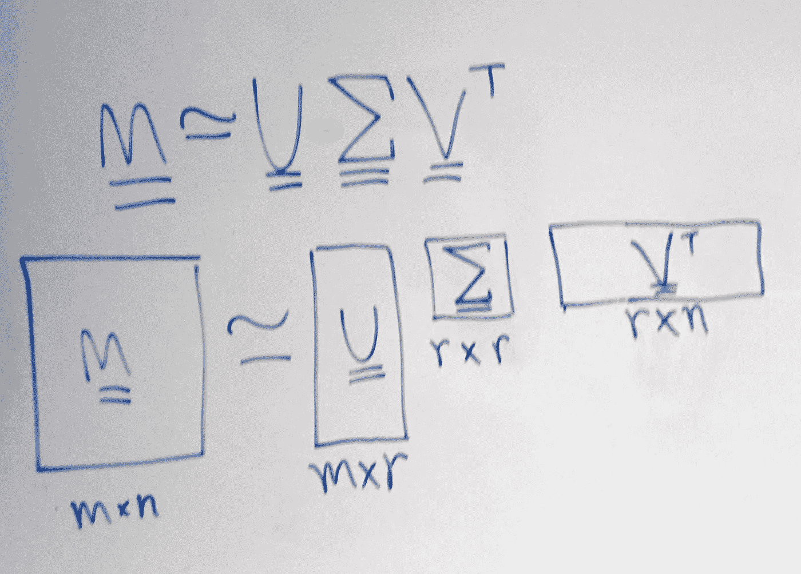

图 1:奇异值分解的公式和矩阵维数

假设我们有一些数据表，在本例中是文本数据，其中每行是一个文档，每列代表一个术语(可以是一个单词或一组单词，如“baker's 十二”或“Downing Street”)。这是表示文本数据的标准方式(在*文档术语矩阵*中，如图 2 所示)。表格中的数字反映了该单词在文档中的重要性。如果数字是零，那么这个单词就不会出现在文档中。

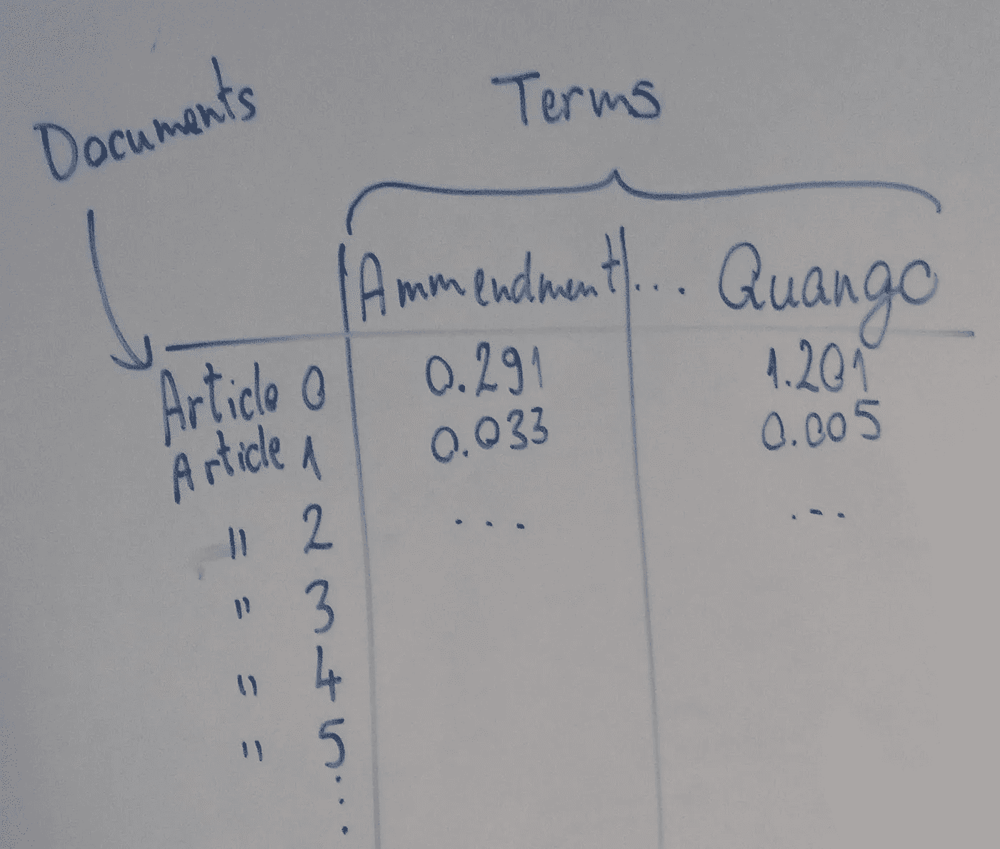

图 2:文档术语矩阵，在应用了某种矢量化之后，在我们的例子中是 TF-IDF(但是单词包也可以)

不同的文档将涉及不同的主题。假设所有文件都是**政治**文章，有 3 个主题:**外交政策(F.P .)、选举和改革**。

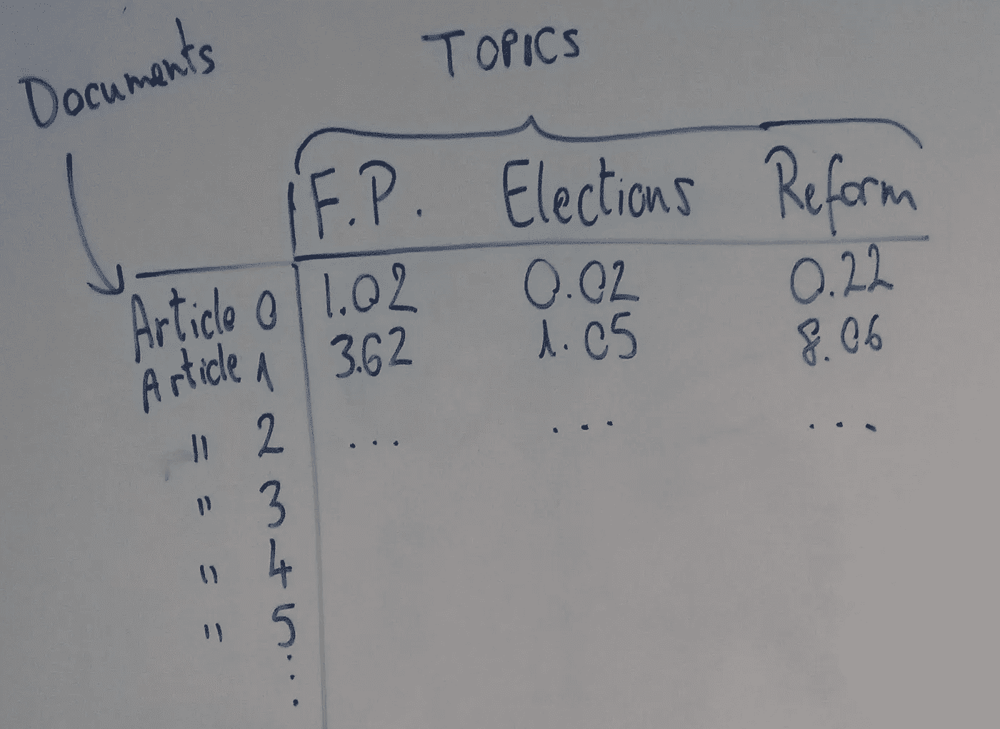

图 3:文档-主题矩阵(或者文档- **潜在的**-概念，如果你喜欢的话)

假设有些文章属于每一个类别，有些属于两个类别，有些属于所有三个类别。我们可以绘制一个表格，其中每行是一个不同的文档(一篇新闻文章)，每列是一个不同的主题。在单元格中，我们将使用不同的数字来表示该文档属于特定主题的程度(参见图 3)。

现在，如果我们从概念上将注意力转移到**主题**本身，我们应该问自己以下问题:*我们是否期望某些* ***单词*** *在这些主题中更频繁地出现？*

如果我们看外交政策，我们可能会看到像“中东”、“欧盟”、“大使馆”这样的术语。对于选举，可能是“选票”、“候选人”、“政党”；对于改革，我们可能会看到“法案”、“修正案”或“腐败”。因此，如果我们在不同的表中绘制这些主题和这些术语，其中的行是术语，我们会看到根据哪个主题最强烈地属于每个术语绘制的分数。自然会有在所有三个文档中出现的术语(“总理”、“议会”、“决定”)，这些术语会在所有三列中有分数，反映它们属于任一类别的程度-数字越高，其与该主题的关联越大。因此，我们的第二个表(图 4)由术语和主题组成。

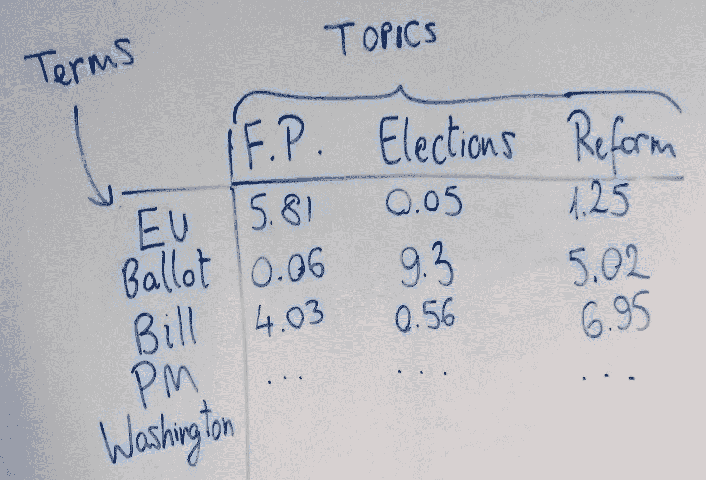

图 4:术语-主题矩阵

现在，最后一个组件作为一个表来解释有点棘手。它实际上是一组数字，一个数字代表一个话题。这些数字代表什么？它们代表了每个主题*解释了*我们的数据的程度。

他们如何“解释”这些数据？好吧，假设实际上，“改革”并不是贯穿我们文章的突出主题，大多数文章更适合“外交政策”和“选举”。因此,“改革”在这一组中会得到一个很低的数字，低于其他两个。另一种选择是，也许所有三个数字实际上都很低，我们实际上应该有四个或更多的主题——我们后来发现我们的许多文章实际上都与经济学有关！由于只坚持三个主题，我们已经剥夺了自己获得更详细和精确的数据的机会。这个数组的技术名称是“奇异值”。

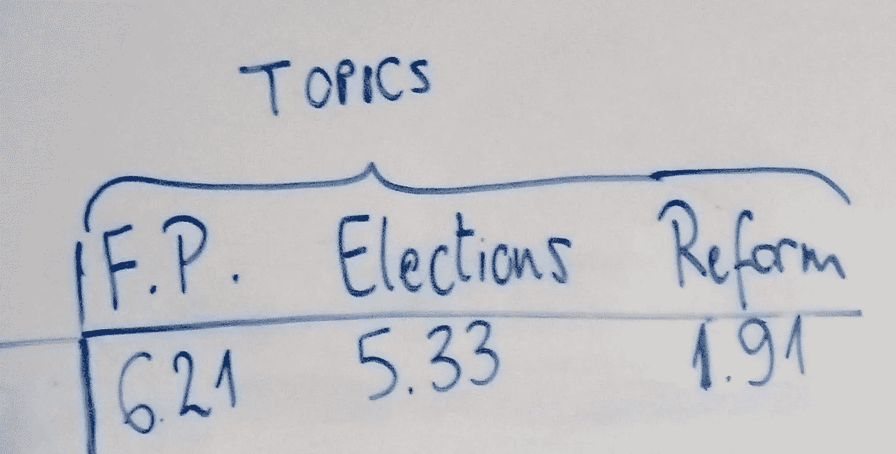

图 5:奇异值——我们的主题在文本中的相对重要性是什么？

这就是目前为止的直觉。您会注意到我们的两个表有一个共同点(文档/文章),这三个表都有一个共同点——主题，或者它们的某种表示。

现在让我们解释一下这是一种怎样的降维技术。如果我们指定一些文档和主题，就更容易看到优点。假设我们有 100 篇文章和 10，000 个不同的术语(想想所有这些文章会有多少独特的词，从“修正”到“热心的”！).在我们最初的文档术语矩阵中，有 100 行和 10，000 列。当我们开始将数据分解为 3 个部分时，我们实际上可以选择主题的数量——我们可以选择 10，000 个不同的主题，如果我们真的认为这是合理的。然而，我们也许可以用更少的主题来表示数据，比如我们最初谈到的 3 个主题。这意味着在我们的文档主题表中，我们将削减大约 *99，997 列*，在我们的术语主题表中，我们将做同样的事情。我们从表中丢弃的列和行在图 6 中显示为散列矩形。M 是原始文档-术语表； *U* 是文档主题表，𝚺 (sigma)是奇异值的数组，而 *V-transpose* (上标 t 表示原始矩阵 t 已沿其对角线翻转)是文档主题表，但沿其对角线翻转(我将在数学部分解释原因)。

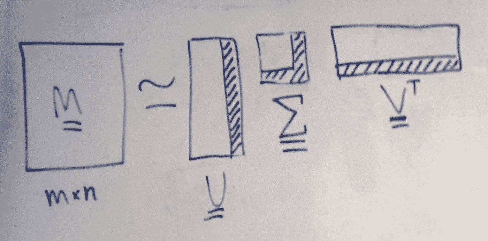

图 6 —我们丢弃了哪些散列

至于表示主题重要性的一组数字，从一组 10，000 个数字中，每个数字越来越小，因为它对应于一个不太重要的主题，我们削减到只有 3 个数字，用于我们剩余的 3 个主题。这就是为什么 LSA 的 Python 实现被称为*截断的* SVD:顺便说一下，我们截掉了表的一部分，但是我们稍后会看到代码。同样值得注意的是，我们事先不知道 3 个主题是什么，我们只是假设会有 3 个，一旦我们得到了组件，我们就可以探索它们，看看术语是什么。

当然，我们不只是想回到原始数据集:我们现在有 3 个可以使用的低维组件。在代码和数学部分，我们将讨论我们实际上前进了哪一步。简而言之，一旦我们截断了表(矩阵)，我们将得到的产品是文档主题表( *U* ) *乘以*奇异值(𝚺).这可以解释为文档(我们所有的新闻文章)以及它们属于每个主题的程度，然后根据每个主题的相对重要性进行**加权**。你会注意到，在这种情况下，这个最终表格中遗漏了一些东西，即*单词。*是的，我们已经超越了文字，我们丢弃了它们，但保留了*主题*，这是一种表达我们文本的更简洁的方式。

# 2.数学

([返回目录](#3ce3))

对于数学，我将对 SVD 进行两种不同的解释:首先是可以用于实方阵 M 的一般几何分解，其次是与我们的例子更相关的可分离模型分解。SVD 也用于基于模型的推荐系统。它非常类似于主成分分析(PCA)，但是它在稀疏数据上比 PCA 操作得更好(并且文本数据几乎总是稀疏的)。PCA 对数据集的*相关性*矩阵进行分解，而 SVD/LSA 直接对数据集进行分解。

我们将**把这个矩阵分解**成组成矩阵。我所说的因式分解本质上与我们用一个数来表示它的因子是一样的，当这些因子相乘时，我们就得到了原始数，例如 A = B * C * D。

这也是为什么它被称为奇异值**分解**——我们将*分解*成它的组成部分。

## 一般几何分解

我们在原始矩阵中无法获得的额外维度，即 *r* 维度，是*潜在概念*的数量。一般来说，我们试图把我们的矩阵表示成其他矩阵，它们的一个轴是这组分量。您还会注意到，基于维度，3 个矩阵的乘法(当 V 被转置时)将使我们回到原始矩阵的形状，维度 *r* 实际上消失了。

在理解数学的过程中，重要的不是确定 u、v 和𝚺中每个数字的代数算法，而是这些乘积的数学性质以及它们之间的关系。

首先，重要的是首先考虑矩阵实际上是什么，它可以被认为是向量空间的变换。在图 7 的左上角，我们有两个垂直的向量。如果我们只有两个变量开始，那么特征空间(我们正在查看的数据)可以在这个空间的任何地方绘制，这个空间由这两个**基**向量描述。现在移到我们图的右边，矩阵 M 被应用到这个向量空间，这就把它转换成新的，在右上角的转换空间。在下图中，M 的几何效应被称为“剪切”向量空间；两个向量 *𝝈1* 和 *𝝈2* 实际上是我们在这个空间中绘制的奇异值。

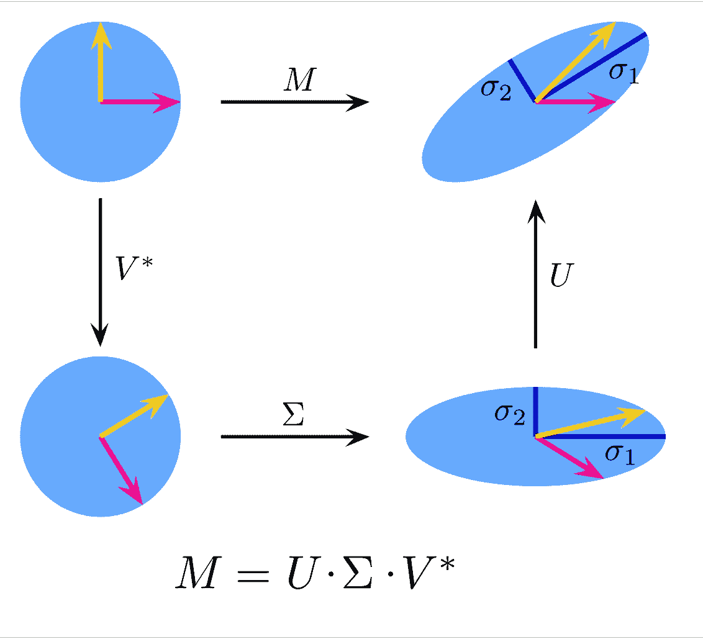

图 7:来源:维基百科；[奇异值分解](https://en.wikipedia.org/wiki/Singular_value_decomposition)；[链接](https://commons.wikimedia.org/wiki/File:Singular-Value-Decomposition.svg#filelinks;)；作者:格奥尔格-约翰

现在，就像你们在学校可能记得的点的几何变换一样，我们可以把这个变换 *M* 看作三个独立的变换:

1.  *V*引起的旋转(或反射)。*注意*V * = V-转置*由于 V 是实酉矩阵，所以 V 的复共轭与其转置相同。在矢量项中，V 或 *V** 的变换保持基矢量的长度不变；
2.  𝚺具有沿其奇异值拉伸或压缩所有坐标点的效果。想象一下我们在左下角的圆盘，我们朝着 *𝝈2* 的方向垂直向下挤压它，然后沿着 *𝝈1* 的方向水平拉伸它。这两个奇异值现在可以被描绘成椭圆的长半轴和短半轴。你当然可以将此推广到 *n* 维度。
3.  最后，应用 *U* 旋转(或反射)我们的特征空间。我们已经得到了与直接从 *M* 转换相同的输出。

我还推荐关于 SVD 的优秀的 [Wikipedia 条目，因为它对这个过程有特别好的解释和 GIF。](https://en.wikipedia.org/wiki/Singular_value_decomposition)

所以，换句话说，其中 *x* 是任意列向量:

M 对 x 的变换与右边矩阵对 x 的三次变换相同

矩阵 *U* 和 *V** 的性质之一是它们是酉矩阵，因此我们可以说这两个矩阵的列形成了两组正交基向量。换句话说，你可以从 U 得到的列向量会形成它们自己的坐标空间，这样如果有两列 *U1* 和 *U2，*你就可以写出空间的所有坐标，作为 *U1* 和 *U2* 的组合。这同样适用于 *V* 、 *V1* 和*V2*的列，并且这将推广到*n*-尺寸(你将有*n*-列)。

# 可分离模型分解

如果我们想象我们的矩阵 M 可以被分解成可分离矩阵的加权和，我们可以得到对 PCA 的相同理解，如下所示。

将我们的数据 M 分解成可分离矩阵的加权和， *Ai*

矩阵𝐴𝑖据说是可分的，因为它们可以分解成两个向量的外积，用奇异值𝝈*I*加权。计算形状为( *m，*)和( *n，*)的两个向量的外积将给出形状为(m，n)的矩阵。换句话说，计算两个向量中任意两个数的每个可能乘积，并放入新矩阵中。奇异值不仅对和进行加权，而且对和进行排序，因为值是按降序排列的，所以第一个奇异值总是最高的一个。

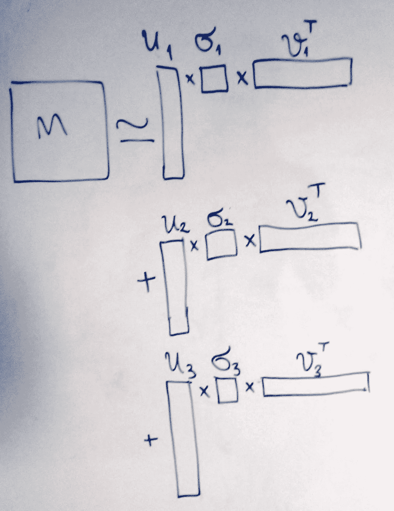

图 8:我们的可分离矩阵。请注意，≅符号代表这样一个事实，即只有 3 个乘积的分解集**近似于**我们的原始矩阵，它并不完全等于它。

在图 8 中，你可以看到如何将它可视化。以前我们有高的 *U* ，正方形*σ*和长的𝑉- *转置矩阵*。现在你可以想象从 *U* 中取出第一个垂直切片，用第一个奇异值对其所有值进行加权(相乘)，然后通过与𝑉 *的第一个水平切片进行外积-转置*，用这些切片的维度创建一个新矩阵。然后我们把这些乘积加在一起，得到 M。或者，如果我们不做完全求和，而只是部分完成，我们得到的是截断的版本。

因此，对于我们的数据:

*   其中 *M* 是我们原来的( *m，n* )数据矩阵——M 行，n 列； *m 个文档，n 个术语*
*   u 是一个( *m，r* )矩阵— *m 个文档和 r 个概念*
*   σ是一个*对角线* ( *r，r* )矩阵——除了对角线上的值以外，所有值都为零。(但是非零值代表什么呢？
*   v 是一个( *n，r* )矩阵— *n 项，r 个概念*

𝚺的值代表了每个潜在概念在多大程度上解释了我们数据中的差异。当这些乘以该潜在概念的 *u* 列向量时，它将有效地加权该向量。

如果我们将它分解成 5 个组件，它看起来会像这样:

加权文档概念向量和术语概念向量的外积之和

这里原本会有 *r* 个 *u* 个向量；5 个奇异值和 n 个𝑣*-转置*向量。

# 3.代码实现

([返回内容](#3ce3))

在最后一节中，我们将看到如何使用 Scikit-Learn 实现基本的 LSA。

## 提取、转换和加载我们的文本数据

```
from sklearn.datasets import fetch_20newsgroups
X_train, y_train = fetch_20newsgroups(subset='train', return_X_y=True)
X_test, y_test = fetch_20newsgroups(subset='test', return_X_y=True)
```

## 清洗和预处理

文本数据的清理通常与数字数据的清理截然不同。您经常会发现自己已经准备好了矢量器、模型，并准备好进行网格搜索，然后提取特征，却发现 cluster *x* 中最重要的特征是字符串“_ _”…因此您需要返回并做更多的清理工作。下面的代码块是我意识到需要从数据集中删除网站 URL、号码和电子邮件的结果。

```
from nltk.corpus import stopwords
from nltk.tokenize import RegexpTokenizer
import re
tokenizer = RegexpTokenizer(r'\b\w{3,}\b')
stop_words = list(set(stopwords.words("english")))
stop_words += list(string.punctuation)
stop_words += ['__', '___']# Uncomment and run the 3 lines below if you haven't got these packages already
# nltk.download('stopwords')
# nltk.download('punkt')
# nltk.download('wordnet')def rmv_emails_websites(string):
    """Function removes emails, websites and numbers""" new_str = re.sub(r"\S+@\S+", '', string)
    new_str = re.sub(r"\S+.co\S+", '', new_str)
    new_str = re.sub(r"\S+.ed\S+", '', new_str)
    new_str = re.sub(r"[0-9]+", '', new_str)
    return new_strX_train = list(map(rmv_emails_websites, X_train))
X_test  = list(map(rmv_emails_websites, X_test))
```

## 文本数据的符号化和矢量化

我们的模型处理数字，而不是字符串！因此，我们将文本标记化(将所有文档转化为更小的观察实体——在本例中为单词),然后使用 Sklearn 的 TF-IDF 矢量器将它们转化为数字。我建议任何转换过程(尤其是那些需要时间运行的过程)都在数据的前 10 行进行，并检查结果:它们是您期望看到的吗？数据框的形状是你所希望的吗？一旦你对你的代码有信心了，就输入整个语料库。

```
tfidf = TfidfVectorizer(lowercase=True, 
                        stop_words=stop_words, 
                        tokenizer=tokenizer.tokenize, 
                        max_df=0.2,
                        min_df=0.02
                       )
tfidf_train_sparse = tfidf.fit_transform(X_train)
tfidf_train_df = pd.DataFrame(tfidf_train_sparse.toarray(), 
                        columns=tfidf.get_feature_names())
tfidf_train_df.head()
```

这将为您提供矢量化的文本数据——文档术语矩阵。对测试集也重复上面的步骤，但是**只**使用 transform，**不** fit_transform。

## 探索性数据分析 LSA

仅仅为了我们的分解数据的可视化和 EDA 的目的，让我们将我们的 LSA 对象(在 Sklearn 中是 [TruncatedSVD 类](https://scikit-learn.org/stable/modules/generated/sklearn.decomposition.TruncatedSVD.html))适合我们的训练数据，并且只指定 20 个组件。

```
from sklearn.decomposition import TruncatedSVDlsa_obj = TruncatedSVD(n_components=20, n_iter=100, random_state=42)tfidf_lsa_data = lsa_obj.fit_transform(tfidf_train_df)
Sigma = lsa_obj.singular_values_
V_T = lsa_obj.components_.T
```

现在让我们想象奇异值——下面的柱状图是否显示了我们对它们的预期？

```
sns.barplot(x=list(range(len(Sigma))), y = Sigma)
```

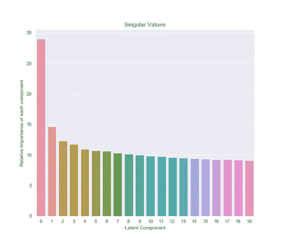

图 9 —我们的奇异值，代表每个潜在概念*在多大程度上解释了数据*中的差异

让我们通过术语-主题矩阵，*V-trans pose 来探索我们减少的数据。* TruncatedSVD 将把它作为形状的 numpy 数组(num_documents，num_components)返回，所以我们将把它变成一个 Pandas dataframe 以便于操作。

```
term_topic_matrix = pd.DataFrame(data=lsa_term_topic, 
                                 index = eda_train.columns, 
                                 columns = [f'Latent_concept_{r}' for r in range(0,V_T.shape[1])])
```

让我们将术语-主题矩阵分割成 Pandas 系列(单列数据框)，按值排序并绘制它们。下面的代码为我们的第二个潜在组件绘制了这个图(回想一下，在 python 中我们从 0 开始计数),并返回图 10 中的图:

```
data = term_topic_matrix[f'Latent_concept_1']
data = data.sort_values(ascending=False)
top_10 = data[:10]
plt.title('Top terms along the axis of Latent concept 1')
fig = sns.barplot(x= top_10.values, y=top_10.index)
```

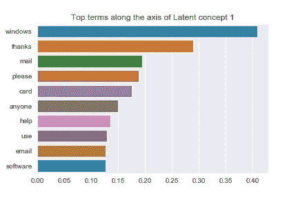

图 10:尽管看起来很嘈杂，但这里至少有三个术语有一个很强的主题

这些词在我们的第二个潜在成分中排名很高。这个轴的另一端的单词呢(见图 11)？

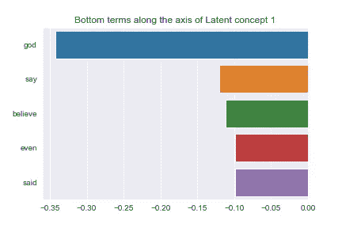

图 11:在这个时候，作者意识到了旅鼠/词干是多么有用

你可以自己决定这种语义分歧意味着什么。添加更多的预处理步骤将有助于我们摆脱像“说”和“说”这样的词产生的噪音，但我们现在将继续努力。让我们为第六个潜在概念再做一对想象(图 12 和 13)。

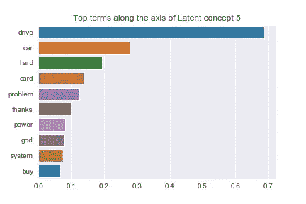

图 12

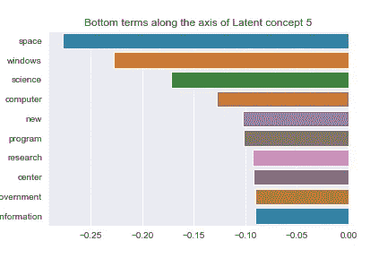

图 13:我们再一次看到技术术语在这些数据中非常突出

在这一点上，由我们来从这些情节中推断出一些意义。概念 5 的轴的负端似乎与技术和科学主题有很强的关联(“空间”、“科学”、“计算机”)，但正端也是如此，尽管更侧重于计算机相关的术语(“硬盘”、“驱动器”、“系统”)。

现在澄清一下，确定正确的组件数量需要调优，所以我没有将参数设置为 20，而是将其改为 100。您可能认为这仍然是一个很大的维数，但是我们最初的维数是 220(这是对我们最小文档频率的限制！)，所以我们减少了相当大的一部分数据。我将在另一篇文章中探讨如何选择奇异值的最佳数量。现在，我们将继续我们所拥有的。

## 在我们的建模任务中使用我们的潜在组件

虽然 LSA 是一种无监督的技术，通常用于在未标记的数据中发现模式，但我们在这里使用它来降低标记数据的维度，然后再将其输入模型。我们将比较 LSA 数据和标准 TF-IDF 数据的准确性，以衡量 LSA 从原始数据集中获取了多少有用信息。我们现在有一个形状的训练数据集(11314，100)。文档的数量保持不变，我们已经创建了 100 个潜在的概念。现在，让我们在这一点上和我们的标准 TF-IDF 数据上运行一个模型。下面的实现的目的不是得到一个好的模型，而是比较两个非常不同的数据集。我通过 GridSearchCV 加入了基本的交叉验证，并对 tolerance 超参数进行了少量的调整。如果你这样做是为了建立一个实际的模型，你会比下面写的走得更远。这只是为了帮助您进行基本的实现:

```
logreg_lsa = LogisticRegression()
logreg     = LogisticRegression()
logreg_param_grid = [{'penalty':['l1', 'l2']},
                 {'tol':[0.0001, 0.0005, 0.001]}]grid_lsa_log = GridSearchCV(estimator=logreg_lsa,
                        param_grid=logreg_param_grid, 
                        scoring='accuracy', cv=5,
                        n_jobs=-1)grid_log = GridSearchCV(estimator=logreg,
                        param_grid=logreg_param_grid, 
                        scoring='accuracy', cv=5,
                        n_jobs=-1)best_lsa_logreg = grid_lsa_log.fit(tfidf_lsa_data, y_train).best_estimator_
best_reg_logreg = grid_log.fit(tfidf_train_df, y_train).best_estimator_print("Accuracy of Logistic Regression on LSA train data is :", best_lsa_logreg.score(tfidf_lsa_data, y_train))
print("Accuracy of Logistic Regression with standard train data is :", best_reg_logreg.score(tfidf_train_df, y_train))
```

它返回:

```
Accuracy of Logistic Regression on LSA train data is : 0.45
Accuracy of Logistic Regression with standard train data is : 0.52
```

性能的下降是显著的，但是您可以将这一点纳入优化流程，并调整潜在组件的数量。这在我们的测试数据(7532 个文档)上表现如何呢？

```
Accuracy of Logistic Regression on LSA test data is : 0.35
Accuracy of Logistic Regression on standard test data is : 0.37
```

两者的精确度都大大下降了，但是请注意模型之间的差距有多小！我们的 LSA 模型能够从我们的测试数据中获取与我们的标准模型一样多的信息，而尺寸却不到一半！由于这是一个多标签分类，最好用混淆矩阵来显示(图 14)。当你考虑给定 20 个新闻类别的随机分类概率时，我们的结果看起来明显更好。如果你不熟悉混淆矩阵，作为一个经验法则，我们想最大化对角线上的数字，最小化其他地方的数字。

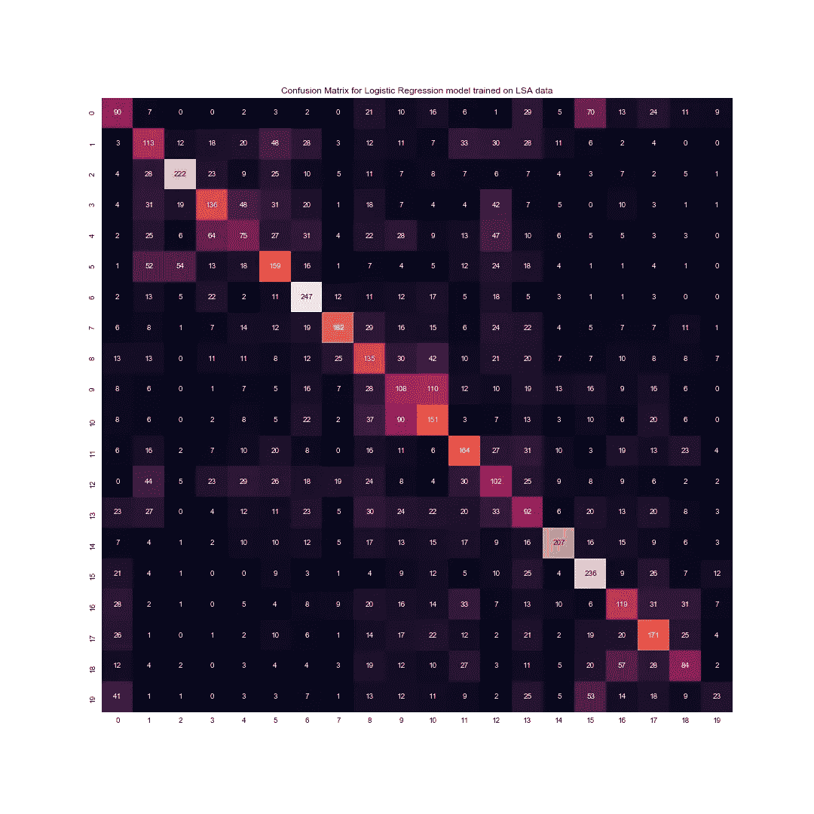

图 14— [我们测试数据的混淆矩阵](https://scikit-learn.org/stable/modules/generated/sklearn.metrics.confusion_matrix.html)(7532 个文档)。y 轴代表实际新闻类别，x 轴代表预测新闻类别。对角线值是所有正确分类的文档。

这就结束了我们在 Scikit-Learn 中对 LSA 的实现。我们已经讨论了这项技术的直觉、数学和编码。

我希望你喜欢这篇文章，并会感谢任何数量的掌声。请在评论中留下任何反馈(积极的或建设性的)，尤其是关于数学部分，因为我发现这是最难表达的。

# 4.参考

([返回目录](http://3ce3))

## 参考资料:

[1] L. Hobson，H. Cole，H. Hapke，[自然语言处理在行动](https://www.manning.com/books/natural-language-processing-in-action) (2019)，[https://www . manning . com/books/Natural-Language-Processing-in-Action](https://www.manning.com/books/natural-language-processing-in-action)

[2] Pedregosa *等著，*[sci kit-learn:Python 中的机器学习](http://jmlr.csail.mit.edu/papers/v12/pedregosa11a.html) (2011)，JMLR 12，第 2825–2830 页。

[3] [哈姆达维](https://towardsdatascience.com/@yassine.hamdaoui?source=post_page-----6c2b61b78558----------------------) Y， [TF(词频)-IDF(逆文档频)从 python 中的无到有](/tf-term-frequency-idf-inverse-document-frequency-from-scratch-in-python-6c2b61b78558) (2019)，走向数据科学

[4]维基贡献者，[奇异值分解](https://en.wikipedia.org/wiki/Singular_value_decomposition)，[https://en.wikipedia.org/wiki/Singular_value_decomposition](https://en.wikipedia.org/wiki/Singular_value_decomposition)