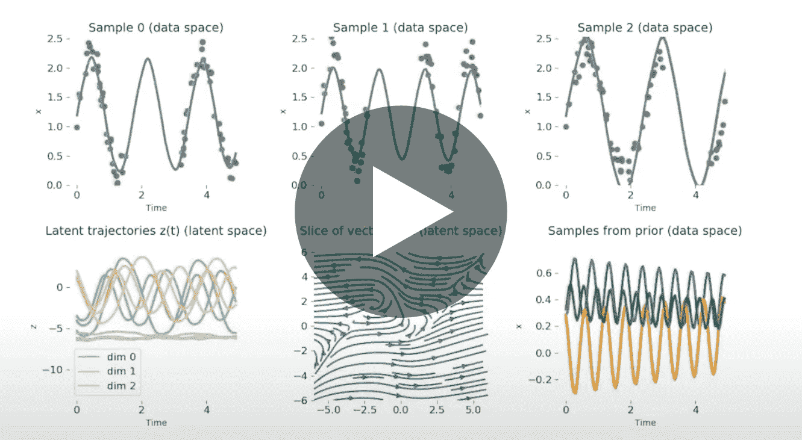

# 潜在随机微分方程

> 原文：<https://towardsdatascience.com/latent-stochastic-differential-equations-a0bac74ada00?source=collection_archive---------30----------------------->

## [活动讲座](https://towardsdatascience.com/event-talks/home)

## 大卫·杜文瑙德| TMLS2019

来自多伦多机器学习峰会的演讲:【https://torontomachinelearning.com/ 

## 关于演讲者:

David Duvenaud 是多伦多大学计算机科学和统计学的助理教授。他是加拿大研究生成模型的主席。他的博士后研究是在哈佛大学完成的，在那里他从事超参数优化、变分推理和化学设计。他在剑桥大学获得博士学位，与邹斌·格拉马尼和卡尔·拉斯姆森一起研究贝叶斯非参数。大卫在谷歌研究院的机器视觉团队呆了两个夏天，还联合创立了能源预测和交易公司 Invenia。David 是 Vector Institute 的创始成员，也是 ElementAI 的研究员。

## 关于演讲:

许多真实世界的数据是不定期采样的，但是大多数时间序列模型需要定期采样的数据。连续时间潜变量模型可以解决这个问题，但直到现在，只有确定性模型，如潜在常微分方程，是有效的反向传播训练。我们将伴随灵敏度方法推广到随机微分方程，构造了一个 SDE，它在时间上向后运行并计算所有必要的梯度，以及一个通用算法，该算法允许随机微分方程通过具有恒定存储成本的反向传播来训练。我们还给出了函数空间中基于梯度的随机变分推理的有效算法，所有算法都使用了自适应黑盒 SDE 解算器。最后，我们将展示对时间序列数据应用潜在随机微分方程的初步结果，并讨论无限深度贝叶斯神经网络的原型。

[潜在随机微分方程](https://youtu.be/EAsXp8NaCR8)