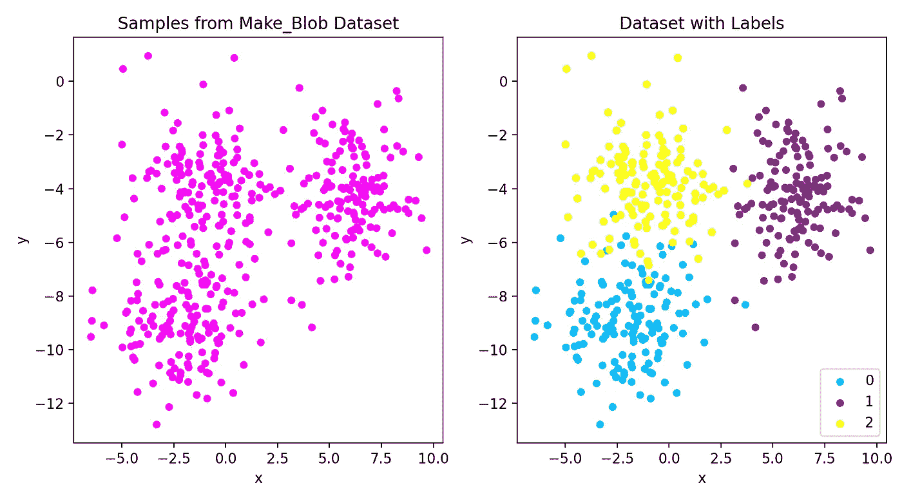
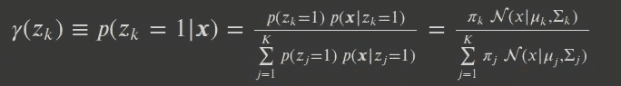
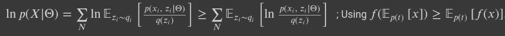

# 潜在变量&期望最大化算法

> 原文：<https://towardsdatascience.com/latent-variables-expectation-maximization-algorithm-fb15c4e0f32c?source=collection_archive---------7----------------------->

## 机器学习的贝叶斯方法

潜伏的‘烟雾’:(图片来源:作者)

“潜伏”一词源于拉丁语，意思是隐藏起来。大概你们都知道潜热，是相变保持温度不变所需的热能。因此，我们观察到一种变化，但其背后的原因显然是隐藏的。潜在变量模型(LVM)的动机是用一些潜在的隐藏变量来解释数据的表层结构。在这篇文章中，我们将通过一个例子来理解 LVMs 和非常著名的处理这类模型的算法，即期望最大化(EM)算法。我个人认为这个主题是贝叶斯机器学习的核心之一，它将涉及大量的数学知识。但是，相信我，会很容易的。此外，了解 EM 算法的核心概念将有助于您真正理解变分自动编码器和最终 GAN 的基础。你可以从这篇文章中学到什么:

1.  为什么是潜变量模型(LVM)？
2.  高斯混合模型(GMM)。
3.  期望值最大化算法。
4.  变分推理和 EM 算法。
5.  用 EM 算法训练 GMM 的例子。

## 潜在变量和 LVM:

为什么是隐藏变量？潜在变量可能是一些理论概念，或者是无法观察到的真实物理变量。我们用几个现实的例子来阐述吧。在文本文档中，提取的“单词”可以被视为特征。通过分解这些特征，我们可以找到文档的“主题”。因此，观察到的特征(“单词”——树枝、根、叶子、花、果实)会分解为潜在特征(“主题”——树、花园)。每当我们有大规模、高维度的噪声特征时，在潜在特征上建立分类器是有意义的。在对象识别任务的情况下，每个数据点(像素强度矩阵)对应于一个对象的图像。在这种情况下，潜在变量可以解释为对象的位置方向。正如克里斯·毕晓普在他的[模式识别书](https://www.amazon.com/Pattern-Recognition-Learning-Information-Statistics/dp/0387310738)中提到的—

> 潜在变量的主要作用是允许观察到的变量上的复杂分布根据从较简单的(通常是指数族)条件分布构建的模型来表示。

通常一个 LVM *p* ，是 2 组变量 *x，z* 的概率分布； *p(x，z)。x* 是数据集 D 中学习时的观察变量，而 *z* 从未观察到。模型的联合概率分布可以写成 *p(x，z) = p(x|z) p(z)* 。

您将会看到，开发 LVMs 的拟合算法相当困难，但是研究这一点并没有什么好处

1.  LVM 通常比原始模型具有更少的参数，这些参数直接表示可见空间中的相关性。
2.  LVMs 中的 LV 主要充当数据的压缩表示，这也称为“瓶颈”。这是无监督学习的基础。如果你想到一个形象(例如。人脸)作为观察变量 *x* 那么，潜在变量 *z* 可以编码人脸的特征(在训练期间看不到)，就像它可以编码人脸是快乐还是悲伤，男性还是女性等等。
3.  LVMs 还可以帮助我们处理缺失数据。前一点和这一点是相关的。如果我们可以对潜在变量进行后验推断，即给定一幅图像 *x* 潜在因子 *z* 是什么，那么一旦我们发现某些图像有缺失部分，潜在因子就可以用于重建。

为了讨论和发展一个现实的 LVM，我们将根据*离散的*潜变量来公式化高斯混合模型(GMM)。由于获取 LVMs 中最大似然估计量的最通用技术是 EM 算法，我们将在接下来的章节中详细讨论。

## 概率聚类和 GMM；

在我之前的 [DBSCAN 算法文章](/dbscan-algorithm-complete-guide-and-application-with-python-scikit-learn-d690cbae4c5d)中，我已经讨论了 K-Means 算法的缺点，特别是在处理不同密度、大小和数据点的空间聚类时，包括噪声和异常值。K-Means 的另一个问题是它执行硬聚类。让我们看一个使用简单的`[make_blobs](https://scikit-learn.org/stable/modules/generated/sklearn.datasets.make_blobs.html)`数据集的例子。在下面的图 1 中，我们看到了包含 3 个带标签和不带标签的聚类的数据集。一旦我们应用 K-Means 算法，它将识别 3 个聚类，但是不可能将任何概率分配给聚类边界处的数据点。如果我们想知道每个数据点属于这三个聚类的概率或可能性(对于聚类边界上的点尤其重要)，该怎么办？

图 1:创建 Blobs 数据集(左)和包含标签的相同数据集(右)。来源:作者

在图 2 中，我们展示了一个将高斯混合模型(GMM)聚类应用于数据集的示例，每个数据点的大小与 GMM 预测的确定性成比例。这与 K-Means 结果进行比较，您可以清楚地看到差异，尤其是对于边界处的点。

图 2:使用 GMM 的软聚类(右)的比较通过给每个数据点分配预测的确定性来描述。这与硬聚类-K-Means(左)相比较。来源:作者

将这种软聚类作为一种动机，让我们使用潜在变量建立 GMM，但在此之前，让我们回忆一下多元正态分布。这里使用的符号很常见。

实验一:多元正态分布。

我们将使用混合正态分布来开发一个概率聚类(软聚类)模型。认为 GMM 是高斯分量的线性叠加的天真想法。每个分量将具有与其相关联的某种概率来表示特定的数据点。

实验 2:高斯分布的混合。

π在 Exp 中称为混合系数。2.对于单个数据点，总和超过聚类数 *K* 。变量 *x* 和 *z* (潜伏)的联合概率分布为: *p(x，z)* = *p(x|z) p(z)* 。因此数据点 *x* 上的边际分布将由下式给出: *p(x) = ∑ p(x|z) p(z) dz* (通过对变量 z 求和/积分获得)。考虑这个 *p(x)* 的一种方式是混合分布 *p(x|z)* ，用 *p(z)* 加权。对于 GMM 上下文，我们可以把 *z* 看作是一个二进制随机变量，具有 1 的 *K* 表示(你可以把这看作是分类表示)，其中一个特定元素等于 1，其他所有元素都是 0。

实验 3:潜在变量的边际分布。

现在，混合系数和潜在变量 *z* ，当我们考虑 z 上的边际分布是按照上面表达式中定义的混合系数来指定时，都落入一个位置。混合系数所满足的条件是必要的，以便它们可以有效地解释为概率。我们认为第 k 个混合系数(π_k)是 z_k 等于 1 的先验概率。由于潜在变量使用 1/K 的表示法(把这看作是分类表示法)，我们可以用另一种方式写出 p(z)和相应的条件分布如下—

实验 4:边际和条件分布

因此，结合多元正态分布和潜在变量分布，我们可以重写 GMM 模型如下。

实验 5:混合系数和多元正态分布的 GMM。

上述表达式对单个数据点有效。对于几个数据点，我们将有*一个对应的潜在变量与每个观察到的数据点相关联。我们现在可以处理联合分布 p(x，z)，而不是只处理边际分布。我们让事情变得更复杂了吗？为了回答这个问题，我们必须在可能性估计的数学中稍微深入一点。下一节将揭示潜在变量将如何帮助我们解决最大似然估计(MLE)容易。*

## 期望值最大化算法(动机):

我们对 GMM 的主要刺激是进行数据点的软聚类。获得每个聚类的最佳参数(混合系数、聚类均值、协变矩阵)的一般直觉是执行通常的 MLE 任务。在上面的表达式 4 中，我们已经为单个数据点写了 GMM 模型。让我们考虑一个具有 N 个点的数据集，这样该观察集将是{x1，x2，x3，…，xN}。对于 N 个数据点，似然函数如下—

实验 6:对数似然函数包括所有 N 个数据点。

这个表达式的最大问题是对数并不直接作用于高斯，而是作用于高斯混合的和。因此，相对于对数对指数的作用，我们没有优势。所以确实这个表情很难还原。意识到这不是单个高斯函数的问题。除了前面的问题，另一个可能出现的问题是当 GMM 的一个组成部分只解释了一个点。这意味着其中一个μ等于数据点 x_n，在方差趋于 0 的极限内，似然项的行为类似于δ函数。所以最大化可能性在这个问题中不是一个好主意。与单个高斯分布问题相比，考虑高斯混合问题的另一种方式是，虽然单个高斯模型属于具有凹对数似然(对于足够简单的族来说是易处理的)的[指数族，但是分量的混合不会具有这种性质。因此，所有这些原因都需要一种新的方法来确定参数，并且是时候深入研究期望值最大化(EM)算法了，该算法确实是基于贝叶斯更新规则的。](http://www.stat.cmu.edu/~siva/705/lec13.pdf)

## EM 算法:

在学习 EM 算法之前，我们需要先推导一些重要的表达式。首先，我们将利用贝叶斯定理从条件分布 *p(x|z)* 中得到给定 *x* 的 *z* 的后验分布表达式，如下所示

实验 7:潜在变量的后验分布

*γ* 项被称为责任，它代表潜在变量 *z* 的第 k 个分量为解释观察值 *x* 所承担的责任。顾名思义，EM 算法依赖于两个简单的步骤:期望(E 步)和最大化(M 步)

a)。E-step:期望步骤是我们计算后验分布的地方，即基于当前参数的责任(exp: 5)。这更多的是解决推断问题，即哪个高斯负责哪个数据点？

b)。M-Step:从 E-step 获得的概率然后用于计算更新的参数(μ、σ和π)。

在几次迭代之后，该过程将收敛，并且我们获得参数的最佳拟合值。让我们更一般地回顾一下 EM 算法的步骤——

实验 8:EM 算法的一般步骤

在这里，重要的是要提到，一旦我们知道了集群分配，就可以获得最佳参数(这是我们在 E-step 上尝试的一部分)。还要意识到，由于从 E-step 中获得了后验概率，我们可以使用期望的定义，然后我们需要最大化完整数据可能性的**期望**而不是数据可能性。我们如何进入这种期望的表达，在接下来的部分将会更加清楚，但是现在记住在*责任*(在实验中定义)方面。7) [我们可以计算出](http://cs229.stanford.edu/notes/cs229-notes8.pdf) [1]参数(μ，σ，π)，表达式如下—

实验 8:从 MLE 获得的参数。

## 变分下界和 EM 算法；

这是刚才提到的，直到收敛重复 EM 算法的步骤。你可能会想怎么保证算法收敛？我们来深入挖掘一下！我们从 GMM 开始说，对于每个数据点 *x_n* 都有一个潜在变量 *z_n* 。完整数据集的对数似然采用如下形式—

实验 9:包含潜在变量的完全可能性

如前所述，这个表达式的问题是对数是作用于高斯混合的和。我们将耍些小花招来解决这个问题。让我们在潜在变量上引入任意概率分布(没有任何特殊性质)— *q(z)* 现在我们可以修改上面的表达式——

实验 10:数据似然性的微小变化

使用期望值的定义，这个表达式可以进一步简化为—

实验 11:使用期望的定义

期望项可以理解为从分布 *q_i* 中提取的 *z_i* 的期望值。我们可以将这个表达式与 Exp 进行比较。为了理解对潜在变量求和是如何给出期望值的。在 Exp 中。11、日志正在对期望值进行操作。鉴于 **Log 是一个凹函数，**让我们应用 [**詹森不等式**](https://en.wikipedia.org/wiki/Jensen%27s_inequality) 来进一步简化表达式——

实验 12:用詹森不等式修改实验 11。

上面的表达式表示完整数据集的对数似然大于或等于上面的期望值。期望项被称为**证据下限(ELBO)** ，通过对数展开和应用贝叶斯定理，我们可以得出更有意义的结论

实验 13:证据下限

使用 [KL 散度](https://en.wikipedia.org/wiki/Kullback%E2%80%93Leibler_divergence)的定义，上述表达式变成—

实验 14: ELBO 和 KL 背离

当 KL 散度≥ 0 时，这意味着 ELBO ≤ *log p(x)* 。现在我们知道它为什么被称为下界了。我们的目标是最大化我们的数据可能性 *log p(X)* ，相反，我们最大化 ELBO。基于这个表达式(Exp。14)让我们再回顾一遍 EM 算法的步骤—

1.  通过随机初始化参数来启动算法。
2.  e 步骤:最大化 ELBO w.r.t *q(z)* 并保持参数 *(π，μ，σ)*不变。由于 *log p(X)* 独立于*q(z)*这个步骤本质上只是计算 KL 散度，并且在 GMM 的情况下 *q(z)* 被设置为等于后验概率。这是可能的，因为*在 GMM* 中可以计算每个数据点的后验概率。
3.  m 步:ELBO 相对于参数最大化，而 *q(z)* 保持固定，这与 MLE 估计非常相似。在这个步骤中，参数被更新。

**为什么趋同:**

我们以一个问题开始这一节——为什么 EM 算法能保证收敛？EM 算法是一个迭代过程，因此 E 和 M 步骤循环进行。重要的是要记住，在 EM 算法的每一步中，首先将分布 *q(z)* 设置为等于后验 *p(z|x)* (E 步)，并且从最大化开始在 M 步中更新参数。随着更新的参数，下限增加(除非算法已经达到局部最大值)。这又增加了对数似然性，但是 log *p(x)* 比下限增加得更多，因为虽然 *q(z)* 是针对旧参数获得的，但是现在在 E 步骤中，当我们再次计算后验 *p(z|x)* 时，并且这次使用来自 M 步骤的新参数，产生非零 KL 发散项。因此，下限以及数据似然性*单调增加*。为了确保算法不会陷入局部最大值，我们对不同的参数初始值运行算法。数据似然性的这种单调递增的性质正是我们想要展示的收敛的代理。如果我们看到可能性在每一步都没有增加，这有时对调试代码非常有帮助。为了运行该算法，我们将给出迭代次数作为参数，并且还为损失函数的分数增加设置容差。现在，是时候将所有的理论付诸实践了，让我们来编码吧！！请查看笔记本，了解详细的代码以及参考资料部分的其他参考资料。

## 用 Python 实现 EM 算法；

让我们从定义 E-step 开始。这里，我们的主要目标是定义后验分布，在我们把它定义为 Exp 中的责任之前。7.下面是代码块—

EM 算法的 e 步(适用于 GMM)

接下来，我们实施 M 步，这是关于最大化的期望，对于 GMM，我们已经知道最好的参数，一旦我们从 E 步得到后验。最大似然估计的参数在实验中给出。8，我们将使用它们来定义 M-step，如下所示—

GMM 的 M-step

Exp。15: ELBO 的可能性和后验概率

一旦我们定义了 E 和 M 步骤，现在我们将实现证据下限作为损失函数。我们从 Exp 修改下界表达式。12 至如实验所示。15.对于潜在变量的分布 *q(z)，*我们将使用从 E-step 计算出来的后验。考虑到这些，让我们将 ELBO 定义如下—

现在，我们已经准备好定义训练循环，我们设置迭代次数和容差，并确保算法以随机初始化的参数启动几次，以免陷入局部最大值。在训练期间，我们需要指定集群的数量，对于复杂的问题，这可能是一个问题。由于 EM 算法很耗时，通常建议运行 K-Means 算法来确定聚类数，然后对 GMM 运行 EM。另外，确定这一点的另一种方式是使用 [Akaike 信息标准](https://en.wikipedia.org/wiki/Akaike_information_criterion)。在我的博士研究中，我确实用 AIC 来分离天体物理模型，但这与我们目前的目的不同。训练循环的代码如下—

最后，在训练之后，我们可以画出轮廓—

图:左:2D 数据集，聚类成 3 个高斯混合(右)。来源:作者

## 使用 Scikit-Learn:

使用 sklearn 的 [GaussianMixture](https://scikit-learn.org/stable/modules/generated/sklearn.mixture.GaussianMixture.html) 类，用 3 行代码就可以实现 GMM EM 算法的所有这些理解和相应的长代码。但是当你知道基本知识的时候，生活总是更好！下面是代码块—

使用 scikit-learn 实现 GMM 很容易！

## 结论:

我们已经完成了这项工作，在这个过程中，我们学习了贝叶斯方法在无监督学习中的几个重要概念。在许多重要的概念中，我希望你们至少能回忆起最重要的一些——

1.  通过 EM 算法的迭代步骤更新基于先验知识的概率分布。这是贝叶斯推断的基础——一旦我们更新了数据(证据)，我们的信念会如何改变。
2.  为什么引入潜在变量有助于我们更好地理解数据，并最终帮助计算最大似然？
3.  KL 散度和 ELBO 通过数据的可能性的关系。这一点你会在生成模型的概念中反复遇到(GMM 是生成模型的一个简单例子)。
4.  对于 GMM，单个数据点的后验概率可以通过分析计算得出，但在复杂模型中可能不是这种情况(大多数情况下后验概率是难以处理的)，因此，它不能作为潜在变量分布的代理( *q(z) = p(z|x)* )。在这种情况下，我们试图从尽可能接近后验分布的分布族 *Q* 中选择 *q* 。这是变分贝叶斯和最终变分自动编码器(VAE)和生成对抗网络(GAN)的基础。

感谢阅读，希望这能对你有所帮助。干杯！！！

页（page 的缩写）s:我在另一篇文章中讨论了贝叶斯机器学习中的另一个重要概念，称为[共轭先验](/understanding-conjugate-priors-21b2824cddae)。

## *参考文献:*

[1] [EM 算法:](http://cs229.stanford.edu/notes/cs229-notes8.pdf) Andrew NG 笔记来自斯坦福知识库。

[2] [变分推论:](https://arxiv.org/pdf/1601.00670.pdf)大卫·布雷的评论。

[3]克里斯·毕晓普的[模式识别](https://www.amazon.com/Pattern-Recognition-Learning-Information-Statistics/dp/0387310738)书:第 9 章。

[4]笔记本链接: [GitHub](https://github.com/suvoooo/Machine_Learning/blob/master/ExMax_ALgo/LVM.ipynb) 。