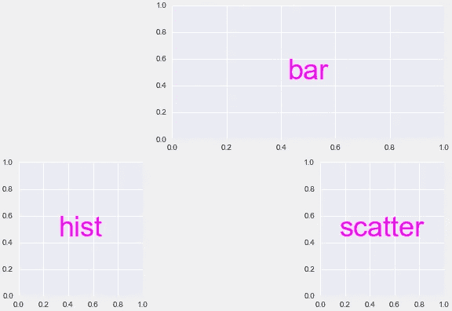
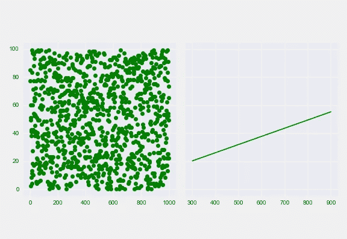
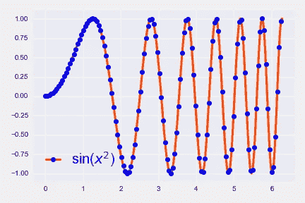
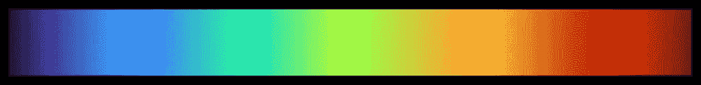
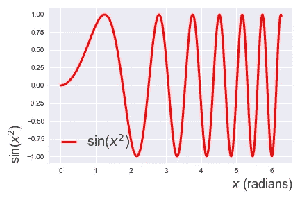
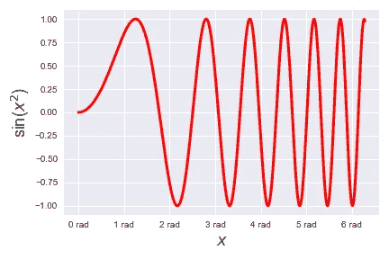
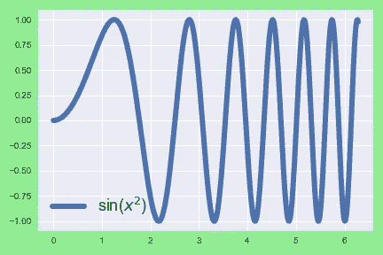
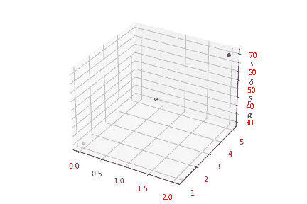
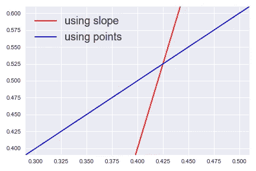

# Matplotlib 的最新酷功能

> 原文：<https://towardsdatascience.com/latest-cool-features-of-matplotlib-c7a1e2c060c1?source=collection_archive---------24----------------------->


照片由 [Paola Galimberti](https://unsplash.com/@paolaccia?utm_source=medium&utm_medium=referral) 在 [Unsplash](https://unsplash.com?utm_source=medium&utm_medium=referral) 上拍摄

## 立即将您的 Matplotlib 升级至最新版本 3.3

日前，Matplotlib 发布了 3.3 版本— **其家族第三代**中最新的。它引入了一些非常令人兴奋的特性，我强烈建议您今天就升级 Matplotlib。这篇文章将通过一些例子来引导你。

我使用以下命令在我的虚拟环境中更新到最新版本。对于新的安装，请参考[官方](https://matplotlib.org/3.3.0/users/installing.html#installation-guide)安装指南。

```
pip install matplotlib --upgrade
```

下面我们来看看 Matplotlib 3.3 的**最新** **亮点功能。**

# 1)生成复杂子情节网格的语义方式

通过`subplot_mosaic()`介绍了一种不太冗长的方式来生成支线剧情，这种方式允许你以一种 ***语义方式*** 可视化地布局你的坐标轴。早先，你不得不使用相对更冗长的方法`subplots()`或`GridSpec`。此外，您可以随意命名您的轴。

例如，要生成如下所示的网格，现在可以以列表的形式传递布局。缺失的支线剧情被标示为`'.'`。要将一个支线剧情跨越两列，重复名字，就像我对`'bar'`做的那样。若要跨行(垂直)，请在第二个列表中垂直下方使用相同的名称。名字`'bar'`、`'hist'`和`'scatter'`也可以用来控制/修改相应支线剧情的属性。

这个功能挺酷很宽泛的，关于这个 ***复杂语义图构图*** [这里](https://matplotlib.org/3.3.0/tutorials/provisional/mosaic.html#sphx-glr-tutorials-provisional-mosaic-py)你要详细阅读。[这个](https://matplotlib.org/3.3.0/tutorials/provisional/mosaic.html#sphx-glr-tutorials-provisional-mosaic-py)超链接还向您展示了其他简写的 ASCII 符号，以重新创建下图。

```
axes = plt.figure(constrained_layout=True).subplot_mosaic(
                [['.', 'bar', 'bar'], # Note repitition of 'bar'
                 ['hist', '.', 'scatter']])for k, ax in axes.items():
    ax.text(0.5, 0.5, k, ha='center', va='center', 
            fontsize=36, color='magenta')
```



使用 subplot_mosaic()生成的支线剧情。请注意跨越两列的扩展“条”。

## 创建后共享 x 轴和 y 轴

你现在也可以在不同的支线剧情中共享轴线，就像这里举例的。

# 2)设置轴框的纵横比

轴框 的 ***纵横比是轴的高度除以其物理单位的宽度。所以如果你需要一个正方形的盒子，盒子的长宽比为 1。现在，您可以通过如下所示的`set_box_aspect()`方法直接设置该比率。此处提供了该功能的几个使用案例[。在下面的代码中，注释掉最后两行，以查看轴框纵横比的变化。](https://matplotlib.org/3.3.0/gallery/subplots_axes_and_figures/axes_box_aspect.html)***

```
fig, (ax1, ax2) = plt.subplots(ncols=2, sharey=True)ax1.plot(np.random.randint(0, 100, 1000), 'go')
ax2.plot([300, 900], [20, 55], 'g')ax1.set_box_aspect(1)
ax2.set_box_aspect(1)
```



盒子长宽比为 1 的支线剧情。

# 3)图例中的彩色标签

使用关键字参数`labelcolor`调用图例时，可以指定图例文本标签的**颜色。默认情况下，它总是黑色的。**

**参见下面的示例，我将标签的颜色设置为标记面的颜色:**

```
fig = plt.figure()x = np.linspace(0, 2*np.pi, 500)plt.plot(x, np.sin(x**2), '-o', c='orangered', mfc='b',
         lw=3, markevery=4, label=r'sin($x^2$)')plt.legend(fontsize=20, labelcolor='markerfacecolor',
           handlelength=1)
```

****

**使用参数“labelcolor”将图例设置为标记颜色的图形。**

**Matplotlib 3.3 现在还提供了 Google AI 团队的 **turbo colormap。****

****

**Matplotlib 3.3 中的 Turbo 颜色映射。**

# **4)记号和标签**

## **轴和颜色条标签的新对齐方式**

**现在，您可以在三个位置对齐 *x* 和 *y* 轴标签。*x*-标签可以对准 *x* 轴的左侧、中间或右侧。类似地， *y* 标签可以在 *y* 轴的顶部、中心或底部对齐。这可以使用参数`loc`来完成。下面的例子说明了这一点:**

```
plt.xlabel(r"$x$ (radians)", loc='right', fontsize=18)
plt.ylabel(r"sin($x^2$)", loc='bottom', fontsize=18)
```

****

**一种图形，其各自的轴的右边标有 x，底部标有 y。**

## **使用字符串和 lambda 函数设置刻度格式化程序**

**现在，在轴上设置刻度格式要简单得多。例如，您现在可以直接使用*字符串*或*函数*作为字符串格式化程序的输入。下面的代码片段比较了使用字符串格式化的最新方式和旧方式。你可以清楚地看到最新的方法是多么简单。参见[这个](https://matplotlib.org/3.3.0/users/whats_new.html#allow-tick-formatters-to-be-set-with-str-or-function-inputs)例子，了解 lambda 函数的类似用法。**

```
import matplotlib.ticker as mticker# Plot the sinusoidal function# In latest version 3.3 
ax.xaxis.set_major_formatter('{x:.0f} rad')# Before version 3.3
ax.xaxis.set_major_formatter(mticker.StrMethodFormatter('{x:.0f} 
                             rad'))
```

****

**x 轴上新字符串格式的演示。**

# **5) rcParams 可以作为 Decorators 传递**

**这是一个**真** **酷** **特色**。现在你可以用定制的**装饰器**包装你的函数来控制你的绘图的参数。在下面的例子中，我用自定义的`rcParams`设置来装饰函数以绘制正弦曲线。**

```
from matplotlib import rc_context@rc_context({"lines.linewidth": 6, 
             'figure.facecolor': 'lightgreen',
             'legend.fontsize': 18})
def plot_sin(x):
    fig, ax = plt.subplots(figsize=(6, 4))
    ax.plot(x, np.sin(x**2), label=r'sin($x^2$)')
    ax.legend()
    returnplot_sin(x)
```

****

**使用 rcParams 设置作为装饰器生成的图。**

# **6) 3D 绘图现在支持次要刻度**

**到目前为止，还没有直接的方法在 3D 轴上启用次要刻度。现在你可以简单地使用关键字`minor=True`打开它们。改编[官方](https://matplotlib.org/3.3.0/users/whats_new.html#d-axes-now-support-minor-ticks)示例，我在下面展示应用于 *z* 轴的该功能。**

```
from mpl_toolkits.mplot3d import Axes3Dfig = plt.figure()
ax = fig.add_subplot(projection='3d')ax.scatter([0, 1, 2], [1, 3, 5], [30, 50, 70])ax.set_zticks([35, 45, 55, 65], minor=True)
ax.set_zticklabels([r'$\alpha$', r'$\beta$', r'$\delta$',
                    r'$\gamma$'], minor=True)ax.tick_params(which='major', color='r', labelcolor='r', width=5)
ax.tick_params(which='minor', color='b', labelcolor='b', width=3)
```

****

**z 轴上带有次要刻度的 3D 绘图。**

# **7)保存图形时指定后端**

**现在，您不需要在 Jupyter 笔记本的开头明确指定后端。您可以简单地将所需的后端作为参数 ***传递，同时使用*后端*关键字保存图形*** 。例如，如果您想用 pgf 后端保存 pdf 图形，您可以执行以下操作**

```
plt.savefig('/Users/Henry/Downloads/sinusoidal.pdf', backend="pgf")
```

**你可以在 matplotlib [这里](https://matplotlib.org/3.3.0/tutorials/introductory/usage.html#backends)阅读更多关于后端的内容。**

# **8)通过两点的无限长直线**

**现在你可以使用新引入的`axline`方法直接画出通过两点的无限长的线。有两种选择:要么明确指定两点并让系统计算斜率，要么指定一点和直线的斜率。以下示例显示了这两个选项的用法。**

****记住:**关键字`slope`应该**只能用于线性秤。**对于**所有的非线性刻度**，你必须明确的通过两点**。****

```
**fig, ax = plt.subplots(figsize=(6, 4))ax.axline((.4, .4), slope=5, color='r', label='using slope')
ax.axline((.3, .4), (.5, .6), color='b', label='using points')ax.legend(fontsize=18, frameon=False)**
```

********

****在 Matplotlib 3.3 中使用 axline()方法绘制无限长的线****

****尽管最新版本 3.3 中引入了其他几个有趣的特性，但我会保持这篇文章的简短，并建议您参考阅读官方页面[此处](https://matplotlib.org/3.3.0/users/whats_new.html#what-s-new)了解引入的变化的完整列表。****

****如果你有兴趣了解之前的 Matplotlib 版本 3.0、3.1 和 3.3 中的新功能，请阅读我之前的帖子[Matplotlib 3 的新功能](/whats-new-in-matplotlib-3-1b3b03f18ddc)。****