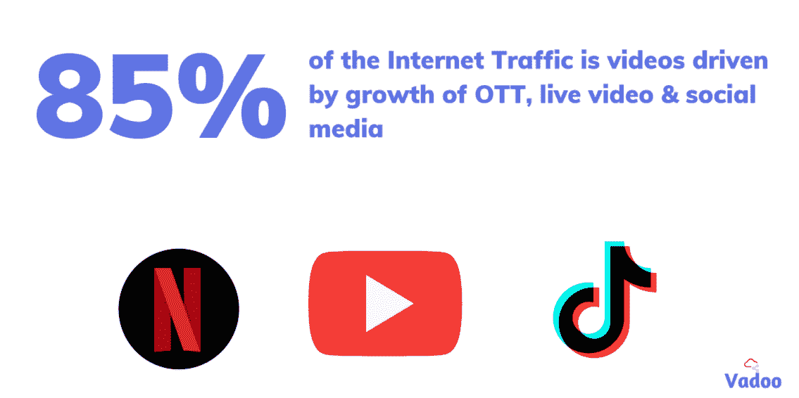
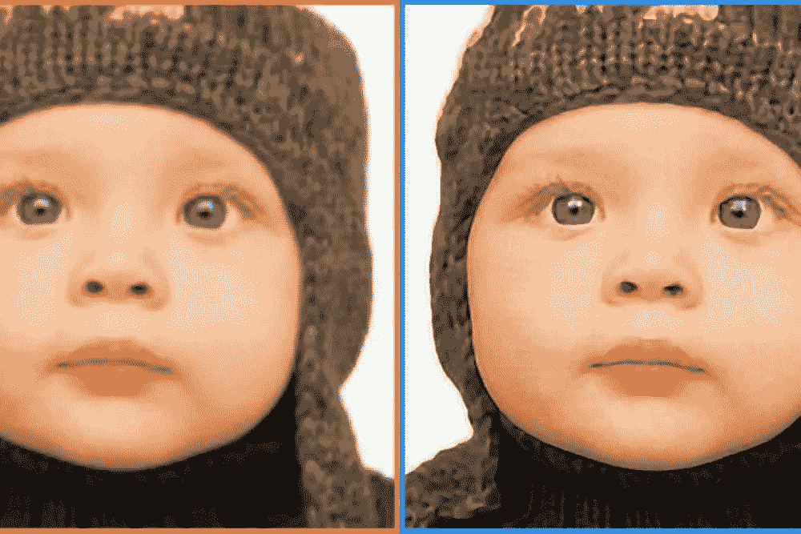
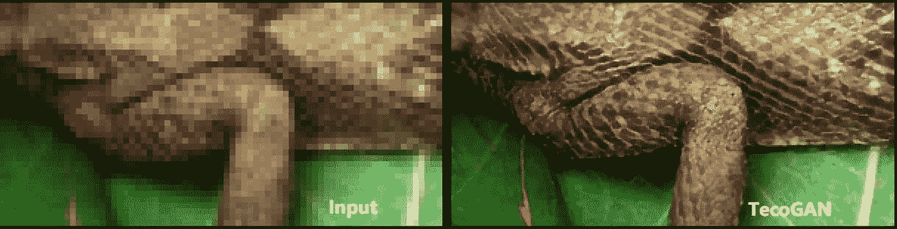
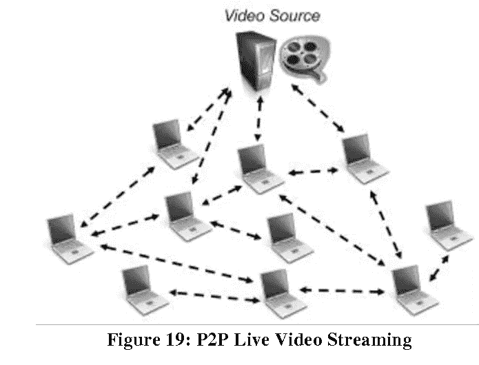
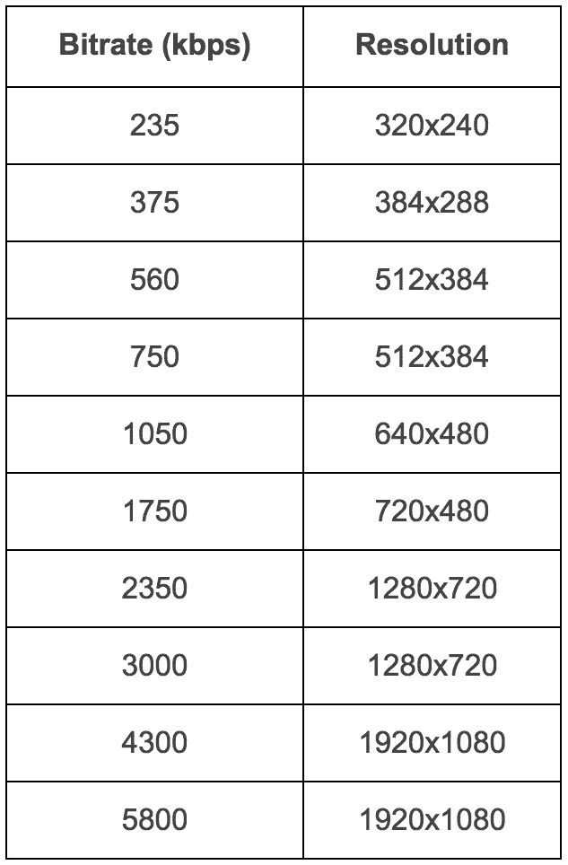

# 人工智能视频流的最新技术进步

> 原文：<https://towardsdatascience.com/latest-technological-advancements-in-video-streaming-with-ai-293d3b8b2a7e?source=collection_archive---------29----------------------->

## 回顾网飞等视频流媒体公司使用的最新技术。

照片由[耶稣爱奥斯汀](https://unsplash.com/@jesuslovesaustin)从 [Unsplash](https://unsplash.com/photos/0O0gux4OZX4)

互联网上 85%的数据是通过视频消费的。大约 2.8 艾字节的数据通过流媒体视频在互联网上传输。这种增长是由网飞等视频点播平台、Zoom 等视频通信平台、Tiktok、电子竞技、直播等社交平台的出现推动的。

*图片作者来自* [Vadoo](https://www.peervadoo.com/)

Covid19 疫情加速了视频消费，并一直是公司从离线模式转向在线直播模式的驱动力。随着日常视频消费的爆炸式增长，我们需要为即将到来的需求做好准备。

在本文中，我们将讨论视频流技术的最新进展，以及它们如何帮助改善流体验。

# 超分辨率

人工智能已经颠覆了各种行业，视频流也不例外。AI 模型可以通过从大量图像中学习，学习如何从低分辨率图像生成高分辨率图像。这种从低分辨率图像生成高分辨率图像的方法称为超分辨率

来自 [Kaggle](https://www.kaggle.com/ll01dm/set-5-14-super-resolution-dataset) 的[创作者](https://www.kaggle.com/ll01dm)的图片

超分辨率属于生成算法领域，该算法能够生成以前没有的信息。从上图中可以看出，网络可以从左侧获取图像，并想象更精细的细节来重新创建右侧的图像。这是可能的，因为人工智能模型已经在大量图像数据上接受了训练，现在它知道如何在提供新图像时放大图像。

同样的概念可以扩展到稍加修改的视频。在视频的情况下，过去的多个生成的高分辨率帧和当前的低分辨率帧一起用于生成当前的高分辨率帧，但是概念是相同的。这项技术提供了以 480p 发送视频，但在客户端设备上以 1080p 观看的能力。

图片来自[论文](https://arxiv.org/abs/1811.09393)作者[作者](https://arxiv.org/abs/1811.09393)

由于深度学习的最新进展和客户端设备巨大计算能力的可用性，这项技术是可能的。最近的一篇论文 **TecoGAN** 产生了高分辨率的结果，与现实世界的图像惊人地相似，如上图所示。使用这项技术可以节省高达 30%的带宽消耗，从而改善整体用户体验。

# [P2P 流媒体](https://www.peervadoo.com/)

视频流遵循客户端-服务器模型。内容从称为 CDN 的边缘位置传送，CDN 缓存来自服务器的内容。客户端设备，即手机/笔记本电脑/电视，从这些 CDN 获取内容，开始播放您的视频。通过 CDN 的视频流有一些限制，如下所述

1.  使用 CDN 的视频流是昂贵的
2.  收视率高峰导致高缓冲
3.  由于 CDN 覆盖不佳，向远程位置交付内容

由于这些原因，视频流公司很难有效地扩展其服务并提供良好的用户体验。所有这些问题都可以通过使用 P2P 流媒体扩展 CDN(即混合 CDN)来解决

图片作者来自[论文](https://www.semanticscholar.org/paper/A-Review-on-P2P-Video-Streaming-Thampi)

在传统 CDN 上添加[对等](https://www.peervadoo.com/)层，通过分发来自相邻对等体的内容来减少主 CDN 的负载，这些对等体本身就像一个 CDN，从而使边缘更接近用户。由于 CDN 上的负载减少，费用现在将减少 40%,同时用户体验也由于较低的重新缓冲而得到改善，因为内容是从附近的对等点而不是远处的 CDN 获取的。关于这项技术如何工作的更多信息可以在[这里](https://blog.peervadoo.com/what-is-vadoo.html)找到。

使用 [Vadoo](https://vadoo.tv) 缩放您的视频流

# [多 CDN](https://api.peervadoo.com/multi_cdn)

我们已经看到，内容通过 CDN 传送到客户端设备，CDN 缓存来自服务器的内容。CDN 由位于多个位置的数据中心组成，提供内容服务。这些位置被称为接入点(POP)。理想情况下，我们希望有尽可能多的 POP。但并不是所有的 CDN 在全球范围内都有同等的影响力。例如，一些最受欢迎的 CDN 在中国甚至没有一个 POP。

另外，每个 CDN 的性能都是随时间变化的，不一致。根据墨菲定律，CDN 可能会在任何时间点发生故障。为了应对所有这些风险，理想的选择是同时接入多个 CDN。这可以通过联系多个 CDN 并单独与它们中的每一个达成交易来实现，也可以通过联系为您管理所有这一切的[多 CDN 提供商](https://api.peervadoo.com/multi_cdn)来实现。

使用多 CDN 为您的视频流服务提供支持，为您提供有助于改善整体用户体验的优势。

1.  通过切换到工作的 CDN 来防止服务突然停止
2.  使用实时用户监控(RUM)指标从当时性能最高的 CDN 获取内容，以提高服务质量(QOS)
3.  中游交换有助于降低 CDN 成本

# CMAF

直播体育比赛会比电视广播延迟 25-30 秒，从而影响用户体验。这是由于视频流技术的设计方式。流式传输视频的最主要方式是基于 HTTP 的流式传输，其中视频内容通过以下步骤传送

1.  视频使用编解码器(如 h264)进行编码，以减小视频文件的大小
2.  然后，视频被转换成可流式传输的格式，如 HLS 或 MPEG-DASH
3.  来自服务器的内容现在通过 CDN 分发
4.  视频播放器在开始播放之前会缓冲一些视频片段

HLS 或 MPEG-DASH 允许分段发送视频，由视频播放器顺序下载。一个片段通常包含大约 10 秒钟的视频。编码器必须等待对视频的整个片段进行编码，然后才能将其用于 CDN。CDN 必须等待接收完整的视频片段，然后才能将其传递给视频播放器。视频播放器必须在开始播放之前缓冲至少几段视频，以保持用户体验。

整个过程会导致 25-30 秒的延迟。此外，由于存在多种格式，即 MPEG-DASH 的 ts fr HLS 和. mp4，因此需要双倍的存储、双倍的编码和双倍的 CDN。CMAF 试图解决上述两个问题。

CMAF 提供了 HLS 和 MPEG-DASH 都支持的一致格式的片段 mp4(fmp4)。它还具有进行分块传输编码的能力。这意味着，编码器在传输之前不会等待整个视频片段。该段被进一步分成更小的块，并且这些块在被编码时被发送，该编码由 CDN 以不特定的顺序传递给编码器。视频播放器负责组织数据块并播放视频片段。

因此，CMAF 有助于减少编码和存储成本，以及减少使用分块传输编码的延迟。

# 按标题编码

视频编码是使用 H.264 等编解码器压缩视频的过程，这些编解码器利用连续帧中存在的公共信息，因此只在帧中存储新添加的信息。为了应对各种网络条件和多变的互联网连接，视频内容以多种分辨率进行编码，并进行智能切换。这种技术被称为自适应比特率(ABR)。

图片来自[网站](https://video.stackexchange.com/questions/24725/grime-like-blocking-compression-artifacts-on-the-decompressed-video-h-264)

下图描述了多种分辨率和相应的比特率分配。这里要注意的关键因素是，相同分辨率的内容可以以多种比特率编码，即 1920 x 1080 的视频可以以 5800 mbps 或 6800 mbps 甚至 4800 mbps 的速率编码。这是因为视频压缩是有损压缩，因此选择的比特率越小，压缩视频中可用的信息就越少。这可以在编码伪像中观察到，类似于您在流媒体平台上观看视频时观察到的上图。

图片来自网飞[博客](https://netflixtechblog.com/per-title-encode-optimization-7e99442b62a2)的作者

既然我们知道可以使用不同的比特率对特定分辨率的视频进行编码，那么在现实世界中，可以选择理想的通用比特率，以便在不消耗大量带宽的情况下减少伪像。上图显示了为所有视频选择的通用带宽模式。但是这种一刀切的方法有一个问题。诸如高辛烷值动作电影的一些视频可能具有丰富的信息，因此可能需要更高的比特率来编码，而简单的卡通视频甚至可以用更低的比特率来执行。

因此，网飞建议以多种比特率对特定的视频分辨率进行编码，然后选择最佳比特率来呈现没有伪像的视频。这是使用称为 VMAF 的度量来完成的，VMAF 是识别渲染视频质量的视觉分数。在此帮助下，可以为每个视频设计定制的比特率阶梯。因此，如果我们正在流式传输卡通视频，它可以以较低的比特率发布，同时仍然具有类似的质量，而动作电影可以以较高的比特率发布，没有任何伪像，从而改善用户体验。

# 摘要

总而言之，我们已经看到了多种有助于扩展、改善用户体验和减少视频流延迟的技术。5G 和虚拟现实(VR)和增强现实(AR)世界的到来以及电子竞技的兴起将使视频带宽消耗飙升。因此，是时候采用最新技术来跟上并服务于这种增长了。