# 面向数据科学家的乳胶，不到 6 分钟

> 原文：<https://towardsdatascience.com/latex-for-data-scientists-in-under-6-minutes-3815d973c05c?source=collection_archive---------25----------------------->


背景图片:[不飞溅](https://unsplash.com/photos/KgLtFCgfC28)

## 任何数据科学简历的必备技能

作为一名数据科学家，你与数据打交道。数据本质上是数学的——你必须能够清楚地表达这些想法。即使您没有开发算法，表达常见数据科学技术的能力——可能是多项式回归或 box-cox 变换的结果——也是必不可少的。

也就是说，LaTeX，这种最流行的数学排版语言，有很多很多多余的东西。本教程将只展示 LaTeX 中与数据科学相关的最重要的部分，到最后，您将对 LaTeX 有足够的了解，可以将它结合到您的项目中。

这是乳胶，在 6 分钟或更短的时间内。最后是 5 道练习题。

# 显示数学

要在文本中显示数学，表达式必须在美元符号之间。

```
In physics, the mass-energy equivalence is stated  by the equation $E=mc^2$, discovered in 1905 by Albert Einstein.
```

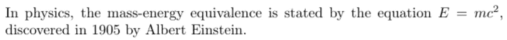

或者，可以使用打开和关闭`\[`和`\]`。

```
The mass-energy equivalence is described by the famous equation\[E=mc²\]
```

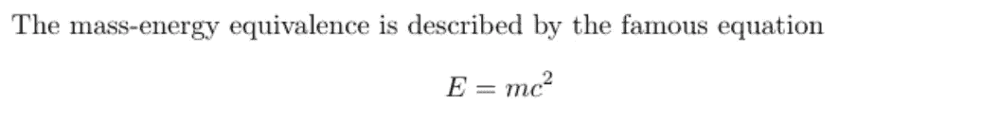

这将自动使数学居中并显示在新的一行上。

# 下标和上标

下标用 _，上标用^.`$a^2$`将输出`a²`。上标也可以通过连续调用与下标组合:

```
\[ a_1^2 + a_2^2 = a_3^2 \]
```

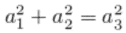

对于更长的上标和下标，将上标和下标放在括号中可以清理代码:

```
\[ x^{2 \alpha} - 1 = y_{ij} + y_{ij}  \]
```

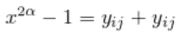

注意——LaTeX 有许多符号可以用`\name`来调用。在上面的例子中，使用了`\alpha`。其他的还有`\infty`，是无穷大的符号。

上标和下标也可以以多种方式嵌套和组合，只要用括号明确指定范围:

```
\[ (a^n)^{r+s} = a^{nr+ns}  \]
```

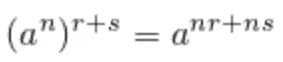

许多数学运算符需要下标或/和上标。在这些情况下，运算符被视为具有正常上标和下标属性的对象。以 sigma/summation 操作符为例，这个操作符由`\sum`调用。

```
\[ \sum_{i=1}^{\infty} \frac{1}{n^s}  
= \prod_p \frac{1}{1 - p^{-s}} \]
```

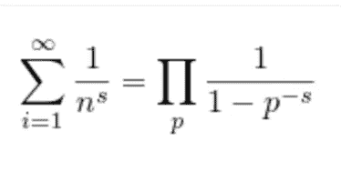

即使使用 sigma 操作符对常规对象调用上标和下标，它也会自动对齐。

另外需要注意的是——当使用\[ and \]开始和结束指示符时，所有内容都放在一行中，所以放在几行中的代码不会影响最终结果。

对上标和下标进行操作的其他运算符包括:

*   `\int`对于积分
*   `\cup`用于联合(朝上 u)
*   `\cap`对于交叉点(朝下 u 形)
*   `\oint`对于曲线积分
*   `\coprod`为联产品

# 经营者

三角函数、对数和其他数学函数可以取消斜体，并通过在前面加一个\来格式化。

```
\[ 
\sin(a + b ) = \sin(a)\cos(b) + \cos(a)\sin(b) 
\]
```

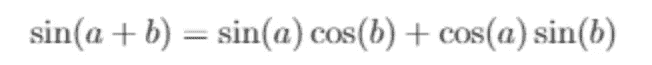

有些运算符可以通过下标接受参数，比如 limit 运算符。

```
\[ 
\lim_{h \rightarrow 0 } \frac{f(x+h)-f(x)}{h} 
\]
```


注意一个极限声明是如何包含一个下标和一个符号`\rightarrow`的调用的。`\frac{a}{b}`是一种创建分数的方法`a/b`。

# 分数和二项式

为了让本节中的一些命令生效，您必须首先在文件的开头包含`amsmath`包。

```
\usepackage{amsmath}
```

分数和二项式系数非常简单。它们被称为`\name{parameter1}{parameter2}`。

```
\[     
\binom{n}{k} = \frac{n!}{k!(n-k)!} 
\]
```

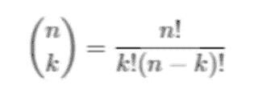

当分数被内联使用时，它们的显示方式会有所不同。

```
Fractions can be used alongside the text, for  example $frac{1}{2}$, and in a mathematical  display style like the one below:\[\frac{1}{2}\]
```

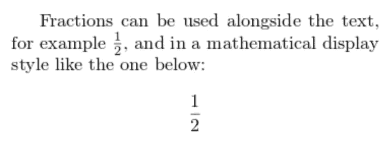

通过使用分数作为参数，可以很容易地嵌套分数。

```
\[   
a_0+\cfrac{1}{a_1+\cfrac{1}{a_2+\cfrac{1}{a_3+\cdots}}} 
\]
```

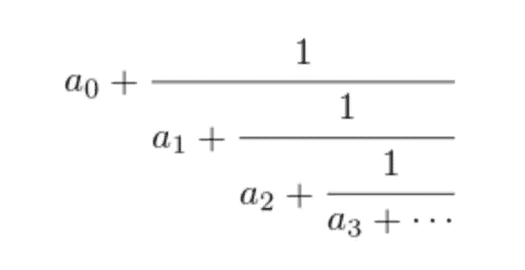

上面的命令使用了来自`amsmath`包的`\cfrac{}{}`,它保持片段的大小不变，即使它们是嵌套的。这可以用`\frac{}{}`来代替，这会让嵌套的分数变小。

# 括号和圆括号

LaTeX 支持多种类型的支架:

*   `(x+y)`渲染( *x* + *y* )
*   `[x+y]`渲染[ *x* + *y* ]
*   `\{ x+y \}`渲染{ *x* + *y* }
*   `\langle x+y \rangle`渲染⟨ *x* + *y* ⟩
*   `|x+y|`渲染| *x* + *y* |
*   `\| x+y \|`渲染∩*x*+*y*∩

有时，括号和圆括号对于表达式来说太小，例如，如果它有分数。

动态圆括号和括号由`\left[object]`和`\right[object]`命令操作，表示开始和结束。

```
\[  
F = G \left( \frac{m_1 m_2}{r^2} \right) 
\]
```

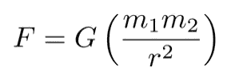

在这种情况下，`[object]`是一个括号，所以表达式被包含在`\left(`和`\right)`中。`[object]`也可以用括号代替(`\left[`和`\right]`)。

# 矩阵

这个`amsmath`包包含了许多排版矩阵的命令。

一个矩阵由几个值定义，每行由`&`分隔，每行由一个`\\`分隔。它包含在标准的`\begin{object}`和`\end{object}`中。

对于没有侧括号的简单矩阵:

```
\begin{matrix}
1 & 2 & 3\\
a & b & c
\end{matrix}
```

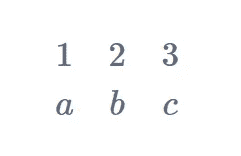

用`{pmatrix}`替换`\begin{matrix}`和`\end{matrix}`中的`{matrix}`,将括号括在矩阵周围:

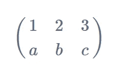

`{bmatrix}`用括号括起来:

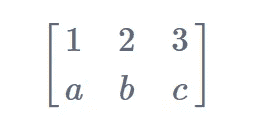

…然后`{Bmatrix}`用花括号把它括起来。

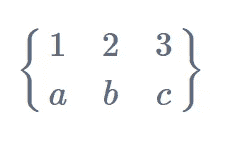

# 实践

现在，你有了乳胶的基本技能。找到将创建给定输出的代码。

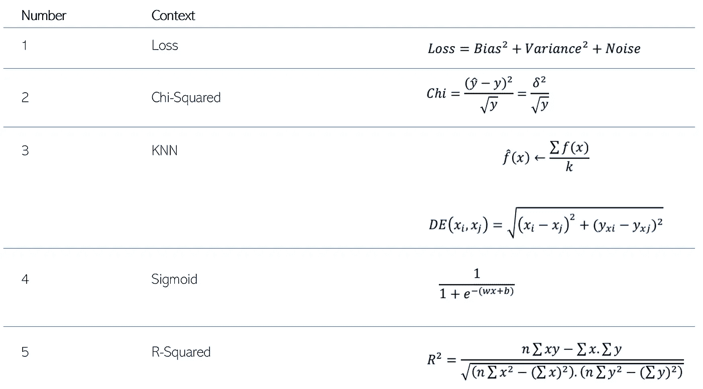

## 解决方法

#1(损失):

```
\[
Loss = Bias^2 + Variance^2 + Noise
\]
```

#2(卡方检验):

```
\[
Chi 
= \frac{(\hat(y)-y)^2}{\sqrt{y}}
= \frac{\delta^2}{\sqrt{y}}
\]
```

第三名(KNN):

```
\[
\hat(f)(x)
\leftarrow \frac{\sum f(x)}{k}
\]
\[
DE(x_i,x_j) = \sqrt{(x_i-x_j)^2 + (y_{xi}-y_{xj})^2}
\]
```

#4(乙状结肠):

```
\[
\frac{1}{1+e^{-(wx+b)}}
\]
```

#5 (R):

```
\[
R^2 = \frac{n \sum xy - \sum x. \sum y}{\sqrt{(n \sum x^2 - (\sum x)^2). (n \sum y^2 - (\sum y)^2)}}
\]
```

# 结论

在本教程中，您学习了…

*   如何内联和单独格式化数学
*   如何使用上标和下标，以及运算符
*   如何呼叫特定的接线员
*   如何使用圆括号和方括号，包括动态的
*   如何创建带有各种侧括号样式的矩阵

现在你可以漂亮地格式化数学了！从现在开始学习 LaTeX 的大部分内容是记忆某些对象的代码(`\object`)，因为你现在已经知道 LaTeX 的基本结构。

如果您喜欢这篇文章，您可能也会对本系列的其他文章感兴趣:

*   [面向数据科学家的 SQL，在 6 分钟或更短时间内完成](https://medium.com/@andre_ye/sql-for-data-scientists-in-6-minutes-or-less-6e11a377751f)

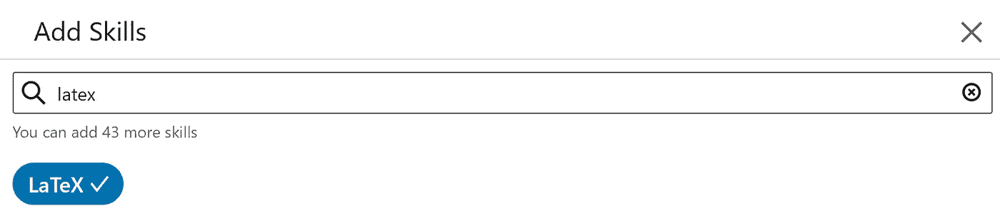

继续并点击“添加”。