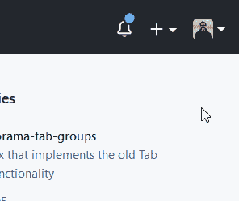
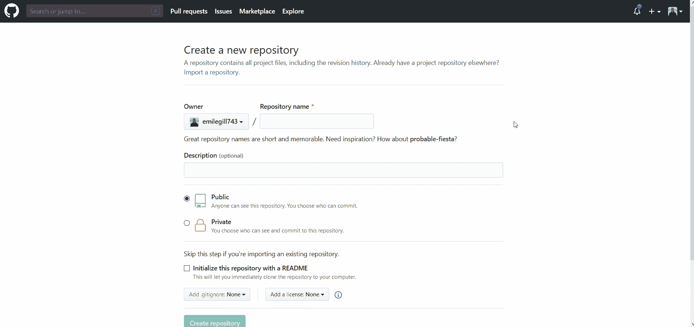
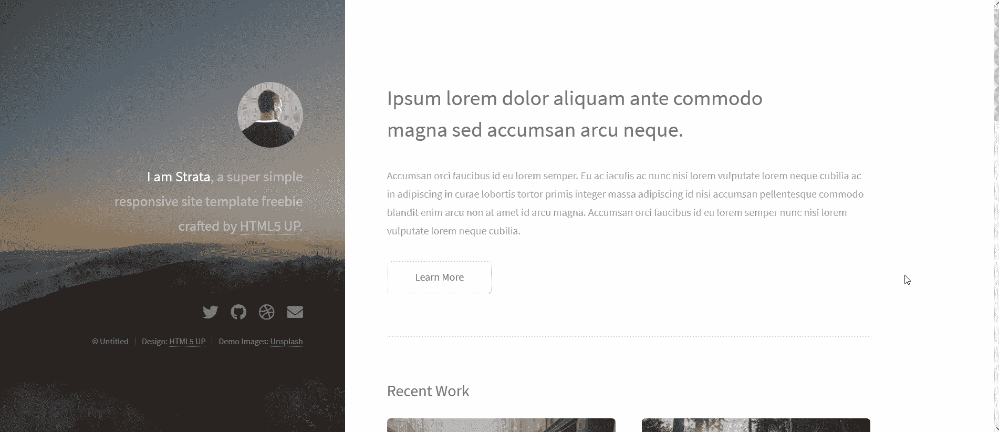
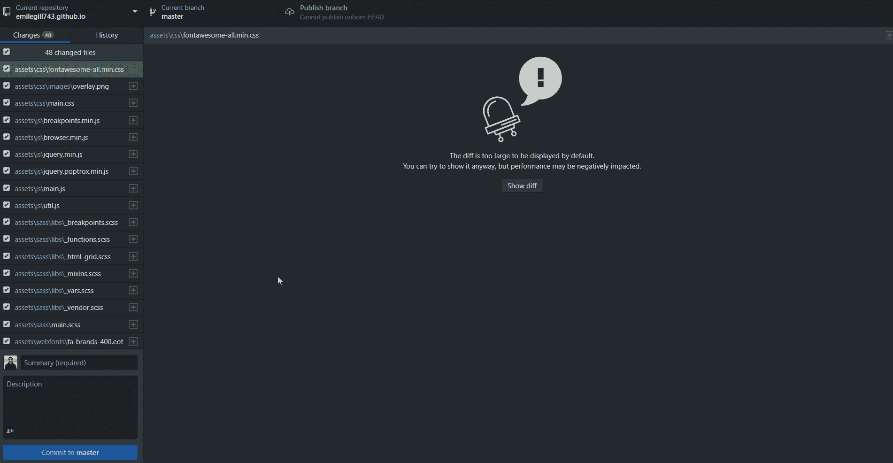
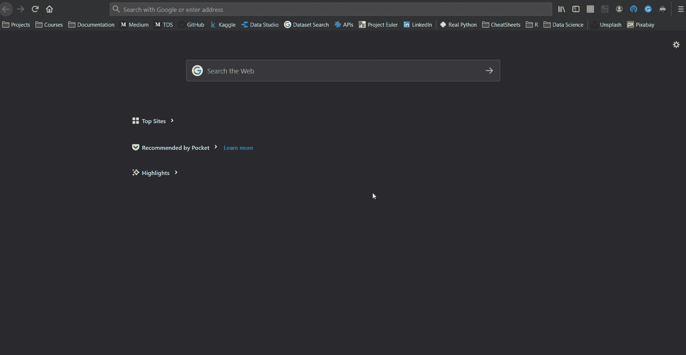
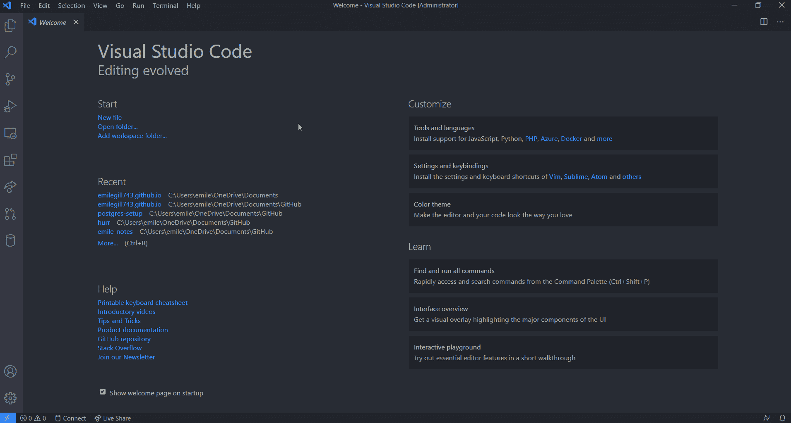

# 使用 GitHub 页面，通过 5 个简单的步骤免费创建一个网站

> 原文：<https://towardsdatascience.com/launch-a-website-for-free-in-5-simple-steps-with-github-pages-e9680bcd94aa?source=collection_archive---------23----------------------->

## 不到 10 分钟就能在网上建立你的个人投资组合网站。


尼古拉斯·皮卡德在 [Unsplash](https://unsplash.com?utm_source=medium&utm_medium=referral) 上拍摄的照片

> **拥有自己的网站可以让你向世界展示你是谁，以及你热爱什么。**

许多人认为，对于普通人来说，建立一个网站成本太高，或者技术难度太大。实际上，它根本不需要花费任何成本，任何人都可以完成——不管经验水平如何——并且可以在 10 分钟内启动并运行！(可以查看我的[这里](http://emilegill743.github.io))

GitHub Pages 是 GitHub 的一个特性，它允许用户直接从存储库中托管静态网页。这是托管个人投资组合网站、展示项目或为小型组织托管其页面的理想选择。在这篇文章中，我将展示对于任何人来说，通过 GitHub 页面建立一个网站是多么简单。

# 步骤 1 —创建 GitHub 帐户


如果您已经有一个 GitHub 帐户，可以跳过这一步。如果没有，可以 [**报名这里**](https://github.com/) 。

在整篇文章中，我尽量不假设您已经掌握了相关知识，但是如果您以前从未使用过 Git，我建议您熟悉 Git 概念。本文从完整的基础知识开始，对 Git 和 GitHub 进行了很好的介绍:

[](/getting-started-with-git-and-github-6fcd0f2d4ac6) [## Git 和 GitHub 入门:完全初学者指南

### Git 和 GitHub 基础知识，供好奇和完全困惑的人使用(加上最简单的方法来为您的第一次公开…

towardsdatascience.com](/getting-started-with-git-and-github-6fcd0f2d4ac6) 

# 步骤 2-为你的网站创建一个存储库

资源库是存储项目所有代码的地方，或者如 GitHub 的帮助页面所解释的:

> “存储库就像是项目的文件夹。项目的存储库包含项目的所有文件，并存储每个文件的修订历史。您还可以在存储库中讨论和管理您的项目工作。” [GitHub 帮助](https://help.github.com/en/github/creating-cloning-and-archiving-repositories/about-repositories)

因此，要开始我们的项目，我们需要做的第一件事是为我们网站的代码创建一个存储库。现在我们有了一个 GitHub 帐户，这很容易做到。只需导航到 GitHub 主页的右上方，在“+”菜单下，选择“ *New Repository* ”。



添加新的存储库

这将打开“*创建新存储库*”页面，我们可以在其中选择存储库名称，并选择我们的存储库是“*公共”*还是“*私有”*。重要的是，我们给这个存储库一个特定的名称，这样 GitHub 就知道这个存储库应该通过 GitHub 页面托管。这个应该是`[your_username].github.io`。例如，因为我的 GitHub 用户名是 emilegill743，所以我的存储库名称——我们稍后将看到我的网站 URL——将是 [emilegill743.github.io](http://emilegill743.github.io) 。我们还希望将我们的存储库设置为“*Public”*，因为如果我们升级到 GitHub Pro，GitHub Pages 只允许托管“ *Private* ”存储库。



为我们的 GitHub 页面网站创建一个存储库

一旦我们完成了这些，GitHub 将带我们到我们新创建的存储库，并解释我们可以开始使用存储库的本地副本的几种方法。如果您不熟悉在命令行上使用 Git，将这个空存储库"*克隆到您的本地系统的最简单的方法是使用在桌面中设置的"*"选项。这将打开 GitHub Desktop——可以在这里[安装](https://desktop.github.com/)——在您选择的位置创建一个存储库的本地副本。现在，在您的本地文件系统上将会有一个以您的存储库命名的空文件夹，它将会跟踪我们所做的任何更改。然后，这些更改可以被“*提交*”和“*推送*”到我们在 GitHub 上的远程存储库。**

# *第三步——选择你的网站设计*

**

*在[https://html5up.net/](https://html5up.net/)上提供的模板*

*现在，如果你是铁杆，你可能想从头开始设计你的网站。理论上，你可以这样做；我们所需要的只是我们的远程存储库中的一个`index.html`文件，GitHub 将继续渲染我们的网站。然而，由于这篇文章的目的是让我们的网站尽快建立并运行，我们将使用一个模板来开始。这将使我们能够以最少的工作量创建一个时尚、响应迅速、专业的网站。*

*有许多网站提供网站设计的模板，有些可以花很少的钱购买，但许多是免费的。我特别喜欢的是 [HTML5 UP](https://html5up.net/) ，它提供了一系列漂亮的设计，非常适合个人作品集网站。在知识共享署名 3.0 许可下，所有的设计都是免费的，这意味着我们可以随心所欲地使用它，只要我们为设计归功于 HTML5。*

*随意自己做研究，找到最适合自己的设计；为了演示，这里我用 HTML5 UP 的[地层主题](https://html5up.net/strata)。*

**

*Strata by HTML5 UP！*

# *第 4 步—推送至 GitHub*

*既然我们已经选择了我们的设计，我们可以下载它的相关文件，并将它们转移到我们的本地存储库中。然后，我们可以提交我们的更改，并将其推送到我们的远程存储库。同样，如果你习惯使用 Git，可以通过命令行来操作，但是如果你是新手，你可以使用 GitHub Desktop。*

**

*推送至 GitHub*

*这就是奇迹发生的地方。打开网络浏览器并导航至 URL `[your_username].github.io`。*

**

*我们的网站上线了！现在让我们看看如何添加最后的润色和个性化，现在它只是一个模板。*

# *第五步——定制你的网站*

**

*对于这最后一步，我们需要一个文本编辑器。如果你是一个编程专家，你可能已经有了一个文本编辑器。任何都可以，但我个人推荐 Visual Studio 代码，你可以在这里安装。*

*在我们的文本编辑器中打开包含我们的存储库的文件夹，我们将看到所有有助于我们网站设计的文件。其中最重要的是我们的`index.html`文件，它表示我们网站主页的结构。可能还会有一些`.css`文件，也可能有一些`.js`。如果你不熟悉这些，不要太担心，当我创建我的第一个网站时，我并不熟悉！一个基本的总结是，HTML(超文本标记语言)构成了网页结构的构建模块，CSS(层叠样式表)描述了网页的样式，Javascript 定义了网页的交互行为。*

*我建议的第一件事是你下载 Visual Studio 代码的[‘Live Server*’*扩展](https://marketplace.visualstudio.com/items?itemName=ritwickdey.LiveServer)，这将使我们能够在编辑网站时预览它，当我们保存更改时会自动刷新。或者，您可以在 web 浏览器中打开`index.html`页面，手动刷新以检查更改。*

**

*VS 代码的实时服务器*

*关于如何编写 HTML，我不会讲太多细节，否则，这很快就会变成一个教程。基本语法由构成 HTML 元素的'*标签*组成，HTML 元素是 HTML 网页的构建块。这些标签通常由开始标签、标签的任何属性、一些内容和结束标签组成。*

```
*<tag attribute="value">Some content</tag>*
```

*你想在多大程度上定制你的网站取决于你自己。在最基本的层面上，你需要改变网页中 HTML 元素的内容来反映你的个人信息。您可能还想更改网页中的图像。要做到这一点，你需要做的就是把你想要使用的图像复制到你的存储库中(如果你使用的是 HTML5 UP 模板，它可能已经有一个为图像指定的文件夹)，然后修改图像元素的`src`属性来反映你的新图像``的路径。这里值得注意的是，图像元素由包含其属性的单个标签组成，而不是像许多其他 HTML 元素那样由开始和结束标签组成。*

*如果你有兴趣学习更多关于 HTML、CSS 和 JavaScript 的知识，这样你就可以让你的网站个性化更上一层楼，我强烈推荐哈佛的 [*CS50W* : *用 Python 和 Javascript 进行 Web 编程*](https://courses.edx.org/courses/course-v1:HarvardX+CS50W+Web/course/) 。这是一门关于 [edX 的完全免费的课程，](https://www.edx.org/)它的前几章主要关注 Git、HTML 和 CSS，之后会继续关注 Javascript。它很好地介绍了让网站真正成为我们自己的网站所需的技巧。*

*要获得更多灵感，请随时查看我的网站 emilegill743.github.io 和下面链接的相应 github 库。*

*[](https://github.com/emilegill743/emilegill743.github.io) [## Emile gill 743/Emile gill 743 . github . io

### 我的个人作品集网站，通过 GitHub 页面托管，基于 HTML5 UP 的 Strata 主题。…

github.com](https://github.com/emilegill743/emilegill743.github.io) 

***感谢阅读！**** 

*如果你喜欢这篇文章，可以看看我的其他文章:*

*[](/finding-a-grocery-delivery-slot-the-smart-way-f4f0800c4afe) [## 聪明的方法是找到一个杂货递送点

### 使用 Python、Heroku 和 Twilio 从一个杂货网站的 API 中抓取数据，并在出现插槽时获得文本通知…

towardsdatascience.com](/finding-a-grocery-delivery-slot-the-smart-way-f4f0800c4afe) [](/a-practical-guide-to-getting-set-up-with-postgresql-a1bf37a0cfd7) [## PostgreSQL 入门实用指南🐘

### Python 的 PostgreSQL、pgAdmin 和 SQLAlchemy 入门。将 SQL 融入 Python 的核心…

towardsdatascience.com](/a-practical-guide-to-getting-set-up-with-postgresql-a1bf37a0cfd7)*