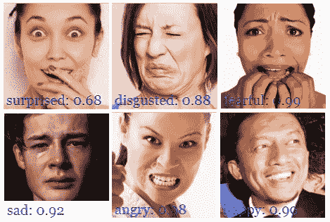
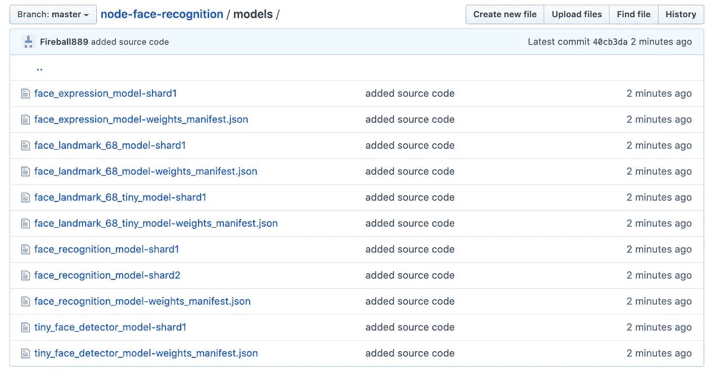
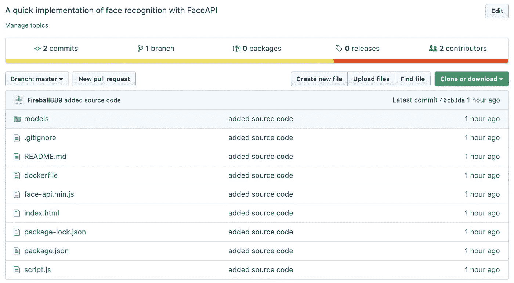

# 在几分钟内，在浏览器中启动您自己的人脸识别应用程序(实时)

> 原文：<https://towardsdatascience.com/launch-your-own-real-time-face-recognition-algorithm-in-your-browser-in-minutes-beginner-guide-a8f2e6fd505c?source=collection_archive---------24----------------------->

## 用 Face API 和 Docker 实现基于 JavaScript 的人脸识别


## 三二一…发射！

如果您想自己实现它，请跳到下面的实现部分。

如果你只是想玩一个没有任何编码的实时人脸识别算法，可以运行下面这个 Dockerized web app:

```
docker run -p 8080:8080 billyfong2007/node-face-recognition:latest
```

这个 Docker 命令将从 Docker Hub 运行 Docker 映像，并将容器的网络端口 8080 绑定到您的计算机。您可以在浏览器中访问面部识别算法，方法是:

```
localhost:8080
```

该网页将访问你的笔记本电脑的摄像头，并开始实时分析你的表情！

不要担心，这完全脱机工作，你将是唯一一个可以查看视频流的人…假设你的计算机没有受到损害。



无论如何，你可能会开始像一个傻瓜一样在电脑前做各种有趣的表情(或者悲伤/愤怒等)!

## 履行

这个算法消耗了建立在 [tensorflow.js 核心 API](https://github.com/tensorflow/tfjs-core) 之上的 [Face API](https://justadudewhohacks.github.io/face-api.js/docs/index.html) 。你也可以训练这个算法来识别不同的人脸。

对于那些还在阅读的人来说，也许您想知道如何构建自己的节点应用程序来使用 Face API？好了，我们开始吧:

你可以在我的 [GitHub Repo](https://github.com/BillyFnh/node-face-recognition) 里找到所有的源文件。

首先，你需要安装 NPM 的实时服务器来服务你的 HTML:

```
npm install -g live-server
```

构建一个名为 *index.html:* 的准系统 HTML 页面

这个 HTML 包含一个视频元素，我们将使用它来传输您笔记本电脑的网络摄像头。

然后用以下内容创建 *script.js* :

该脚本做了几件事:

1.  从目录异步加载所有模型
2.  请求访问您的网络摄像机的权限
3.  一旦视频开始流，创建一个画布，并调用 Face API 每 100ms 在画布上绘制一次。

需要的机器学习模型可以从我的 [GitHub Repo](https://github.com/BillyFnh/node-face-recognition/tree/master/models) 下载:



一旦你准备好了 index.html、script.js 和模型，你就可以开始了。您仍然需要包含 face-api.min.js，您的应用程序才能开始工作:



现在你准备好了！开始使用 live-server 服务您的 HTML 页面:

```
cd /directory-to-your-project
live-server
```

这个简单的 JavaScript 项目让我体验了 ML，我希望我能做更多，但我不确定这个算法在现实生活中会有什么实际用途。你怎么想呢?

页（page 的缩写）s:这是我的第一篇媒体文章，如果你认为这篇文章需要进一步澄清，请告诉我！:)