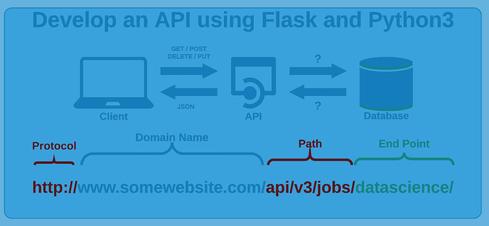
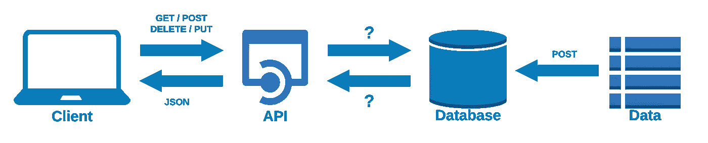
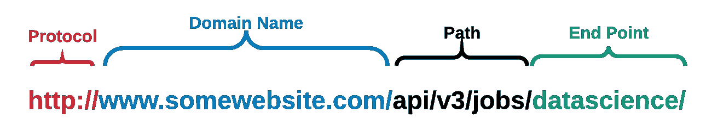
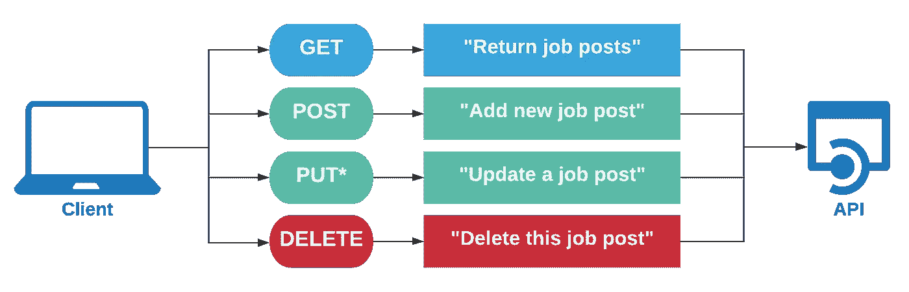
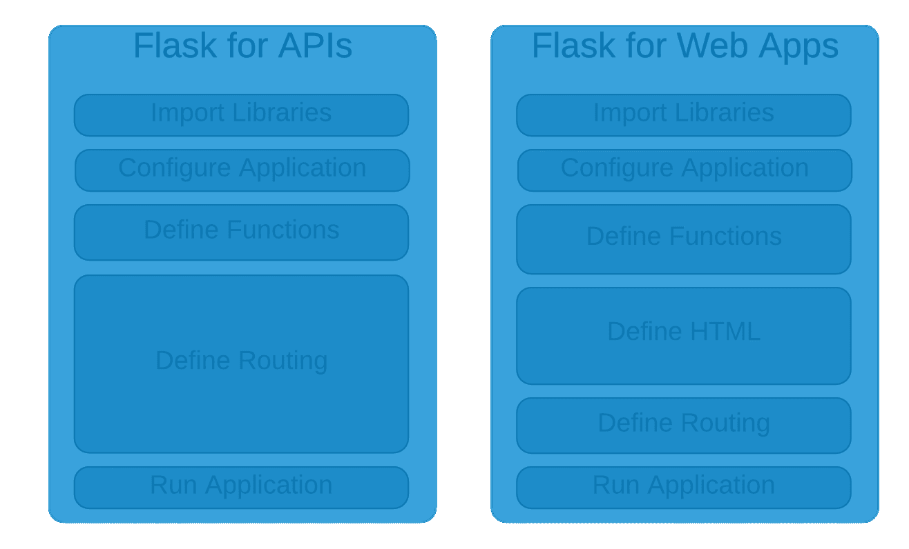

# 使用 Flask & Python 在 7 分钟内启动您自己的 REST API

> 原文：<https://towardsdatascience.com/launch-your-own-rest-api-using-flask-python-in-7-minutes-c4373eb34239?source=collection_archive---------19----------------------->

## 下面的文章介绍了使用 Python、Flask 和 Sqlite3 开发 REST API



## 1.简介:

应用程序编程接口(API)被定义为处理两个或更多中介(通常是用户和数据库之间)之间的交互的接口。更常见的是，大多数被访问的网站、被玩的视频游戏、甚至是被流式传输的视频都涉及到被利用的某种级别的 API。作为数据科学家，我们经常使用 API 来检索信息，如股票价格、文章或其他类型的信息。数据科学家通常会发出 HTTP 请求，这通常会导致数据以 JSON 文件的格式返回。

表述性状态转移(REST)类型的 API 是一种架构风格，它使用 HTTP 请求来获取、上传、发布和删除数据(图 1)。作为用户，当使用诸如 [Postman](https://www.postman.com/) 之类的软件或者诸如 *Requests* 之类的普通 Python 库来发出 HTTP 请求时，我们经常会体验到 API 的客户端。然而，对于大多数 Python 开发者来说，API 函数的底层框架仍然是一个“黑箱”。本文的目的是通过使用 Flask 框架从头开发一个 API 来探索这一领域。



图 1:REST API 的主框架，其中 API 的客户端允许使用 GET、POST、DELETE 和 PUT 方法添加和删除数据。

## 2.REST API 的基础:

REST API 背后的主要结构由三个关键项目组成:(url 和端点，(2)方法，以及(3)数据。当客户机针对 API 发出 HTTP 请求以检索数据时，必须设计的第一项是 URL。URL 通常包含站点域、一系列目录层次结构，最后是端点，通常遵循图 2 所示的结构。



图 HTTP 请求 URL 的一般结构。

使用 REST API 发出请求时，通常使用四种主要方法:GET、POST、PUT 和 DELETE。虽然这些方法大多是不言自明的，但主要的好处是可以使用这些方法从任何给定的数据库中检索、添加或删除数据。GET 请求是最常见的请求类型，主要用于从服务器或数据库中检索数据。POST 请求用于向 API 发送数据，以便创建或更新条目。与 POST 类似，PUT 请求用于向 API 发送数据，以便创建或更新条目，但是，PUT 请求是等幂的，这意味着可以多次应用该方法，而不会改变最终结果。最后，删除请求用于删除数据库中的某些条目。下面的图 3 总结了 REST API 背后的主要方法，使用了一个关于每个请求的示例解释命令。



图 3:REST API 背后的四个主要方法，以及一个以职位发布为例总结功能的示例语句。*请注意，PUT 方法类似于 POST 方法，但是它们是等幂的，多次调用相同的请求将产生相同的结果。另一方面，POST 请求是非等幂的，发出相同的请求可能会导致意外的结果。

最后，构成 API 的最后一项是要查询的实际数据，可以是从小的 CSV 文件到大的关系数据库。出于本文的目的，我通过转换一个示例 CSV 文件，使用 Python 的 sqlite3 库创建了一个数据库。

## 3.准备数据库:

出于本文的目的，我们将使用一个关于 CS 和数据科学职位的职位发布数据集来创建一个 API。现在让我们继续使用 *sqlite3* 库创建一个数据库。出于本文的目的，为了简单起见，我们将坚持使用 s *qlite3* 库，然而，生产级数据库应该利用 [MySQL](https://www.mysql.com/) 或 [PostgreSQL](https://azure.microsoft.com/en-us/services/postgresql/?&ef_id=Cj0KCQjwuJz3BRDTARIsAMg-HxVl-J3edqbx_16MBsgl2jTI16XT6jhux1RTnqPpZl_3zzombPkkr6waAlJEEALw_wcB:G:s&OCID=AID2000128_SEM_Cj0KCQjwuJz3BRDTARIsAMg-HxVl-J3edqbx_16MBsgl2jTI16XT6jhux1RTnqPpZl_3zzombPkkr6waAlJEEALw_wcB:G:s&gclid=Cj0KCQjwuJz3BRDTARIsAMg-HxVl-J3edqbx_16MBsgl2jTI16XT6jhux1RTnqPpZl_3zzombPkkr6waAlJEEALw_wcB) 来获得最大效率，这两者在 AWS 等云服务器上都很容易获得。我们从 *sqlite3* 开始，创建一个允许我们创建新的 *sqlite3* 连接的函数。这里的主要目标是准备一个函数，通过创建一个连接来创建一个新的数据库文件。

```
def createSqliteConnection(database):
    """ 
    Function that creates a connection to a sqlite3 database file.[@param](http://twitter.com/param) database -- The path and name of the database file to connect to.
    """
    conn = None
    try:
        print("----------Attempting to connect to database using Sqlite3 version {version} ...".format(version = sqlite3.version))
        conn = sqlite3.connect(database)
        print("----------Successfully to connected to {database}".format(database = database))except Error as e:
        print(e)
    finally:
        if conn:
            conn.close()
```

创建数据库后，现在可以直接从 CSV 导入数据。

```
def pandasToDatabase(csvDocument, database, tableName):
    conn = sqlite3.connect(database) 
    df = pd.read_csv(csvDocument)
    df.to_sql(tableName, conn, if_exists = "append", index = False)
```

两个函数都完成后，我们现在可以继续执行这些函数:

```
if __name__ == '__main__':
    createSqliteConnection("data/datasciencejobs_database.db")
    pandasToDatabase("data/datasciencejobs_database.csv", "data/datasciencejobs_database.db", "tblJobs", )
```

这将导致创建一个名为:

```
data/datasciencejobs_database.db
```

现在创建了主数据库文件，我们现在能够使用 API 直接从数据库中查询数据，从而避免了 CSV 的使用。这允许更快和更干净的连接。

## 4.创建 Flask 应用程序:

针对 API 的 Flask 应用程序的后端开发不同于大多数用户熟悉的标准的基于 GUI 的 web 应用程序。从高层次的角度来看，主要的区别可以总结在图 4 中。两者之间的主要区别在于，由于必须考虑图形用户界面，标准 web 应用程序的重点转向了 HTML 和布局功能。另一方面，API 的主要关注点是信息的路由和流动。



图 flask 应用程序用于 API 时相对于标准 web 应用程序的一般高层次比较。

我们通过在 *app.py* 文件中定义我们的“app”并创建一个 Flask 应用程序来开始这个过程。

```
app = flask.Flask(__name__)
app.config["DEBUG"] = True
```

然后，我们必须创建几个函数，当在 URL 中采用某些路线时，这些函数会显示数据。让我们从一个简单的' *view all'* 函数开始，它显示数据库中的所有条目。请注意，我们使用的是上面指定的 GET 方法。

```
@app.route('/api/v1/jobs/datascience/all', methods=['GET'])def apiViewAll():
    conn = sqlite3.connect('data/datasciencejobs_database.db')
    conn.row_factory = dictFactory
    cur = conn.cursor()
    all_books = cur.execute('SELECT * FROM tblJobs;').fetchall()
    return jsonify(all_books)
```

启用此功能后，最终用户现在能够查询我们数据库中的所有数据。目前，这还不是问题，因为数据库包含的条目不超过 1000 个，但是，随着数据库的增长，最终用户需要等待很长时间才能访问整个数据库，这将成为更大的问题。也就是说，任何 REST API 的高效设计的一部分是基于预定的文件服务器查询数据的能力，以便查询数据库的某些部分。假设数据库由列' *id* '、 *datetime* '、 *country* '和' content '组成，一个“最佳设计”的 API 将允许用户使用前三个参数来查询数据。必须开发一个函数，允许通过指定' *id* '、*日期时间*'或'*国家*'来使用多个端点过滤数据。请注意，如果没有指定任何条目，将发出错误 404 页面未找到。

```
@app.route('/api/v1/jobs/datascience', methods=['GET'])def apiViewByFilter():
    '''
    Function that allows users to filter the results in the API     based on specified input.
    '''
    query_parameters = request.args
    id = query_parameters.get('id')
    dateTime = query_parameters.get('dateTime')
    cleanContent = query_parameters.get('cleanContent')
    country = query_parameters.get('country')
    query = "SELECT * FROM tblJobs WHERE" to_filter = []
    if id:
        query += ' id=? AND'
        to_filter.append(id) if dateTime:
        query += ' dateTime=? AND'
        to_filter.append(dateTime) if cleanContent:
        query += ' cleanContent=? AND'
        to_filter.append(cleanContent) if country:
        query += ' country=? AND'
        to_filter.append(country) if not (id or dateTime or cleanContent or country):
       return pageNotFound(404) query = query[:-4] + ';'
    conn = sqlite3.connect('data/datasciencejobs_database.db')
    conn.row_factory = dictFactory
    cur = conn.cursor() results = cur.execute(query, to_filter).fetchall() return jsonify(results)
```

最后，现在完成了 API 的所有部分，可以使用 Flask 的运行功能运行应用程序。

```
app.run()
```

API 中指定的三个主要端点允许用户查询所有数据，或者基于“id”、“国家”和“日期时间”。

例如，用户可以使用以下方式查询所有数据:

```
‘127.0.0.1:5000/api/v1/jobs/datascience/all’
```

用户还可以使用其中一个端点来查询数据:

```
‘127.0.0.1:5000/api/v1/jobs/datascience?country=United%20States’
‘127.0.0.1:5000/api/v1/jobs/datascience?id=81953194’
```

## 5.部署 Flask 应用程序:

API 完成并按预期运行后，下一个逻辑步骤是将应用程序部署到服务器。出于本教程的目的，API 是使用本地端口在本地“部署”的。部署基于 Flask 的应用程序的一些最佳选项包括: *AWS* 、 *Heroku* 和 *PythonAnywhere* 。在探索了这三个版本之后，我个人发现[www.pythonanywhere.com](http://www.pythonanywhere.com)是这三个版本中最用户友好和最便宜的，拥有关于部署过程的[全面的文档](https://help.pythonanywhere.com/pages/Flask/)。

## 结论:

总之，为了理解管理这个功能的主要框架，我们对 REST APIs 进行了概述。为了存储我们感兴趣的数据，创建了一个 SQL 数据库。最后，使用 Flask 使用 REST APIs 的最佳实践开发了一个 API，允许用户通过多个端点查询数据。

欲了解更多信息和访问代码，请访问 my [GitHub](https://github.com/alkhalifas/flask-web-api) 。