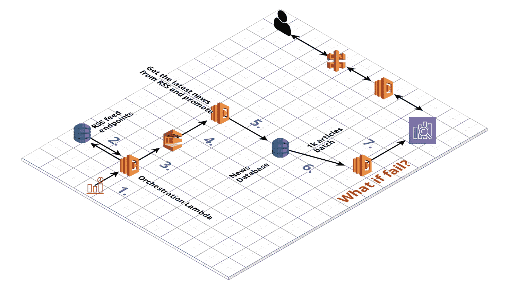
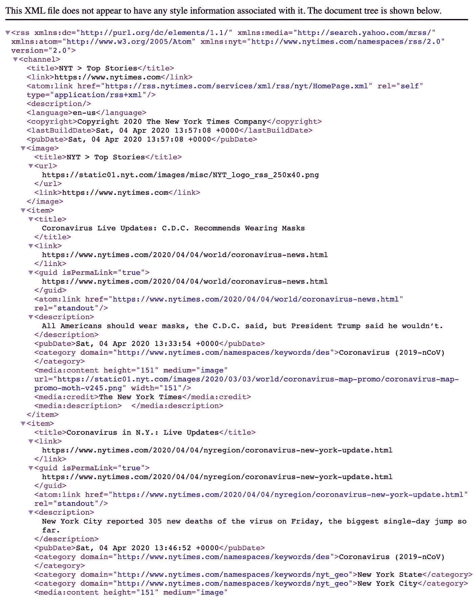
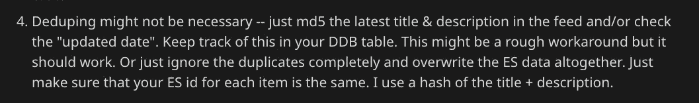

# 我们如何利用 AWS 在 60 天内推出数据产品

> 原文：<https://towardsdatascience.com/launching-beta-data-product-within-two-month-with-aws-6ac6b55a9b5d?source=collection_archive---------11----------------------->

## 新闻捕手

## 两个人的团队在不到两个月的时间里为 200 名用户计划并发布了一个测试版，并且没有放弃他们的全职工作。



测试版 newscatcherapi.com 解决方案架构

60 天内，我们:

*   迭代我们的架构设计 3 次
*   发布的 [Python 包](https://github.com/kotartemiy/newscatcher)在 GitHub 上获得了 800 多颗星
*   收到了 200 多个测试版的注册
*   交付了我们的[最小可行产品](https://newscatcherapi.com/docs)

[这篇文章中我将要谈到的产品的官方网站](https://newscatcherapi.com/)。

在本文中:

*   第一部分**产品**
*   第二部分。**计划&要求**
*   第三部分。**解决方案架构**
*   第四部分。**发布测试版**

我们是由两名数据工程师组成的团队。在 2020 年 2 月和 3 月，我们将大部分空闲时间用于构建一个 API，让你可以搜索新闻文章的数据。

> 这就像用一行代码查询谷歌新闻档案。

我们之前几乎没有使用 AWS 或交付**成功的端到端解决方案的经验**。尽管如此，正确的规划、寻求帮助和投入一些时间来寻找正确的工具使之成为可能。

> 尽管这是一个测试版。

## 我们遵循的原则

在业务方面:

1.  尽可能多地使用外部工具
2.  尽可能快地交付，以便尽快获得用户的反馈
3.  用户至上。他们应该决定什么重要，什么不重要

在技术方面:

1.  尽量减少使用您必须自己运行的服务器
2.  如果已经编写了代码，就不要再编写了
3.  只有当客户无法使用您的解决方案时，性能才是重要的
4.  请求帮助

# 第一部分.产品


何塞·马丁·拉米雷斯 C 在 [Unsplash](https://unsplash.com?utm_source=medium&utm_medium=referral) 上拍摄的照片

## 问题

我们大多数人阅读新闻。当我们为了个人兴趣消费新闻时，很容易跟随我们感兴趣的事情。

许多企业还必须不断了解全球的最新动态。典型的例子是金融机构。他们使用替代数据来识别非金融活动产生的风险。

政治、文化和社会事件可能引发另一系列事件，重塑某些金融市场。

当然，你可以谷歌任何关键词或话题，找到最相关的新闻结果。但是，假设你是一个交易者，想要了解投资组合中每家公司的最新消息。每小时一次。

[https://www.gifbay.com/gif/newspaper_press-130154/](https://www.gifbay.com/gif/newspaper_press-130154/)

或者，你必须分析一个人/公司/事件在过去的一个月中被提及了多少次。

或者，您希望向服务的用户显示特定主题的最新新闻。

从某种意义上来说，**手工劳动要么变得不可能，要么变得过于昂贵。**成千上万的新闻文章需要分析。如果你想扩大规模，你必须自动化这个过程。

## 解决办法

[Newscatcher AP](https://newscatcherapi.com/) I 是一个 JSON API，可以让你搜索新闻数据。例如，您想获得在过去一天发表的关于苹果公司的所有文章的列表。

对于每个数据记录，您将获得:

*   相关性分数(文章与搜索标准的匹配程度)
*   统一资源定位器
*   发布日期和时间
*   标题
*   摘要
*   文章语言
*   网站的全球排名

我们从数以千计的新闻网站收集新闻文章数据，更重要的是，将这些数据标准化。

## 是数据即服务吗？

[Auren Hoffman 的《数据即服务圣经》](https://www.safegraph.com/blog/data-as-a-service-bible-everything-you-wanted-to-know-about-running-daas-companies?source=search_post---------0)是任何想要了解什么是数据业务的人的必读之作。

根据 Auren 的愿景，数据业务有 **3 大支柱**:

1.  **数据采集** —我们必须从数千家不同的在线新闻发布商那里收集新闻
2.  **数据转换** —我们必须规范化我们的数据并存储它，以便它可以被数据交付流程使用
3.  **数据交付** —我们必须让客户能够消费我们的数据(例如，API)

DaaS 卖给你的是材料，而不是解决方案本身。**你必须根据自己的需求调整数据以提取价值。**因此，潜在客户池减少到那些拥有数据团队作为资源的人。但是，那些拥有开发人员的客户可以根据需要精确地调整数据产品。

## DaaS 对 SaaS

当你饿的时候，你有两个主要的选择。

第一个是从餐馆点一些食物/去餐馆。例如，你订了 20 美元的比萨饼。

另一个选择是去杂货店，花 8 美元买下所有的食材，然后自己做饭。

自己做披萨的缺点就是要花时间。另外，你需要掌握一些技能。但是，它更便宜(如果你不为你的时间收费的话)，而且**你可以随心所欲地定制**。

餐馆的比萨饼通常不能定制。

比萨饼店是 SaaS 的一个例子，因为它给你的是最终产品。杂货店是 DaaS 的一个例子，因为它给你资源来烘烤你自己的比萨饼。

## 什么是贝塔？

贝塔是你如何能:

*   验证你的想法，
*   揭示主要技术问题
*   收集关于用户需要的最重要功能的反馈

你不收费，所以它不需要完美。

## 为什么发布测试版而不是最终版？

嗯，你必须非常擅长你正在做的事情，并且完全了解你的受众，这样才能在第一次尝试时就发布“有价值的东西”。所以多花一点时间最终会有回报。

对我们来说，这也是为了验证我们的架构。我们必须看到不同的部件是如何粘在一起的。

## β=最小可行产品

我不确定这是否总是正确的，但在大多数情况下应该是这样。你只留下产品无法生存的功能。

所有不必要的都放在 MVP 后的第一栏。

# 第二部分。计划和要求


由[伦纳特·约翰逊](https://unsplash.com/@lenjons?utm_source=medium&utm_medium=referral)在 [Unsplash](https://unsplash.com?utm_source=medium&utm_medium=referral) 上拍摄的照片

## 测试版要求

用户传递单词/短语，API 返回一堆关于搜索主题的文章。就这么简单。

从 API 收到响应应该不会超过 3-5 秒。

我们还添加了一些过滤器，因为这很容易做到。

任何需要一个多小时开发的功能都被抛弃了。

我们的文档页面很好地展示了我们所取得的成就。

## 如何构建新闻 API？

简单来说，我们必须从新闻网站获取文章，比如 nytimes.com 的[、](https://www.nytimes.com/)[和 theverge.com 的](https://www.theverge.com/)等。最终目标是从任何现有的新闻网站上获取。

然后，**数据规范化&重复数据删除——最重要的部分**。每篇文章都是一个数据点——它有一组变量，如标题、出版日期、作者等。

例如，一篇文章发表的日期和时间应该是我们最终数据源中的一个时区。否则按时间查询数据就没有任何意义了。

最后，在我们收集和标准化之后，我们应该**将数据**存储在某个地方。更重要的是，检索数据应该很容易。在我们的例子中，我们很大程度上依赖于搜索功能。

## 去拿文章。数据收集

在我开始解释架构设计之前，我应该解释一下我们将如何收集新闻文章的数据。

第一个想法可能是为每个网站设置网页抓取器。Web 抓取已经很发达了——有很多开源库使得 web 抓取变得很容易。

但是，**每个网站都有自己的结构**。即使有一些令人惊奇的库可以帮助你从新闻文章中构建数据(比如[报纸](https://github.com/codelucas/newspaper))，它也不能 100%适用于这些来源。

**制作成千上万个可以避免被禁的网络爬虫既昂贵又耗时**。

在理想的情况下，我应该有一个 API 来从每个新闻数据提供者那里检索最新的新闻。另外，每个 API 都是相同的设计。

但是没有这样的 API。然而，另一种获取新闻数据的方法是存在的。并且，它已经被规范化了。它被称为 RSS。

> 根据[维基百科](https://en.wikipedia.org/wiki/RSS)， **RSS 是一种网络提要，允许用户和应用程序以标准化的、计算机可读的格式访问网站的更新。**

对于新闻网站来说，*网站更新*是新的新闻文章。几乎每个新闻网站都有。

RSS 已经标准化了。算是吧。您需要做一些额外的工作来从中提取主要字段。



nytimes.com 的主要 RSS

# 第三部分。解决方案架构


newscatcherapi.com AWS 架构图测试版

将收集到的标准化数据传送到我们的最终数据存储需要 7 个步骤——弹性搜索:

1.  CloudWatch 事件触发λ
2.  Lambda 从 DynamoDB 获取 RSS 提要 URL
3.  同一个 Lambda 将所有这些 RSS URLs 发送到 SQS
4.  Lambda 获取来自 SQS 的每个 RSS 端点，并读取和规范化提要
5.  新闻文章数据被插入 DynamoDB
6.  DDB 流收集多达 X 条新插入的记录，并将其发送给 Lambda
7.  Lambda 在 Elasticseearch 中插入新记录

**第一步。** CloudWatch 事件触发了“编排”lambda

> AWS Lambda 是一个无服务器的功能即服务工具，它运行您的代码来响应事件。您不必维护服务器。您只需为执行该功能的时间付费。
> 
> CloudWatch 事件是一个 [cron 作业](https://en.wikipedia.org/wiki/Cron)的 AWS 实现。

你可以设置 CloudWatch 事件，每隔 X 分钟、小时、天等触发你的 Lambda。

**第二步。**“编排”lambda 从 DynamoDB 获取 RSS 提要 URL

DynamoDB 表包含了我们用来更新新闻数据库的所有 RSS 提要

> DynamoDB 是 AWS 的一个完全托管的非 SQL 数据库。与 AWS Lambda 一样，您不必管理其背后的硬件或软件。您可以将它作为存储数据的现成解决方案。

**第三步。**“编排”lambda 将所有这些 RSS URLs 发送到 SQS

现在您有了一个必须处理的所有 RSS 提要的列表。

它们有数千个，所以循环处理每一个不是一个选项。

让我们假设我们有另一个 Lambda 函数可以读取和规范化 RSS。AWS Lambda 允许您进行数百个并行调用。因此，你可以考虑从你当前的 Lambda 调用许多其他的 Lambda。

这种方法应该是可行的，但是，它会使您的过程变得复杂并且容易失败。

所以你需要中间的东西。

> 简单队列服务是由 AWS 完全管理的队列服务。

我们将把所有的 RSS 端点作为消息发送给 SQS，而不是从我们的“编排”Lambda 中触发 RSS 处理。然后，来自 SQS 的新消息可以触发 RSS 处理 Lambda。

通过添加 SQS 层，我们使得检查每个 RSS 端点处理的成功变得更加容易。如果其中一个 lambda 失败，它不会中断处理其他 RSS 提要的任何其他 lambda。

**第四步。**Lambda 从 SQS 获取每个 RSS 端点，并读取和规范化提要

我最喜欢的 AWS Lambda 特性是，你不用为同时执行多个 Lambda 而多花钱。当您不知道未来的工作负载，或者想要确保系统在接收更多负载时不会崩溃时，它使 Lambda 成为一个有用的工具。

这个 Lambda 是一个 Python 函数，它将 RSS URL 作为输入，并返回结构化数据(标题、发布日期、作者、文章 URL 等。)

现在，当我们从每个 RSS 提要中提取并规范化新闻文章的数据时，必须存储这些数据。

**第五步。**新闻文章数据被插入 DynamoDB

在将数据发送到 Elasticsearch 集群之前，我们将其放入 DynamoDB。主要原因是 Elasticsearch 确实失败了。Elasticsearch 在很多方面都很棒(我们将在后面讨论)，但是 **Elasticsearch 不能成为你的主要数据存储**。

重复数据删除。每个 RSS 提要偶尔会更新一次。它向提要添加了更多的文章。例如，新闻网站 X 的 RSS 提要总是包含 100 篇文章。提要每小时更新一次。如果在这一小时内有 10 篇新文章，那么它们将出现在顶部。而最早的 10 篇文章将被删除。其他 90 篇文章会和一个小时前一样。因此，所有这 90 篇文章在我们的数据库中都是重复的。

我们有成千上万的这样的反馈。

因此，如果我们能够验证每个 ID(不管它是什么)是否已经存在于我们的数据库中，那就太好了。

我从 Reddit 上得到了很好的建议:



感谢来自 AWS 的 Vladimir Budilov 的帮助

诀窍是确保我们对每篇新闻文章都有一个一致的 ID 键。我们是每篇文章的标题+网址。然后，当我们将这些数据插入 DynamoDB 时，只允许新的 id(检查 DynamoDB 的 *attribute_not_exists* 设置)。

因此，我们不必自己消除重复数据。

**第六步。** DDB 流收集多达 X 条新插入的记录，并将其发送给 Lambda

现在，我们必须从 DynamoDB 向 Elascticsearch 集群发送新数据。

我们在 DynamoDB 插件上做了一个触发器。每次任何数据被插入 DynamoDB 时，它都会被 Lambda 拾取，然后将这些新数据发送到 Elasticsearch 集群。

将数据加载到 DynamoDB 中我们显著降低了 ES 的负载，因为它将接收更少的新数据。另外，DynamoDB 是我们的主要数据来源。

**第七步。** Lambda 在 Elasticsearch 中插入新记录

DynamoDB 承担了确保数据库中没有重复项的所有繁重工作。只有新插入的记录才会进入 Elasticsearch 集群。

您可以将 Lambda 设置为等待新的 X 记录或 Y 分钟，然后一次获取多个记录。这样你的交易会更少，而且你可以利用 Elasticsearch 批量插入。

## 为什么选择 Elasticsearch？

因为这是使用全文搜索的最佳方式。

Elasticsearch 很复杂，你几乎可以调整任何东西。充分了解数据的用途和用途可以让您优化集群以获得最佳性能。

然而，出于测试目的，我们几乎在所有地方都使用默认设置。

## 数据交付/API

到目前为止，我们确保我们的 Elasticsearch 集群得到了新数据的更新。现在，我们必须为用户提供一个工具来与我们的数据进行交互。我们选择让它成为一个 RESTful API。

我最喜欢的组合是用 API Gateway + Lambda 来做。

来自 [AWS 页面](https://aws.amazon.com/api-gateway/?nc1=h_ls):

> API Gateway 处理接受和处理多达数十万个并发 API 调用所涉及的所有任务，包括流量管理、CORS 支持、授权和访问控制、节流、监控和 API 版本管理。

因此 API 网关负责管理 API 请求。我们还是要实现逻辑层。Lambda 函数将处理每个 API 调用。

Lambda 本身是用一个叫 Flask 的微型 web 框架编写的。

这个 Lambda 的任务是解析用户传递的参数(比如他们想要查找文章的短语)。然后，它查询我们的 Elasticsearch 集群。最后，它组成一个干净的 JSON 响应对象，发送给用户。

除了 Flask，我们还使用了[***elasticsearch-DSL-py***](https://github.com/elastic/elasticsearch-dsl-py)包来帮助编写和运行针对 elastic search 的查询。

我建议使用 [Zappa](https://github.com/Miserlou/Zappa) 部署 API Lambdas:

> Zappa 使得在 AWS Lambda + API Gateway 上构建和部署无服务器、事件驱动的 Python 应用程序(包括但不限于 WSGI web 应用程序)变得非常容易。可以把它想象成 Python 应用程序的“无服务器”网络托管。这意味着无限扩展、零停机、零维护，而成本只是您当前部署的一小部分！

当你不确定你要服务多少个调用时，用 Lambda 部署你的 API 是最方便的。

更重要的是，如果你有 0 个电话，你支付 0。

# 第四部分。后期测试


照片由[蓝屋滑雪板](https://unsplash.com/@bluehouseskis?utm_source=medium&utm_medium=referral)在 [Unsplash](https://unsplash.com?utm_source=medium&utm_medium=referral) 上拍摄

## 初始(beta 后)发布计划

除了我们在测试版中取得的所有成就之外:

*   按语言过滤
*   适用于 6-10 种最常见语言的正确文本分析器
*   精确匹配搜索
*   必须包含/排除一个短语
*   按国家过滤
*   每个国家/地区端点的头条新闻
*   按主题过滤(体育、商业、娱乐等。)
*   页码

我们将有大量的工作来优化我们的弹性搜索集群。最大的变化是正确的**根据语言**分析文本字段。

重点是让搜索知道用户想要的语言。例如，默认的 Elasticsearch 文本分析器不知道“got”是“go”的基本形式。而英语分析器使用词干来跟踪这些东西。

因此，知道你希望你的文章被搜索到哪种语言将极大地提高找到的文章的相关性分数。

日志记录是我们想要实现的另一件重要的事情。最有可能的是，我们将使用 Elasticsearch 进行日志记录。

还应实施弹性搜索恢复计划。至少，我们应该知道集群何时关闭(目前情况并非如此)。

# 结论

它只是工作。你还需要从测试版中得到什么？

帮助我们进行测试的两个主要因素是:

1.  请 Reddit 帮助我们设计建筑
2.  投资一些时间来发布我们的 [Python 包](https://github.com/kotartemiy/newscatcher) →获得 beta 注册

[https://www.youtube.com/watch?v=r13riaRKGo0](https://www.youtube.com/watch?v=r13riaRKGo0)

感谢你一路阅读到这里。

支持我们的最好方式是参加我们的[封闭测试](https://newscatcherapi.com/docs)。

```
About meMy name is Artem, I build [newscatcherapi.com](https://newscatcherapi.com/) - ultra-fast API to find news articles by any topic, country, language, website, or keyword.I write about Python, cloud architecture, elasticsearch, data engineering, and entrepreneurship.
```