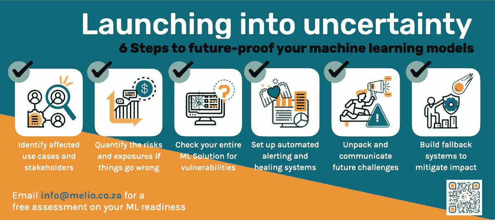
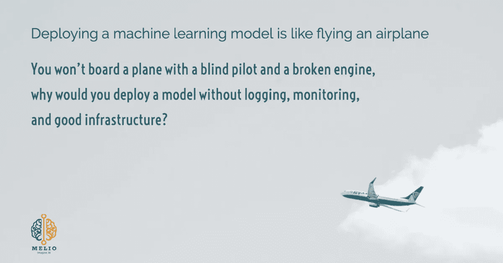

# 走向不确定性——让您的 ML 模型经得起未来考验的 6 个明智步骤

> 原文：<https://towardsdatascience.com/launching-into-uncertainty-6-smart-steps-to-future-proof-your-ml-models-bdebbccc6c43?source=collection_archive---------71----------------------->

## 新冠肺炎版:

## 你的机器学习模型在疫情会失败。以下是减轻损害的方法。

来自 [Unsplash](https://unsplash.com/photos/xu2WYJek5AI) 的照片 [Anastasia Patrova](https://unsplash.com/@anastasia_p)

有许多文章关注机器学习如何能够并且正在疫情期间提供帮助。韩国和台湾政府成功展示了他们如何利用人工智能来[减缓新冠肺炎病毒的传播。法国科技公司](https://hbr.org/2020/04/how-digital-contact-tracing-slowed-covid-19-in-east-asia)发现没有戴口罩的热点地区，建议政府将重点放在教育上。数据和医学专家合作[索引新冠肺炎医学期刊论文](https://www.kaggle.com/covid-19-contributions)。

来自数据科学界的参与令人振奋，结果也很突出。

但是这个帖子讲的恰恰相反。我在这里不是要吹捧机器学习的成功。我在这里对它所有的荣耀和奇迹产生一点怀疑。我是来问这个问题的:

> 在这段不确定的时间里，你在观察你的机器学习模型吗？

为什么不呢？

照片由[斯蒂芬·道森](https://unsplash.com/@srd844)从 [Unsplash](https://unsplash.com/photos/qwtCeJ5cLYs) 拍摄

现实生活中的数据经常与训练数据相背离。从您将准确、稳定的模型发布到产品中的那一天起，随着客户的发展，它的性能每天都在下降。对于新冠肺炎来说，这就好像是将模型从安全的培养皿中释放出来，放入狂野的西部。

随着政策变化、利率下降和支付假期，突然的数据转移会对您的模型产生深远的影响。模型精度下降没问题，但是对变化一无所知就不行了。

> 模型精度下降是可以的，但是对变化一无所知是不行的

在过去的几周里，我一直在参与这些机器学习模型的影响评估。最初这是压倒性的，所以我收集了一些实际的步骤，希望其他团队可以带着更多的信心和更少的恐慌来处理这个过程:

作者制作的信息图。由 Eucarlp 从[www.flaticon.com](http://www.flaticon.com)创作的图标

为了避免就这个主题写一整本书，本文使用了相当多的术语。如果您不确定术语的含义，请单击超链接。

# 步骤 1:识别受影响的用例以及涉众

图标来自[桉树](https://www.flaticon.com/authors/eucalyp)，作者改编。

不是所有的用例都会受到疫情的影响，就像不是所有的模型都会遭受数据[数据或概念漂移](https://machinelearningmastery.com/gentle-introduction-concept-drift-machine-learning/)。

任何软件评估的第一步都和任何软件开发的第一步一样:提出问题。

> 问一堆问题。

如果您有许多正在进行的用例，并且不确定先处理哪一个，请从以下问题开始:

❓:我在模拟人类行为吗？(即复活节期间购买的物品、房屋贷款首付款)

❓Did:我对政府或企业在危机期间改变的政策(如旅行禁令、银行支付假期)有任何固有的假设

一旦你确定了用例，然后指出受这些用例影响的涉众。涉众通常是该领域的主题专家，因此他们可以在下面的步骤 2 中帮助您。

**给自己画一个决策树。**

如果您的系统涉及到人员或策略，请继续执行步骤 2。

否则，继续前进。

# 第二步:评估事情出错时的风险和暴露程度

图标来自[桉树](https://www.flaticon.com/authors/eucalyp)，作者改编。

这个疫情是黑天鹅事件的经典案例。这是一次罕见的意外病毒爆发，后果严重。

所以很有可能事情会出错，但是会错到什么程度呢？

> 事情将会出错，但到底会错到什么程度呢？

[**情景分析**](https://www.kaushik.net/avinash/create-high-impact-effective-data-visualizations/#whatifmodels) 可以帮助我们驾驭这些极端情况。

在这一步中，与业务部门的 SME(主题专家)交谈非常有价值。他们通常有许多问题想要答案，数据科学家将分析数据以生成这些问题的洞察包。这时候这些问题可以帮助你审问你的模型。

举个例子，

> "如果房地产销售大幅下降，我们的底线会怎么样？"

好了，现在是检验它的时候了。如果您正在对房屋贷款产生的收入进行建模，那么在房屋贷款销售额较低时(夏季度假城镇的冬季月份)检查数据。然后，根据 SME 的建议进行调整，生成一个假的输入数据集，并在您的模型中运行。这可以帮助您评估模型面临风险的区域。

给出一个量化的数字可以帮助企业做出艰难的决定。即使我们觉得我们没有足够的信息来提供预测，但仍然要做出决定。贷款仍然需要发放，卫生纸仍然需要运输。我们不应该把责任推得更远，而应该专注于尽力而为。

给出一个附有所有星号的预测。

如果影响很大，请继续第 3 步进行彻底检查。

*否则，继续前进。*

# 步骤 3:检查整个解决方案的漏洞

图标来自[桉树](https://www.flaticon.com/authors/eucalyp)，作者改编。

机器学习解决方案不仅仅是模型本身。有数据工程管道、推理和模型再训练。端到端地扫描整个解决方案以发现漏洞非常重要。

> 机器学习解决方案不仅仅是模型

以下是您可以关注的一些领域:

⏩大量购买会破坏你的销售渠道吗？一些供应商的预测算法被订单数量的突然变化[破坏](https://insights.techreview.com/coronavirus-and-the-impact-on-global-supply-chains/?fbclid=IwAR3BMJnJqYFyEIdjSRIH5mjsqoPL9yV0tbOlE6TfZhuCeQn9I5-Ev57jgfA)。另一方面，一些欺诈检测系统被误报淹没了。

⏩您的基础架构上的基本负载是否发生了变化？有些模型不太相关，有些甚至更重要，转移您的计算资源可以平衡成本。

⏩调查模型的[全局和局部特征重要性](https://christophm.github.io/interpretable-ml-book/)。你的主要特征对疫情敏感吗？他们应该吗？有很多关于[可解释 AI](https://cloud.google.com/explainable-ai) 的文章，在未知的时间里，推理可解释性可以给人们需要的透明度。

**在整个管道中定义检查。**

到第 3 步时，您已经确定您的解决方案受到了危机的影响。所以继续第 4 步。

从这一点开始，没有前进，只有前进。

# 步骤 4:设置自动警报和修复

图标来自[桉树](https://www.flaticon.com/authors/eucalyp)，作者改编。

如果你正在阅读这篇文章，你可能还没有监控系统。否则，你将设置 500 吉拉门票，并在您的下一步顶部。

> 部署机器学习模型就像驾驶飞机一样

想象你是一名飞行员:

☑️:没有伐木就像没有黑匣子的飞行。任何恐怖分子都可以劫持飞机而不承担任何后果。

🖥️:没有监控就像在新的空域盲目飞行。飞行员不知道他要去哪里，你也不知道。

🌪没有弹性基础设施的️️:就像一架无人维护的飞机。机票很便宜，但飞机随时可能坠毁。

来自 [Unsplash](https://unsplash.com/photos/dCOuYgsm9X8) 的 [Kaotaru](https://unsplash.com/@kaotaru) 摄影， [melio.ai](http://melio.ai/) 编辑

你不会带着一个失明的飞行员和一个坏掉的引擎登机，为什么你要部署一个没有日志记录、监控和弹性基础设施的模型呢？

## 先不说监控，治愈呢？

许多成熟的机器学习解决方案都在系统中内置了自动化的[再培训](https://docs.aws.amazon.com/machine-learning/latest/dg/retraining-models-on-new-data.html)。但在这些极端事件中，或许值得看一看*刷新的*车型。他们使用最新的数据进行预测吗？他们应该吗？

面对未知情况时，自动重新部署刷新的模型可能会有风险。人在回路的方法可以是临时的，也可以是战略性的解决方案。

1️⃣设置了自动再培训和报告(使用业务 KPI 以及步骤 3 中定义的抽查)。

在疫情时期，2️⃣用更严格的警告标准警告人们要得到认可。

3️⃣:如果步骤 1-3 被严格执行，并且风险和暴露被承认，那么我们可能准备好重新部署模型。

**监控数据和模型漂移，并在必要时重新部署。**

*如果您仍然不确定，设置* [*金丝雀部署*](https://martinfowler.com/articles/cd4ml.html) *并将您的一小部分流量重定向到新模式。然后等新车型稳定了再慢慢淘汰旧的。*

# 第五步:打开包装，交流未来的挑战

图标来自[桉树](https://www.flaticon.com/authors/eucalyp)，作者改编。

新冠肺炎的影响从卫生纸短缺到全球经济崩溃不等。即使不是所有行业，也是大多数行业受到了正面或负面的影响。

> 这种反常可能会成为新的常态

远程工作、破产激增、结构性失业以及旅行限制等长期影响尚不明朗。当历史数据在这种前所未有的情况下不适用时，“异常”就可能成为新的常态。这迫使我们回过头来解开基本的商业问题，并重新思考许多假设。

⏩我们在未来的模型训练中包括疫情的数据吗？

⏩我们是否包含了更好地反映当前现实的新特性？

⏩当发生重大中断时，我们应该调整模型的敏感性吗？

⏩我们需要重新评估疫情之前选择的模型指标吗？

⏩当事情“恢复正常”时，我们会恢复上述所有情况吗？

在这个阶段，问题比答案多。盲目推荐“最佳实践”为时尚早。

*唯一的办法是保持好奇，保持沟通畅通，承认风险，一步一步来。*

# 步骤 6:建立后备系统以减轻影响

图标来自[桉树](https://www.flaticon.com/authors/eucalyp)，作者改编。

你想过为什么蜣螂不会迷路吗？

这些微小的昆虫使用一系列的导向系统来帮助它们达到尽可能高的精确度。当一个系统不可靠时，[他们切换到使用另一个](https://www.businesslive.co.za/bd/national/science-and-environment/2019-10-29-wits-university-and-lund-university-make-groundbreaking-discovery-about-dung-beetles/)。

> 当你没有任何数据的时候，你就得用理智~理查德·费曼

著名物理学家、诺贝尔奖获得者劳蕾特·理查德·费曼在调查美国宇航局*挑战者*计划灾难时说:“当你没有任何数据时，你必须使用理性。”(摘自戴维·爱泼斯坦的[系列，第 9 章)。](https://www.amazon.com/Range-Generalists-Triumph-Specialized-World/dp/0735214484)

当机器学习依赖于历史模式时，这一点尤其正确。当历史模式不可靠时，需要调用替代策略:

⏩**无监督** **或半监督**方法可以帮助重新定义问题空间。基于现有用户的新行为为其创建新的细分。一个过去的户外迷可能是现在正念的瑜伽士。

⏩**压力测试**:第二步建立的场景分析框架可用于加载输入数据的各种极端情况。

⏩集成或选择:集成很受欢迎，因为它能够通过组合多个弱学习者来创建强学习者。有时，这可能是不必要的。一个用例可能有多个模型。工程管道可以检测变更或属性，并使用最合适的模型进行推断。

**或者以上都有，以人为中心。**

*这就是为什么女士们先生们——AutoML 不会取代数据科学家。成为理性的声音。与中小企业交流。保持冷静，坚持下去。*

来自 [Unsplash](https://unsplash.com/photos/hAZ3TNzQP6w) 的 [Tonik](https://unsplash.com/@thetonik_co) 拍摄的照片

在这个不确定的时期避免变化是一项挑战。没有人能确定任何事情，做一个预测是令人畏惧的。遵循以下步骤可以指导您解决无法预见的问题:

1.  **回到基本面，这个用例是关于什么的？**
2.  **问题&解释你的模型**
3.  **抽查您的整个解决方案**
4.  **建立测井&监控框架**
5.  **再培训和重新部署**
6.  **保持好奇心，为未来做准备**
7.  **做一只屎壳郎**

如果你喜欢这篇文章，我以前也发表过类似的主题:

*   [3 个提示你需要保存你的数据科学项目范围](/3-tips-you-need-to-save-your-data-science-project-scope-832c38c8fd17)
*   [与业务一起定义数据科学项目范围的 3 个技巧](/tips-on-defining-a-data-science-project-scope-with-business-baa5a5b652b7)
*   [超越平凡——数据科学阅读清单](/to-rising-above-the-ordinary-a-data-science-reading-list-4548c363fb9)

**感谢阅读** ⭐在[媒体](https://medium.com/@mereldawu)、 [LinkedIn](https://www.linkedin.com/in/mereldawu/) 上关注我，或者访问我的[网站](https://merelda.com/)。此外，如果你想评估你的机器学习部署框架，[在 Melio Consulting 给我们发电子邮件](http://info@melio.co.za/)。