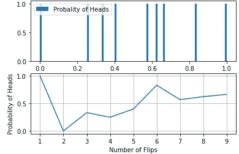
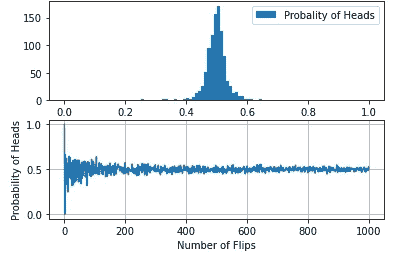
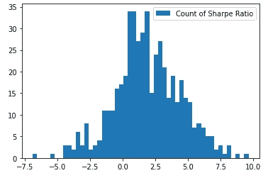
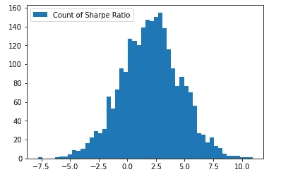

# 用 Python 实现金融中的大数定律

> 原文：<https://towardsdatascience.com/law-of-large-numbers-in-finance-using-python-86945eaee444?source=collection_archive---------44----------------------->

# **大数定律:**

你有没有想过赌场是怎么赚钱的？大数定律从统计学的早期阶段开始就是一个众所周知的概念。但是，我们不仅仅在统计学中发现它的用途。它的重要性体现在生活的各个领域，从赌博到汽车保险定价，甚至是猜测谁会赢得选举。

鸣谢:图片来自 Unsplash

大数定律指出，随着试验或观察次数的增加，观察到的或实际的概率接近预期的均值或理论值。这意味着随着样本量的增加，样本的平均值越来越接近总人口的平均值。

大数定律在从金融到商业到统计的各种分析领域都有应用。例如，在商业环境中，增长率往往是大数法则的代表。这表现为增长率或多或少地与经济增长率趋同。类似的情况也出现在金融领域，市值巨大的公司或多或少变得停滞不前，看不到之前观察到的增长。

理解这个概念的一个非常有力且被广泛引用的例子是观察硬币的翻转。最初的几次投掷不一定有一半的机会是正面或反面。对于一个结果可能有更高的累积概率。因此，相对频率可能与预期的 50%相差很远，比如说 10、20、50、100 次翻转。但另一方面，假设我们像掷硬币 a 一样掷 1000 次或 100000 次，那么得到正面的累积概率就更接近 50%的期望值。

我试图通过用 python 写代码来模拟这种情况。

在观察不同翻转次数的累积概率时，我们看到当整体翻转随着分布接近正态分布而开始变高时，概率收敛到期望值 50.0%。

仅仅 10 次翻转，我们就能看到以下内容:

抛 10 次硬币正面朝上的概率

对于 1000 次翻转，我们会看到以下内容:

投掷硬币 1000 次，正面集中到 50%的概率

因此，大数定律有助于我们理解为什么不能只相信一个结果。这就是为什么我们需要对从样本人群中得到的观察结果持怀疑态度，尤其是那些低数量的人群。

# **平均法则:**

有时人们倾向于把大数定律和平均数定律互换。他们不一样。大数定律是一个数学定理，随着试验次数的增加(大型试验)，理论上结果必然会收敛到预期的平均值，而平均定律或多或少是一个门外汉术语，认为试验的结果会在一个小样本内达到平衡。这不是数学原理，而是一厢情愿的想法。而这个非常糟糕的统计数据导致了‘赌徒谬误’的概念。

# **赌徒的谬误:**

这种谬误是一种信念，认为某个结果可能会发生，因为错误地理解了平均法则的基本原理。这导致“赌徒”相信，由于特定的结果最近没有发生，所以它现在有可能发生，从而达到平均。人们需要理解，各种结果的发生之间没有关系，它们是相互独立的。

虽然大数定律将有助于赌场在大量旋转中获得收益，即使它在轮盘赌的单次或几次旋转中失败，但是平均定律将不会帮助赌徒，因为假设轮盘现在将落在黑色上，就像它以前几次落在红色上一样。因此它纯粹是随机的，没有真正的平均律概念。

# **大数定律在交易和金融中的应用:**

大数定律在贸易和金融领域也有应用。它表明，大量具有较高夏普比率(回报风险比)的交易往往比少量交易更有效。

正如乔治索罗斯(George Soros)所言，重要的不是你是对是错，而是正确时你会赚多少，错误时你会亏多少，这让你的策略更有针对性。这归结为有效风险管理的原因。在这种情况下，根据大数定律，一个交易者可能大部分时间都是错的，但仍然是盈利的。

在很多这样的场景中，最大的挑战是理解一段时间实际上有多长。经验告诉我们，尽可能长时间的回溯测试会让我们更接近平均年化回报。让我们以低频交易策略为例。让我们试着去理解实现一个更真实的夏普战略和它的方差需要多长时间。

让我们假设一个经过回溯测试的策略的真实夏普比率为 2(假设这是低频交易的平均值)。让我们在大约 2 个月的 40 天交易期内试着认识到这一点。假设正态分布的平均回报率为 0.1%，让我们模拟一下，看看夏普比率随着交易(或试验)次数的增加而变化。

它的 python 代码如下。

只做了 15 笔交易，我们看到以下夏普比率:

进行了 15 次交易

上面的直方图告诉我们，只要有几笔交易，就会得到比回溯测试更低的夏普比率。

通过 500 笔交易，我们观察到以下情况:

500 笔交易

在 2500 笔交易中，我们看到了以下情况:

2500 笔交易

从上面的图表中，我们可以清楚地看到，随着轨迹的减少，我们可能会观察到更多的损失。但是最终，随着试验的不断增加，夏普比率趋向于回溯测试的数字(通过趋向于正态分布)。这里的诀窍是尽可能多地参与大量的试验。

# **行为心理学对 LLN 的入侵:**

大数定律的关键在于，首先，一次又一次地交易，其次，不要因为一次又一次地改变潜在的假设而中断交易。交易者确实倾向于改变策略，希望战胜市场，因此很难保持自我控制。在不气馁的情况下尽可能多的交易是一个非常困难的任务。因此,“耐心和财务”这个概念变得比以往任何时候都重要。这个信息超载的时代是一把双刃剑。它一方面帮助长期投资者做出明智的选择，但同时也干扰了另一个不耐烦的投资者对策略进行定期评估。这使投资者倾向于选择正确的股票，但在错误的时机退出交易策略，甚至在很早的时候退出交易游戏。

# **离别的思念:**

无论从回溯测试中得出的交易策略听起来有多好，它都取决于你无数次的执行和实践。交易是一份需要正确的技术和技能，经验和更重要的不断尝试的工作。

***来自《走向数据科学》编辑的提示:*** *虽然我们允许独立作者根据我们的* [*规则和指导方针*](/questions-96667b06af5) *发表文章，但我们并不认可每个作者的贡献。你不应该在没有寻求专业建议的情况下依赖一个作者的作品。详见我们的* [*读者术语*](/readers-terms-b5d780a700a4) *。*