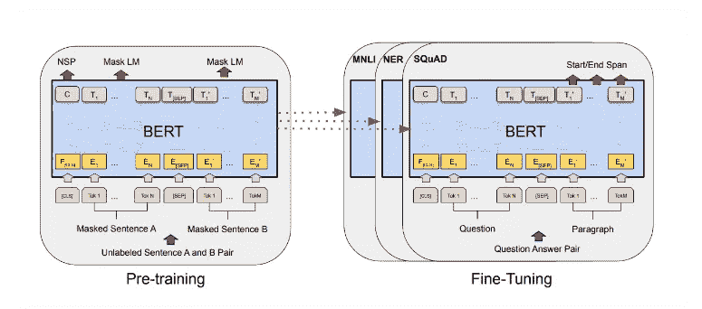
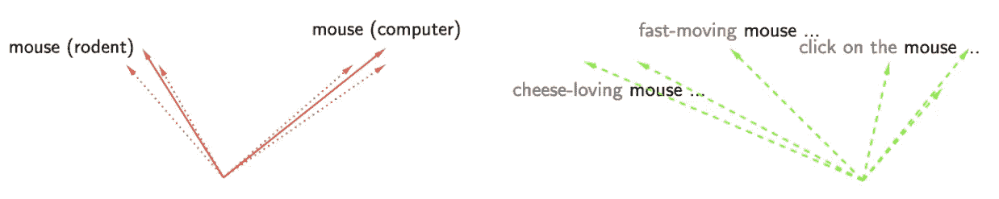
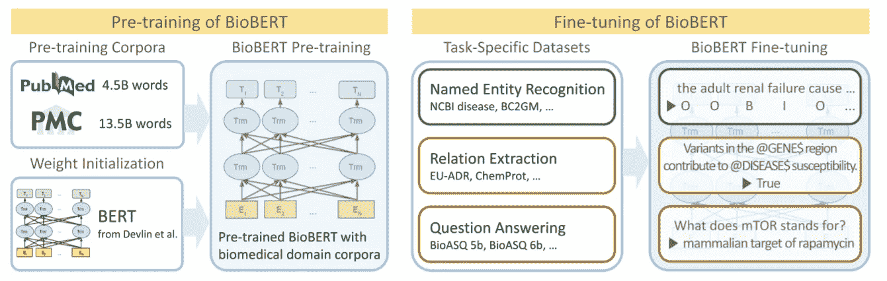

# 走向一个特定法律领域的伯特？

> 原文：<https://towardsdatascience.com/lawbert-towards-a-legal-domain-specific-bert-716886522b49?source=collection_archive---------21----------------------->

## 法律行业的特定领域 BERT

来源:[大英图书馆](https://www.bl.uk/collection-guides/modern-law-reports-and-legal-cases)

谷歌来自变形金刚的双向编码器表示(BERT)是 2018 年开发的大规模预训练自动编码语言模型。它的发展被描述为 NLP 社区的“ImageNet 时刻”，主要是因为 BERT 在执行下游 NLP 语言理解任务时非常熟练，只需要很少的反向传播和微调(通常只有 2-4 个时期)。

来源:[德夫林等人(2019 年)](https://arxiv.org/abs/1810.04805)

对于上下文，传统的单词嵌入(例如 word2vec 和 GloVe)是*非上下文的。t*hey*用单个静态向量表示每个单词令牌，通过单词共现而不是单词的顺序上下文来学习。当一词多义时(即同一个词有多个不同的意思)，这可能会有问题，这在法律中是很常见的。*

来源:[谷歌开发者](https://developers.google.com/machine-learning/crash-course/embeddings/translating-to-a-lower-dimensional-space)

例如，单个静态上下文无关向量将用于表示句子“柠檬是酸的”和“那辆车是柠檬”中的单词“柠檬”(即，对柠檬法则的有趣引用，该法则在新车被证明有缺陷时保护消费者)。

来源: [Ethayarajh (2019)](https://www.aclweb.org/anthology/D19-1006.pdf)

相比之下，BERT 是一个*上下文*模型，它基于每个单词周围的单词生成特定于上下文的表示。有趣的是，Ethayarajh (2019)表明，BERT 不会为每个词义创建一个“柠檬”的表示(左选项)，而是会创建无限多个“柠檬”的表示，每个表示都高度特定于其上下文(右选项)。这意味着不是生成单个密集向量来表示令牌“lemon”，而是将令牌动态地表示为“______ 是酸的”和“那辆车是 _____”。

伯特捕捉语言多义性的能力尤其适用于多义性大量存在的法律领域。例如，法律中的“对价”一词代表契约关系中的互惠理念，与该词通常的含义“考虑周到”有着不同的含义。此外，同一术语在成文法和判例法中可以有多种定义。例如,“工人”一词在欧盟法律中有四种不同的定义，甚至在同一份文件中也可以用来指不同种类的工人。因此，语境语言模型的发展对法律人工智能领域具有重要意义。

BERT 体系结构的技术细节超出了本文的范围(已经有大量文章讨论过)。然而，值得注意的是，BERT 的关键创新之一是它的双向性，即它克服了顺序文本解析的传统问题。值得注意的是，这个上下文中的双向并不意味着在*顺序*意义上的双向(即同时从左到右和从右到左进行解析)，而是在*同时*意义上的双向(即它同时从所有层中的令牌的左右上下文中学习信息)。这是通过使用像掩蔽 LMs (MLMs)和下一句预测(NSP)这样的方法来实现的，以获得更好的上下文单词嵌入结果。

# ***特定领域的优势***

来源:[大英百科全书](https://www.britannica.com/story/what-is-the-difference-between-criminal-law-and-civil-law)

虽然 BERT 在执行一般语言表示任务方面非常有效，但问题是——在未标记的通用维基百科和开源文章上接受训练——它缺乏特定领域的知识。这是一个重要的警告，因为语言模型只能和它的语料库一样好。打个比方，将一个普通的伯特模型应用于特定法律领域的问题，可能相当于让一个文科生去解决一个法律问题，而不是让一个学了多年法律知识的法律学生去解决。这是有问题的，因为在一般开源语料库(例如维基百科和新闻文章)中发现的语言和法律语言之间有很多脱节，这些语言可能是深奥的和基于拉丁语的。

虽然在撰写本文时尚未开发出法律领域特定的 BERT 模型，但已经开发的其他领域特定的 BERT 的示例包括 BioBERT(生物医学科学)、SciBERT(科学出版物)、FinBERT(金融通讯)和 ClinicalBERT(临床笔记)。尽管它们都具有特定于领域的 BERTs 的相似性，但是它们的体系结构表现出许多关键的不同。

# 培训特定法律领域的专家

我将探索一些培训特定领域业务技术人员的方法:

## *完全预先训练伯特*

这包括用大规模未标记的法律语料库(例如，法令、判例)完全重做 BERT 的预训练过程。从这个意义上说，特定领域的知识将在预培训过程中注入。这是 SCIVOCAB SciBERT 采用的方法。

虽然这确实大大提高了 BERT 在特定领域任务上的性能，但关键问题是完成重新训练所需的时间、成本和数据量可能太大而不可行。BERT-Base 本身是一个具有 12 个堆叠层和大约 1.1 亿个权重/参数的神经网络，其预训练语料库需要 33 亿个令牌。重新训练特定领域的 BERT 将需要类似数量的训练数据(例如，SciBERT 使用了 31.7 亿个令牌)。训练该模型需要一周或更长时间(例如，SCIVOCAB SciBERTs 在 v3 TPU 上训练需要一周时间),并且成本极高，这对于一般企业来说根本不可行。

## 进一步预培训 BERT

因此，一种折衷方案可能是不完全重新训练 BERT，而是从 BERT 初始化权重，并用合法的特定领域数据进一步对其进行预训练。这已被证明可以提高 BERT 的性能，Sun (2019)表明，经过进一步预训练的模型在所有七个数据集上的表现都优于原始的 BERT-Base 模型。

这似乎是最受欢迎的方法，用于 BioBERT、BASEVOCAB SciBERT 和 FinBERT。研究人员没有完全从头开始重新训练，而是用从 BERT-Base 学习到的权重初始化新的 BERT 模型，然后在特定领域的文本上训练它(例如 PubMed abstracts 和 BioBERT 的 PMC 全文文章)。Lee 等人(2020)报告说，BioBERT 在所有数据集上取得了比 BERT 更高的 F1、精度和召回分数。同样，Beltagy 等人(2019)报告称，SciBert 在生物医学、计算机科学和多领域任务上表现出色。

来源:[李等人(2019)](https://arxiv.org/ftp/arxiv/papers/1901/1901.08746.pdf)

## *微调伯特*

另一个更简单的选择是使用预先训练的 BERT，但在下游 NLP 任务中使用特定于法律领域的语料库对其进行微调。微调的概念来自迁移学习的领域，简单地说，这意味着采用一个旨在解决任务 *x* 的模型，并将其重新用于解决任务 *y* 。在实践中，它通常意味着采用预训练的 BERT 模型，并在最后添加一个未训练神经元的额外输出层，然后使用带标签的法律语料库进行训练(微调通常是一项监督任务)。在对特定于领域的数据进行微调之后，得到的模型将具有更新的权重，更接近于目标领域的特征和词汇

这种方法的优点是，它需要的数据少得多，而且训练起来明显更快、更便宜。鉴于 BERT-Base 的预训练已经编码了一般领域中大多数单词的知识，它只需要一些调整就可以适应法律上下文的功能。微调通常只需要 2-4 个时期(几分钟的事情)，而不是几周的时间跨度。这种方法还需要更少的数据(尽管它通常需要带标签的数据)，这使它更可行。

此外，如果需要，微调可以结合特定领域的预训练来完成，即它们不是互斥的方法。例如，BioBERT 首先接受生物医学领域特定语料库的预训练，然后在生物医学文本挖掘任务上进行微调，如命名实体识别、关系提取和 QA。

# **结论**

随着最近对像 OpenAI 的 GPT-3 这样的超大规模模型的大肆宣传，最初围绕 BERT 的兴奋似乎有些消退。然而，值得记住的是，BERT 仍然是一个非常强大和敏捷的模型，可以说它有更多的实际应用。从特定领域的 BERT(如 SciBERT 和 BioBERT)的经验来看，在特定领域的语料库上微调和/或预训练 BERT 可能会提高法律 NLP 任务的性能。为此，根据研究人员的时间和金钱资源，有各种方法来改善和调整伯特的表现。