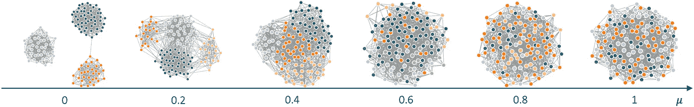
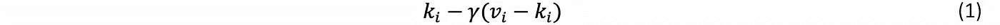
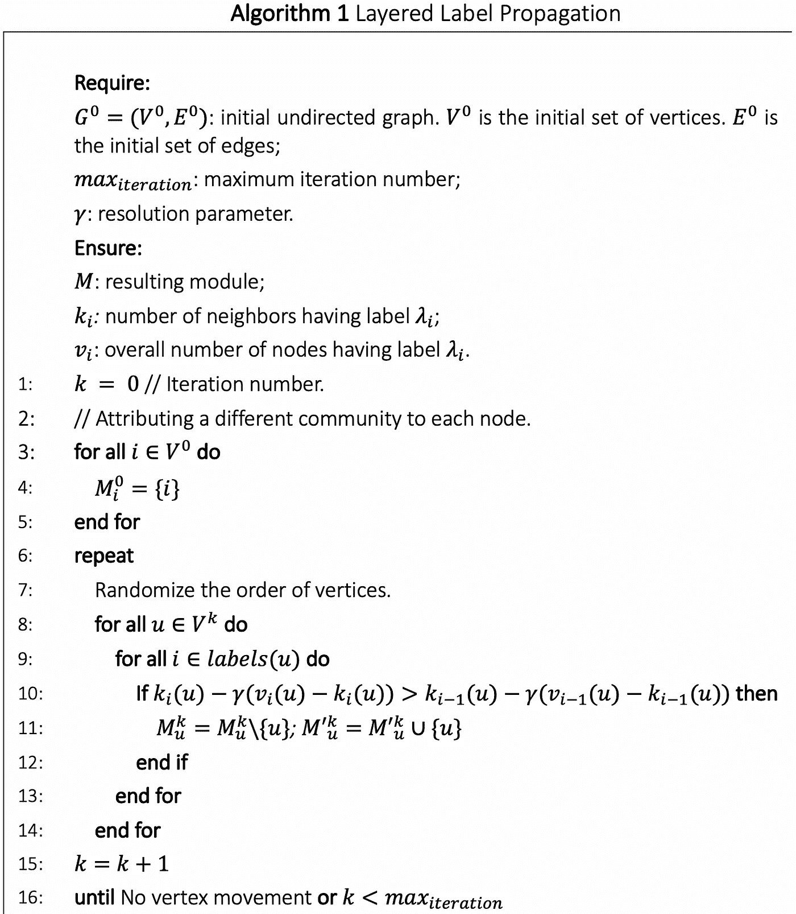

# 分层标签传播算法

> 原文：<https://towardsdatascience.com/layered-label-propagation-algorithm-1b181b982e80?source=collection_archive---------46----------------------->

## 一种社区发现算法

在运行分层标签传播算法之后，具有可变混合参数(μ)和固定节点数以及平均节点度的 lanchi netti-Fortunato-radic chi 基准合成网络。

分层标签传播算法(LLP) [1]的发展强烈地基于旧的标签传播(LP) [2]。后者从给网络中的每个节点分配不同的社区开始。然后，在每一轮的开始，节点的顺序被随机化。在每一轮中，每个节点将被分配在直接邻居中更有代表性的社区。只要社区没有发生变化，或者达到给定的迭代次数，LP 就结束。它不依赖于任何目标函数的优化，并且不需要关于网络中存在的社区的先验信息(无监督的)。虽然，可以用近似集输入(半监督)。根据定义，该算法本质上是局部的，在边的数量上是(近似)线性的，并且在图中需要很少的通道。这些是允许对真实网络进行分析的基本特征。寻找最优划分的问题已经被证明等价于寻找动力学 Potts 模型[1]的哈密顿量的局部最小值。虽然这个问题有一个平凡的全局最优解，将整个网络视为一个集群，但这不是我们感兴趣的。LP 避免了这样的解决方案，因为本地搜索的固有动态性。虽然这通常被认为是一个缺点，但在这种情况下，它是 LP 算法工作的一个基本特征。

尽管使用了类似的方法，LLP 不仅考虑了邻居中的节点，还考虑了剩余网络中的节点。迭代过程是一样的，区别在于它优化的值。在这种情况下，分配的社区将最大化:

𝑘𝑖是在给定节点的邻域中带有标签𝜆𝑖的节点的数量，而𝑣𝑖是整个图中以相同方式标记的总数。𝛾是分辨率参数，通过其在整个网络中的通常存在来缓冲属于邻域中给定社区的节点的数量。每当接近 0 时，LLP 就减少到 LP。预计对于较低的𝛾值，该算法将突出显示较少、较大和稀疏的聚类。对于更高的值，簇变得更小、更密集并增加它们的数量。可以说，没有一个先验的度量来说明哪个值对被分析的网络更好。算法 1 中 LLP 的伪代码。

与 LLP 类似，已经提出了其他算法，它们执行相同的步骤序列，但最大化不同的值，如模块化。

利用多个处理器的并行实现可以显著地加速该算法在我们的机器上的执行。

# 参考

[1] P. Boldi，M. Rosa，M. Santini 和 S. Vigna，“分层标签传播:用于压缩社交网络的多分辨率无坐标排序”，载于 *WWW '11 第 20 届国际万维网会议论文集*，2011 年；

[2] N. Raghavan，R. Albert 和 s .鸠摩罗王，“检测大规模网络中社区结构的近线性时间算法”，*物理评论 E 25 周年里程碑，*第 76 卷第 3 期，2007 年。