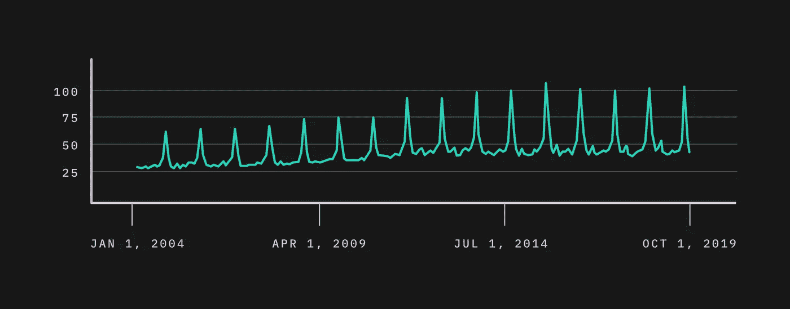
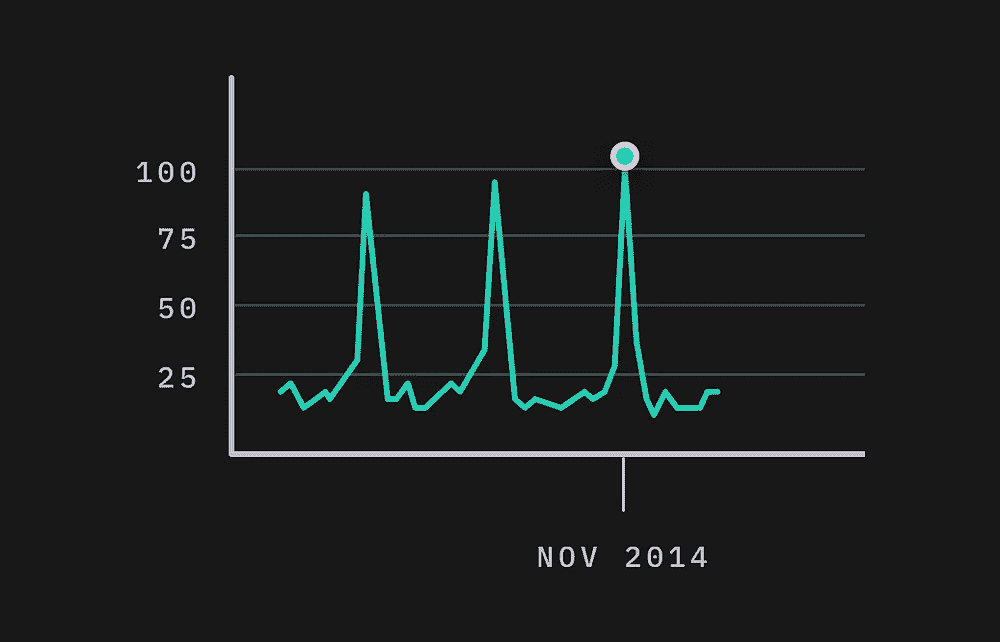

# 数据层:背景如何帮助做出更好的决策

> 原文：<https://towardsdatascience.com/layers-of-data-how-context-helps-make-better-decisions-4432b855573c?source=collection_archive---------47----------------------->

2012 年，《哈佛商业评论》宣布数据科学家的角色是“21 世纪最性感的工作”。Glassdoor 在 2016 年将数据科学家列为他们年度最佳工作名单的第一位，这更是火上浇油。他们 2019 年的头号工作？你猜对了:数据科学家。那么，这些“受过培训、有好奇心在大数据世界中做出发现的高级专业人员”到底有什么特别性感的地方呢？首先，现在的数据比以往任何时候都多，而且大多数数据都是最近才创建的。2017 年，数据管理平台 Domo 估计，所有数据中有 90%是在前两年内创建的——每天有 2.5 万亿字节的数据*。难怪公司对如何最好地利用这些前所未有的数据感兴趣。然而，大量的数据不一定是相关的数据。这种不一致导致公司在过去十年中争相实施程序来解释这些数据并产生可操作的见解。正如杜克大学经济学家丹·艾瑞里在 2013 年所说:*

> *“大数据就像青少年性行为:每个人都在谈论它，没有人真正知道如何去做，每个人都认为其他人都在做，所以每个人都声称自己在做……”*

因此，数据科学家对这些海量信息的理解能力变得非常有价值。通过绘制不同数据点之间的联系，并评估这些数据为何重要的更大图景，数据科学家能够帮助公司获得有意义的见解，从而做出更好的决策。

**为什么没有上下文数据毫无意义**

从表面上看，数据只是数字、单词等的集合。只有当数据与上下文一起呈现时，它才变得有意义。以谷歌趋势图为例:

没有任何语境，完全没有意义。这个频率肯定有周期性的东西，但是还不完全清楚这个频率是什么或者为什么会发生，或者它为什么重要。现在，如果我告诉你趋势图是关于搜索词“馅饼”的，你可以开始对数据得出有意义的结论:也就是说，每年都有一些东西导致搜索词“馅饼”的搜索量激增。如果我继续提供上下文线索，数据会变得越来越相关。例如，请允许我进一步澄清，搜索仅限于美国，峰值似乎集中在一个主要峰值和一个次要峰值上:

知道了在美国对“馅饼”的搜索在每年的 11 月达到高峰，我们就可以开始推断这些数据意味着什么。在这一点上，你可能会对自己说“很明显，在感恩节前后搜索馅饼的次数会激增。”然而，这正是上下文变得至关重要的地方。如果你在美国出生和长大，你很可能知道感恩节在 11 月，而且馅饼经常在感恩节供应，因此馅饼搜索的激增与人们计划感恩节庆祝活动直接相关。然而，如果你不是在美国长大的，你可能缺乏上下文参考来理解为什么馅饼搜索在美国的 11 月达到高峰。

那么三月份的小高峰是怎么回事呢？在这一点上，你可能已经猜到了，3 月份的峰值很可能是每年 3 月 14 日(3.14…明白吗？).同样，这些数据只对那些拥有提供相关性的适当上下文的人有洞察力。如果你从未听说过圆周率日，3 月份的数据峰值可能不会给你提供太多的见解。

有了适当的上下文，可以根据数据做出决策，也可以根据数据的含义做出决策。在我们的 pie 示例中，假设的 pie 制造商的 CMO 将配备有关于流量习惯的信息(数据)，以及与这些习惯相关的热门话题(上下文)。总之，这可以支持广告活动，其中数据通知何时以及如何到达消费者，并且上下文通知他们可能发现相关和有趣的内容。

值得一提的是，这个例子过于简化，可能需要通过定量和定性手段获得额外的数据和背景。无论如何，希望这些性感的数据科学家能够通过研究趋势和背景线索来帮助改善决策，这一点变得越来越清楚。可能不太清楚的是，他们如何可能开始用 2.5 万亿字节的日常数据做到这一点。这就是技术进入等式的地方。

**计算机如何帮助导航上下文线索**

在我们进入芯片和算法之前，让我们花点时间想想是什么让数据科学家能够如此出色地完成他们的工作。广义地说，他们都可以使用现存的最强大的计算机:人脑。神经科学家 Bobby Kasthuri 博士致力于“以前所未有的规模绘制大脑地图”，他估计一个人的大脑有大约 1000 亿个连接连接超过 1000 亿个*神经元*。正是这种极端的复杂性导致了意识和认知。实际上，这种复杂性和力量是人类之所以为人的原因。生物过程和它们影响的高级行为特征之间的这种分离最终是神经科学和认知科学之间的差异。这一切都回避了一个问题:如果我们能制造一台像人脑一样复杂的计算机，它能“思考”吗？

截至这篇论文发表时，人类大脑的复杂程度比我们可用的最强大的计算机还要高几个数量级，因此，真正的计算机认知距离现实还有很长的路要走。如果我们看看神经科学/认知科学的关系，电气工程和计算机科学之间有明显的相似之处。计算机行为背后的理论(计算机科学)受限于硬件的实际约束(电子工程)。因此，计算机需要人类的输入和指令才能以某种方式运行。换句话说，它们需要数据(输入)和上下文(指令)来生成一些有价值的输出。数据科学家可以利用他们的经验、洞察力、研究和批判性思维来帮助计算机“学习”与给定数据集相关的上下文。反过来，计算机可以在给定的上下文中快速独立地处理这些数据。这就是机器学习的有效工作方式。一旦经过训练，计算机可以接受新的输入，并确定该输入是否与已建立的上下文匹配，并相应地采取行动，提供根据已建立的上下文理解进行判断的新输出。这个循环本质上就是我们所说的人工智能。

尽管有了这些基本的工具，计算机离思考还有很长的路要走。正如柳文欢·埃齐奥尼在《T4》中所说的，如何知道人工智能是否会毁灭文明:

> 机器只拥有人类丰富多样的学习能力的一小部分。说机器学习就像说小企鹅知道如何捕鱼。事实是，成年企鹅会游泳，捕捉鱼，消化鱼，吐出到它们的嘴里，然后把食物放进它们孩子的嘴里。人工智能同样被人类科学家和工程师填鸭式喂养。
> 
> 与机器学习相反，人类学习将个人动机(“我想独立于父母开车”)映射到战略学习计划(“参加驾驶培训，周末练习”)。一个人制定具体的学习目标(“在平行停车方面变得更好”)，收集并标记数据(“这次角度错了”)，并融入外部反馈和背景知识(“讲师解释了如何使用侧镜”)。人类识别、框定和塑造学习问题。这些人类的能力没有一项是机器可以远程复制的。机器可以执行超人的统计计算，但这仅仅是学习的最后一英里。"

**我们如何利用人工智能做出更好的决策**

显然，技术“思考”的能力与我们自己的能力还相差甚远。然而，当我们将人工智能视为改善我们决策方式的几个可用工具之一时，它仍然提供了显著的好处。

如果计算机缺乏真正“思考”和生成战略决策的能力，我们还应该使用人工“智能”这个术语吗？如果我们按照以下定义来考虑人工智能，我会说是的:人工智能是一个依赖人类输入的计算机系统，以便在给定的数据环境下处理可能的输出。没有人类的智能，人工智能是没有意义的。

想想人工智能的这个定义，很明显，任何输出的价值都将受到数据准确性和上下文相关性的限制。此外，上下文的范围将是“影响”任何结果的最大驱动因素。如果我们要接受人工智能的功能至少类似于人类智能，尽管功能远不如人类智能，那么我们应该首先考虑如何利用我们自己的智能来为决策提供信息，这是有道理的。考虑一下机器学习公司 OnCorps 的创始人兼首席执行官、埃森哲前首席技术策略师 Bob Suh 的话:

*情商高的人优势明显。他们学习其他人的模式，知道如何传达同理心，并根据他们对他人反应的预期，仔细权衡回应，选择最佳回应。情商帮助领导者做出更好的决策，产生更好的结果。*

考虑到情商的这一定义，模式是从经过仔细权衡(上下文)的响应(数据)中得出的。所有这些都符合我们之前对机器学习的定义。主要的补充是在 Suh 的描述中，高情商的人知道“如何传达同理心”这是人类的理解和人工智能的输出可以一起行动，以更好地做出决策的地方。

最普遍接受的同理心定义(也是 Suh 提到的与高情商个体相关的定义)是“对他人态度的心理认同或替代体验。”较少讨论的是移情的第二个定义，它是“赋予一个物体，如一个自然物体或艺术品，自身存在的情感或态度的想象力。”如果我们认为“要做的决定”是一个我们可以归因于自己的感觉或态度的对象，那么我们就可以看到决策是一系列的行动，在这些行动中，我们将自己的*情感*背景用于最终结果。这就是人脑的复杂性取代计算机能力的地方，并允许我们做出比计算机本身更复杂的决定。

**避免语境偏见的危险**

在我们上面提到的例子中，正是个人情绪和经历的可变性最终允许了复杂的决策。每个人都会对输入指导和输出评估做出不同的、略有细微差别的解释。因此，考虑用于训练 AI 的上下文如何导致有偏见的结果是至关重要的。虽然个人可能会对如何解释和使用任何人工智能输出产生明显的偏见，但本节将特别关注输入偏见如何导致重大但往往隐藏的问题。为什么？因为如果你的任务是仅仅基于输出做出决策，你可能会缺乏任何关于是什么形成了输入的背景，这可能会导致你对数据的完全不正确的解释。

历史偏见是有偏见的最明显的例子之一。当由于文化、法律和/或系统原因，数据集被限制在一个小的上下文子集内，可能不再有效时，就会出现这种情况。举个例子，广泛报道的问题与亚马逊试图创建一个人工智能算法来审查新员工并为公司的发展职位找到最佳候选人有关。一旦实施，结果明显倾向于推荐男性候选人而不是女性候选人。原因？亚马逊使用十年的应用程序作为成功/失败的背景来建立这个系统。问题是绝大多数技术职位的候选人和雇员都是男性。虽然众所周知，历史上(以及现在)技术行业的工作都是由男性主导的，但任何数据模型都必须考虑这一历史背景，以防止有偏见的招聘决策。

偏置结果的另一个例子涉及先前关于人类经验和视角的讨论，用于向数据集提供上下文。有一种现象与人类所说的他们的感受/想法和他们的大脑实际反应之间的差异有关。正如我们之前讨论的，我们可以将处理(神经科学)与输出(认知)分开。在许多情况下，我们的生活经历导致我们(通常是下意识地)改变我们的输出，以满足我们认为可以接受的东西(社会的、情境的或其他的)。情感本质上是主观的。这当然会影响我们训练数据模型的方式，这会给任何人工智能输出增加偏见。

如果我们认识到背景主观性会固有地偏向数据训练，那么我们必须检查这对基于这些主观模型的现实世界决策有什么潜在影响。2016 年 5 月，ProPublica 对语境偏见的影响进行了最早和最彻底的调查。他们对美国各地法庭使用的“风险评估”算法进行了彻底的分析，以确定通过司法系统的个人再犯的风险。最终，他们发现这些算法明显更有可能将黑人被告识别为比白人被告具有更高的再犯风险，这导致这些人的刑期明显更高。问题是这与实际的再犯率没有关联。白人被告与其实际比率相比长期得分较低，而黑人被告与其实际比率相比长期得分较高。事实上，种族间的再犯率比分数显示的要接近得多。虽然正在讨论的算法的具体设计是专有的，因此我们无法最终确定其失败的确切原因，但它揭示了当我们“出错”时可能发生的可怕后果。人们失去了多年的生命，因为没有考虑到背景偏见可能会不正确地扭曲输出。

如果有空间对影响人工智能输出的背景偏见产生如此重大的、潜在的改变生活的后果，它回避了问题:我们到底应该使用人工智能吗？与人类大脑相比，它是否仍然过于初级，无法为我们提供任何有意义的东西？简而言之，不，我们不应该放弃人工智能带来的潜在好处。然而，我们必须时刻注意技术如何将上下文应用于数据，上下文如何增加偏差，以及这对未来的任何输出意味着什么。如果我们认识到人工智能*对*有什么好处:也就是说，它只是我们可以用来补充决策过程的许多工具之一，那么我们就可以开始利用我们个人和商业生活中的潜在重大利益。