# 高血压药物综述的 LDA 主题建模

> 原文：<https://towardsdatascience.com/lda-topic-modeling-for-high-blood-pressure-drugs-reviews-ff40af2ee319?source=collection_archive---------34----------------------->


图片由作者“联合国新冠肺炎对策”提供

主题建模是一种利用无监督机器学习算法的文本分析技术。主题建模的最终目标是在大量文本文档中发现主题，并发现隐藏的主题。语料库中的每个文档将由至少一个主题组成，如果不是多个主题的话。主题建模对于文档聚类和非结构化文本的信息检索非常有用。

[**潜在狄利克雷分配**](http://blog.echen.me/2011/08/22/introduction-to-latent-dirichlet-allocation/) (LDA)是一种用于主题建模的算法，用于将文档中的文本聚类成主题列表。

这里我们将把 LDA 应用于一组高血压药物综述文档，并把它们分成主题。

# 动机

目标是通过对这些分组主题的分析，从这些评论中获得深刻见解:

*   从综述中探索所有高血压药物共有的潜在主题。
*   预测给定评论文本的评分。

我们开始吧！

# 数据集

该分析中使用的数据集是从 WebMD 药物评论数据集(可从 [Kaggle](https://www.kaggle.com/rohanharode07/webmd-drug-reviews-dataset) 下载)中提取的约 18，000 份患者对用于治疗高血压的药物的评论列表。数据提供者通过抓取 [WebMD](https://www.webmd.com/drugs/2/index) 站点获取数据集。原始数据集中约有 36 万行独特的评论，更新到 2020 年 3 月。

```
import pandas as pd# Read data into papers
drug_df = pd.read_csv('C:/Users/Johnny Phua/Metis/Project4/Drug Review/webmd.csv')hbp_drug_df = drug_df[drug_df["Condition"] == 'High Blood Pressure']
```

看一眼数据。

```
print(len(hbp_drug_df))
hbp_drug_df.head()
```

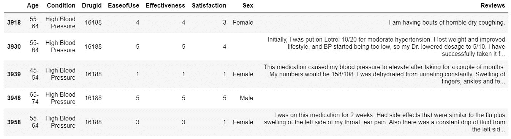

图 1:药品评论数据集的前 5 行。

# 数据预处理

执行了以下步骤:

*   **小写**单词并删除非字母字符。
*   字 **<三字**被**去掉**。
*   **分词**:将文本拆分成单词。
*   所有**停用字**都被移除。
*   单词被**词条化**:第三人称的单词被改为第一人称，过去时态和将来时态的动词被改为现在时态。
*   单词被词干化:单词被还原成它们的词根形式。

以下功能用于小写单词、删除非字母字符以及删除少于 3 个字符的单词:

```
import redef clean_non_alpha(text):
    return re.sub('[^a-zA-Z]',' ', str(text))def remove_short_word(text):
    return  re.sub(r'\b\w{1,3}\b', '', str(text))def convert_to_lower(text):
    return re.sub(r'([A-Z])', lambda m: m.group(1).lower(),  
    str(text))
```

**标记化**

标记化就是将一个字符串拆分成一系列标记的过程**。标记是整体的一部分，所以在我们的上下文中，单词是句子中的标记。**

```
from nltk.tokenize import RegexpTokenizerdef get_tokenize(text):
    """
    function to tokenize text to list of words.
    """
    tokenizer = RegexpTokenizer(r'\w+')
    return tokenizer.tokenize(str(text))
```

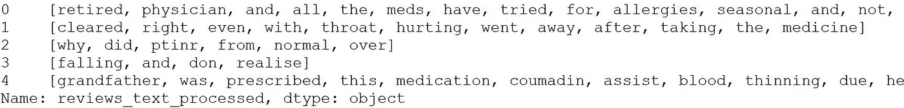

图 2:标记化后列表中的单词

**删除停用词、词汇化、词干**

下面的函数做的工作是去除停止字，词汇化和词干化。

```
from nltk.stem import WordNetLemmatizer
lemma = WordNetLemmatizer()
from nltk.stem import PorterStemmer
stemmer = PorterStemmer()
from nltk.corpus import stopwords
stop_words = stopwords.words('english')def remove_stopwords(token):
    """
    function to remove stopwords
    """
    return [item for item in token if item not in stop_words]def clean_lemmatization(token):
    #from nltk.stem import WordNetLemmatizer
    #lemma = WordNetLemmatizer()
    return [lemma.lemmatize(word=w,pos='v') for w in token]def clean_stem(token):
    #from nltk.stem import PorterStemmer
    #stemmer = PorterStemmer()
    return [stemmer.stem(i) for i in token]
```


图 3:去除停用词、词汇化和词干后的标记。

数据集现在是干净的，并且格式正确。它现在可以用于 LDA 建模。

然而，在我们开始训练模型之前，我们将如何决定使主题可解释性的最佳主题数量。

**1)主题建模中主题数(k)的确定方法是什么？**

确定主题模型的最佳主题数(k)的方法之一是通过比较 C_V 一致性分数。最佳的话题数量会产生最高的 C_V 连贯分数。Coherence 查看每个生成的主题中最频繁出现的单词，对它们之间的语义相似性进行评级(使用 UCI 或 Umass 进行成对计算)，然后找到模型中所有主题的平均一致性分数。([http://qp ple . com/topic-coherence-to-evaluate-topic-models/](http://qpleple.com/topic-coherence-to-evaluate-topic-models/))

我们如何评估和提高模型结果的可解释性？

一旦我们选择了主题的最佳数量，接下来要问的问题是如何最好地评估和提高这些主题的可解释性。一种方法是可视化我们的主题模型的结果，以确保它们对我们的场景有意义。我们可以使用 pyLDAvis 工具来可视化您的 LDA 模型对主题及其热门词的拟合。

# 一袋单词

从“reviews_docs”创建一个字典，包含一个单词在训练集中出现的次数。

```
from gensim import corpora
dictionary = corpora.Dictionary(reviews) 
```

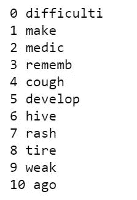

使用 Gensim.filter_extremes 内置函数过滤出出现在，

*   少于 15 份文件(绝对数量)或
*   超过 0.5 个文档(总语料库大小的一部分，而不是绝对数量)。
*   在上述两个步骤之后，只保留那些出现次数为 11 及以上的标记，换句话说，只保留前 2130 个最频繁的标记。

通过检查整个单词字典的频率分布(按频率降序排列)，我们可以知道前 2130 个单词/记号对于每个记号具有 11 个及以上的出现次数。

```
# first get a list of all words
all_words = [word for item in      list(hbp_drug_df['reviews_text_processed']) for word in item]# use nltk FreqDist to get a frequency distribution of all words
fdist = FreqDist(all_words) # choose k and visually inspect the bottom 10 words of the top k
k = 2130
top_k_words = fdist.most_common(k)
top_k_words[-10:]
```

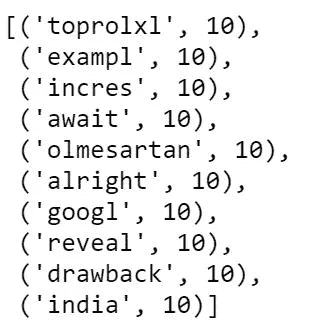

图 5:语料库的词频分布。

将上述过滤器应用于 gensim 字典:

```
dictionary.filter_extremes(no_below=15, no_above=0.5, keep_n=2130)
```

然后，我们为每个文档创建一个文档单词矩阵，报告有多少单词以及这些单词出现了多少次。将此保存到‘doc _ term _ matrix’。

```
from gensim import corpora
doc_term_matrix = [dictionary.doc2bow(rev) for rev in reviews]
```

# 使用单词包运行 LDA

准备好字典和 doc_term_matrix 后，现在我们可以使用**gensim . models . LDA model . LDA model**来训练 LDA 模型。

然而，此时，我们需要问的下一个问题是，我们应该使用多少个主题(k)来训练我们的模型？我们可以利用 c_v coherence score 和 pyLDAvis 可视化工具来决定我们的模型的最佳主题数量。

计算 c_v 一致性分数:

```
#Calculate the c_v Coherence Score for different k from 1 to 10.
from tqdm import tqdm
from gensim.models import LdaModel

coherenceList_cv = []
num_topics_list = np.arange(1,10)for num_topics in tqdm(num_topics_list):

    lda_model =  LdaModel(corpus=doc_term_matrix,id2word=dictionary,num_topics=num_topics,random_state=100, update_every=1, chunksize=1000, passes=50, alpha='auto', per_word_topics=True)

    cm_cv = CoherenceModel(model=lda_model, corpus=doc_term_matrix, texts=reviews, dictionary=dictionary, coherence='c_v')

    coherenceList_cv.append(cm_cv.get_coherence())
```

绘制 pyLDAvis:

```
# Plotting tools
import pyLDAvis
import pyLDAvis.gensim# Visualize the topics
pyLDAvis.enable_notebook()
vis = pyLDAvis.gensim.prepare(lda_model, doc_term_matrix, dictionary)
vis
```

**什么是话题连贯？**

连贯性测量在每个生成的主题中最频繁出现的单词，评定它们之间的语义相似性；利用 UCI 或 Umass 来执行成对计算；然后为该模型计算所有主题的平均[一致性分数](http://qpleple.com/topic-coherence-to-evaluate-topic-models/)。

从下面我们的模型中不同 k 个主题的 c_v 一致性分数分布可以看出，主题数 k=3 和 k=5 给出了同样高的分数。

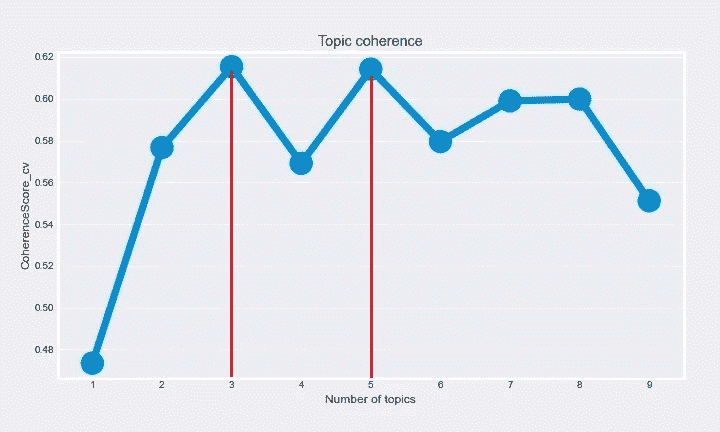

图 6:k 个主题的 c_v 连贯分数

然而，如果我们绘制 pyLDAvis 图，很明显，k=3 将比 k=5 给出更有希望的结果。可以注意到，对于 k=5，主题 1、2 和 3 彼此高度重叠。而对于 k=3，主题在不同的象限中被很好地分开。

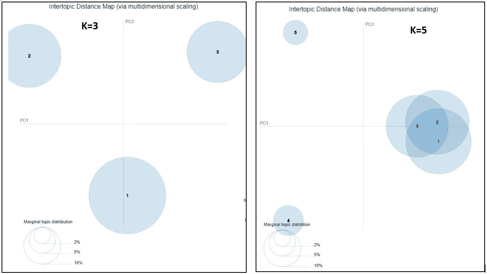

图 7:k 从 1 到 10 的 pyLDAvis 图

t-SNE 图也清楚地表明，k=3 比 k=5 好得多，因为可以注意到，当 k=5 时，有 3 个主题相互重叠。

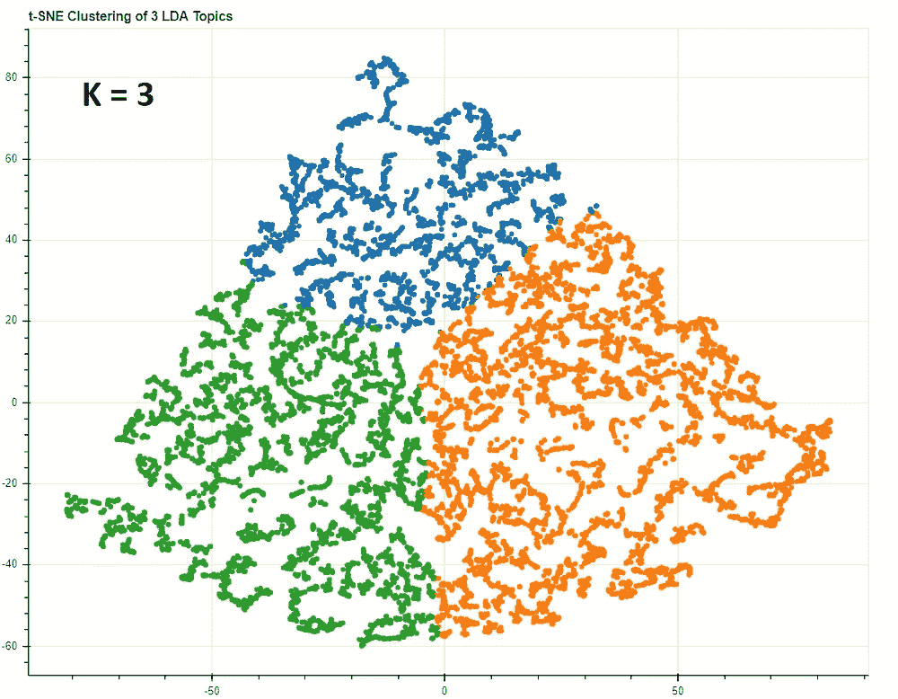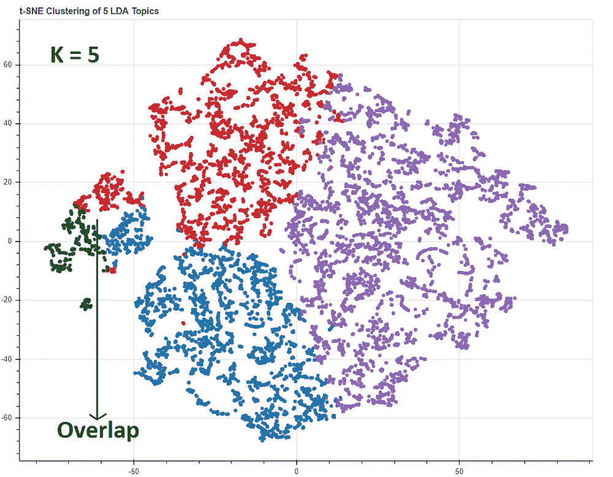

图 8:k = 3 和 k=5 时的 t-SNE 图

现在，我们可以使用 k=3 来生成 LDA 模型。让α和β超参数自动生成。

```
import gensim# Creating the object for LDA model using gensim library
LDA = gensim.models.ldamodel.LdaModel# Build LDA model
lda_model = LDA(corpus=doc_term_matrix, id2word=dictionary, num_topics=3, random_state=100, chunksize=1000, passes=50, update_every=1, alpha='auto', eta='auto', per_word_topics=True)
```

您可以使用 *lda_model.show_topic():* 查看每个主题的前 10 个关键词以及每个关键词的权重(重要性)

0 [('天'，0.043550313)，('感觉'，0.03116778)，('时间'，0.030068435)，('得到'，0.0252915)，('喜欢'，0.020811914)，('迪子'，0.017624224)，('使'，0.017559748)，('胎'，0.01706512

1 [('压'，0.046297483)，('效'，0.045646794)，('血'，0.044705234)，('方'，0.041772064)，('功'，0.027191896)，('年'，0.026943726)，('医'，0.024851086)，('下'，0.0203996)。

2 [('咳嗽'，0.038522985)，('疼痛'，0.021691399)，('药物'，0.02127608)，(' caus '，0.017660549)，(' sever '，0.01583576)，('走'，0.01558094)，('医生'，0.01529741)，('停'，0.015242598

# 词云

我们来看看模型的词云分布。

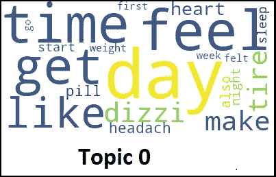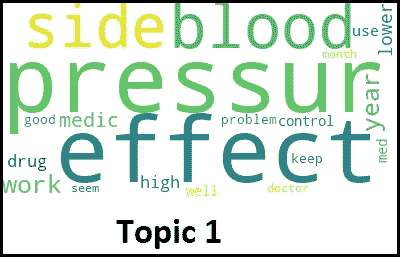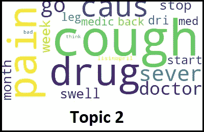

图 9:单词云

通过参考高血压药物的一些常见副作用的列表，可以注意到主题 0 和主题 2 显示了下面提到的列表中的一些副作用。

高血压药物的一些常见副作用包括:

**咳嗽**

腹泻或便秘

**头晕**或头晕

剧烈而突然的脚部**疼痛**

感到紧张

感觉**疲倦**、虚弱、困倦或缺乏能量

**头痛**

恶心或呕吐

皮疹

无需尝试就能减肥或增重

*   **腿肿**

# 获得洞察力

通过从数据集中随机读取耐心的评论，可以注意到，主题 0 和主题 2 的评论显示耐心对于这两个主题经历了不同类型的副作用。而专题 2 的综述表明，这类患者的耐心比专题 0 经历了更严重的副作用，因为专题 2 的患者采取了诸如停止服用该药物并改用另一种药物的行动。然而，对于以主题 1 为主导主题的耐心的评论显示，该药物对他们有效，并且仅经历轻微的副作用症状。

现在我们可以给这个主题贴上如下标签:

主题 0:副作用类型 I —“头晕”、“疲倦”、“头痛”

话题 1:药物有效

主题 2:第二类副作用——“咳嗽”、“肿胀”、“疼痛”

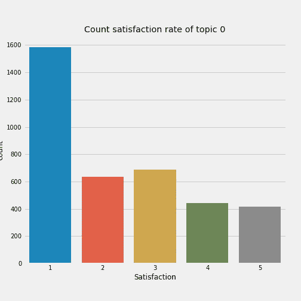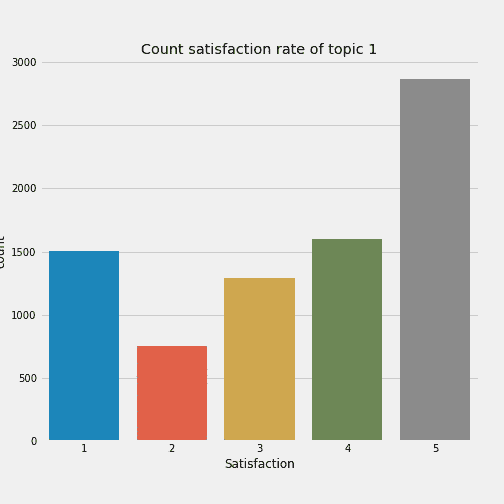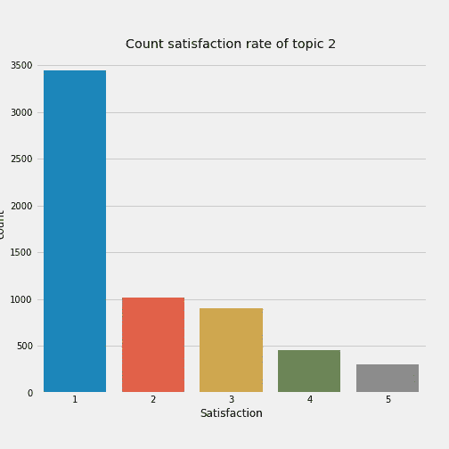

图 10:各主题满意率统计

从上述三幅图中可以看出，在主题 1 中聚集了评论的患者对等级为 3 及以上的药物最满意。而主题 0 和主题 2 的患者对 2 级及以下的评分大多不满意。

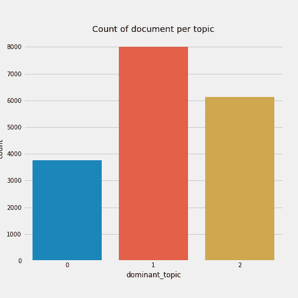

图 11:每个主题的文档数。

从上面的图表可以看出，大约 55%服用高血压药物的患者会出现某种副作用症状。