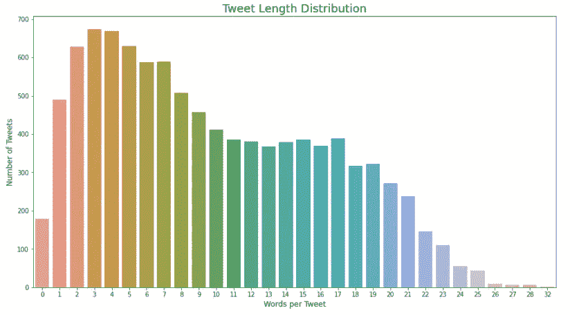
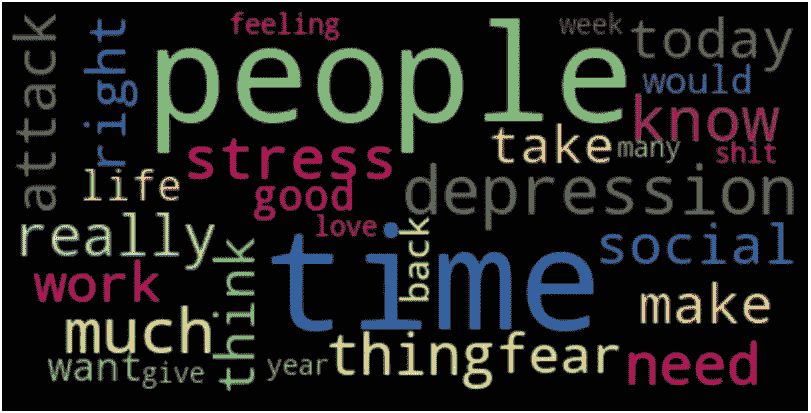
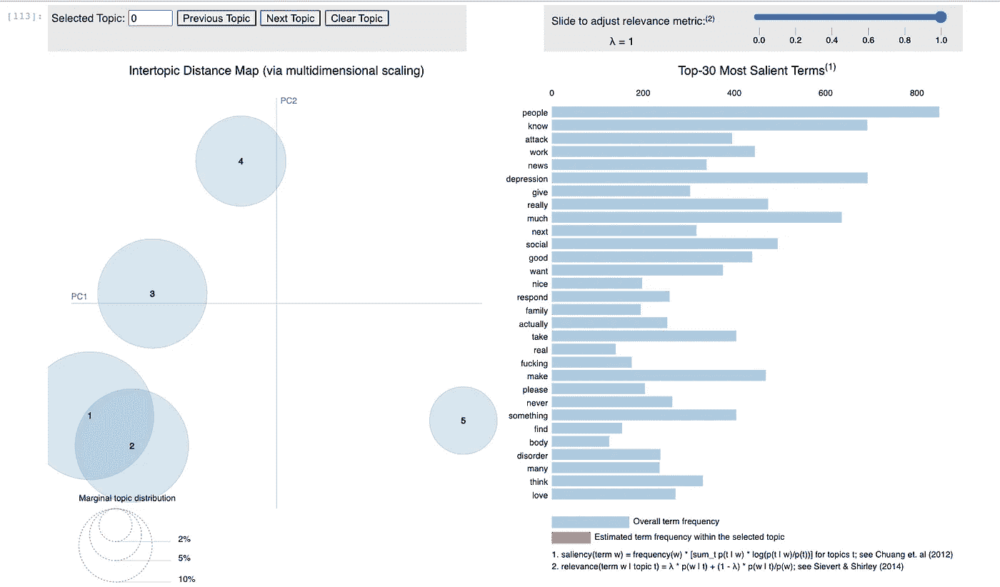

# 基于 Tweets 的 LDA 主题建模

> 原文：<https://towardsdatascience.com/lda-topic-modeling-with-tweets-deff37c0e131?source=collection_archive---------13----------------------->

## 理解非结构化文本


凯文在 [Unsplash](https://unsplash.com?utm_source=medium&utm_medium=referral) 上[悲伤](https://unsplash.com/@grievek1610begur?utm_source=medium&utm_medium=referral)的照片

## 问题和目的

有了一些为文本分类构建 NLP 模型的经验，我一直在进一步思考如何处理完全非结构化的文本数据。每天大约有 [5 亿条推文在 Twitter 上发布](https://www.internetlivestats.com/twitter-statistics/)，Twitter 是文本数据的巨大来源。人们在推特上谈论什么？这些推文可以通过编程组织成主题吗？人们对你的产品或公司有什么看法？可以发现对进一步分析/建模有用的模式吗？嗯——我想我们会找到答案的。

对于这个项目，我决定使用 GetOldTweets3 python 库从 twitters API 中提取的 tweets。用于这个项目的任何笔记本都可以在我的 [GitHub](https://github.com/RobbieZifchak/nlp-tweets) 上找到。

## GetOldTweets3

```
import GetOldTweets3 as got
```

*   使用“got”别名导入 GetOldTweets3 库，以便于使用
*   有很多参数可以玩，即用户名，位置，日期。我选择使用“通过查询搜索获取 tweets ”,这样我就可以指定一个特定的主题。

```
tweetCriteria =    got.manager.TweetCriteria().setQuerySearch('anxiety')\
                           .setSince("2018-06-30")\
                           .setUntil("2020-06-30")\
                           .setNear('New York')\
                           .setMaxTweets(10000)tweet_object = got.manager.TweetManager.getTweets(tweetCriteria)
```

我选择查看纽约地区两年时间内包含“焦虑”一词的推文，希望了解人们可能在推文中表达他们的焦虑。是什么引起的？人有自残的风险吗？我们能找到任何有价值的特定主题来潜在地执行进一步的建模吗？

在进行 API 调用后，我用下面的代码片段构建了一个数据帧:

这里感兴趣的主要值只是文本。我不会对用户名、日期等感兴趣。此刻。

## 预处理文本

在我真正对文本数据做任何有用的事情之前，它必须被预处理成机器可读的数字输入。我已经在[之前的博客](https://medium.com/swlh/quick-text-pre-processing-c444f0ed9dcc)中介绍了下面的步骤，但是我将在这里列出一般的步骤。

1.  删除 URL
2.  标记每条推文
3.  删除停用词、标点符号和小写所有单词
4.  删除任何剩余的特殊字符
5.  将文本词条化

一旦文本被处理，它应该像这样:

```
[‘feel’, ‘like’, ‘cheer’, ‘slowly’, ‘morphed’, ‘scream’]
```

我可以检查我的推特语料库的全部词汇:

*共 99716 字，词汇量为 13633
最大推文长度为 32*

## 电子设计自动化(Electronic Design Automation)

然后，我可以使用 seaborn 和 matplotlib 的 countplot 检查每条 tweet 的长度:



语料库中推文的长度

考虑到这种分布是右偏的，每条包含少于 5 个单词(令牌)的 tweets(文档)高度集中，我将删除少于 4 个单词的额外文档，假设这些文档不会提供任何有意义的上下文。

让我们来看看排名前 30 的单词。有了 nltk.probability 的 FreqDist 类和 WordCloud 库，实际上相当容易。

首先，我从每条 tweet 创建了一个包含所有令牌的平面列表。然后将所有标记的列表传递给 FreqDist()，它将计算每个标记的出现次数，并为每个标记创建一个包含(单词，频率)的元组。

输出:

```
[('time', 854),  ('people', 774),  ('depression', 608),  ('much', 548),  ('know', 501),  ('stress', 469),  ('really', 449),  ('thing', 438),  ('need', 437),  ('attack', 428),  ('make', 407),  ('social', 396),  ('today', 389),  ('work', 354), ...]
```

一旦我有了词频，我就可以构建一个字典来创建单词云。

然后，该字典可以与。WordCloud 的 generate _ from _ frequencies 方法。

单词云:



人、时间、压力、抑郁是出现频率最高的 10 个词。考虑到被查询的推文都包含“焦虑”一词，这并不奇怪。

## 创造一个单词包

我将使用 Gensim 的字典构造器给 tweet 语料库中的每个单词一个唯一的整数标识符。

构造的字典应该包含 13633 个标记(语料库 vocab 的大小)。

```
{'applies': 0,  'exist': 1,  'go': 2,  'japanese': 3,  'learning': 4,  'list': 5,  'mean': 6,  'okay': 7,  'open': 8,  'people': 9, ....}
```

**袋字** 什么是[袋字](https://en.wikipedia.org/wiki/Bag-of-words_model)？简单的解释是，它是一个单词 token(或 *term)* 在一个文档中出现的次数的计数(在这个例子中是一条 tweet )。下面的代码利用了 gensim 的 doc2bow 方法，将上面的字典作为输入。

输出将包含每个 tweet 的向量，形式为**(单词 id，单词在文档中出现的频率)。**

```
[[(0, 1),
  (1, 1),
  (2, 1),
  (3, 1),
  (4, 1),
  (5, 1),
  (6, 1),
  (7, 1),
  (8, 1),
  (9, 1),
  (10, 1),
  (11, 1),
  (12, 1),
  (13, 1),
  (14, 1)],
      ...]
```

考虑到 tweet 通常非常短，平均大约 33 个字符[，我们可以看到这条 tweet 包含 14 个独特的单词，每个单词只出现一次。有了这袋单词，建模就可以开始了！](https://techcrunch.com/2018/10/30/twitters-doubling-of-character-count-from-140-to-280-had-little-impact-on-length-of-tweets/#:~:text=The%20most%20common%20length%20of,limit%2C%20now%20it's%201%25.)

## 拟合 LDA 模型

那么，LDA 到底是什么？

LDA，或*潜在目录分配，*是围绕*最流行的主题建模算法之一。* LDA 是一个生成统计模型，它允许观察值由未观察到的组来解释，从而解释为什么部分数据是相似的。LDA 将文档集作为输入，假设每个文档是少量主题的混合，并且每个单词可归属于文档主题之一。如果想深入了解，可以去看看[戴夫·布雷的讲座](https://www.youtube.com/watch?v=DDq3OVp9dNA)，以及[这个博客](/light-on-math-machine-learning-intuitive-guide-to-latent-dirichlet-allocation-437c81220158)。

## 根西姆

在 Gensim 中拟合 LDA 模型非常简单。作为起点，我已经建立了一个包含 5 个主题和 10 个通道的模型。这在这个阶段有些武断。我想看看是否会出现一些关于人们为什么在推特上谈论焦虑的一般性话题，并发现一个可观察到的模式。

以下是输出结果:

```
[(0,
  '0.019*"work" + 0.015*"take" + 0.014*"stress" + 0.014*"need" + 0.014*"time" + 0.013*"much" + 0.011*"today" + 0.010*"sleep" + 0.009*"next" + 0.009*"watch"'),
 (1,
  '0.034*"know" + 0.027*"people" + 0.025*"depression" + 0.017*"nice" + 0.016*"social" + 0.016*"family" + 0.015*"please" + 0.015*"really" + 0.015*"fucking" + 0.015*"think"'),
 (2,
  '0.022*"attack" + 0.019*"much" + 0.018*"give" + 0.017*"really" + 0.014*"make" + 0.014*"know" + 0.014*"never" + 0.013*"would" + 0.013*"something" + 0.013*"people"'),
 (3,
  '0.018*"news" + 0.014*"respond" + 0.013*"good" + 0.013*"disorder" + 0.012*"fear" + 0.012*"hard" + 0.011*"trying" + 0.011*"still" + 0.010*"love" + 0.010*"literally"'),
 (4,
  '0.030*"people" + 0.020*"real" + 0.019*"body" + 0.019*"social" + 0.018*"find" + 0.018*"good" + 0.018*"depression" + 0.018*"want" + 0.016*"next" + 0.016*"actually"')]
```

## 估价

在我寻求评估的过程中，我发现了一些有用的资源，这才刚刚开始。特别是 [Matti Lyra 在 PyData Berlin 2017](https://www.youtube.com/watch?v=UkmIljRIG_M&t=179s) 关于评估主题模型的演讲。我不打算在这篇博客中深入讨论评估或优化，因为这会变得太长。但是这里有一些可视化主题模型的基本策略。

**目测**

输出代表 5 个主题，包括热门关键词和对主题的相关权重贡献。

虽然我可以从每个主题中推断出一定程度的情感，但主题分配并没有明确的划分或可识别的模式。和常用词也有不少交叉。

*   主题 0 似乎是关于在家工作的挣扎。虽然如果是这样的话，我很惊讶“covid”、“新冠肺炎”、“冠状病毒”等。不包括在这里。
*   话题 1 可能是关于社会孤立？
*   话题二？
*   主题 3 似乎是关于媒体，以及对媒体的反应
*   主题 4 与主题 1 没有太大的不同

皮尔戴维斯

PyLDAvis 库是可视化主题模型中的主题的好方法。我不打算详细解释它，但这里有图书馆的[文件](https://pyldavis.readthedocs.io/en/latest/readme.html#usage)以及[原创研究论文](https://nlp.stanford.edu/events/illvi2014/papers/sievert-illvi2014.pdf)，该论文于 2014 年 6 月 27 日在巴尔的摩的 [2014 年关于交互式语言学习、可视化和界面的 ACL 研讨会](http://nlp.stanford.edu/events/illvi2014/)上发表。

用 PyLDAvis 可视化主题模型非常简单。传入模型、单词包和 id2word 映射，就完成了。

输出:



在左边，主题被绘制在表示每个主题之间的距离的二维平面上。而右边的水平条形图代表与每个主题最相关的单词。该图表是交互式的，允许您选择特定的主题，并查看每个主题的相关单词，希望从每个主题中推断出含义。

## 结论和未来步骤

虽然我目前对这个 tweet 主题模型的迭代没有明确地以一种我认为对外部任务有价值的方式分离或聚集 tweet，但我将继续研究一些优化策略。

*   使用 n-grams 连接通常一起出现的单词，如“精神”和“健康”。一个双字母组合将保留“心理健康”,这样模型就可以把它作为一个标记来读取。
*   对不提供任何有意义上下文的常见单词进行额外过滤。
*   计算一致性分数，并找到 k 个主题、通过次数等的最佳参数。
*   收集更大的推特语料库，并尝试更多样化的数据集。

祝贺你坚持到了最后。如果你想联系@[*https://www.linkedin.com/in/rob-zifchak-82a551197/*](https://www.linkedin.com/in/rob-zifchak-82a551197/)，请随时在 LinkedIn 上联系我