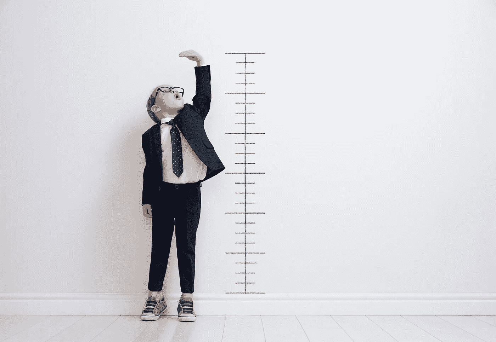

# 用愿景而不是指标来领导:OKR 如何成为一个危险的工具

> 原文：<https://towardsdatascience.com/lead-with-vision-not-metrics-how-okrs-can-be-a-dangerous-tool-29e0ee2a2012?source=collection_archive---------45----------------------->

照片由 iStock Photo 编舞提供

如果使用得当，数据是任何组织成功的关键。没有帮助我们理解性能和设定基线的度量标准，就不可能改进。大多数组织一开始都有良好的意图——使用数据来提高效率、推动问责制和改进关键指标——但很快就陷入了官僚主义、“给自己的作业打分”的偏差状态。这导致利用数据来转移人们对美国真实状况的注意力，或者更糟糕的是，直接撒谎并掩盖真相。

20 世纪 90 年代，NYPD 实施了 CompStat，这是一个全市范围的数据库系统，使用比较统计数据来更有效地跟踪和减少犯罪。该法案要求警察对其管辖区域内的犯罪负责，并因将犯罪率降低了 75%而受到称赞。然而，在过去的几十年里，这实际上导致了官员们不太关心[履行他们的职责](https://www.usatoday.com/story/opinion/policing/spotlight/2017/02/09/compstat-computer-police-policing-the-usa-community/97568874/)，而更关心在被跟踪的指标上显示改进。在极端情况下，有报道称[警察降低了举报犯罪的严重程度](https://www.fastcompany.com/90249924/reply-all-podcast-nypd-compstat)只是为了提高指标。

# 按指标管理:用良好的意图铺路

科技行业多年来一直使用 OKR(目标和关键结果)来跟踪业绩，但我们都看到它们随着时间的推移变得越来越没有意义。经过几个季度甚至几年的时间，人们不可避免地将 OKR 氏症作为获得晋升的一种方法，而不是一种跟踪什么是对的，以及——可能更重要的是——什么是错的方法。这意味着，被跟踪的关键结果最终成为相同的顶级指标，只是稍作调整，以显示对组织其余部分的微小改进:比如“我们的数据将扩展 10%”或“我们将增加 5 个新客户”

这种类型的问题在一个行业中并不孤立，但当我们为成功设定错误的标准时，这种问题就会经常发生。例如，学校通常是根据学生的毕业率来评判的。作为回应，老师们感到有压力让可能没有取得学业成功的学生通过考试。这种做法非但没有让学生为未来做好准备，反而危及学生接受的教育质量。

设定只跟踪顶级指标的目标是糟糕领导的表现。我可以在没有外界知识的情况下进入任何一家公司，并通过说“我们的组织需要多销售 X%的产品”或“增加 Y%的利润”来负责一个好的船长不仅会规定船需要到达哪里，还会提供一个愿景，让船员们能够沿途做出自己的航行决定。

# 哪里出问题了？

CompStat，沿着我们在教育和技术领域看到的路线，开始得很好。作为一个集中跟踪数据库的所有逮捕，传票，以及整个地区的其他犯罪活动，它有巨大的能力，揭示主要趋势。如果使用得当，它可以帮助领导者更有效地打击犯罪，例如，通过了解犯罪是如何联系在一起的，或者在什么时间哪个区域需要更多的警察关注。

然而，任何像这样的系统被滥用的两个因素是:

1.  给自己的作业评分
2.  与晋升和降级的相关性

不幸的是，这两个概念是相互矛盾的。我们都希望在报告自己的成功时能够做到客观，但当业绩与个人职业发展或成就相关时，即使是道德狂热分子也会有意或无意地将衡量标准偏向那些对他们更有利的方面。

# 如何对抗度量的阴暗面

无论你怎么分析，这都是一个极其困难的问题。很难激励你的组织去创建和恰当地度量那些不可游戏的客观指标。也很难确保员工对愿景有足够清晰和简明的理解，以便他们在任何时候都能为组织做出正确的决定。

有几个因素可能有助于组织实现这些目标。

**1——作为领导者，为公司设定正确的愿景。**

一个组织的愿景不应该由顶级的业务成果组成。相反，愿景应该是员工在决策过程中使用的工具，以理解和直观地了解他们应该做出的决策类型。亚马逊取得了令人难以置信的成功，部分原因是杰夫·贝索斯让[非常清楚](https://www.theverge.com/2016/7/28/12313526/amazon-q2-2016-earnings-report-aws-cloud-profit)顶级指标并不是亚马逊努力的方向。他正在建设“世界上最大的商店”，员工们知道他们可以牺牲短期收入来实现这个目标。

**2 —创建与个人绩效无关的组织绩效客观指标。**

有一个清晰定义的愿景会让一切变得更容易，并有助于确保员工跟踪真正重要的指标。出于客观性，指标不应与个人晋升相关联，以确保对公司的成功有一个清晰的看法，不受政治的影响。

**3——推动个人绩效评估中的问责制。**

给自己的作业评分是决定成绩的良好基础，但任何好的制度都有制衡机制。个人需要责任感，这可以通过管理层、同事和最终消费者来实现。

# 它在实践中是如何工作的？

让我们试着把这个过程应用到 NYPD。

**1——NYPD 运用杰夫·贝索斯原则的新愿景。**

我们不应该设定像“连续 20 年降低犯罪率”这样的最高目标，而是应该思考警察为什么存在，并以此来定义我们的愿景。

寻找愿景应该很简单:“在执法的同时确保公民的安全、健康和财产。”

最终，这意味着警察是公务员，其任务是帮助公民更加安全。不应优先考虑不符合这一愿景的指标。

**2 —定义客观的绩效指标。**

虽然客观性通常很难实现，但我们的工作变得容易多了，因为我们都设定了一个愿景，并将衡量与推广脱钩。因此，在报告犯罪时，我们不应该担心坏数据。犯罪将是我们的第一个衡量标准，因为它达到了理解我们公民的安全、健康和财产的最高水平。

犯罪显然是衡量愿景的一个标准，因为犯罪是衡量违反法律的频率的外在标准，但它并不能严格衡量公民的安全和健康。我们可以从外部数据中添加这方面的直接测量，并将其与犯罪联系起来，以确保它们得到准确报告。我们也可以通过这种方法来衡量警察自己是否造成了伤害。

**3 —推动对个人绩效的问责。**

个人绩效报告是一个良好的开端，但让官员承担责任也意味着从同事、经理和外部信息中收集信息。

为了确保警察对公民的安全和健康起到促进作用，我们必须衡量警察本身的行为。警队的不良行为记录需要像保存给市民一样保存给警察。

最后，我们应该增加从我们的公民中提取警方表现数据的方法，如民意测验或匿名举报热线。从多个来源和角度收集反馈对于推动绩效评估的问责制至关重要。

# 底线

自从引入 CompStat 以来，已经过去了将近 30 年。虽然指标可能在改善，但公民和警察之间的关系比以往任何时候都紧张。当然，在讨论美国的治安状况时，有一个更大的社会背景需要考虑。然而，由于专注于错误的指标，他们不再致力于确保公民安全和健康的目标。

我们能从中学到什么？虽然大多数人本质上是好的，并希望在他们的组织中做到最好，但很少有领导层能够将他们公司的愿景提炼为一套指导原则。员工非常擅长对他们获得的成功指标进行局部优化，并且倾向于推动短期指标而不是长期愿景，除非组织明确规定了优先事项。

在许多组织中，缺乏领导远见会导致对员工的误导。OKR 的是一个危险的目标设定框架，没有一个明确定义的愿景和客观跟踪和分级表现的结构。不用说，我们都应该努力确保愿景和目标跟踪在我们的组织中被视为一等公民，否则我们将面临与警察机构相同的挑战。