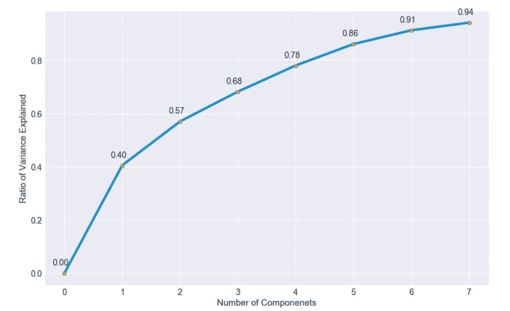
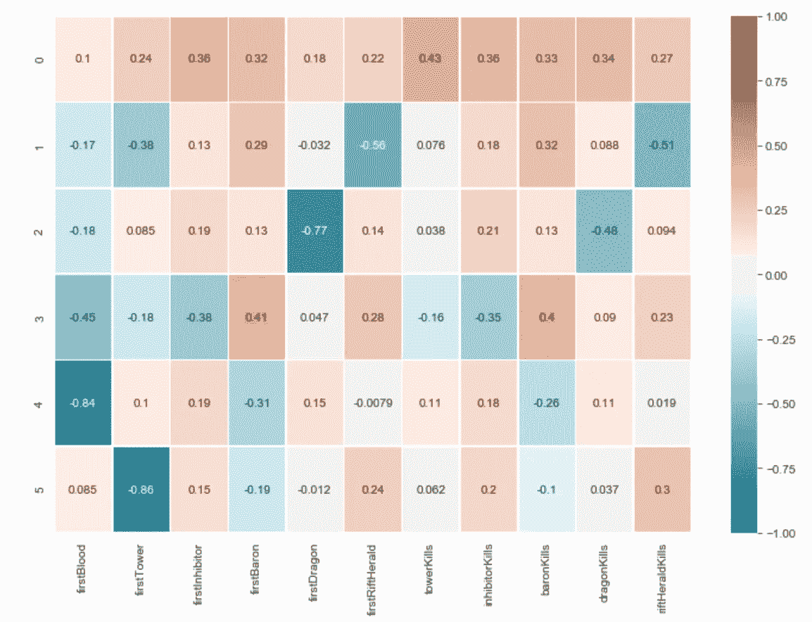
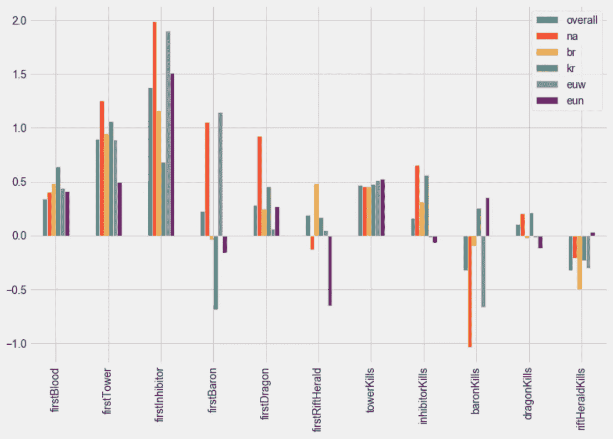

# 英雄联盟获胜条件

> 原文：<https://towardsdatascience.com/league-of-legends-win-conditions-db139f1ed6ca?source=collection_archive---------25----------------------->

## 用 Python 编码来理解赢得英雄联盟游戏的最重要因素

Mateo Vrbnjak 在 [Unsplash](https://unsplash.com?utm_source=medium&utm_medium=referral) 上拍摄的照片

# 介绍

在过去的几年里，电子竞技社区一直在快速发展，曾经是一种休闲娱乐的东西已经演变成一个产业，预计到 2022 年[将产生 18 亿美元的收入。虽然这个生态系统中有许多视频游戏，但很少有像英雄联盟这样成为社区的主要内容，该游戏在 2019 年世界锦标赛期间聚集了超过 1 亿名独立观众。](https://www.businessinsider.com/esports-ecosystem-market-report?op=1)

《英雄联盟》于 2009 年底发布，是一款免费的 MOBA(多人在线对战竞技场)视频游戏，由 Riot Games 创建，早期曾产生广泛的竞争场景，2011 年的第一届世界锦标赛产生了约 160 万观众。从那以后，这款游戏在受欢迎程度和游戏性方面都有所增长，因为 Riot 开始明白如何改变才能使游戏更具竞争性和趣味性。

游戏目前的状态相当复杂，如果你是一个完全的新手，你应该看看这个[视频](https://www.youtube.com/watch?v=0uyLRPmmYPk)。总的来说，一场英雄联盟比赛由两队五名球员组成，每队控制一个独特的角色或“冠军”，当一队位于该队基地深处的 Nexus 被摧毁时，比赛结束。一路上，一个团队可以实现许多目标，例如摧毁炮塔，杀死中立的怪物，如龙和男爵，为整个团队的爱好者，等等。一些目标，比如摧毁至少五个炮塔和一个抑制剂，是赢得游戏的必要条件，而其他的，比如获得第一滴血，是有帮助的，但不是必要的。通过这个项目，我想更好地了解这些目标中哪些是赢得一场英雄联盟比赛最重要的。就此而言，我提出的问题如下:

> 《英雄联盟》一款游戏最重要的胜利条件是什么目标？

# 收集数据

跳进来，我首先用 [Riot 开发者门户](https://developer.riotgames.com/)申请了一个应用，在我的应用被接受后，我浏览了一下[API 标签](https://developer.riotgames.com/apis)以了解我可以请求的数据类型。不幸的是，没有直接的方法让我从一个区域中找出最后 X 个排名匹配，所以我必须找到一种方法来解决这个问题。

我的解决方案是使用一个召唤师名字(用户名)列表来为每个玩家生成一个最近比赛的列表。通过使用 [Python 包 Riot-Watcher](https://github.com/pseudonym117/Riot-Watcher) 对 Riot API 的一系列调用，我在一个略低于 10，000 行的 Pandas 数据帧中填充了最近排名的英雄联盟游戏，这些游戏是由五个地区的[前 100 名玩家](https://www.leagueofgraphs.com/rankings/summoners/na)玩的，这五个地区构成了最大数量的英雄联盟玩家群[。](https://www.statista.com/statistics/711469/league-of-legends-lol-player-distribution-by-region/)乍看之下，数据帧如下所示:

匹配数据帧的前十行

在前七列中，0 表示“假”，1 表示“真”，而在后面的列中，单元中编码的数据表示该事件发生的次数。每一行都包含了英雄联盟排名赛中一支球队的数据。例如，在第一行中，没有首先获得任何目标的队输掉了整场比赛。

# 利用热图和主成分分析进行探索性数据分析

我首先发现，大约 91%的获胜团队摧毁了第一个抑制剂，80%杀死了第一个男爵，70%摧毁了第一个塔，63%杀死了第一条龙，59%的获胜团队以第一滴血开始游戏。看起来最重要的胜利条件是摧毁第一个抑制剂，这是有道理的，因为摧毁一个团队的抑制剂会给他们的基地带来压力，并让对手有更多的地图控制权。

接下来，我可视化了数据集中各列之间的相关性:

数据间的热图关联

我还为我的数据中代表的每个区域绘制了相同的相关性热图，以比较不同区域之间的相关性，希望注意到游戏风格的一些差异。不过一般来说，相关矩阵看起来非常相似。一个可能的原因是，我的数据包括了每个地区最好的球员参加的比赛，其中许多人都是职业水平的。因此，由于良好的游戏实践在竞争社区中是一致的，所以我的数据中所表示的比赛涉及到的玩家相对于每个地区排名较低的玩家来说，在每个游戏中的导航是相似的。

我现在很好奇，想看看用比我用来预测游戏结果的 10 个特征更少的特征能在多大程度上解释数据中的差异。在这种情况下，我进行了主成分分析，以了解我可以将数据简化成多少个特征，并仍然保留大部分差异:

每个新组成部分解释的差异比率

十个预测值列中超过 80%的方差可以用一半的特征量来解释。这肯定很有趣，通过将每个组件与原始数据集的列相关联，我希望了解哪些特性在解释数据的方差方面最重要，这可以帮助我找出哪些列对团队是否会获胜最关键。

数据集的列和主成分之间的关系

用于生成上述热图的组件来自一个包含六个组件的 PCA 对象，因为我希望这些组件能够解释数据中 90%以上的差异。看起来，杀死塔的数量、杀死抑制剂的数量以及团队是否摧毁了第一个抑制剂是决定数据方差的最重要的特征，因为第一个成分解释了方差的 40%,并且前面提到的三列在该成分中权重最大。

重申我在这一点上收集的见解:

*   从我的关联热图来看，一个团队是否摧毁了第一个抑制剂，一个团队有多少塔杀，一个团队摧毁了多少抑制剂，都与获胜有最高的关联。
*   根据我的 PCA 分析，一个团队是否摧毁了第一个抑制剂，一个团队有多少塔杀，以及一个团队摧毁了多少抑制剂在解释数据的差异方面起了最大的作用。

# 使用逻辑回归的数据建模

我用了一个逻辑回归模型来理解一场《英雄联盟》排名赛的获胜条件。我的过程是首先将我的数据分成一组特征和一组目标，其中我的特征是除“win”和“region”列之外的所有列，我的目标是“win”列。然后，我将我的数据分为训练集和测试集，通过逻辑回归模型运行它们，并检查分类报告和混淆矩阵，以确保相对较强的预测能力。当逻辑回归模型在整个数据集上运行时，模型的精度和召回率分别为. 86 和. 85。

在这里，我对只包含一个地区的数据子集进行了逻辑回归，比如只在北美、北美等地进行的比赛。，并将模型的系数记录在熊猫数据框中。然后这个数据框架被可视化，这样我就可以比较不同的区域:

跨区域和整体的对数回归系数

回归系数描述了预测变量和目标变量之间的关系。例如，当观察上面的第一滴血预测变量时，获得第一滴血的团队是游戏结果的中度预测者，因为获得第一滴血的团队更有可能获胜。另一方面，裂缝传令官杀死实际上是反方向相关的(除了 EUNE)，获得更多裂缝传令官杀死的团队更有可能失败。

使用这个分析过程，我了解了哪些列更能预测胜利，帮助我回答了关于英雄联盟游戏中胜利条件的问题。

# 结论

作为我项目的结果，以下是我得出的结论:

*   根据我的逻辑回归模型，按照从大到小的顺序，第一个抑制剂，第一个塔，和塔杀是整个数据集中最重要的获胜条件。
*   根据我的关联热图，按照从大到小的顺序，塔击杀、第一个抑制剂和抑制剂击杀是整个数据集中最重要的获胜条件。
*   虽然拿了第一个男爵的北美和 EUW 队更有可能获胜，但是随着杀死男爵数量的增加，这些地区的队更有可能失败。
*   与其他地区相比，北美地区的团队更有可能赢得第一条龙，这一事实可能表明北美地区的游戏更容易受到龙迷的影响，并围绕龙展开战斗。
*   KR 游戏受一个特性的影响并不均衡。这可能表明 KR 球员比其他地区的球员更了解如何在背后比赛，这促使一支球队比其他地区更经常地赢得目标的组合。

如果你认为我错过了任何其他有趣的观察，请在评论中告诉我们！

包含我的代码的 GitHub 存储库和我为这次分析整理的数据集可以在[这里](https://github.com/ankushbharadwaj/league-of-legends-win-conditions)找到。