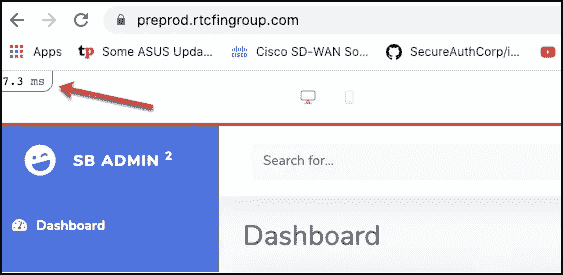
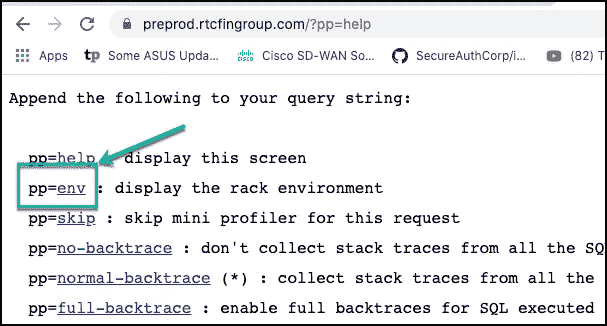
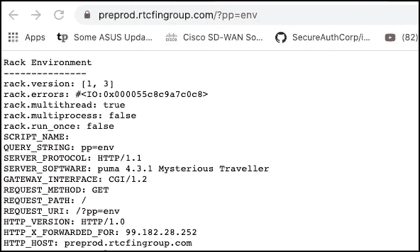
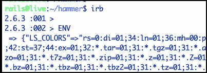

# 在 Web 应用程序中泄露秘密

> 原文：<https://towardsdatascience.com/leaking-secrets-in-web-applications-46357831b8ed?source=collection_archive---------33----------------------->

## 环境变量失控:数据泄露结果

## 利用错误配置的中间件中的漏洞


“秘密应该是安全的”——授权给杰森·奥斯特罗姆

信息泄露是一种漏洞，在这种漏洞中，系统会无意中暴露机密信息。这篇文章通过观察环境变量在 web 应用程序中如何被误解和误用，展示了这个缺陷的一个例子。这篇文章将重新审视最佳实践，并以对开发者的可行建议作为结束。

L eaking Secrets 描述了一种信息泄露缺陷，在这种缺陷中，应用程序将敏感凭证或 API 密钥暴露给对手。OWASP 2017 十大漏洞将此漏洞归类为“ [*敏感数据曝光*](https://owasp.org/www-project-top-ten/OWASP_Top_Ten_2017/Top_10-2017_A3-Sensitive_Data_Exposure) ”。这篇文章将讨论如何通过一个在 rails 应用程序上运行的易受攻击和错误配置的中间件 gem 的案例研究来利用这一点。这些类型的问题可能会导致企业的数据泄露，从而导致重大的财务和声誉损失。这些问题是经常观察到的，因为基础设施即代码(IaC)和云速度使 DevOps 人员能够快速启动新的 web 应用程序和环境而不受检查。如果您是使用 Rails 的开发人员，您需要了解这些问题。如果你是一个使用 web 应用程序的初学者，你会发现这些信息很有用，并且(我希望)能够更好地保护你的客户。

在你的 web 应用程序中通过公共互联网暴露秘密正是你 ***永远*** 不想做的事情。对于阅读本文的 Rails 开发人员来说，这是对 Rack-mini-profiler 的致敬。

# 机架式迷你剖面仪:好的，坏的，丑陋的

R[ack-mini-profiler](https://github.com/MiniProfiler/rack-mini-profiler)是一个中间件 gem，被 Rack 开发人员用作性能工具，以提高基于 Rack 的 web 应用程序的可见性和速度。该工具对开发者社区有价值，并受到高度重视，正如这位[爱好者](https://www.speedshop.co/2015/08/05/rack-mini-profiler-the-secret-weapon.html)所展示的:

> `*rack-mini-profiler*`是一个用于机架应用的性能工具，由天才的 [@samsaffron](https://twitter.com/samsaffron) 维护。 [rack-mini-profiler](https://github.com/MiniProfiler/rack-mini-profiler) 提供了一整套工具来测量支持 rack 的 web 应用程序的性能，包括详细的 SQL 查询、服务器响应时间(对每个模板和部分模板都有细分),令人难以置信的详细的毫秒级执行时间细分(具有不可思议的`*flamegraph*`功能),甚至可以通过其出色的垃圾收集功能帮助您跟踪内存泄漏。**我会毫不犹豫地说** `***rack-mini-profiler***` **是我最喜欢也是最重要的开发快速 Ruby webapps 的工具。**

我最近在野外发现了一个使用 Rack-mini-profiler 的 Rails 应用程序的部署，看到其中的安全问题令人大开眼界。我想澄清的是，我并不是说创业板有内在的脆弱性；相反，如果没有适当的安全保护，如何使用或配置中间件 gem 是一个问题。所以我开始更好地理解这是如何发生的，以及观察到的实际漏洞。这一努力的高潮是一个开源项目，“锤子”。Hammer 是一个易受攻击的 Rails 应用程序部署的例子，它使用 Rack-mini-profiler 来泄漏 API 密钥和敏感信息。它与在野外观察到的真实世界的应用程序一样容易受到攻击。这也是一个骨架应用程序，可以用来以安全的方式分叉和试验敏感变量。在构建这个工具的过程中，我学到了一些东西，希望与开发人员和 InfoSec 社区分享这些经验。


锤子图像，归杰森·奥斯特罗姆所有

锤子 Github 站点这里是[这里是](https://github.com/iknowjason/hammer)。

这里的是[的一个轻锤介绍。](/building-a-vulnerable-rails-application-for-learning-2a1de8cf98d5)

让我们快速浏览一下中间件的功能，它为开发人员提供了如此多的好处，但同时也使它成为一个有吸引力的攻击目标。你可以跟随锤子的演示应用:[https://preprod.rtcfingroup.com](https://preprod.rtcfingroup.com)。

在左上角，通过安装这个性能中间件 gem 呈现了一个“HTML 速度徽章”。安装该工具后，HTML speed badge 可用于分析 Rails 应用程序提供的任何给定页面。



HTML 速度徽章

【https://preprod.rtcfingroup.com/users/.】T2 让我们浏览敏感用户可以公开访问的 URL—[注意，这些不是真正的用户。它们是从模拟用户的工具中包含的脚本中随机生成的。看一下左上角的 HTML 速度标记，看看它是如何渲染页面渲染时间的。](https://preprod.rtcfingroup.com/users/.)


用户页面

Ex 在 ***/users/*** 展开速度徽章，显示渲染每个页面所花费的时间，以毫秒为单位。请注意用于呈现 ***用户/索引*** 的有趣的 SQL 查询。Rack-mini-profiler 创建了一个链接，您可以单击该链接获取更多信息。让我们来看看。


用户的 SQL 查询

B 下面，您可以看到 Rack-mini profiler 显示了详细的调用堆栈查询信息。您可以看到呈现给用户的 SQL 查询、文件和精确行。对于试图提高性能和识别应用程序瓶颈的开发人员来说，这是非常好的信息。但是从攻击者的角度来看，这收集了诸如 SQL 查询之类的有价值的信息，这些信息可能使其他漏洞被利用。从不公开 SQL 查询客户端被认为是一种标准的安全实践。当我第一次在野外看到这个的时候，我简直不敢相信我所看到的。Rack-mini-profiler 的网站声明，该工具可用于分析开发和生产中的应用程序。这就是为什么确保公开 SQL 调用堆栈查询与应用程序开发的组织安全策略保持一致如此重要。当我第一次看到这个的时候，我不知道会有更有趣的东西。阅读下文。


调用堆栈查询

R ack-mini-profiler gem 使用了“Pretty Print”Ruby 类( ***pp*** )，可以通过追加 ***在默认 URL 找到？pp =求助*** 。对于开发者来说，它有很多不错的特性，比如内存分析和垃圾收集。从安全角度来看最有趣的是漂亮的印花 ***env*** 。



精美的印刷(pp)菜单

## №1:转储“环境”

T 他的 ***env*** pretty print 特性转储所有传递给 Rails 应用程序的环境变量。这包括如下所示的 ***机架环境*** 。



env 的漂亮印刷

T 看一下[***profiler . Rb***](https://github.com/MiniProfiler/rack-mini-profiler/blob/master/lib/mini_profiler/profiler.rb)的 Rack-mini profiler 源代码，代码显示它首先通过迭代并打印存储在 ***env 中的局部变量来转储 ***env*** 。*** 这与上面以“ ***机架环境*** ”开头的输出相关

## №2:转储“环境”

其次，它通过迭代并打印这个散列的内容来转储 ENV 常量。


用于转储环境和环境的 RackMiniProfiler 源

T 下面的截图显示了从易受攻击的示例应用程序开始转储 ENV 常量哈希，与从`ENV.each do`开始的第二部分代码相关。


转储环境

在这个例子中，亚马逊 S3 API 密钥被存储在 ENV 中，并向公众公开。这显示了在存储于 ENV 常量散列中的环境变量中存储 API 秘密和其他敏感凭证是多么危险。我们将在下面详细讨论这是如何发生的。


转储更敏感的环境

更进一步，示例应用程序泄露了各种不同的云 API 和秘密，包括脸书、Twitter、LinkedIn 和 Google。


转储 API 密钥

## Ruby 中的 env 和 ENV 是什么？

NV 是一个类似哈希的类，Ruby 用它向我们的应用程序公开环境变量。例如，我们的 rails 应用程序可以使用 PATH 或 HOME。Rack-mini-profiler 不需要做太多的事情来转储 ENV，因为该常量在应用程序启动时公开。开发人员有责任正确地存储、加载和保护 ENV。传统上，ENV 与环境变量相关，并且比 ***env*** 更加全局。这些变量中的每一个都被列为键/值对，它们通常用于共享配置。

像 Rails 这样的 ll Rack 应用程序只接受一个参数，这个参数是一个名为 ***env*** 的散列。env 被传递给 Rails 应用程序，并存储诸如 HTTP 头、请求和服务器配置等信息。与 ENV 相比， ***env*** 更适合 Rails。

# 漏洞

环境变量不应该用来存储敏感的配置信息，比如凭证和 API 密钥。如果必须使用它们，您的安全程序应该接受这种风险，将其记录在您的风险登记簿中，并提供适当的安全控制来降低风险。

关于环境变量及其正确使用已经说了很多。十二因素应用宣言声明环境变量应该被用来存储配置元素，比如亚马逊 S3 或 Twitter 等外部服务的凭证。


十二要素应用宣言

我不同意这个。遵循这种做法会增加您公司的商业风险。

这个示例应用程序展示了开发人员犯错误和无意中暴露敏感的 API 键(如 AWS)是多么容易，这些 API 键会导致数据泄露。创建此应用程序是为了模拟在列举上述问题后得到保护的野外生产环境。Rails 开发人员可以使用不同的环境，比如生产、QA 或开发。Rack-mini profiler 设计用于这些环境中的任何一种。暴露的环境变量，如果包含在**开发**环境中运行的敏感机密，会给攻击者提供凭证，允许未经授权的数据访问、信息泄漏和特权升级到**生产**。环境变量有一个存储配置元素的好地方。它们不应该被用于敏感的秘密。

T 这个示例应用程序使用 [Dotenv](https://github.com/bkeepers/dotenv) rails gem 从`.env`加载环境变量。这个示例应用程序使用`.env.local`将文件中包含的所有填充的环境变量加载到由 Rack-mini-profiler 转储的 env 常量中。看看锤子的 Github [回购](https://github.com/iknowjason/hammer/blob/master/.env.local)中也能看到的配置:


Hammer 附带的“. env.local”

除了通过中间件暴露敏感环境变量的风险之外，还有其他一些充分的理由说明为什么开发人员应该意识到这种实践中固有的风险。下面的列表总结了来自迪奥戈莫尼卡的一些风险:

1.  由于没有正确使用 ***而将未加密的环境变量文件如`.env.local`复制到中央 Git 存储库中的风险。gitignore* 文件。部落知识的风险，当没有设置系统的新开发人员没有适当注意保护这些包含环境变量的文件时。秘密被复制到不同的系统并被暴露。**
2.  应用程序可以获取整个环境，并打印出来用于调试或错误报告。如果在离开您的环境之前没有进行适当的清理，机密可能会泄露。
3.  环境变量被传递给子进程，这可能导致意外的访问(例如，第三方工具可以访问您的环境)。
4.  当应用程序崩溃时，通常将环境变量存储在日志文件中以供调试。这增加了磁盘上明文秘密的风险。

# 试验 ENV 和 Bash 环境

在我们开始玩一些 ENV 和环境变量的例子之前，让我们回顾一下 Ruby 环境变量的一些规律。 [Honeybadger.io](https://www.honeybadger.io/blog/ruby-guide-environment-variables/) 就此给出了一个精彩的教程，我来总结一下:

1.  每个进程都有自己的一组环境变量。
2.  环境变量随着它们的过程而消亡。
3.  一个进程从它的父进程继承它的环境变量。
4.  对环境的更改不会在进程间同步。
5.  您的 shell 只是环境变量系统的一个 UI。

这个例子遍历了 Rails 应用程序主目录中的 Hammer 环境。

转到 Rails Hammer 应用程序的工作主目录:

```
$ cd /home/<username>/hammer
```

Grep for ***SECRET*** 中的 ***.env.local*** 来看一些我们想玩的环境变量。

```
$ grep SECRET .env.local
```

你会看到几个皇冠宝石的 API 键。现在用`env`打印 Bash shell 环境变量。您将看到所有的标准环境变量，比如$HOME 和$PATH。用`env | grep SECRET`验证那些敏感变量当前没有加载到您的 Bash 环境中。


验证“env”命令不显示机密

运行交互式 Ruby 工具( ***irb*** )，我们看看会发生什么。默认情况下， ***irb*** 不会看到 ENV 公开的任何敏感环境变量。这是因为我们需要使用 Rails '***dotenv***' gem 从`.env`文件中加载变量。这表明，默认情况下，当实例化 Ruby 应用程序时，Rails 应用程序会将父进程(Bash shell)的环境变量继承到 ENV 常量中。但是我们需要以特殊的方式将额外的环境变量加载到 ENV hash constant 中，因为这些变量在默认情况下是不可用的。您将能够看到 ***$PATH*** 和 ***$HOME*** ，但看不到其他任何内容。

```
$ irb
> ENV
> ENV['PATH']
> ENV['S3_SECRET_ACCESS_KEY']
```



启动 irb


获取一些环境变量

指示 ***irb*** 使用 ***dotenv*** gem 从 ***.env.local*** 文件中加载环境变量。这个命令将把环境变量加载到 ENV 中，使它们对我们的 ***irb*** ruby 环境可用。

`> require 'dotenv';Dotenv.load('.env.local')`

注意，所有漂亮的东西现在都有了，敏感的皇冠宝石 API 键！


使用 dotenv 加载. env.local 文件

验证您可以在 irb 终端中访问这些漂亮、敏感的 ENV 程序！

```
> ENV['S3_ACCESS_KEY_ID']
> ENV['S3_SECRET_ACCESS_KEY']
```


验证敏感的环境变量

接下来，打开一个新的外壳。启动 ***irb*** 并尝试列出 ENV 中存储的敏感环境变量。


默认情况下，ENV 不会在单独的进程之间共享或同步

注意，在第二个 shell 的 ***irb*** 会话中，没有列出敏感的环境变量。这是因为环境变量的工作方式。每个进程都有自己的一组环境变量，这些变量不会在进程之间自动同步。

现在尝试导出这些变量。如果你把`export`放在`.env.local`中命名的变量的语法前面，并源文件， ***神奇地发生了*** 。这将本地 shell 变量转换为 ENV 可用的环境变量。然后任何从 bash shell 实例化的 Rails 子进程都可以使用它。锤子应用程序包括一个导出的变量文件样本，目的是以安全的方式处理敏感变量- `.env.local.exported`。让我们试一试。

在第二个 shell 中，退出 ***irb*** 会话并键入 source 命令。然后运行 ***env*** 列出 bash shell 中的环境变量:

```
$ source .env.local.exported
$ env | grep SECRET
```


获取. env.local.exported 文件

现在在第二个 shell 中，重新启动 ***irb*** 并获取敏感的 ENV 变量。

```
$ irb
> ENV['S3_ACCESS_KEY_ID']
> ENV['S3_SECRET_ACCESS_KEY']
```


显示秘密被加载到 ENV 中

太神奇了！你不必调用 Dotenv gem 来自动加载到 env 中。这向您展示了 Dotenv gem 正在做什么——本质上是从 ***中获取变量。env*** 文件当环境被引导并加载到 env。然后通过 Rack-mini-profiler Pretty Printer(PP)ruby 类转储 ENV。

在本例中，我们最终将导出的变量提供给了 bash shell。一旦我们退出 shell，环境变量对于下一个启动的 bash shell 就不可用了。如果开发人员将命令添加到 shell init 脚本，如 ***。bashrc* 这是应该避免这种做法的另一个原因。**

# 存储机密的方法概述

*   **明文存储秘密:**使用 Rails gem 方法如 [Dotenv](https://github.com/bkeepers/dotenv) 或 [Figaro](https://github.com/laserlemon/figaro) 在环境中存储秘密，通过加载 env 访问。其他方法包括 [rbenv-vars](https://github.com/rbenv/rbenv) 插件和 [direnv](https://direnv.net/) 。这些是流行的方法，但是开发者应该考虑更好的安全性。
*   **SaaS 秘密管理服务**:使用诸如[金库](https://www.hashicorp.com/products/vault/secrets-management/)、 [AWS 秘密管理器](https://aws.amazon.com/secrets-manager/)和许多其他服务在你的应用程序内同步和管理秘密。这是一种比明文存储秘密更好的方法，但是请记住，您必须保护一个超级机密的 SaaS API 密钥，它会保护您的所有秘密。
*   **Rails 加密的秘密:**从 Rails 5.1 开始，您可以使用加密的秘密来为您的应用凭证提供更好的保护。可以使用除 ENV 键/值散列之外的特殊变量来访问它们。这里有一个很好的[概述](https://medium.com/@kirill_shevch/encrypted-secrets-credentials-in-rails-6-rails-5-1-5-2-f470accd62fc)，从 Rails 6 开始，可以做多环境凭证管理。这是比第一种方法更安全的方法，与第二种方法相似。这应该将主加密密钥保存在您的 Rails 系统上，而不是与云 SaaS 同步。

# 推荐

以下是一些降低风险的建议。这些旨在提供想法，并应与您的开发运维流程保持一致。

*   卸下连接到公共互联网的所有系统上的 rack-mini-profiler gem。
*   在需要可访问公共互联网的 Rack-mini profiler 系统上:通过白名单/防火墙 IP 地址实施强访问控制，仅允许开发人员工作站访问 web 应用程序。
*   使用 RackMiniProfiler 访问控制来授权请求并将其列入白名单。RackMiniProfiler 有一个***authorization _ mode***在生产中加入白名单。参考[自述文件](https://github.com/MiniProfiler/rack-mini-profiler)中 ***非开发环境下的访问控制*** 章节。
*   使用加密的机密并避免使用 ENV 的环境变量来存储敏感的凭证。在本地执行此操作的最佳方法是 Rails 加密机密。这将避免将敏感变量加载到 ENV 中，因为这会增加它们被无意中暴露的风险。

# 结论

像 Rack-mini-profiler 这样的中间件为开发人员提高 Rails 应用程序的速度提供了优秀的特性；但是，必须应用安全控制来确保机密在您的应用程序中得到适当的保护，不会泄露给对手。

一位睿智的网络安全专家发表了这个简单而有力的声明:

> 我们都需要一起努力。任何弱点都是需要修正的弱点，让我们一起来修正它。

# 参考

[https://github.com/MiniProfiler/rack-mini-profiler](https://github.com/MiniProfiler/rack-mini-profiler)

[https://www . speed shop . co/2015/08/05/rack-mini-profiler-the-secret-weapon . html](https://www.speedshop.co/2015/08/05/rack-mini-profiler-the-secret-weapon.html)

[https://stack ify . com/rack-mini-profiler-a-complete-guide-on-rails-performance/](https://stackify.com/rack-mini-profiler-a-complete-guide-on-rails-performance/)

[https://12factor.net/config](https://12factor.net/config)

[https://www . honey badger . io/blog/ruby-guide-environment-variables/](https://www.honeybadger.io/blog/ruby-guide-environment-variables/)

[https://www . honey badger . io/blog/securing-environment-variables/](https://www.honeybadger.io/blog/securing-environment-variables/)

[https://www . ruby guides . com/2019/01/ruby-environment-variables/](https://www.rubyguides.com/2019/01/ruby-environment-variables/)

[https://diogomonica . com/2017/03/27/why-you-should-use-env-variables-for-secret-data/](https://diogomonica.com/2017/03/27/why-you-shouldnt-use-env-variables-for-secret-data/)

[https://stack overflow . com/questions/61821207/rails-environment-variables-with-rack-mini-profiler](https://stackoverflow.com/questions/61821207/rails-environment-variables-with-rack-mini-profiler)

[https://medium . com/craft-academy/encrypted-credentials-in-ruby-on-rails-9db 1 f 36d 8570](https://medium.com/craft-academy/encrypted-credentials-in-ruby-on-rails-9db1f36d8570)

[https://medium . com/@ kirill _ shevch/encrypted-secrets-credentials-in-rails-6-rails-5-1-5-2-f 470 accd 62 fc](https://medium.com/@kirill_shevch/encrypted-secrets-credentials-in-rails-6-rails-5-1-5-2-f470accd62fc)

[https://medium . com/poka-tech blog/the-best-way-to-store-secrets-in-your-app-308 a 6807 D3 ed](https://medium.com/poka-techblog/the-best-way-to-store-secrets-in-your-app-is-not-to-store-secrets-in-your-app-308a6807d3ed)