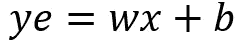

# 今日学习人工智能 Pytorch 入门

> 原文：<https://towardsdatascience.com/learn-ai-today-01-getting-started-with-pytorch-2e3ba25a518?source=collection_archive---------31----------------------->

## [今天学 AI](http://towardsdatascience.com/tagged/learn-ai-today)

## 定义和训练 Pytorch 模型并动态可视化结果

[Jukan Tateisi](https://unsplash.com/@tateisimikito?utm_source=unsplash&utm_medium=referral&utm_content=creditCopyText) 在 [Unsplash](https://unsplash.com/s/photos/stairs?utm_source=unsplash&utm_medium=referral&utm_content=creditCopyText) 上拍摄的照片。

这是今天我创作的 [**学艾**](http://learn-ai-today.com/) 系列中的第一个故事！这些故事，或者至少是前几个，是基于我在研究/学习 **PyTorch** 和**深度学习**时创作的一系列 **Jupyter 笔记本**。我希望你和我一样觉得它们很有用！

## 你将从这个故事中学到什么

*   如何创建 PyTorch 模型
*   如何训练你的模型
*   动态可视化培训进度
*   学习速度如何影响训练

# 1.PyTorch 中的线性回归

线性回归是一个你可能很熟悉的问题。最基本的形式就是用一条线来拟合一组点。

## 1.1 介绍概念

考虑一条线的数学表达式:

`w`和`b`是该线性模型的两个**参数**或**权重**。在**机器学习**中，通常使用`w`指**重量**和`b`指**偏差**参数。

在机器学习中，当我们**训练一个模型**时，我们基本上是在为一组给定的输入/目标`(x,y)`对寻找**最佳参数** `w`和`b`。在模型被训练之后，我们可以计算模型估计。该表达式现在将看起来

这里我把`y`的名字改成`ye` (y 估计)，因为这个解不精确。

**均方差(MSE)** 就是`mean((ye-y)²)`——目标值和估计值之间的均方差。对于一个回归问题，你确实可以最小化 **MSE** 以便找到最好的`w`和`b`。

线性回归的思想可以用代数矩阵符号来概括，以允许多个输入和目标。如果你想了解更多关于回归问题的数学精确解，你可以搜索[正规方程](https://mathworld.wolfram.com/NormalEquation.html)。

## 1.2 定义模型

PyTorch `nn.Linear`类是定义具有任意数量输入和输出的线性模型所需要的全部。对于将直线拟合到一组点的基本示例，考虑以下模型:

***注:*** *我使用的* `Module` *来自*[*fastai*](https://github.com/fastai/fastai)*库，因为它使代码更干净。如果你想使用纯 PyTorch，你应该使用* `nn.Module` *来代替，你需要在* `__init__` *方法中添加* `super().__init__()` *。fastai* `Module` *为你做到了。*

如果你熟悉 **Python 类**，代码是不言自明的。如果没有，考虑在深入 PyTorch 之前做一些研究。有许多在线教程和课程涵盖了这一主题。

回到代码。在`__init__`方法中，您定义了模型的层。在这种情况下，它只是一个线性层。然后，`forward`方法就是当你调用模型时被调用的方法。类似于普通 Python 类中的`__call__`方法。

现在，您可以将 LinearRegression 模型的一个实例定义为`model = LinearRegression(1, 1)`，表示输入和输出的数量。

也许你现在在问为什么我不简单地做`model = nn.Linear(1, 1)`你是绝对正确的。我在定义`LinearRegression`类时遇到这么多麻烦的原因只是为了给以后的改进提供一个模板，稍后你会发现。

## 1.3 如何训练你的模型

训练过程基于一系列 4 个步骤，反复重复:

*   **正向传递:**将输入数据提供给模型，并获得模型输出— `outputs = model(inputs)`
*   **计算损失函数:**对于线性回归问题，我们使用的损失函数是均方误差(MSE)。我们经常把这个函数称为标准— `loss = criterion(outputs, targets)`
*   **反向传递:**计算损失函数相对于每个可学习参数的梯度。记住，我们要减少损失函数，使输出接近目标。梯度告诉我们，如果你增加或减少每个参数，损耗会如何变化— `loss.backwards()`
*   **更新参数:**在减少损失的方向少量更新参数值。更新参数的方法可以简单到减去乘以一个小数值的梯度值。这个数字被称为**学习率**，我刚刚描述的**优化器**是**随机梯度下降(SGD)** — `optimizer.step()`

我还没有确切地定义`criterion`和`optimizer`，但我会在一分钟。这只是给你一个训练迭代步骤的总体概述和理解，或者通常称为**训练时期**。

让我们定义我们的`fit`函数，它将完成所有需要的步骤。

请注意，在 — `optimizer.zero_grad()`之前，还有一个额外的步骤我没有提到。这是因为默认情况下，在 PyTorch 中，当您调用`loss.backwards()`时，优化器会将梯度值相加。如果你不在每个时期将它们设置为零，那么它们将会一直累加，这是不可取的。除非你在做梯度积累——但那是一个更高级的话题。除此之外，正如你在上面的代码中看到的，我保存了每个时期的损失值。我们应该预计它会稳步下降——这意味着该模型在预测目标方面变得越来越好。

正如我上面提到的，对于线性回归，通常使用的标准是 **MSE** 。至于优化器，现在我总是把 **Adam** 作为首选。它速度很快，应该可以很好地解决大多数问题。我不会详细说明 Adam 现在是如何工作的，但我们的想法总是在最短的时间内找到最佳解决方案。

现在让我们继续创建我们的线性回归模型的实例，定义我们的**标准**和我们的**优化器**:

`model.parameters()`是向优化器提供可训练参数列表的方式，而`lr`是学习率。

**现在让我们创建一些数据并训练模型！**

数据只是一组遵循模型`y = 2x + 1 + noise`的点。为了让它更有趣一点，我让 x 的值越大噪声越大。第 4 行和第 5 行中的`unsqueeze(-1)`只是在末尾给张量增加了一个额外的维度(从`[10000]`到`[10000,1]`)。数据是相同的，但张量需要有这样的形状，这意味着我们有 10000 个样本，每个样本有一个特征。

绘制数据，结果就是下图，可以看到真实的模型和输入数据+噪声。

线性回归模型的输入数据。图片由作者提供。

**现在为了训练模型我们只需运行我们的** `**fit**` **函数！**

经过训练后，我们可以绘制 100 个时期内损失的演变。正如您在下图中看到的，最初的损失约为 2.0，然后急剧下降到接近零。**这是意料之中的**，因为当我们开始时，模型参数是**随机初始化的**，并且随着训练的进行，它们收敛到解决方案。

100 个训练时期的损失演变(MSE)。图片由作者提供。

**注:**试试玩学习率值，看看对训练有什么影响！

要检查训练好的模型的参数，可以在训练完模型后运行`list(model.parameters())`。您将会看到，在这个示例中，它们非常接近 2.0 和 1.0，因为真正的模型是`y = 2x + 1`。

您现在可以计算模型估计值— `ye = model(x_train)`。(请注意，在计算评估之前，您应该始终运行`model.eval()`来将模型设置为评估模式。这对于这个简单的模型来说不会有什么不同，但是当我们开始使用批处理规范化和删除时，就会有所不同。)

绘制预测图，您可以看到它几乎完美地匹配了真实数据，尽管事实上模型只能看到有噪声的数据。

可视化模型评估。图片由作者提供。

# 2.逐步走向多项式回归

既然我们已经使它适用于简单的情况，那么转移到更复杂的线性模型就非常简单了。第一步当然是生成这样的输入数据。对于这个例子，我认为模型`y = 3x² + 2x + 1 + noise`如下:

多项式模型的输入数据。图片由作者提供。

请注意，这次输入形状是`[1000, 2]`，因为我们有两个对应于`x`和`x²`的特征。这就是使用线性回归拟合多项式的方法！

与前面的例子相比，现在唯一的区别是模型需要两个输入— `model = LinearRegression(2,1)`。就是这样！现在，您可以按照完全相同的步骤来训练模型。

然而，让我们用一些动态的可视化来让事情变得更有趣一点吧！

## 2.1 动态可视化培训进度

为了动画化训练的发展，我们需要更新拟合函数，以便也存储每一步的模型估计值。

你可能注意到了一个‘新词’——`detach()`(代码第 17 行)。这是告诉 PyTorch 从梯度计算图中分离变量(它将不再计算分离变量的梯度)。如果在分离之前尝试将张量转换为 NumPy，将会出现错误。

继续，您可以像以前一样重复相同的过程来训练模型。唯一的区别是`fit2`函数也将返回每个训练时期的模型估计值。

**要创建培训的视频/gif，请看下面的代码:**

`%%capture`告诉 Jupyter 抑制单元格的输出，因为我们将在下一个单元格中显示视频。然后，从第 3 行到第 10 行，我照常设置情节。不同之处在于模型预测。我将其初始化为空，然后使用`matplotlib.animation`迭代更新图形以生成动画。最后，可以使用来自`IPython.display`的`HTML`渲染视频。看看下面的结果！

在训练期间可视化模型预测。作者的动画。

有趣的是，蓝线最初非常快地弯曲成正确的形状，然后为了最终的解决方案收敛得更慢！

**注:**尝试使用**学习率**、不同的**优化器**以及任何您能想到的东西，看看对优化的影响。**这是一个直观了解优化工作原理的好方法！**

# 3.神经网络模型

上面的例子对于学习和实验来说很有趣。然而，在实践中，你的数据通常不是由多项式生成的，或者至少你不知道多项式的项是什么。关于**神经网络**的一个好处是你不需要担心它！

让我们从定义我命名为`GeneralFit`的模型开始:

在这个模型中有一些新的方面需要考虑。有 3 个线性层，正如你在正向方法中看到的，在前两个线性层之后，使用了一个 **ReLU** **激活函数** — `F.relu()` —。 **ReLU** 代表**整流线性单元**，简单来说就是**将所有负值归零**。然而，这个看似琐碎的操作足以**使模型非线性。**

**注意，线性层只是矩阵乘法。**如果你有一个接一个的 100 个线性图层，线性代数会告诉你有一个线性图层执行相同的操作。这个线性层是 100 个矩阵的简单乘积。然而，当你引入非线性激活函数时，这就完全改变了。现在，您可以继续添加更多的线性层与非线性激活交错，如 ReLU(在最近的模型中最常见)。

一个**深度神经网络**只不过是一个具有几个“隐藏”层的神经网络。回头看看上面的代码，例如，你可以尝试添加更多的“隐藏”层并训练模型。事实上，你可以称之为深度学习。(请注意，隐藏层只是输入层和输出层之间任何层的传统名称。)

使用上述模型和一组新生成的数据，我获得了以下训练动画:

以 0.01 的学习率在训练期间可视化 GeneralFit 模型的模型预测。作者的动画。

对于这个例子，我训练了 200 个纪元，学习率为 0.01。让我们试着将学习率设置为 1。

在学习率为 1 的训练期间可视化 GeneralFit 模型的模型预测。作者的动画。

**显然这样不好！**当**学习率过高**时，模型可能无法正确收敛到一个好的解，甚至可能发散。如果你把学习率设定为 10 或 100，它不会有任何进展。

# 家庭作业

我可以给你看一千个例子，但如果你能自己做一两个实验，你会学到更多！我给你们展示的这些实验的完整代码可以在这个笔记本上找到。

*   试着玩一下**学习率**，历元数，隐藏层数，隐藏层数的大小；
*   也试试 SGD optimizer，玩玩学习率，也许还玩玩动量(我在这个故事中没有涉及到，但现在你知道了，你可以做一些研究)；

如果你通过实验创造了有趣的动画笔记本，那就在 GitHub、Kaggle 上分享吧，或者写一个关于它的故事！

# 结束语

**今日学 AI**系列第一个故事到此结束！

*   请考虑 [**在此链接加入我的邮件列表**](https://docs.google.com/forms/d/e/1FAIpQLSc0IBzdCn7osIjvGno1GjBakI-DfXHE8gDLZ--jNzWsXtRW0g/viewform) 获取更新，以便您不会错过以下任何故事或重要更新！
*   我还会在 learn-ai-today.com**列出新的故事，这是我为这次学习之旅创建的页面！**
*   **如果你以前错过了，[这是 Kaggle 笔记本的链接，上面有这个故事的代码](https://www.kaggle.com/mnpinto/learn-ai-today-01-getting-started-with-pytorch/)！**

**欢迎在评论中给我一些反馈。你觉得什么最有用，或者什么可以解释得更好？让我知道！**

**本系列的下一个故事:**

** [## 今日学习人工智能:02 —使用 PyTorch 解决分类问题简介

### 用神经网络对花卉进行分类，可视化决策边界和理解过度拟合。

towardsdatascience.com](/learn-ai-today-02-introduction-to-classification-problems-using-pytorch-b710918cba63) 

你可以在下面的故事中了解更多关于我的旅程！

 [## 我的 3 年历程:从零 Python 到深度学习竞赛高手

### 自从 2017 年开始学习 Python 以来，我一直遵循的道路是成为一名独自参加 Kaggle 比赛的大师…

towardsdatascience.com](/my-3-year-journey-from-zero-python-to-deep-learning-competition-master-6605c188eec7)  [## 我在 Kaggle 上的两年旅程:我如何成为竞赛大师

### 描述我的旅程和策略，我遵循成为一个竞赛大师与个人金牌

towardsdatascience.com](/my-2-year-journey-on-kaggle-how-i-became-a-competition-master-ef0f0955c35d) 

*感谢阅读！祝您愉快！***