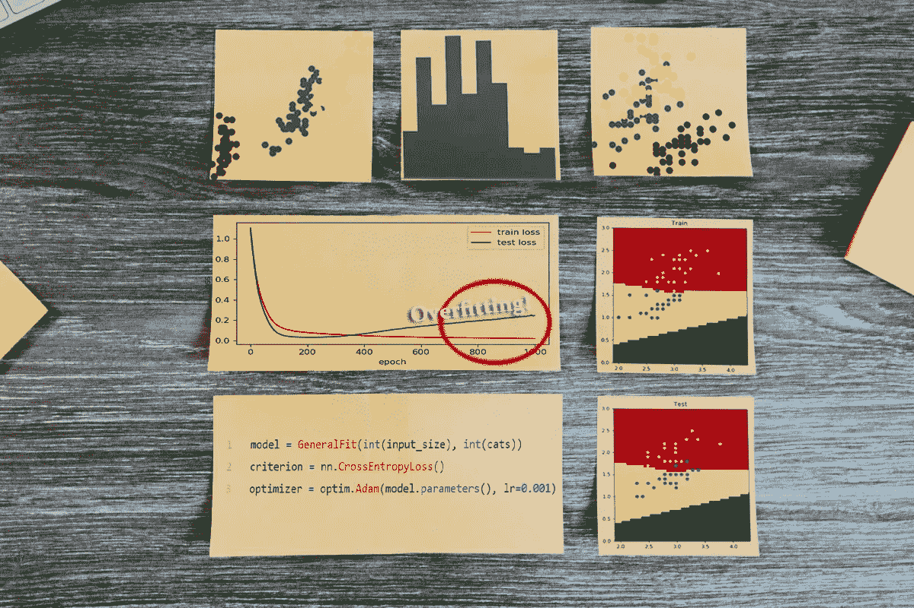
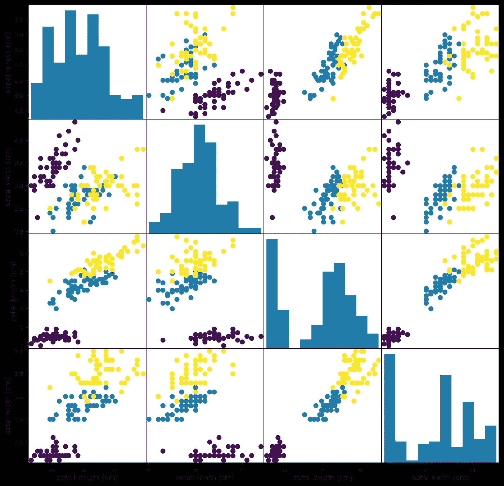
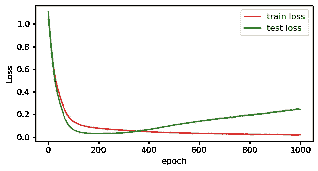
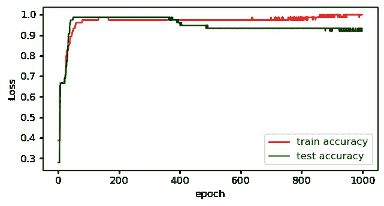
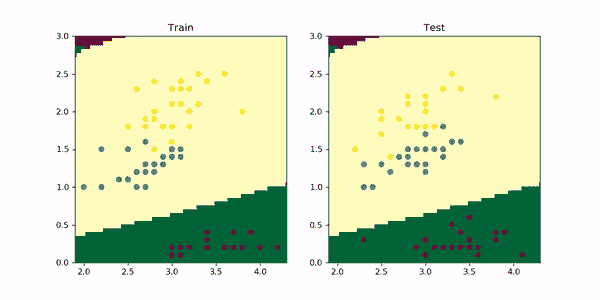
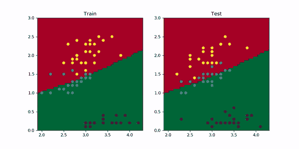
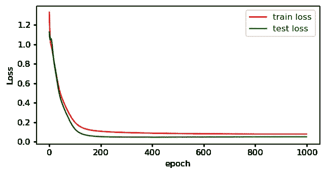

# 今天学习人工智能 02:使用 PyTorch 的分类问题介绍

> 原文：<https://towardsdatascience.com/learn-ai-today-02-introduction-to-classification-problems-using-pytorch-b710918cba63?source=collection_archive---------69----------------------->

## [今天学 AI](http://towardsdatascience.com/tagged/learn-ai-today)

## 用神经网络对花卉进行分类，可视化决策边界和理解过度拟合。

改编自[凯莉·西克玛](https://unsplash.com/@kellysikkema?utm_source=unsplash&utm_medium=referral&utm_content=creditCopyText)在 [Unsplash](https://unsplash.com/s/photos/organize?utm_source=unsplash&utm_medium=referral&utm_content=creditCopyText) 上的照片。

这是我创作的 [**今日 AI**](http://learn-ai-today.com/)**系列的第二个故事！这些故事，或者至少是前几个，是基于我在研究/学习 **PyTorch** 和**深度学习**时创作的一系列 **Jupyter 笔记本**。我希望你和我一样觉得它们很有用！**

**如果你还没有，一定要检查以前的故事！**

** [## 今日学习人工智能:Pytorch 入门

### 定义和训练 Pytorch 模型并动态可视化结果

towardsdatascience.com](/learn-ai-today-01-getting-started-with-pytorch-2e3ba25a518) 

# 你将从这个故事中学到什么:

*   验证的重要性
*   如何为分类问题训练模型
*   动态可视化决策边界
*   如何避免过度拟合** 

# **1.鸢尾花数据集**

**让我们从介绍数据集开始。我将使用非常著名的 [**鸢尾花数据集**](https://en.wikipedia.org/wiki/Iris_flower_data_set) ，它包含以下 3 种花的 4 种不同测量值(萼片长度、萼片宽度、花瓣长度、花瓣宽度)。**

****

**图片改编自[维基百科](https://en.wikipedia.org/wiki/Iris_flower_data_set)。**

****目标是使用每朵花的 4 个测量值准确识别物种。**注意，现在使用直接从图像中学习的模型(卷积神经网络)相对容易，但我将把这个话题留到下一课。如下面的代码所示，**鸢尾花数据集**可以很容易地从 **sklearn 数据集**中下载。**

**为了快速显示数据，我们绘制每对要素的散点图和每个要素的直方图。为了实现这个表示，我使用了**pandas . plotting . scatter _ matrix**函数(和往常一样，你可以在最后找到完整代码的链接)。**

****

**鸢尾花数据的可视化(蓝点——鸢尾；蓝绿色的点——杂色鸢尾；黄点——海滨鸢尾)。图片由作者提供。**

**正如你在上面的散点图中看到的，对于大多数样品来说，区分物种应该很容易。例如，在大多数地块中，刚毛鸢尾点与其他两个物种非常接近。对于这样一个简单的例子，你可以通过画几条线来创建一个基于规则的算法。然而，为了简单起见，**也是一个用神经网络介绍**分类的好例子**！****

# **2.验证集**

**在直接进入模型和训练**之前，创建一个验证集**非常重要。为了避免一次引入太多概念，我在第一课中跳过了这一步。**

****验证集**的想法很简单。不是用你所有的数据训练一个模型，而是**把一小部分数据**(通常是 20% — 30%)储存起来，你将使用这些数据来评估训练好的模型**是否能很好地推广到看不见的数据**。这对于确保您的模型可以安全地投入生产以准确评估新数据非常重要。**

**在上面的代码中，我使用了`train_test_split`函数来随机分割数据，我选择了一个`test_size=0.5`。设置`random_state`总是一个好主意，以确保当您重新运行代码时，将使用相同的分割。**

**请注意，这是一个常见且良好的实践，两个不是 2 个而是 **3 个数据分割:训练、验证和测试**。在这种情况下，当你尝试几个模型、想法和超参数(如学习率)时，你使用验证集来检查进度，当你对结果满意时，才在最后使用测试集。这就是在**卡格尔比赛**中发生的事情，那里通常有一个**隐藏测试装置**。**

# **3.为分类训练模型**

**我将在这个例子中使用的模型与我在[上一课](/learn-ai-today-01-getting-started-with-pytorch-2e3ba25a518)中用于回归问题的模型完全相同！**

****那么有什么区别呢？**不同之处在于**损失函数**。对于**多类分类**问题，通常的选择是**交叉熵损失** (nn。PyTorch 中的 CrossEntropyLoss)。对于**二元分类**的问题，你通常会用**二元交叉熵** **损失** (nn。BCEWithLogitsLoss)。因此，用于定义模型、标准和优化器的代码与我在上一课中用于回归的代码非常相似！**

**要考虑的另一个区别是最后一个激活函数。对于**回归**问题，模型的输出是一个数字，可以是任何实数值。对于**二进制分类**，您需要使用一个 **Sigmoid 激活函数**将输出映射到 0–1 范围。对于**多级分类**，您需要 **Softmax 激活功能**(除非您想要允许多项选择，在这种情况下使用 Sigmoid 激活)。Softmax 输出可以解释为分配给每个类的概率。**

**现在不要太担心激活函数。我只是在这里提一下，让你意识到他们的存在。目前，值得一提的是。CrossEntropyLoss 包括为您激活的 Softmax 和 **nn。BCEWithLogitsLoss** 为您提供乙状结肠。这样你就不需要在模型的末尾添加任何激活函数。PyTorch 会帮你搞定的！**

**在训练模型之前，我还修改了上一课的`fit`函数(你可以在 Kaggle 笔记本上查看，最后有完整的代码),以考虑到`train`和`test/validation`数据。(当只处理两个数据集时，术语**验证**和**测试**经常互换使用。)**

**绘制 1000 次训练中的训练和测试损失图，你可以看到**有些奇怪的事情正在发生**。**

****

**训练和测试损失。图片由作者提供。**

**虽然**列车损失**随着时间的推移不断改善，但**测试损失**最初稳步改善，但随后**开始增加**。也许最重要的是，**你可以通过绘制模型在 1000 个时期的精确度**来看到同样的效果。**

****

**训练和测试准确性。图片由作者提供。**

**你现在看到的是我们所说的**过拟合**——在的某个点，模型开始“记忆”训练数据，而**的泛化性能**(用测试集评估)**下降**。这就是为什么你需要一个验证/测试集。在这种情况下，你可以看到，如果你在 200 个时期停止训练，结果可能会更好。这种方法称为**提前停止**，是一种减少**过拟合**的简单方法。然而，还有其他的方法，比如使用**重量衰减**，我马上会谈到。让我们首先做一些有趣的可视化来更好地理解正在发生的事情。**

# **4.可视化决策边界并减少过度拟合**

**为了可视化训练边界并更好地理解过度拟合，我仅使用 2 个(而不是 4 个)特征来重新训练模型，以便容易地在 2D 图形中绘制结果。**在下面的动画中，您可以看到在 1000 个训练时期中，训练(左)和测试(右)的决策界限不断演变。****

****

**在 1000 个训练时期可视化模型决策边界。作者的动画。**

**看看**最初模型如何快速学习划分区域的 2 条直线边界**。然后，**红黄边界开始向上弯曲**，更好地适应列车组。然而，观察测试集，这导致了性能的**轻微下降，因为更多的黄色点移动到中间区域，而蓝绿色点移动到顶部区域。而**这正是过度拟合的样子**。对于更复杂的问题，你可以在**多维度**中想象这一点——当你有很多维度时，更容易过度拟合。****

**如果你很难想象任何超过 3 维的东西，只要遵循 Geoffrey Hinton 的建议:**“要处理 14 维空间中的超平面，想象一个 3 维空间，并大声对自己说‘14’。大家都这么干。”****

**为了减少这个例子中的过度拟合，可以使用两个简单的“技巧”:**

*   ****提前停止:**用更少的时期训练模型**
*   ****权重衰减:**通过在每次迭代中少量减少模型权重，使其变小**

## **4.1 提前停止**

****提前停止**的想法非常简单，正如我之前提到的，如果模型在大约 200 个历元时具有**最佳验证精度，那么如果你只训练 200 个历元，你将得到一个概括得更好的模型——根据验证精度。问题是，您可能会在视觉上过度适应验证集——特别是当您根据验证分数调整许多超参数时。**这就是为什么在完成所有实验后，获得一组额外的数据来评估模型是非常重要的。******

## **4.2 重量衰减**

****体重衰减**的思路也很简单。当拟合一个**神经网络时，**一般来说，不存在最优解，而是存在多个可能的相似解。**权重衰减**，通过迫使权重保持较小，将迫使优化过程达到更简单的解决方案。**

**让我们给我们的模型添加一个`weight_decay=0.01`，并像以前一样在训练 1000 个时期后可视化结果。在 PyTorch 中，您只需要将这个参数作为`optimizer = optim.Adam(model.parameters, lr=0.001, weight_decay=0.01)`添加到优化器中。生成的动画如下。**

****

**在权重衰减为 0.01 的 1000 个训练时期期间可视化模型决策边界。作者的动画。**

**如您所见，现在红黄边界不会像以前那样向上弯曲，因为这需要大幅增加权重，而且精度不会有太大变化。**

**用具有重量衰减的 4 个输入特征来训练模型，得到了下面的训练和测试损失图。看，现在**测试损失没有像以前一样开始增加！****

****

**用重量衰减训练的模型的训练和测试损失。图片由作者提供。**

**同样重要的是要提到**当你开始一个新项目时，过度适应是你应该瞄准的目标**。从一个可以过度拟合数据的模型开始，这样你就知道你的模型有足够的“灵活性”来学习数据中的模式。**然后增加正则化，像权重衰减，避免过拟合！****

# **家庭作业**

**我可以给你看一千个例子，但如果你能自己做一两个实验，你会学到更多！这些实验的完整代码可以在 [**这本笔记本**](https://www.kaggle.com/mnpinto/learn-ai-today-02-classification-with-pytorch) 上找到。**

*   **和上一课一样，试着玩学习率、时期数、重量衰减和模型大小。**
*   **做些实验，看看结果是否如你所愿，如果不是，看看视觉效果，试着理解为什么。**

**和往常一样，如果你通过实验创作出了有趣的动画笔记本，那就在 GitHub、Kaggle 上分享吧，或者写一个中型故事！**

# **结束语**

****Learn AI Today** 系列第二个故事到此结束！**

*   **请考虑将 [**加入我的邮件列表，点击此链接**](https://docs.google.com/forms/d/e/1FAIpQLSc0IBzdCn7osIjvGno1GjBakI-DfXHE8gDLZ--jNzWsXtRW0g/viewform) 获取更新，这样你就不会错过下面的任何故事或重要更新了！**
*   **我还会在 learn-ai-today.com**列出新的故事，这是我为这次学习之旅创建的页面！****
*   ****如果你以前错过了， [**这是 Kaggle 笔记本的链接，上面有这个故事的代码**！](https://www.kaggle.com/mnpinto/learn-ai-today-02-classification-with-pytorch)****

****欢迎在评论中给我一些反馈。你觉得什么最有用，或者什么可以解释得更好？让我知道！****

****你可以在下面的故事中了解更多关于我的旅程！****

**** [## 我的 3 年历程:从零 Python 到深度学习竞赛高手

### 自从 2017 年开始学习 Python 以来，我一直遵循的道路是成为一名独自参加 Kaggle 比赛的大师…

towardsdatascience.com](/my-3-year-journey-from-zero-python-to-deep-learning-competition-master-6605c188eec7)  [## 我在 Kaggle 上的两年旅程:我如何成为竞赛大师

### 描述我的旅程和策略，我遵循成为一个竞赛大师与个人金牌

towardsdatascience.com](/my-2-year-journey-on-kaggle-how-i-became-a-competition-master-ef0f0955c35d) 

*感谢阅读！祝您愉快！*****