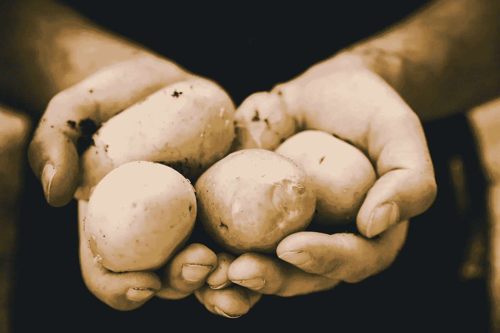
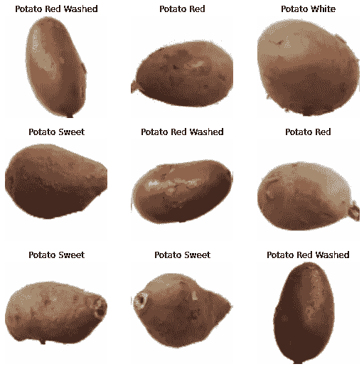
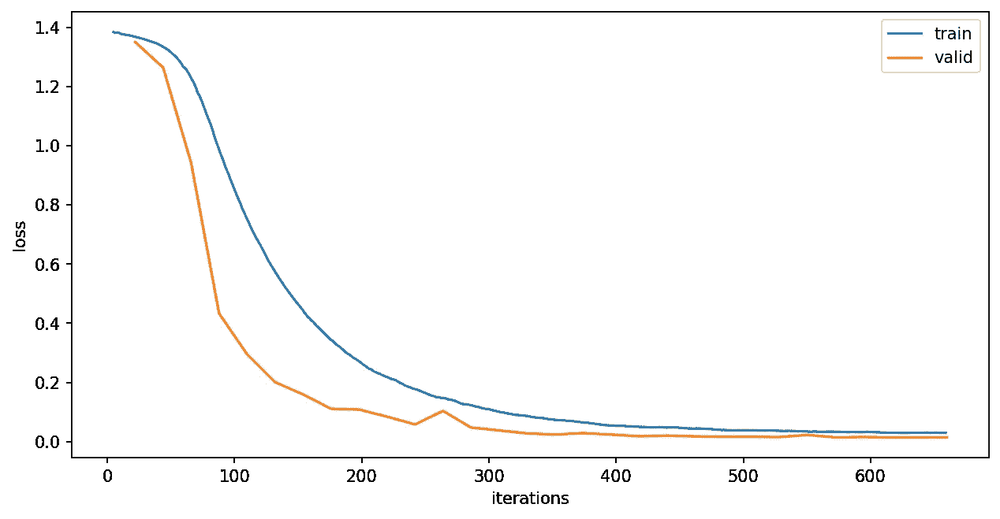

# 学习人工智能今天 03:马铃薯分类使用卷积神经网络

> 原文：<https://towardsdatascience.com/learn-ai-today-03-potato-classification-using-convolutional-neural-networks-4481222f2806?source=collection_archive---------40----------------------->

## [今天学 AI](https://towardsdatascience.com/tagged/learn-ai-today)

## 在 PyTorch 中创建一个 CNN 模型，并使用 fastai2 训练它识别土豆的类型，以简化代码

JESHOOTS.COM 在 [Unsplash](https://unsplash.com/s/photos/potato?utm_source=unsplash&utm_medium=referral&utm_content=creditCopyText) 上[的照片。](https://unsplash.com/@jeshoots?utm_source=unsplash&utm_medium=referral&utm_content=creditCopyText)

这是 [**学艾今日**](http://learn-ai-today.com/) 系列的第 3 个故事！这些故事，或者至少是前几个，是基于我在研究/学习 **PyTorch** 和**深度学习**时创作的一系列 **Jupyter 笔记本**。我希望你和我一样觉得它们很有用！

如果你还没有，一定要检查以前的故事！

 [## 今日学习人工智能:02 —使用 PyTorch 解决分类问题简介

### 用神经网络对花卉进行分类，可视化决策边界和理解过度拟合。

towardsdatascience.com](/learn-ai-today-02-introduction-to-classification-problems-using-pytorch-b710918cba63) 

# 你将从这个故事中学到什么:

*   土豆并不都一样
*   使用 Kaggle 数据集
*   卷积神经网络如何工作
*   使用 fastai2 让您的生活更轻松

# 1.Kaggle 数据集

如果你想找到一个公共数据集，Kaggle 数据集页面是一个很好的起点。Kaggle 上有近 5 万个数据集，随着用户创建和上传新的数据集与世界分享，这个数字每天都在增长。

有了为这节课创建一个**土豆分类器**的想法后，我很快找到了[这个](https://www.kaggle.com/moltean/fruits)数据集，它包含了 4 类土豆以及许多其他水果和蔬菜。

来自[水果 360](https://www.kaggle.com/moltean/fruits) 数据集的图像样本。

# 2.卷积神经网络

计算机视觉的构建模块是**卷积神经网络**。这些网络通常结合了几层核卷积运算和缩减。

下面的动画是对**内核卷积**操作的可视化展示。内核是一个小矩阵，通常是 3x3，在整个图像上移动。让我们称它为**输入特征图**，而不是图像，这样更通用。

来自 [Theano 文档](http://deeplearning.net/software/theano/tutorial/conv_arithmetic.html)的卷积示例。

在每一步中，内核 3x3 矩阵的值按元素乘以输入特征映射的相应值(上面动画中的蓝色矩阵),这 9 个乘积之和就是输出值，从而得到动画中的绿色矩阵。**内核中的数字是待学习模型的参数。通过这种方式，模型可以学习识别作为计算机视觉基础的空间模式。通过拥有多层并逐渐缩小图像，**每个卷积层学习到的模式越来越复杂。为了更深入地了解 CNN，我推荐 Irhum Shafkat 的这个故事。****

CNN 的想法从 80 年代就有了，但它在 2012 年开始获得动力，当时 ImageNet 竞赛的获胜者使用了这种方法并“击败”了竞争对手。他们的[论文](http://papers.nips.cc/paper/4824-imagenet-classification-with-deep-convolutional-neural-networks.pdf)描述了解决方案，摘要如下:

> “我们训练了一个大型深度卷积神经网络，将 ImageNet LSVRC-2010 大赛中的 120 万幅高分辨率图像分类为 1000 个不同的类别。在测试数据上，我们实现了 37.5%和 17.0%的前 1 名和前 5 名错误率，这大大优于以前的最先进水平。具有 6000 万个参数和 650，000 个神经元的神经网络由五个卷积层组成，其中一些卷积层后面是 max-pooling 层，以及三个完全连接的层，最后是 1000 路 softmax。为了加快训练速度，我们使用了非饱和神经元和卷积运算的高效 GPU 实现。为了减少全连接层中的过拟合，我们采用了最近开发的正则化方法“dropout ”,该方法被证明非常有效。我们还在 ILSVRC-2012 竞赛中加入了该模型的一个变体，并获得了 15.3%的前五名测试错误率，而第二名的错误率为 26.2%。”

前五名的错误率为 15.3%，而第二名的错误率为 26.2%，这是一个巨大的突破。**快进到今天，** [**当前前 5 名结果**](https://arxiv.org/pdf/2003.08237v4.pdf) **准确率为 98.7%(错误率 1.3%)。**

现在让我们用两个卷积层编码一个非常简单的 CNN，并用它来创建一个土豆分类器！

*   第一卷积层`nn.Conv2d`具有 **3 个输入通道**和 **32 个输出通道**，其**内核大小为 3×3**。输入通道的数量 3 对应于 RGB 图像通道。输出通道数只是一个选择。
*   第二卷积层具有 32 个输入通道**和 64 个输出通道**，以匹配前一层的输出通道数量。
*   注意第 9 行和第 10 行，在**卷积层**之后，我应用了一个`F.max_pool2d`和一个`F.relu`。 **max-pooling** 操作将通过选择每个 2x2 像素的最大值来缩小图像。这样得到的图像只有一半大小。 **ReLU** 是一个非线性激活函数，正如我在本系列的[第 1 课中提到的。](/learn-ai-today-01-getting-started-with-pytorch-2e3ba25a518)
*   在大小为 2 的两次卷积和最大池化之后，得到的特征图的大小是原始图像的 1/4。我将使用 64x64 的图像，因此这将产生一个 16x16 的特征地图。我可以添加更多的卷积层，但在某些情况下，当特征图已经很小时，通常，下一步是使用**平均池**，通过计算平均值将特征图减少到 1x1。注意，因为我们有 64 个通道，结果张量将有一个`(batch-size, 64, 1, 1)`的形状，然后在应用最后的线性层之前，它将被整形为`(batch-size, 64)`。
*   最终线性层的输入大小为 64，输出大小等于要预测的类别数**。在这种情况下，将是 4 种类型的土豆。**

**注意:**理解一切工作原理的一个好方法是使用 [Python 调试器](https://docs.python.org/3/library/pdb.html)。您可以将`import pdb`和`pdb.set_trace()`包含在 forward 方法中。然后你可以一步一步地移动，检查每一层的形状，给你一个更好的直觉或者帮助调试问题。

# 3.使用 fastai2 让您的生活更轻松

当有工具可以让你的生活更轻松时，不值得浪费时间为深度学习管道的每一步编码。这就是为什么在这个故事中我将使用 [**fastai2 库**](https://github.com/fastai/fastai2) 来完成大部分工作。然而，我将使用前一节中定义的基本 CNN 模型。请注意，fastai2 使用 PyTorch，并使每个步骤的定制变得容易，**这使它对初学者和高级深度学习实践者和研究人员都有用。**

下面 12 行代码就是 fastai2 中的整个深度学习流水线，使用的是上一节定义的 **BasicCNN** ！你可以在这里找到本课所有代码的笔记本。

*   **第 1-6 行:**定义了 **fastai 数据块**。我在[这个](/advanced-dataloaders-with-fastai2-ecea62a7d97e)和[这个](/working-with-3d-data-fastai2-5e2baa09037e)故事中谈到了 fastai 数据块的话题。**图像块**和**类别块**表示数据加载器将有一个图像类型的输入和一个类别类型的目标。
*   **第 2 行和第 3 行:**`get_x`和`get_y`是给出处理输入和目标的函数的参数。在这种情况下，我将从 pandas dataframe 中读取列“file”(每个图像文件的路径)和“id”(马铃薯的类型)。
*   **第 4 行:**`splitter`是一个参数，可以告诉你如何将数据分成训练集和验证集。这里我使用了`RandomSplitter`,默认情况下随机选择 20%的数据来创建验证集。
*   **第 5 行:**添加了一个变换，将图像的大小调整为 64x64。
*   **第 6 行:**包括标准化和图像放大。请注意，我使用的是默认的扩充。fastai 的一个优点是，大多数情况下，您可以使用默认设置，而且它很有效。这对学习非常有好处，因为在开始做有趣的工作之前，你不需要了解所有的细节。
*   **第 8 行:**data loaders 对象被创建。(`train_df`是带有`file`和`id`列的数据帧，查看完整代码[此处](https://www.kaggle.com/mnpinto/learn-ai-today-03-potato-classifier))。
*   **第 9 行:**创建一个类数为 4 的 BasicCNN 模型的实例(注意`dls.c`自动指示类数)。
*   **第 10 行:**定义了 fastai **Learner** 对象。这是您指出模型、损失函数、优化器和验证指标的地方。我将使用的损失函数是`nn.CrossEntropyLoss`,正如在[上一课](/learn-ai-today-02-introduction-to-classification-problems-using-pytorch-b710918cba63)中所述，它是超过两个类别的分类问题的首选。
*   **第 12 行:**使用一次循环学习率时间表(学习率快速增加到`lr_max`，然后逐渐减少)和 0.01 的权重衰减来训练模型 30 个时期。

经过 30 个时期的训练，我用这个简单的 CNN 模型获得了 100%的验证准确率！这是训练和验证损失看起来像一个训练过程:

培训和验证损失在培训过程中的演变。图片由作者提供。

就是这样！如果你按照[代码](https://www.kaggle.com/mnpinto/learn-ai-today-03-potato-classifier)操作，你现在可以非常准确地识别 4 种土豆。最重要的是，这个例子中没有任何东西是关于土豆的！您可以对几乎任何想要分类的东西应用类似的方法！

# 家庭作业

我可以给你看一千个例子，但如果你能自己做一两个实验，你会学到最多！这个故事的完整代码可以在这个笔记本上找到。

*   和上一课一样，试着玩学习率、时期数、重量衰减和模型大小。
*   不使用 BasicCNN 模型，尝试使用在 ImageNet 上预训练的 Resnet34(看看 fastai `cnn_learner`)结果如何比较？可以尝试更大的图像尺寸，激活 Kaggle 内核上的 GPU，让训练更快！(Kaggle 免费为您提供 30h/周的 GPU 使用量)
*   现在，使用数据集中的所有水果和蔬菜训练模型，并查看结果。该数据集还包括一个测试集，您可以使用它来进一步测试训练好的模型！

和往常一样，如果你通过实验创作出了有趣的动画笔记本，那就在 GitHub、Kaggle 上分享吧，或者写一个中型故事！

# 结束语

**Learn AI Today** 系列第三个故事到此结束！

*   请考虑 [**在这个链接中加入我的邮件列表**](https://docs.google.com/forms/d/e/1FAIpQLSc0IBzdCn7osIjvGno1GjBakI-DfXHE8gDLZ--jNzWsXtRW0g/viewform) ，这样你就不会错过我即将发布的任何故事了！
*   我还会在 [**、learn-ai-today.com**](http://learn-ai-today.com/)、我为这次学习之旅创建的页面以及[**GitHub 资源库**](https://github.com/mnpinto/learn_ai_today) 列出新故事！
*   如果你以前错过了， [**这是 Kaggle 笔记本的链接，上面有这个故事的代码**！](https://www.kaggle.com/mnpinto/learn-ai-today-03-potato-classifier)

欢迎在评论中给我一些反馈。你觉得什么最有用，或者什么可以解释得更好？让我知道！

你可以在下面的故事中了解更多关于我的深度学习之旅！

 [## 我的 3 年历程:从零 Python 到深度学习竞赛高手

### 自从 2017 年开始学习 Python 以来，我一直遵循的道路是成为一名独自参加 Kaggle 比赛的大师…

towardsdatascience.com](/my-3-year-journey-from-zero-python-to-deep-learning-competition-master-6605c188eec7)  [## 我在 Kaggle 上的两年旅程:我如何成为竞赛大师

### 描述我的旅程和策略，我遵循成为一个竞赛大师与个人金牌

towardsdatascience.com](/my-2-year-journey-on-kaggle-how-i-became-a-competition-master-ef0f0955c35d) 

*感谢阅读！祝您愉快！*