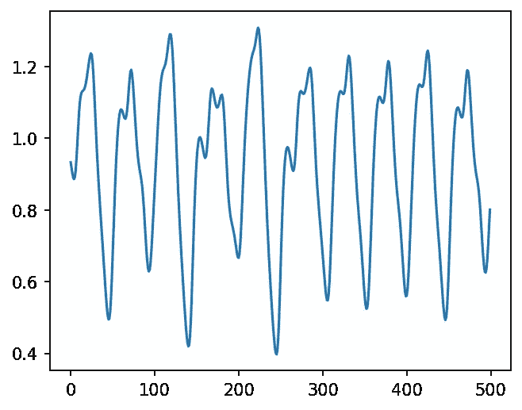
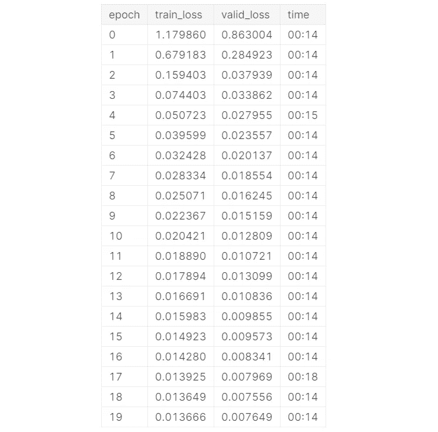
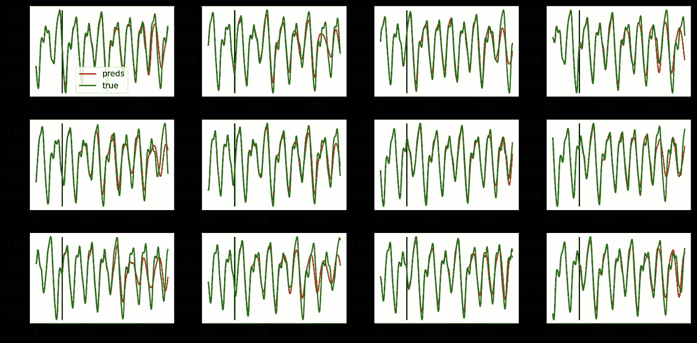
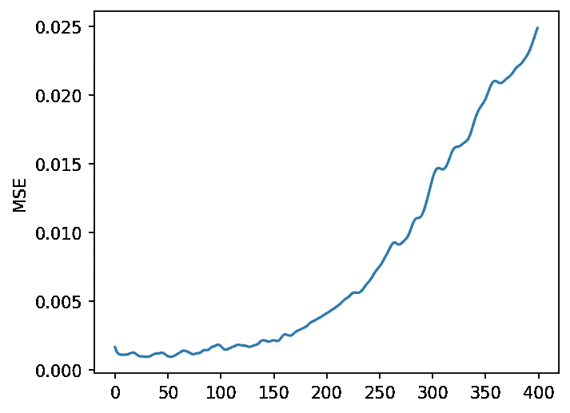

# 今日学习人工智能 04:时间序列多步预测

> 原文：<https://towardsdatascience.com/learn-ai-today-04-time-series-multi-step-forecasting-6eb48bbcc724?source=collection_archive---------21----------------------->

## [今天学 AI](https://towardsdatascience.com/tagged/learn-ai-today)

## 创建和训练 1D 卷积神经网络，以预测用 Mackey-Glass 方程生成的混沌时间序列的多个未来时间步长

由[在](https://unsplash.com/@drew_beamer?utm_source=unsplash&utm_medium=referral&utm_content=creditCopyText) [Unsplash](https://unsplash.com/s/photos/future?utm_source=unsplash&utm_medium=referral&utm_content=creditCopyText) 上绘制的 Beamer 照片。

这是 [**学艾今日**](http://learn-ai-today.com/) 系列的第 4 个故事！如果你还没有，一定要检查以前的故事。

 [## 今天学习人工智能:03 —使用卷积神经网络的马铃薯分类

### 在 PyTorch 中创建一个 CNN 模型，并使用 fastai2 训练它识别土豆的类型，以简化代码

towardsdatascience.com](/learn-ai-today-03-potato-classification-using-convolutional-neural-networks-4481222f2806) 

# 你将从这个故事中学到什么:

*   创建一个混乱的时间序列
*   按顺序拆分系列以提供给模型
*   定义和训练用于时间序列预测的 1d 卷积神经网络
*   使用 fastai2 **数据集**和**学习器**

# 1.创建一个混乱的时间序列

在一个混沌系统中，初始条件的一个非常小的变化就可能导致完全不同的结果。在这样的系统中，即使你知道描述未来的确定性方程，你也无法准确预测未来。为什么？因为你需要一台无限精确的计算机和无限精确的初始条件。事实上，这根本不可能。这就是为什么天气预报只在短期内准确。随着时间的推移，随着动态和统计模型的改进以及计算能力的提高，它们也在不断改进。然而，不可能长期准确地预测每天的天气，因为它是一个混沌系统。

为了生成一个混沌时间序列，我将使用 [Mackey-Glass 方程](http://www.scholarpedia.org/article/Mackey-Glass_equation)，参数在这里[描述](http://lab.fs.uni-lj.si/lasin/wp/IMIT_files/neural/nn05_narnet/)。Python 代码如下所示:

前 500 个样本的结果如下:

麦基-格拉斯时间序列。图片由作者提供。

请注意，时间序列中有一个模式，但有很多变化，无法在很长一段时间内可靠地预测。

# 2.按顺序拆分系列以提供给模型

用上面的代码生成的数据是一个很长的序列。为了训练一个模型，我将把数据分成 500 个元素的较小序列。**输入数据**将是前 100 个元素，而**目标数据**(未来预测)将是剩余的 400 个元素。此外，数据的前 2/3 将用作**训练数据**，而后 1/3 用作**验证数据**。

**注意:**处理时间序列时，选择序列的最后一部分进行验证通常是个好主意，特别是当您想要预测未来时。否则，该模型可能会学习自相关，并产生误导性的好结果，这将在应用于未来时“打破”实践。

上面的代码简单地运行长序列，并创建如上所述的输入和目标序列，按照模型所需的格式重新整形。对于图像数据和通常的 2D 卷积神经网络，张量以形状[批量大小，通道，行，列]组织。这里对于 **1D 卷积神经网络，**也是一样的，但是去掉了最后一个维度。并且实际上有可能具有多个时间序列的输入(表示为几个通道)。

# **3。定义和训练模型**

我为这个实验定义的模型是一个 1D 卷积神经网络，它有 3 个卷积层，然后是 ReLU 激活和**批量归一化**，最后是平均池和两个线性层。基本原理类似于 2D 卷积层。每个连续的层都可以捕获越来越复杂的数据模式。**批量标准化**有助于使训练更快、更稳定，即使在非常深的神经网络中。你可以看这个 10 分钟的视频，吴恩达解释了为什么 Batch Norm 有效。

还注意到，在最后一个线性层之前，我使用了一个**下降**(第 26 行)。漏失(在第 10 行中定义，概率为 0.5)通常是一种成功的正则化方法。它只是随机删除特征图中的一些元素，使数据每次都略有不同。以一幅图像为例。丢弃就像删除图像的一些像素。最有可能的是，您仍然可以识别图像中的对象，因此模型必须学习它，从而产生更健壮的模型。

**注意:**在推断时间内，辍学是不活跃的。这也是你需要在运行推理之前调用`model.eval()`的原因之一，否则会应用 dropout。

使用 fastai `Datasets`类很容易创建数据加载器，然后使用 fastai `Learner`将数据加载器与模型结合起来。学习者类处理训练和预测。

*   在上面的代码中，**数据集**是通过给出一个项目列表和一个函数来定义输入和其他目标而创建的(第 1 行)。我之前将序列和目标定义为张量`x`和`y`(这里是[完整代码](https://www.kaggle.com/mnpinto/learn-ai-today-04-time-series))，因此我只需要从这些张量中选择元素。你可以在文档[中阅读更多关于 fastai `Datasets`的信息。](https://docs.fast.ai/data.core.html#Datasets)
*   如您所见，在第 5 行中，我使用**一个周期学习率时间表**训练模型 20 个时期(学习率上升，直到达到`max_lr`，然后逐渐衰减)。fastai 提供的又一个好特性！

在训练过程中，下表打印了结果，您可以看到随着训练的进行，训练和验证损失逐渐下降。

训练进展表。图片由作者提供。

如上表所示，列车损失高于验证损失有几个原因。在这种情况下，一个可能的原因是仅用于培训的辍学本身的使用。你可以试着运行没有脱落的代码，检查一下是不是这样！

现在模型已经定型，让我们计算验证的预测。`Learner`的`get_preds`方法可以如下使用:`ye_valid, y_valid = learn.get_preds().`注意，我不需要调用`model.eval()`，因为 fastai `get_preds`已经处理了这些细节。然而有一点需要记住。

有了结果，是时候可视化预测了！这是最好玩的部分。下面的代码创建了一个包含 12 个验证序列的可视化图像。

结果的可视化。绿线代表真实数据，红线代表预测。输入数据显示在垂直黑条上。图片由作者提供。

如上图所示，模型预测(红色)从紧跟目标(绿色)开始，但随着时间的推移，性能开始下降。事实上，如果我沿着时间轴绘制均方差(MSE ),结果如下:

MSE 超过 400 的预测序列。图片由作者提供。

由于数据的混乱性质，这是意料之中的。这个结果还能进一步提高吗？可能是的，我在准备这个故事时尝试了几种不同的选择，真正的学习是查看代码并进行自己的观察和实验。

# 家庭作业

我可以给你看一千个例子，但如果你能自己做一两个实验，你会学到最多！这个故事的完整代码可以在 [**这个笔记本**](https://www.kaggle.com/mnpinto/learn-ai-today-04-time-series) 上找到。

*   尝试改变模型、超参数、优化函数、输入和输出序列的大小，看看它如何影响结果。
*   将该模型应用于你可能感兴趣的某个问题的另一个时间序列。成绩如何？

和往常一样，如果你通过实验创作出了有趣的动画笔记本，那就在 GitHub、Kaggle 上分享吧，或者写一个中型故事！

# 结束语

**今日学 AI**系列第四个故事到此结束！

*   请考虑 [**在这个链接中加入我的邮件列表**](https://docs.google.com/forms/d/e/1FAIpQLSc0IBzdCn7osIjvGno1GjBakI-DfXHE8gDLZ--jNzWsXtRW0g/viewform) ，这样你就不会错过我即将发布的任何故事了！
*   我还会在[**learn-ai-today.com**](http://learn-ai-today.com/)**—**我为这次学习之旅创建的页面上列出新的故事，并在[**GitHub 知识库**](https://github.com/mnpinto/learn_ai_today) 列出新的故事！
*   如果你以前错过了， [**这是 Kaggle 笔记本的链接，上面有这个故事的代码**](https://www.kaggle.com/mnpinto/learn-ai-today-04-time-series) ！

欢迎在评论中给我一些反馈。你觉得什么最有用，或者什么可以解释得更好？让我知道！

你可以在下面的故事中了解更多关于我的深度学习之旅！

 [## 我的 3 年历程:从零 Python 到深度学习竞赛高手

### 自从 2017 年开始学习 Python 以来，我一直遵循的道路是成为一名独自参加 Kaggle 比赛的大师…

towardsdatascience.com](/my-3-year-journey-from-zero-python-to-deep-learning-competition-master-6605c188eec7)  [## 我在 Kaggle 上的两年旅程:我如何成为竞赛大师

### 描述我的旅程和策略，我遵循成为一个竞赛大师与个人金牌

towardsdatascience.com](/my-2-year-journey-on-kaggle-how-i-became-a-competition-master-ef0f0955c35d) 

*感谢阅读！祝您愉快！*