# Git 和 GitHub 入门:初学者完全教程

> 原文：<https://towardsdatascience.com/learn-basic-git-commands-for-your-data-science-works-2a75396d530d?source=collection_archive---------26----------------------->


照片由[扬西·敏](https://unsplash.com/@yancymin?utm_source=medium&utm_medium=referral)在 [Unsplash](https://unsplash.com?utm_source=medium&utm_medium=referral) 上拍摄

## [动手教程](https://towardsdatascience.com/tagged/hands-on-tutorials)

## 关于如何在 15 分钟内使用 GitHub 的完整教程

## Git 作为一个版本控制系统

G 它是全球开发者普遍使用的开源版本控制系统。版本控制系统帮助开发人员对开源项目做出贡献，并检查代码的版本。git 是由 Linux 创始人 Linus Torvald 开发的，作为帮助 Linux 开发人员开发和维护代码的工具。所以，git 是 Linus Torvald 支持主项目 Linux 的第二个项目。

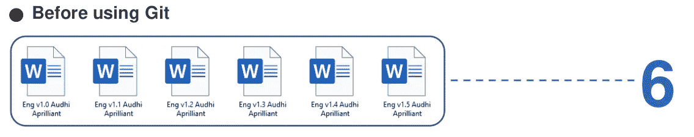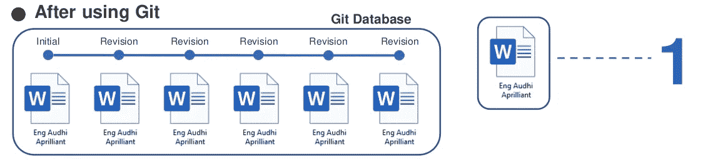

git 作为版本控制工具的图示(图片由作者提供)

上图清楚地向我们解释了 git 作为版本控制工具的功能。它让我们可以处理单个文件，而不是有各自版本的多个文件。使用基本版本(许多文件)往往是不可跟踪和非结构化的。我们也无法跟踪我们的修订。但是，使用 git，任何修订或更改都将被记录在 git 系统上，作为用户，我们可以根据需要返回到文件的某个版本。从 git 日志中，我们可以从头开始跟踪我们工作中的修订。

作为协作工具，git 将电子邮件、短信、聊天等基本协作方式移植到协作系统中。对于一个有很多人参与的大项目来说，基本的协作往往是不完整的、误解的、糟糕的日志，并且效率低下。

> Git 是为基于文本的数据设计的，例如代码、书籍、论文、文章等

许多公司和开源项目都在使用版本控制系统来管理他们的项目，比如谷歌、脸书、微软、推特、LinkedIn 等等。所以，这就是为什么我们需要学习基本的 git 命令，为我们未来在科技公司的工作和职业生涯服务。

## 如何安装 Git

在你的电脑上安装 git 似乎很容易。但是这也取决于你的操作系统。对于 Windows 用户，你可能需要去 git 官方网站下载它。幸运的是，对于 Linux 用户，只需打开我们最喜欢的终端并运行如下脚本:

```
sudo apt-get update
sudo apt-get upgrade
sudo apt-get install git
```

安装完成后，一切都会好的。用下面的命令检查我们的 git 版本。

```
**# Check our git version**
git --version
```

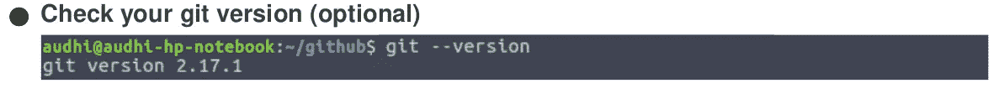

Git 版本 2.17.1(图片由作者提供)

## 配置

第一步，在深入讨论 git 及其环境之前，我们需要配置我们的 git。我们向它提供一个用户名**和**电子邮件**。**

```
**# Setup the git configuration**
git config --global user.name "your-username"
git config --global user.email "your-email"
```

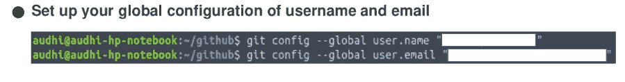

设置 git 配置(图片由作者提供)

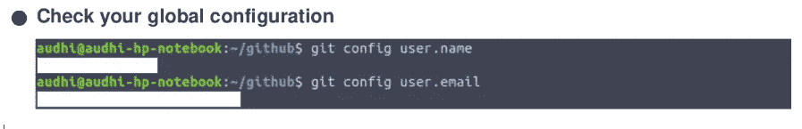

查看我们的 git 全局配置(图片由作者提供)

## Git 作为版本控制工具

对于我们第一次接触 git，让我们创建一个目录，例如，在我的例子中是 *git-stk* ，然后移动到那个目录中。然后，从`**git init**`开始我们的练习。重要的是注意到`**git status**`将打印我们的作品的状态，如目录或文件有任何变化。只要我们没有做任何修改，命令`**git status**`将 ***打印出来还没有提交*** 。

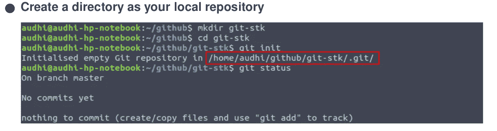

git 的初始化(图片由作者提供)

那么，`**git init**`是什么意思呢？简单来说，这个命令将创建一个包含几个文件夹和文件的`**.git**`文件夹，比如`**hooks**`、`**info**`、`**objects**`、`**refs**`、`**config**`、`**description**`和`**HEAD**`，以便跟踪我们的工作。我们的更改日志将被记录在那里。

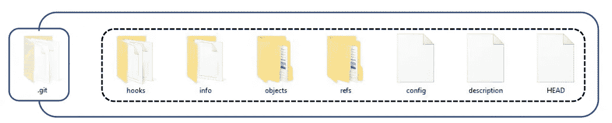

中的目录。git 初始化后的 git 文件夹(图片由作者提供)

为了与 git 命令进行交互，让我们创建一个新的 markdown 文件，即 *README.md* ，其中填充了句子*“readme . MD 文件的第一行”*。

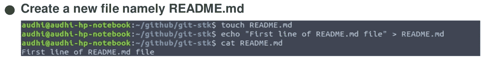

创建一个新文件与 git 交互(图片由作者提供)

让我们用`**git status**`命令检查当前状态。它打印出红色标记，表明我们对 *git-stk* 中的文件夹或文件做了任何更改。这也意味着我们的改变还没有被标记出来。我们处于 git 生命周期中的修改状态。

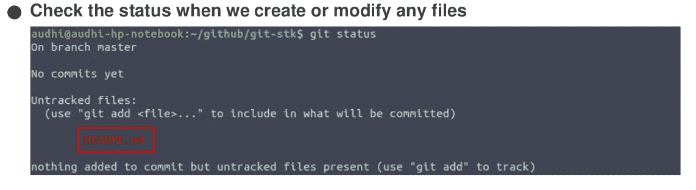

README.md 在修改状态下的状态(图片由作者提供)

要在文件 *README.md* 中标记我们的更改，请运行`**git add**`命令。要查找修改状态和暂存状态之间的状态差异，只需再次运行`**git status**`。绿色标记表示我们的更改已被标记，现在我们处于暂存状态。

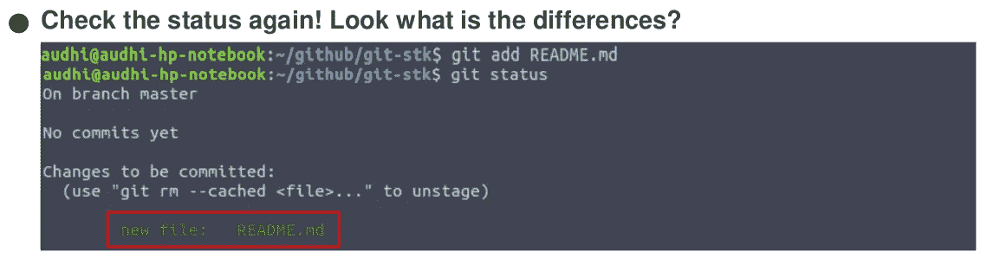

README.md 运行`**git add**`命令后的状态(图片由作者提供)

我们的 *README.md* 文件已被标记，但尚未录制。记录我们的更改，就像我们在使用 *Microsoft Word* 或其他带有`**git commit**`的工具时一样，然后是提交消息。

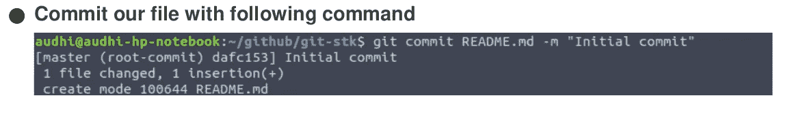

README.md 已提交(图片由作者提供)

## Git 生命周期

到目前为止，我们已经在 git 环境中进行了实验，并分配了 git 命令。但是现在，我们将深入探讨 git 的生命周期。我们之前所做的就是我们在 git 生命周期中看到的。git 生命周期分为四个状态，即:

*   **已修改**:尚未标记任何更改。我们可以在这里做任何事情，操作文件，创建或删除一个新的文件夹，以及其他事情
*   **Staged** :我们的变更已经被标记但还没有被记录的状态
*   **提交**:成功的文件夹或文件被记录到我们的*中。git* 文件夹

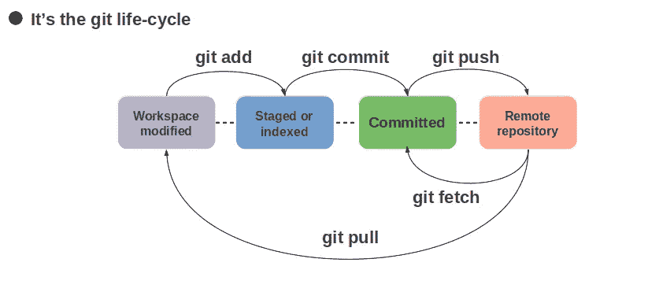

Git 生命周期(图片由作者提供)

## 继续追踪我们的日志

你能想象如果我们在文件夹中犯了一些错误吗？我们可以倒退回上一次提交或两次提交吗？答案是我们当然可以。Git 保存我们的更改(提交),如果我们的工作需要，我们可以去任何地方。好了，下面是你必须知道的新 git 命令:`**git log**`。我们将记录我们的整个提交，所以我们可以很容易地跟踪我们的工作或提交。

在之前的提交中，我们创建了一个名为 *README.md* 的文件。现在，我们将使用 git logs 命令修改该文件并检查其日志。首先用句子*“readme . MD 文件第二行”*添加我们的 *README.md* 文件然后提交。只需遵循并运行基于下图的脚本。

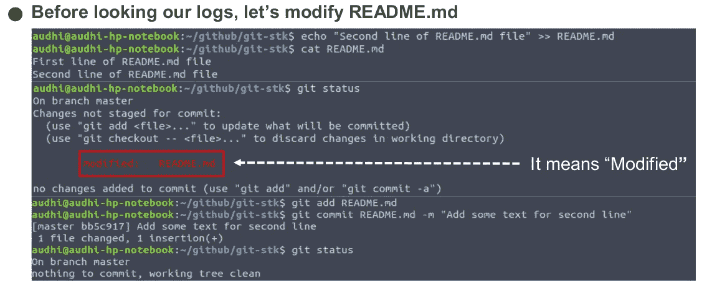

修改我们的 README.md 文件并提交它(图片由作者提供)

检查状态，直到它打印出*“Nothing to commit”*。这意味着我们已经提交了所有的更改。好了，为了跟踪我们的工作(提交)，我们只需运行`**git log**`，它将打印作者(用户名和电子邮件)、修改的日期和时间、消息和 SHA。

*   `**git log --oneline**` :打印一行日志
*   `**git log --graph**` :用作者的线漂亮的展示日志
*   `**git log --author=<username>**` :显示某个作者的日志(如果我们和很多用户一起工作)
*   `**git log <filename>**` :显示某个文件的日志

> 我们必须尽可能清晰简单地添加提交消息，因为这将有助于我们跟踪我们的工作

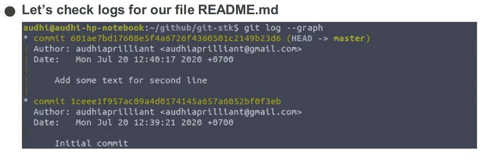

在 git 中提交日志(图片由作者提供)

git 上必须知道的命令之一是`**git diff**`。它帮助我们比较分支、特定文件或整个目录上的提交。例如，我们将比较两次提交。

图案是`**git diff <SHA-before> <SHA-after>**`。用我们提交的 SHA 输入`**<SHA-before>**`和`**<SHA-after>**`。

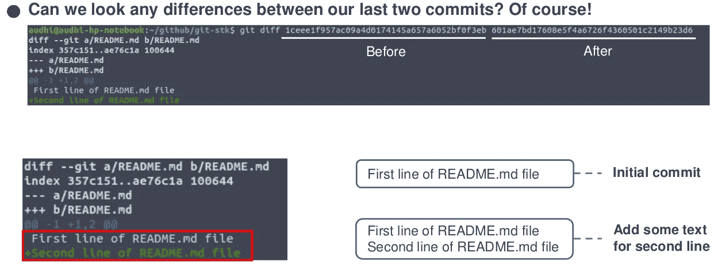

使用`**git diff**`比较 git 中的两个条件(图片由作者提供)

根据输出，我们在 *README.md* 文件中获得了关于第一次提交和第二次提交之间差异的信息。有用吧？

## 向后移动到以前的状态

作为人类，我们并不完美，对吗？有时我们会犯一些影响其他事情的错误。这也适用于科技公司，例如作为一个数据科学团队，我们正在为我们的机器学习流程开发新功能。但是发现了一个 bug。我们必须从作品的开始追溯，逐行检查代码。Git 通过向后移动特性简化了我们的工作。我们可以根据发现 bug 之前的提交来跟踪，而不是从作品的开头开始。

在 git 上有三个命令可以向后移动。它是用来满足我们的需要的。

*   `**git checkout**`:它就像一台时光机，我们可以将项目文件的状态还原到指定的时间。然而，这是暂时的。这些不存储在 git 数据库中
*   `**git reset**`:这个命令让我们无法回到未来。我们将丢失我们的提交。重置 git 日志后，我们需要编写一个新的提交
*   `**git revert**`:将采用过去已有的文件条件，然后将它们与上次提交合并

> 我们可以调用 git checkout 命令在每次提交时检查文件条件。使用命令`***git checkout master***`从过去返回

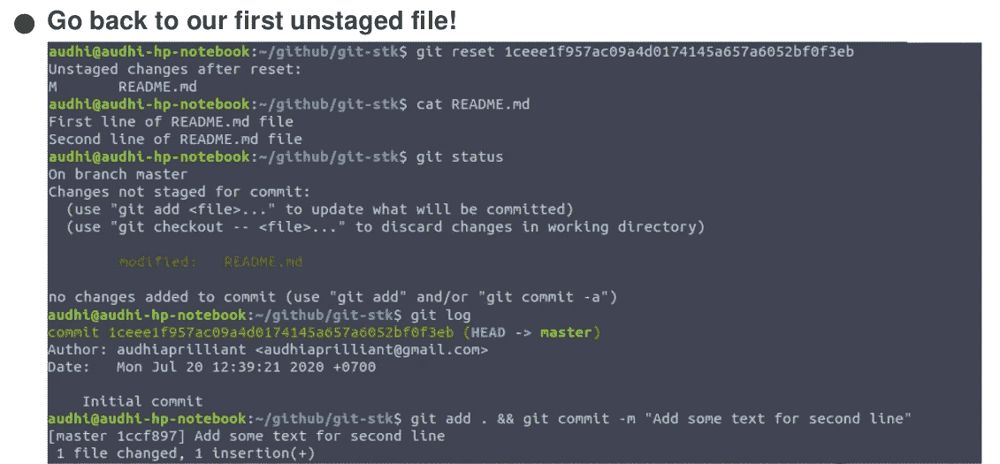

git 中`**git reset**`命令的实现(图片由作者提供)

当我们决定使用 git reset 时，有三个选项可供选择。这取决于我们的问题和我们想去的州。让我们来看看它们，并在您的计算机上试用它们！

*   `**git reset --soft**`:将文件恢复到暂存状态
*   `**git reset --mixed**`:将文件恢复到修改状态
*   `**git reset --hard**`:将文件恢复到提交状态

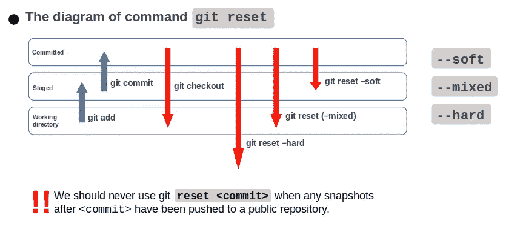

Git 重置命令(图片由作者提供)

`**git reflog**`用于恢复项目历史。我们可能熟悉显示提交列表的`**git log**`命令。`**git reflog**`与此类似，但显示的是`**HEAD**`改变的时间列表。

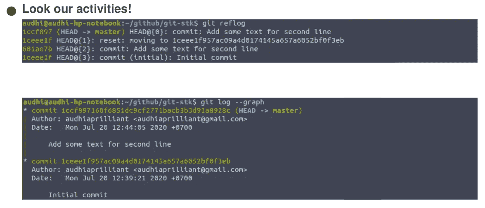

执行`**git reflog**`来恢复项目历史(图片由作者提供)

让我们再次修改我们的 *README.md* 文件来显示`**git checkout**`命令。我们只是用*“readme . MD 文件的第三行”*添加一个新行。之后，像上一步一样，将其添加到提交状态。

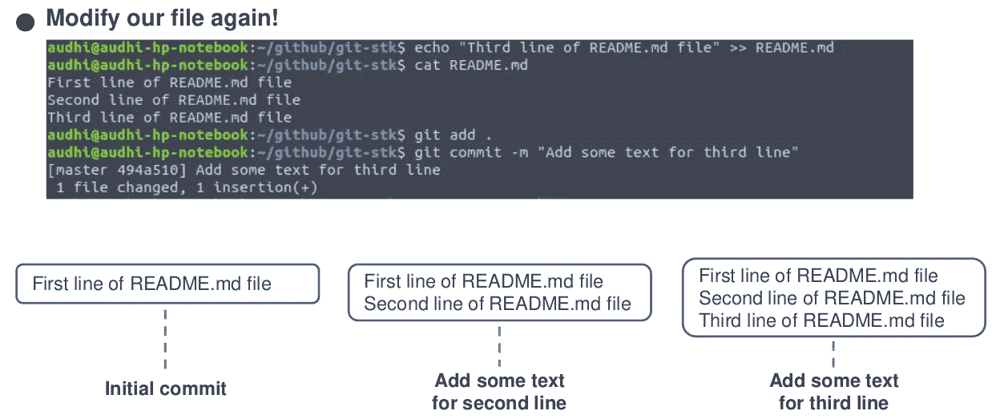

在 git 中提交日志(图片由作者提供)

请记住，我们已经用`**git reset**`恢复了我们的文件，它删除了我们的最后一次提交。然后，使用 git checkout，我们将在每次提交时检查文件条件。

> **记住:**直到这一步，我们只有三次提交

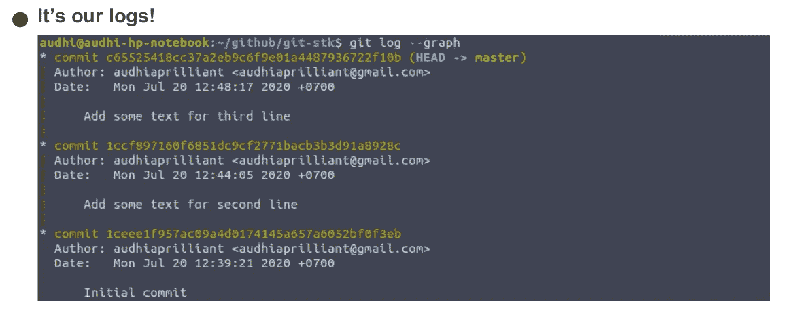

在 git 中提交日志(图片由作者提供)

为了检查我们的第一次提交，我们使用了**头**指针。按照说明理解`**git checkout HEAD**`是什么意思。它帮助我们跟踪 README.md 文件中的内容，每次提交时，是否有任何更改？什么样的变化？


使用`**git checkout**`命令检查提交(图片由作者提供)

要了解标题上 ***波浪号(~)*** 和 ***脱字符(^)*** 的功能，请看下图。它让我们可以执行工作中每个分支上的每个提交。

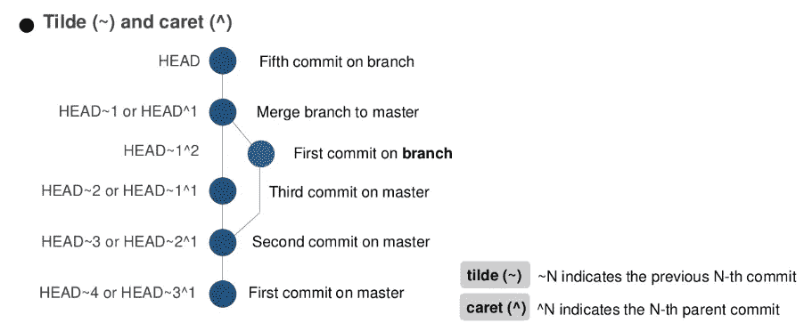

标题上的代字号和插入符号(图片由作者提供)

## Git 作为协作工具—分支

当谈到 git 作为一个版本控制工具时，我们只是谈论 git 如何帮助我们保持文件的版本。但是，现在我们将 git 作为一个协作工具来讨论。

> **Git** 中默认的**分支**名称为`**master**`

在我们的代码上开发新特性时，建议创建一个新的分支。让主分支作为我们的主要代码。如果我们的功能已经完成，并且没有发现错误，就与主分支合并。

在这种情况下，我们将创建一个名为 **new_branch** 的新分支，向 *README.md* 文件添加两行新行。

> `***git checkout***`命令也用于移动和创建分支

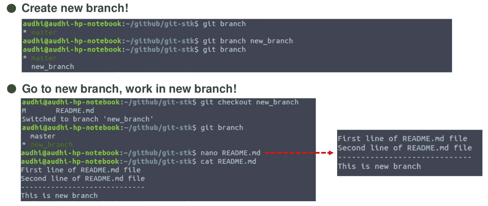

在 *README.md* 文件中新建一个分支并添加一行(图片由作者提供)

在 **new_branch** 分支上添加对提交状态的修改，并返回到主分支。查看 *README.md* 文件。我们在 **new_branch** 上的修改没有应用到主文件，因为我们在不同的分支上工作。它保持我们的主要代码干净和安全。

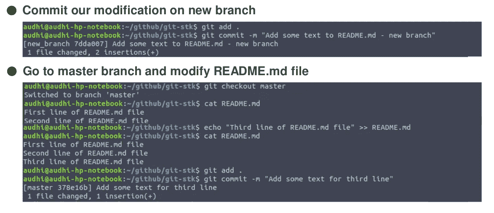

签出到主文件，并在 README.md 文件中添加新的一行(图片由作者提供)

查看 git 日志，现在您会在红色标记处发现一个新分支。是的，这表明在另一个分支上有任何提交。

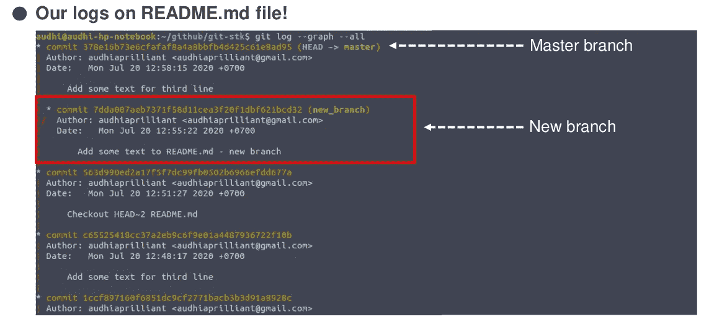

使用 git 中的新分支提交日志(图片由作者提供)

我们刚刚创建了一个新的分支并提交给它。现在，我们必须将该分支合并到主分支，并清除所有冲突。

## Git 作为协作工具—合并

当我们和一个团队一起工作时，我们必须有许多分支和它的特性。我们的下一个任务是合并这些分支，并管理其中的冲突。它是由`**git merge**`指挥的。当主文件上的文件被选为主文件或代码时，我们必须将另一个分支合并到主文件中。所以我们要去找师父！如果我们的代码冲突，作为主要开发人员或项目负责人，我们的任务是选择是删除代码还是添加到主代码中。

> 两个分支代码由`**======**`分开

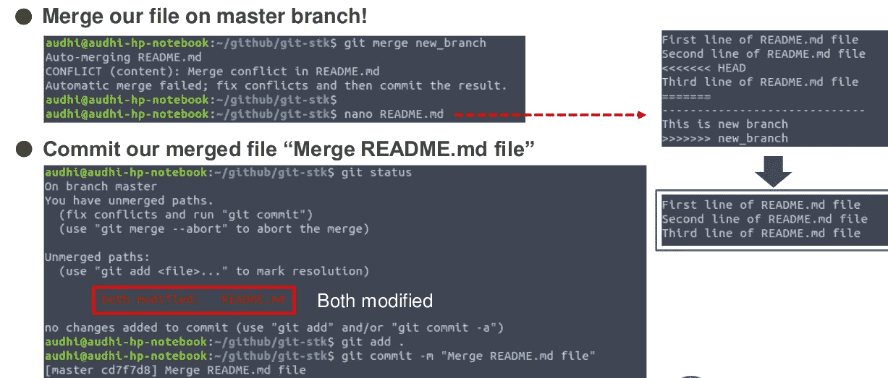

将 new_branch 合并到主服务器并管理冲突(图片由作者提供)

在我们的合并正确完成后，只需查看 git 日志。瞧啊。我们已经将 **new_branch** 合并到 master。我们的主人现在干净了！这是在 git 上合并的简单任务。

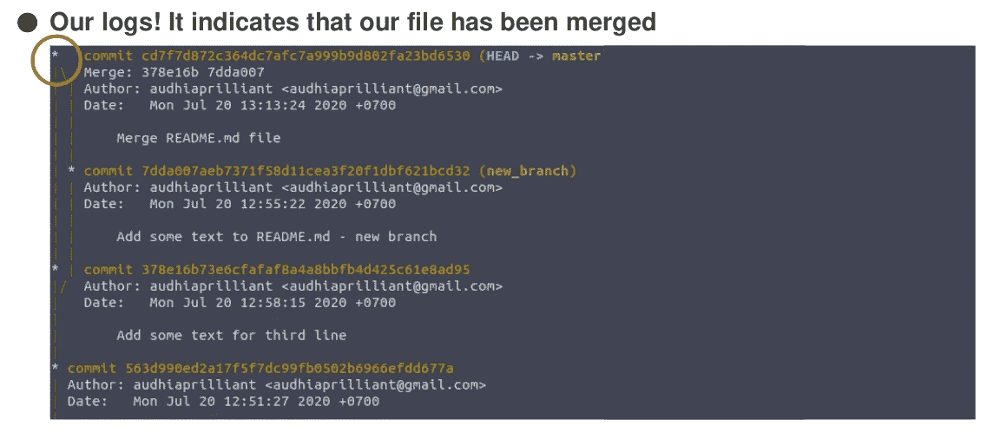

在 git 中提交日志(图片由作者提供)

显示文件的每一行是什么版本和作者最后修改的，我们可以使用`**git blame**`命令。

`**git blame L <start><end>**`

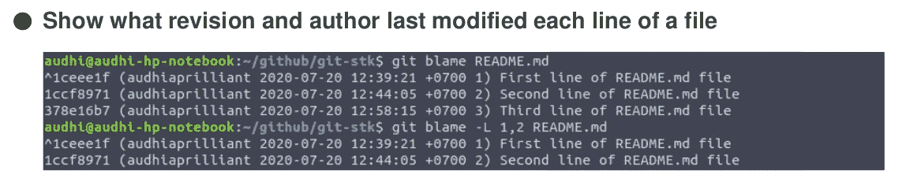

README.md 文件中的最后修改版本和作者(图片由作者提供)

## Git 作为协作工具—远程存储库

在谈论了很多关于 git 作为版本控制工具之后，接下来我们讨论 git 作为通过远程存储库的协作工具。有许多平台提供服务，让我们的脚本与人们或我们的团队协作，例如 GitHub、GitLab、Bitbucket 等。对于本教程，我们使用 GitHub。因此，您可能需要注册您的帐户，并按照说明操作！

请登录 GitHub 页面并创建一个新的存储库。选择您自己的回购名称，然后单击 ***创建存储库*** 创建新的存储库。

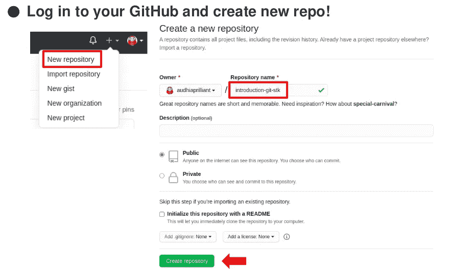

在 GitHub 中创建一个新的资源库(图片由作者提供)

我们的目标是将本地存储库上传到 GitHub 上的远程存储库。因此，在创建了新的存储库之后，我们可以将我们的远程存储库链接(通过 *SSH* 或 *HTTPS* )复制到终端并运行`**git remote add**`命令。它将创建一个到远程存储库的新连接。

运行`**git push**`将我们的本地存储库上传到远程存储库。这个命令需要两个参数`***<remote-name>******<branch-name>***` *。*

*   `***<remote-name>***` : 一个远程名字，比如，`**origin**`
*   `***<brach-name>***` :分支名称，例如`**master**`(默认)

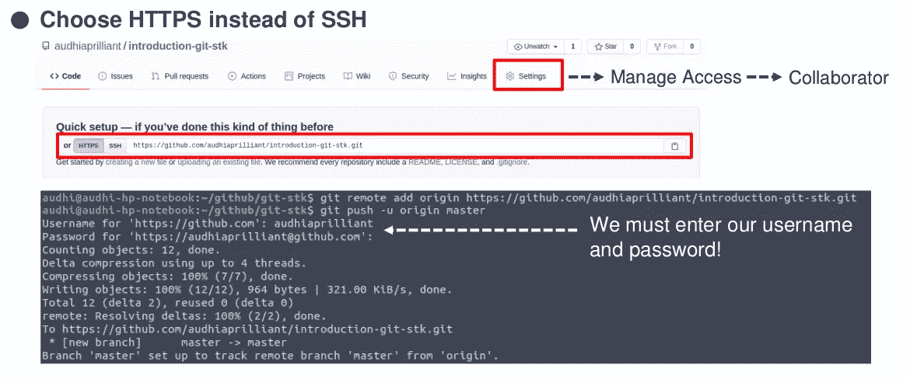

管理远程存储库并上传到其中(图片由作者提供)

## 摘要

我们现在就在这里，编码员！总结一下我们的教程，友好的开发者只是创建了一个简单的*备忘单*来帮助我们理解我们已经学过的基本 git 命令。了解更多关于 git 备忘单的信息！

## 笔记

你可能想要得到这个基础 git 教程的简历，只需访问我的 GitHub 页面[https://audhiaprilliant . GitHub . io/git-version-control-system/](https://audhiaprilliant.github.io/git-version-control-system/)。如果能和世界各地的人一起分享和学习，那该多好啊！谢谢！

## 参考

[1]阿诺姆，[吉特](https://docs.github.com/) (2020)，[https://docs.github.com/](https://docs.github.com/)。