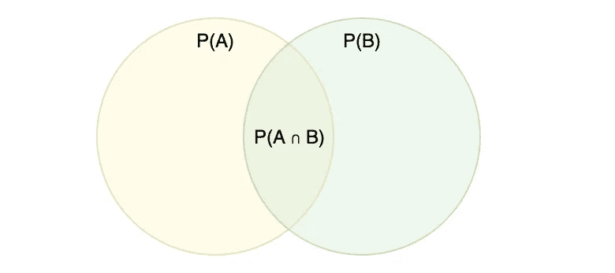
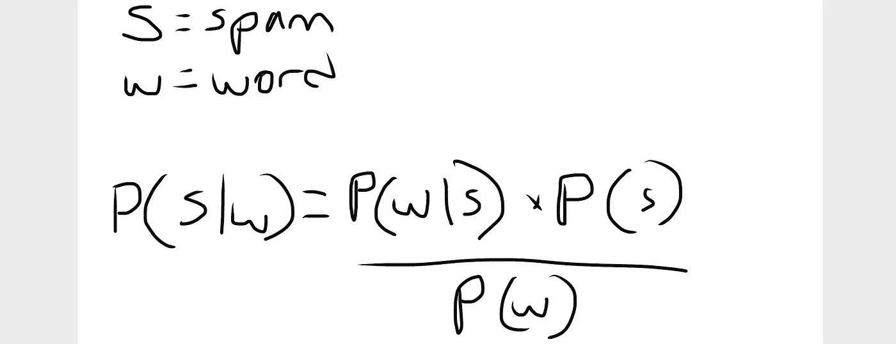
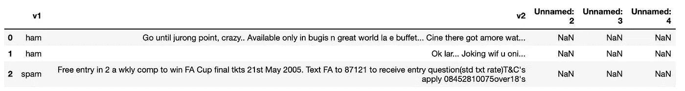
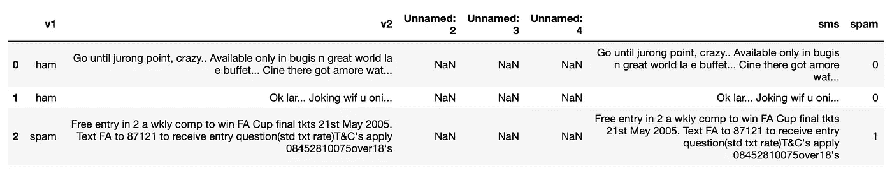
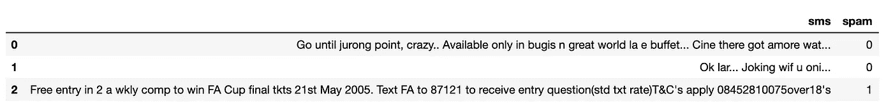
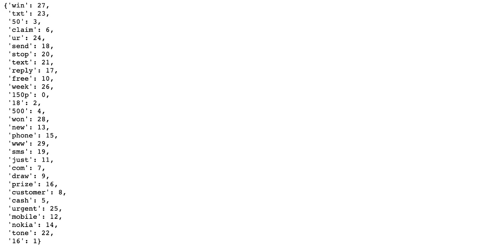
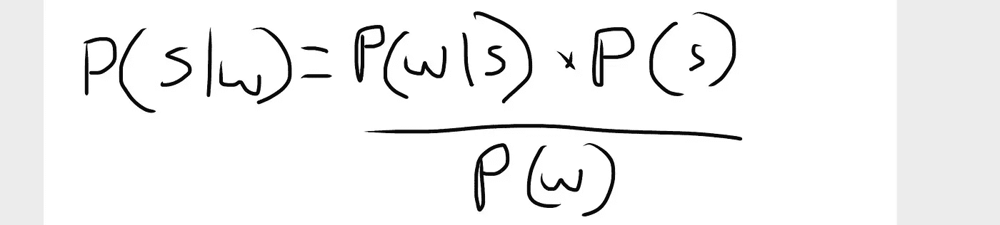

# 通过检测垃圾邮件学习贝叶斯定理

> 原文：<https://towardsdatascience.com/learn-bayes-theorem-by-detecting-spam-df092cd68d6a?source=collection_archive---------16----------------------->

## 应用贝叶斯定理预测 SMS 消息是垃圾消息的概率的教程。



**本教程有 2 个部分:**
1。从[条件概率](/conditional-probability-with-a-python-example-fd6f5937cd2)推导贝叶斯定理
2。预测短信是否是垃圾短信

# 第一部分:从条件概率推导贝叶斯定理

## 条件概率

我在这里更深入地讨论了条件概率[。](/conditional-probability-with-a-python-example-fd6f5937cd2)

条件概率告诉我们，给定另一个事件，一个事件发生的概率。


`P(A|B) = P(A ∩ B) / P(B)`是发生`A`的概率，在我们知道`B`发生的情况下。计算方法是`A`和`B`都发生的概率除以`B`发生的概率。

但是如果我们想找到相反的情况，在发生`A`的情况下`B`的概率，会怎么样呢？

有时条件概率在这方面很有用。但是有时候用贝叶斯定理更简单。

## 贝叶斯定理

[维基百科](https://en.wikipedia.org/wiki/Bayes%27_theorem)说，

> 在[概率论](https://en.wikipedia.org/wiki/Probability_theory)和[统计学](https://en.wikipedia.org/wiki/Statistics)，**贝叶斯定理**(或者**贝叶斯定律**或者**贝叶斯法则**)描述了[事件](https://en.wikipedia.org/wiki/Event_(probability_theory))的[概率](https://en.wikipedia.org/wiki/Probability)，基于可能与该事件相关的条件的先验知识。

## **推导贝叶斯定理**

我们从条件概率的公式开始，它可以写成“A 给定 B”或“B 给定 A”。


注意，直观上，`P(A∩B)`和`P(B∩A)`是一样的(见下文)。这意味着我们可以互换使用它们。以后请记住这一点。


我们从第一个公式开始，`P(A|B)= P(A∩B) / P(B)`。

多两边乘`P(B)`。这将抵消右边的`P(B)`分母，留给我们下面的。


我们现在能看到的(如果我们交换左右两边，会更容易)是`P(A∩B)= P(A|B) * P(B)`。我们将把它插回到我们的第二个原始配方中(原始配方如下)。


得到这个公式(修改如下)。


也就是贝叶斯定理。

我们现在将使用贝叶斯定理来尝试和预测 SMS 消息中的垃圾邮件。

# 第 2 部分:预测 SMS 消息是否是垃圾消息

贝叶斯推理在垃圾邮件检测中有着悠久的历史。我们将在这里用一些真实的数据进入基础。



在我们的例子中，`probability an SMS is spam, given some word`，等于`probability of the word, given it is in a spam SMS`，乘以`probability of spam`，再除以`probability of the word`。

从 [Kaggle](https://www.kaggle.com/uciml/sms-spam-collection-dataset) 下载数据集，并在数据帧中检查。

```
import pandas as pd
df = pd.read_csv('sms-spam.csv', encoding='ISO-8859-1')
df.head(3)
```



原始 CSV 中的列没有意义。因此，我们将把有用的信息移到两个新列中，其中一列是布尔值，表示该短信是否是垃圾短信。

仅供参考，“火腿”的意思是“不是垃圾邮件”。

```
import numpy as npdf['sms'] = df['v2']
df['spam'] = np.where(df['v1'] == 'spam', 1, 0)df.head(3)
```



现在删除旧列。

```
df = df[['sms','spam']]
df.head()
```



好多了。

检查记录的数量。

```
len(df)
#=> 5572
```

那太多了。让我们使用 25%的原始数据样本。

```
sample_df = df.sample(frac=0.25)
len(sample_df)
#=> 1393
```

那更好。

现在将数据分成两个独立的数据帧，一个是垃圾邮件数据帧，一个是火腿数据帧。

```
spam_df = sample_df.loc[df['spam'] == 1]
ham_df = sample_df.loc[df['spam'] == 0]print(len(spam_df))
print(len(ham_df))#=> 180
#=> 1213
```

我们将使用 sklearn 的 TFIDF 矢量器来观察垃圾邮件中的一些重要单词，并选择一个插入我们的公式中。

```
from sklearn.feature_extraction.text import TfidfVectorizervectorizer_spam = TfidfVectorizer(stop_words='english', max_features=30)vectorizer_spam.fit(spam_df['sms'])
vectorizer_spam.vocabulary_
```



我们需要在公式中选择一个单词，所以我将选择单词“win ”,尽管尝试使用其他单词也很有趣。

现在我们需要计算公式的不同部分。



`P(W|S)` =单词“win”出现在垃圾消息中的概率
`P(S)` =垃圾消息整体的概率
`P(W)` =单词“win”出现在消息整体中的概率

说出我们的话。

```
word = 'win'
```

计算`P(W|S)`。

```
word = 'win'spam_count = 0
spam_with_word_count = 0for idx,row in spam_df.iterrows():
    spam_count += 1

    if word in row.sms:
        spam_with_word_count += 1probability_of_word_given_spam = spam_count / spam_with_word_count
print(probability_of_word_given_spam)#=> 10.0
```

计算`P(S)`。

```
probability_of_spam = len(spam_df) / (len(sample_df))
print(probability_of_spam)#=> 0.12921751615218952
```

计算`P(W)`。

```
sms_count = 0
word_in_sms_count = 0for idx,row in sample_df.iterrows():
    sms_count += 1

    if word in row.sms:
        word_in_sms_count += 1probability_of_word = word_in_sms_count / sms_count
print(probability_of_word)#=> 0.022254127781765973
```

现在把所有这些放在一起。

```
(probability_of_word_given_spam * probability_of_spam) / probability_of_word#=> 58.064516129032256
```

嘣。这告诉我们，如果一条短信包含“赢”这个词，那么这条短信有 58%的概率是垃圾短信。

# 结论和下一步措施

在生产垃圾邮件检测系统中，我们需要对语料库中的每个单词进行上述计算，然后组合概率。

我们可能还想包括其他功能，如单词组合，消息长度，标点符号等。

这会让这篇文章变得很长。

如果你感兴趣，这里有一篇 PDF 文章，解释了组合多个单词结果的几种方法。

我希望这给了你一些使用贝叶斯定理的洞察力和实践经验，即使我们只是触及了表面。