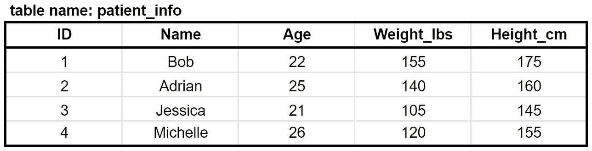
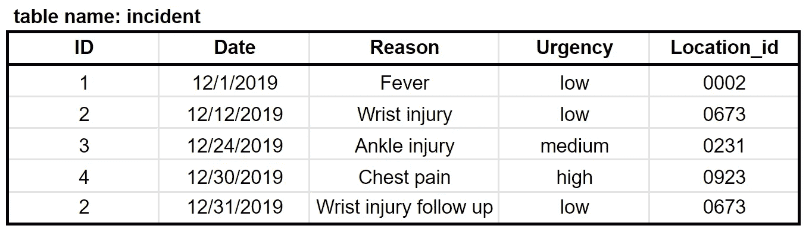
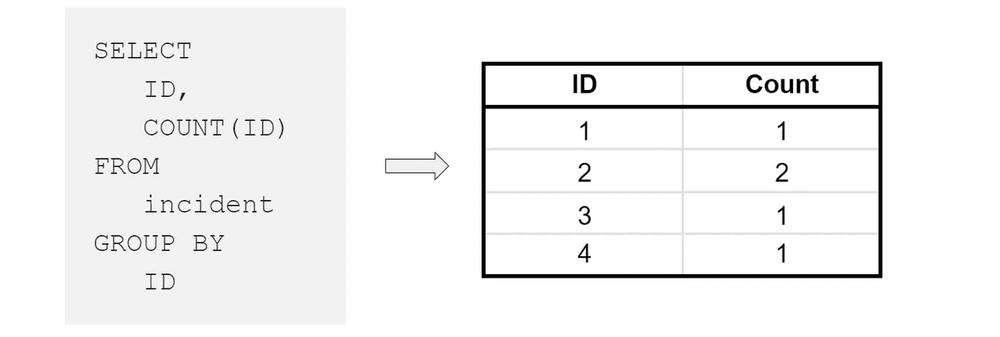
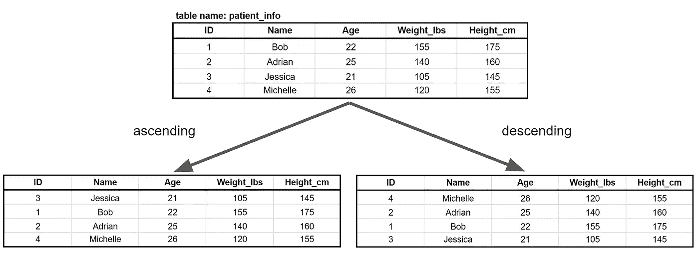

# 5 分钟 5 步学会初学 SQL！

> 原文：<https://towardsdatascience.com/learn-beginner-sql-in-5-steps-in-5-minutes-c44c47fa39a1?source=collection_archive---------11----------------------->

## 学习科技行业最受欢迎的技能！


图片来自 [Pixabay](https://pixabay.com/?utm_source=link-attribution&utm_medium=referral&utm_campaign=image&utm_content=1954920) 的[图米苏](https://pixabay.com/users/Tumisu-148124/?utm_source=link-attribution&utm_medium=referral&utm_campaign=image&utm_content=1954920)

# 介绍

所以你想学 SQL？太好了，你应该！

## *你知道数据分析师**[*数据工程师*](/most-in-demand-tech-skills-for-data-engineers-58f4c1ca25ab) *和数据科学家*[](/the-most-in-demand-tech-skills-for-data-scientists-d716d10c191d)**最想要的第三个技能是什么吗？***

**在本文中，我将向您解释如何以最简单的方式使用 SQL 进行查询。但首先，让我定义几个术语…**

*****如果这是你喜欢的那种东西，成为第一批订阅*** [***我的新 YouTube 频道在这里***](https://www.youtube.com/channel/UCmy1ox7bo7zsLlDo8pOEEhA?view_as=subscriber) ***！虽然还没有任何视频，但我会以视频的形式分享很多像这样的精彩内容。感谢大家的支持:)*****

# **定义**

****行**，也称为**记录，**是代表单个实体的属性(变量)的集合。例如，一行可能代表一个住院病人，可能有年龄、体重、身高等属性/变量…**

****

**一个**表**是具有相同属性(相同变量)的行的集合。对我帮助最大的是把一个表格想象成一个 Excel 表格。**

****

**表格示例**

****查询**是对数据库表或表组合中的数据的请求。使用上面的表格，如果我想找到所有年龄大于 23 岁的患者，我将编写一个**查询**。**

# **如何编写 SQL**

**因为这是给初学者的教程，如果你想从**一个**表中提取数据，我将向你展示如何编写一个查询。**

**一个基本查询有五个组件:**

1.  **选择(必填)**
2.  **从(必填)**
3.  **其中(可选)**
4.  **分组依据(可选)**
5.  **排序依据(可选)**

**其结构如下:**

```
****SELECT**
   [column_name_1],
   [column_name_2],
   [column_name_n]
**FROM**
   [table_name]
**WHERE**
   [condition 1]
**GROUP BY** [column_name] 
**ORDER BY** [column_name]**
```

**让我们带回我的例子作为参考:**

****

# **1.选择(必填)**

****SELECT 确定要从给定的表中提取哪些列。**例如，如果我想提取名称，那么我的代码应该是这样的:**

```
**SELECT Name**
```

**一个巧妙的技巧是，如果你想拉所有的列的**，你可以使用星号——见下文:****

```
**SELECT ***
```

# **2.从(必填)**

****

****FROM 确定您要从哪个表中提取信息。**例如，如果您想要获取患者的姓名，您可能想要从名为 patient_info 的表中获取数据(见上文)。代码看起来会像这样:**

```
**SELECT
   Name
FROM
   patient_info**
```

**这是您的第一个函数查询！让我们来完成另外 3 个可选步骤。**

# **3.其中(可选)**

**如果您想选择年龄超过 23 岁的患者的姓名，该怎么办？这就是我们的用武之地。 **WHERE 是用来过滤您的表**的语句，就像您在 Excel 中使用过滤工具一样！**

**获取 23 岁以上患者姓名的代码在左边。右侧显示了一个可视化表示:**

****

**如果想要满足**两个**子句的患者姓名，可以使用**和**。例如，查找年龄超过 23 岁且体重超过 130 磅的患者的姓名。**

```
**SELECT
   Name
FROM
   patient_info
WHERE
   Age > 23
   AND
   Weight_lbs > 130**
```

**如果您想要满足两个子句之一的**的患者姓名，您可以使用**或**。*例如，查找小于 22 岁或大于 23 岁的患者的姓名。*****

```
**SELECT
   Name
FROM
   patient_info
WHERE
   Age < 22
   OR
   Age > 23**
```

# **4.分组依据(可选)**

**GROUP BY 正如它所说的那样— **它将具有相同值的行分组到汇总行中**。它通常与计数、最小值、最大值、总和、AVG 等聚合函数一起使用。**

**让我们用下面的例子:**

****

**如果我们想得到每个病人去医院的次数，我们可以使用下面的代码并得到下面的结果:**

****

# **5.排序依据(可选)**

**ORDER BY 允许您根据特定属性或多个属性按升序或降序对结果进行排序。我们来举个例子。**

****

```
**SELECT
   *
FROM
   patient_info
ORDER BY
   Age asc**
```

**“ORDER BY Age asc”意味着您的结果集将按年龄以升序对行进行排序(参见上图中的左表)。如果你想按降序排列(上图的右边表格)，你可以用 **desc 代替 **asc** 。****

# **结论**

**这就是如何构造一个查询！你刚刚学到了科技界最受欢迎的技能之一。我将在下面提供一些链接，在那里你可以练习你的 SQL 技能。尽情享受吧！**

# **感谢阅读！**

**如果你喜欢我的工作，想支持我…**

*   **成为第一批订阅[我的新 **YouTube 频道**这里](https://www.youtube.com/channel/UCmy1ox7bo7zsLlDo8pOEEhA?view_as=subscriber)的人之一！*虽然还没有任何视频，但我会以视频的形式分享很多像这样的精彩内容。***
*   **也是这里第一批关注我的 [**Twitter**](https://twitter.com/terence_shin) 的人之一。**
*   **在 **LinkedIn** 上关注我[这里](https://www.linkedin.com/in/terenceshin/)。**
*   **在我的**邮箱列表** [这里](https://forms.gle/UGdTom9G6aFGHzPD9)报名。**
*   **看看我的网站，[**terenceshin.com**](https://terenceshin.com/)。**

**[](https://www.hackerrank.com/domains/sql) [## 解决 SQL 代码挑战

### 加入 700 多万开发人员在 HackerRank 上解决代码挑战的行列，这是为…

www.hackerrank.com](https://www.hackerrank.com/domains/sql) [](https://www.w3resource.com/sql-exercises/) [## SQL 练习、练习、解答-w3 资源

### SQL 代表结构化查询语言，它是一种 ANSI 标准的计算机语言，用于访问和操作…

www.w3resource.com](https://www.w3resource.com/sql-exercises/)**