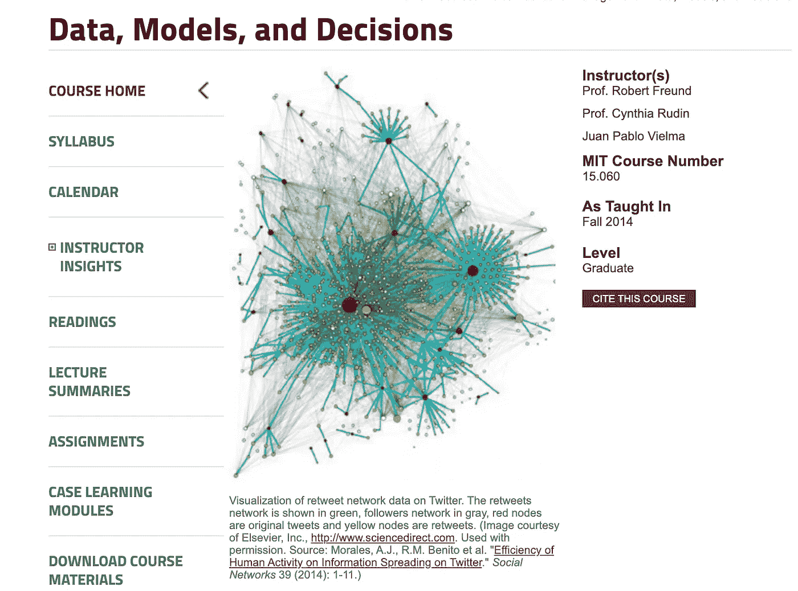
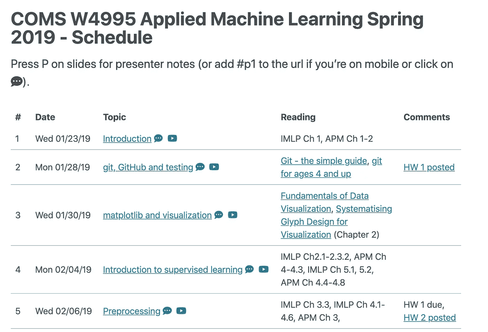
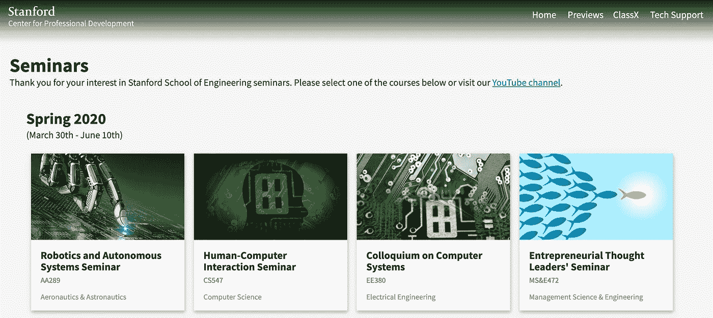
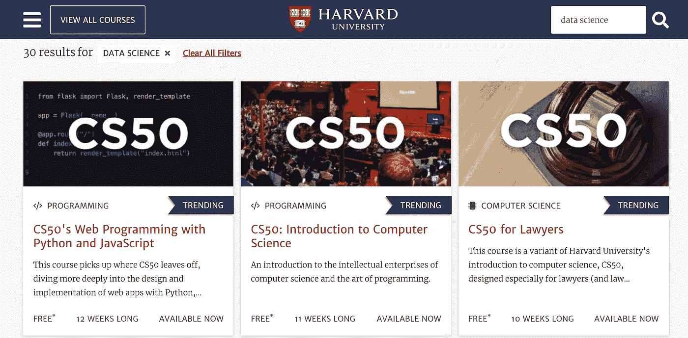

# 免费从顶尖大学学习数据科学

> 原文：<https://towardsdatascience.com/learn-data-science-from-top-universities-for-free-ee3387ad88ac?source=collection_archive---------22----------------------->

## 在哪里可以找到麻省理工学院、斯坦福大学和哈佛大学的免费讲座、研讨会和完整课程

瓦西里·科洛达在 Unsplash 上拍摄的照片

我最近在读一本名为《超学习》的书。加速您的职业生涯，掌握硬技能并智胜竞争对手。这本书讲述了一种学习技巧，可以让你在看似不可能的时间框架内学习新的技能，甚至全新的科目。根据这本书，超学习是“获取技能和知识的一种策略，这种策略是自我导向的和强烈的”。

这本书的作者斯科特·H·杨利用超级学习完成了一项著名的个人挑战。他给自己设定的挑战是在 12 个月内学习完麻省理工学院(T2 麻省理工学院)的计算机科学课程。他在 2012 年成功完成了挑战，并录制了一个关于他经历的 ted 演讲，名为“你能用 2000 美元获得麻省理工学院的教育吗？”。

你能花 2000 美元得到斯科特·H·杨的麻省理工教育吗

斯科特·H·杨只用了 2000 美元就完成了他的挑战，因为麻省理工学院通过一个在线门户网站免费提供他们的大部分课程材料和讲座。

麻省理工学院并不是唯一一所这样做的大学。许多排名靠前的美国大学免费提供课程、讲座和其他学习材料。在这其中，有大量的材料高度且经常直接适用于学习数据科学、机器学习和人工智能。

> 许多排名靠前的美国大学免费提供课程、讲座和其他学习材料。

我之前写过一篇名为*[*如何免费学习数据科学*](/how-to-learn-data-science-for-free-eda10f04d083)*的文章，与更传统的大学学位课程相比，它提供了一种替代的、免费的学习途径。然而，如果你是通过更传统的基于讲座的课程学得更好的人，或者想通过更深入地钻研相关主题来补充本课程，以下免费资源可以提供帮助。**

# **麻省理工学院，开放式课程**

**麻省理工学院是现代计算机领域教学和研究的领先机构之一。2001 年，该大学推出了自己的[开放式课件](https://ocw.mit.edu/index.htm)平台。它的目标是让绝大多数课程的课堂笔记、习题集、考试和视频讲座都可以在网上免费获得。**

**这里有大量数据科学相关主题的资料。我个人最喜欢的包括:**

*   **[计算思维与数据科学简介](https://ocw.mit.edu/courses/electrical-engineering-and-computer-science/6-0002-introduction-to-computational-thinking-and-data-science-fall-2016/)。**
*   **[机器学习的数学](https://ocw.mit.edu/courses/mathematics/18-657-mathematics-of-machine-learning-fall-2015/)。**
*   **[计算机科学导论和 Python 编程](https://ocw.mit.edu/courses/electrical-engineering-and-computer-science/6-0001-introduction-to-computer-science-and-programming-in-python-fall-2016/)。**
*   **[数据、模型和决策](https://ocw.mit.edu/courses/sloan-school-of-management/15-060-data-models-and-decisions-fall-2014/)。**

****

**数据、模型和决策——课程大纲，麻省理工学院开放式课程**

# **哥伦比亚大学，应用机器学习**

**Andreas C. Muller 是流行的 Python 机器学习库 [Scikit-learn](https://scikit-learn.org/stable/index.html) 的核心开发人员之一，也是哥伦比亚大学的研究科学家和讲师。**

**每年他都在网上发布他的*‘应用机器学习’*课程的所有材料。本课程的所有幻灯片、课堂讲稿和家庭作业都可以在这个 [Github repo](https://github.com/amueller/COMS4995-s19/tree/master/homeworks) 中获得。**

**回购中的材料实际上是我见过的最好的，涵盖了在现实世界中实际应用机器学习的领域。除了涵盖从数据探索和清理到模型评估和调优的机器学习过程的所有方面，还涵盖了 Github、单元测试和持续集成。当你在现实世界中应用机器学习时，这些都是非常重要的方面。**

****

**哥伦比亚大学“应用机器学习课程”的时间表快照**

# **斯坦福大学，研讨会**

**斯坦福工程学院定期在网上免费提供一些精选的研讨会。有一些精选的数据科学相关研讨会，包括“*人机交互”*和“*机器人和自主系统”*。你可以通过这个[链接](https://seminars.stanford.edu/)找到它们。**

**此外，斯坦福大学将许多研讨会和讲座上传到它的 Youtube 频道——你可以在这里找到。频道上有大量涵盖数据科学、机器学习和深度学习的视频。**

****

**斯坦福大学免费研讨会**

# **哈佛免费在线课程**

**哈佛大学在其网站上发布了一系列完全免费的在线课程。这些课程大部分是由 edX 主办的，所以你也可以选择支付少量费用来获得每门课程的认证。**

**这里有一些非常优秀的学习数据科学的课程。这些包括以下几个最佳选择，尽管还有很多其他的:**

*   **[可再生数据科学的原理、统计和计算工具](https://online-learning.harvard.edu/course/principles-statistical-and-computational-tools-reproducible-data-science?delta=0)。**
*   **[CS50:计算机科学导论](https://online-learning.harvard.edu/course/cs50-introduction-computer-science?delta=0)。**
*   **[线性模型和矩阵代数介绍](https://online-learning.harvard.edu/course/data-analysis-life-sciences-2-introduction-linear-models-and-matrix-algebra?delta=0)。**
*   **[CS50 用 Python 介绍人工智能](https://online-learning.harvard.edu/course/cs50s-introduction-artificial-intelligence-python?delta=0)。**

****

**哈佛大学免费在线课程**

# **伯克利，MOOCs**

**加州大学柏克莱分校也出版了一系列关于 edX.org 课程。有一些优秀的数据科学相关课程，包括:**

*   **[数据科学:机器学习和预测](https://www.edx.org/course/foundations-of-data-science-prediction-and-machine)。**
*   **[数据科学:用 Python 进行计算思维](https://www.edx.org/course/foundations-of-data-science-computational-thinking)。**
*   **[数据科学与工程带星火](https://www.edx.org/xseries/data-science-engineering-apache-spark)。**

**网上有如此丰富的学习数据科学的免费资料。本文涵盖了一些来自高排名大学的更传统的基于讲座的方法。为了获得更多的替代资源，我之前在这里发布了我的前 5 个。**

**感谢阅读！**

**[**我每月发一份时事通讯，如果你想加入，请通过此链接注册。期待成为您学习旅程的一部分！**](https://mailchi.mp/ce8ccd91d6d5/datacademy-signup)**