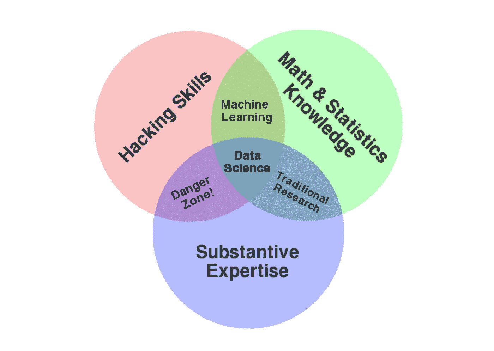

# 以正确的方式学习数据科学

> 原文：<https://towardsdatascience.com/learn-data-science-the-right-way-92fc9437e64e?source=collection_archive---------23----------------------->

## 发痒的地图集，直接跳进去😉

来源:[弗拉巴哈拉](https://unsplash.com/@vladbahara)经 [unsplash](https://unsplash.com/photos/EOva41PiBYg) (CC0)

要错过数据科学的迷人歌曲，你必须生活在岩石下。作为“[21 世纪最性感的工作](https://hbr.org/2012/10/data-scientist-the-sexiest-job-of-the-21st-century)”，数据科学激起了人工智能、机器学习、魔法等的想象，正在彻底改变我们与信息互动的方式。对于临时技术人员、经验丰富的数据专业人员或任何介于两者之间的人来说，将数据科学技能添加到你的技能清单中会非常有利可图。但是你应该从哪里开始呢？

如果你像我一样，问谷歌“如何学习数据科学”会让你陷入混乱。在“ [8 个简单步骤](https://www.datacamp.com/community/tutorials/how-to-become-a-data-scientist)”中吹嘘掌握数据科学的文章与致力于艺术的整个[博士项目](https://www.mastersindatascience.org/schools/doctorate/)相矛盾。Python 爱好者和 R 狂热分子争夺“[数据科学的最佳计算语言](/programming-languages-for-data-scientists-afde2eaf5cc5)”，而 [Julia](https://julialang.org/) 进行了一次突袭。数据库技术吹捧高效的存储和检索方法，如 MySQL、Postgres、MongoDB 和 Cassandra，以与位/字节进行交互，但因应用程序而异。Tableau 最近被 SalesForce 以将近**160 亿美元**收购，然而嵌入式绘图库和前端框架使得数据可视化变得免费*和*容易。

因为有这么多固执己见、见解深刻的声音回荡在数据科学领域，所以我不会因为给乐队增加一件乐器而感到内疚。我的建议？无论何时何地，只要你能，就加入进来。在这个旅程中没有完美的地图，只有你的。通过分析把自己从麻痹中解放出来，把自己的手弄脏，宝贝！

来源:经由[狮门](https://lionsgateathome.com/)的[辣身舞](https://giphy.com/gifs/lionsgatehomeent-dancing-patrick-swayze-jennifer-grey-26BROqpsKZQPxkIMw/embed) g

不，不是那种肮脏的🕺.

在本文中，我将分享我的建议，告诉你如何抛弃 atlas，进入数据科学的奇妙世界。我将讨论我最喜欢的开源资源、平台和框架(天哪！)它可以启动你的旅程，或者让余烬继续燃烧。如果这次在新冠肺炎的隔离让我们学到了什么，那就是在线教育和电子学习工具在提升普通技术人员方面有着无限的潜力。没有比这更好的时间来学习新技能或磨练你的爱好了。

在开始之前，让我们快速定义一下“数据科学”到底是什么:

> 数据科学家(名词):比任何软件工程师更擅长统计学，比任何统计学家更擅长软件工程的人。— [乔希·威尔斯](https://medium.com/u/fd3f17e8c623?source=post_page-----92fc9437e64e--------------------------------)通过[推特](https://twitter.com/josh_wills/status/198093512149958656)

不管你对这个定义的感觉如何，它说明了围绕数据科学的模糊光环。一般的软件工程师真正了解多少统计学？一般的统计学家做过多少工程项目？我个人觉得无所谓。该领域不断变化，包括新技术，淘汰过时的技术，并鼓励新兴领域的加入。所以，只要你致力于追求*学习和建设，*我相信你会走得很好。

还是不相信我？看一看数据科学的招聘信息，你会发现基本要求从高级算法设计博士到任何拥有 HS 文凭和相关经验的人都有。10 年使用特定技术的基于项目的工作与另一个初级职位——拥有数学学位的大学毕业生——的竞争。熟练掌握 Python、R、Scala、COBOL 等。与任何有使用代码模糊性经验的人相比。

我最近参加了一个会议，会上才华横溢的 Dick De Veaux 用这张图(或类似的图)传达了他对数据科学的定义。

来源:[数据科学维恩图](http://drewconway.com/zia/2013/3/26/the-data-science-venn-diagram)经由[德鲁·康威](http://drewconway.com/) (CC0)

De Veaux 教授交替使用“预测分析”、“机器学习”、“数据科学”和“人工智能”等术语，并用有趣的例子证明他的松散命名法是正确的，这些例子证明了这门学科是多么模糊。我喜欢这个图表，因为它为灵活性和灵活性留下了空间:如果你对一个主题感到舒适，只需深入另一个主题。

我绝对不是想抹杀那些拥有高等学位和相关经验的数据科学家的惊人成就。然而，我确实想激励越来越多好奇的数据专业人员建立他们的信心，并向一些伟大的资源学习。我们来看看吧！👇

> 我没有💰来推广这些资源，我希望您在使用我的建议来提升您的数据科学技能时发现真正的价值！

# 免费在线资源

有大量的资源可供任何对启动或维持数据科学职业感兴趣的人使用。在众多的在线课程、游戏化课程、GitHub 知识库和媒体文章中，有一些是我最喜欢的:

## Hackr.io

这个出色的平台查询他们的用户社区，以众包和聚合各种主题的课程，包括[数据科学](https://hackr.io/tutorials/learn-data-science?sort=upvotes&type_tags%5B%5D=1)和[机器学习](https://hackr.io/tutorials/learn-machine-learning-ml?sort=upvotes&type_tags%5B%5D=1)，以提供免费的在线学习。根据您的技能水平和对特定主题的兴趣，您可以定制搜索查询和/或加入他们的社区以接收新产品的更新。

## 互联网档案馆

互联网档案馆提供免费书籍、电影、软件、音乐、网站以及几乎所有主题的更多内容。我的一个同事最近建议互联网档案馆填补一些隔离时间，我没有回头！你可以下载和/或[查阅](https://archive.org/details/inlibrary)高质量的人工智能/人工智能教材，以继续你的研究或进入新的主题。

## Python 课程

**Python 是迄今为止我最喜欢的编程语言，**由于它的简单性和无限的社区支持，我总是对免费提供的高质量 Python 资源感到惊讶。如果您是这个领域的新手，Python 是介绍编程概念的一种很好的语言；如果你是个老手，学习或更新 Python 基础知识只会提高你的市场竞争力。

> 虽然我还没有完成下面列出的所有免费课程的***(你也不应该！)，这些是一些最受欢迎和评价最高的资源，值得您关注📚。***

*   ***[Python 编程入门](https://www.udemy.com/course/pythonforbeginnersintro/) — Udemy***
*   ***[Python 核心和高级](https://www.udemy.com/course/python-core-and-advanced/) — Udemy***
*   ***[适合绝对初学者的 Python](https://www.udemy.com/course/free-python/)—Udemy***
*   ***[从零开始学习 Python](https://www.educative.io/courses/learn-python-from-scratch)—educative . io***
*   ***[用 Python 实现谷歌 IT 自动化](https://www.coursera.org/professional-certificates/google-it-automation) — Coursera***

## ***十大免费 Python 编程书籍***

***我一直随身带着一个 1TB 的外置硬盘，里面装满了编程教科书、PDF、备忘单等等。虽然它已经过时了，特别是在如此容易访问云的情况下，我还是喜欢把一切都组织在一个物理驱动器上。无法解释。无论如何，许多📖 👇在我的💾。***

*** [## 十大免费 Python 编程书籍——下载 PDF 或在线阅读

### 每个程序员都喜欢免费的电子书和免费的课程，如果它们来自著名的技术书籍出版商，比如…

www.java67.com](https://www.java67.com/2017/05/top-7-free-python-programming-books-pdf-online-download.html) 

## R 的漩涡

如果你曾经上过在线编程课程，你可能会对基于浏览器的代码和实际开发环境之间的脱节感到沮丧。 [Swirl](https://swirlstats.com/) 在 R 控制台上，按照您自己的节奏，以交互方式教您 R 编程和数据科学。你只需要下载 R，设置 RStudio，安装[漩涡](https://swirlstats.com/students.html)，就可以开始了！作为一个对 Python 无比熟悉的人，这个工具真的帮助我扩展了我的视野*和*与 R studio(R 开发人员的首选 IDE)的舒适性。

## Git & GitHub

如果之前没用过 GitHub， ***git*** 启动😉！对于那些正在构建很酷的自动化脚本/ ML 项目的独立数据科学家来说，GitHub 提供了一个存储和共享代码的好地方。如果你在一个团队中工作，你很可能使用过类似的工具来协作和管理产品代码。 **GitHub** 是一个在线平台(虽然桌面应用程序可以下载),用于创建存储库和共享代码；git 生活在你的终端里，与 GitHub 的沟通要高效得多。

对于新手，我推荐 [Git Started with GitHub](https://www.udemy.com/course/git-started-with-github/) 作为入门速成班，包括安装。如果您熟悉 GitHub，但想更好地了解终端，请查看这个 [Bash Shell 教程](https://www.udemy.com/course/git-bash/)以了解更有效的命令行要点。对于侧重于版本控制的基于浏览器的场景，请尝试 [katacoda](https://www.katacoda.com/courses/git) 。如果您想跳过教程，直接进入脚本，请查看参考指南:

 [## 我离不开的 4 个 Git 脚本

### 2005 年，Linus Torvalds 创建了 Git 来取代他开发的专有分布式源代码控制管理解决方案

opensource.com](https://opensource.com/article/20/4/git-extras) 

如果所有这些看起来有点初级，而你只是在寻找一个复习/备忘单供你使用，那么克隆这个库。

## 发展环境和集装箱化

如果你曾经看过 [MTV 婴儿床](https://en.wikipedia.org/wiki/MTV_Cribs)，那么这个参考就是给你的:一个 IDE(集成开发环境)，很像主卧室，是魔法发生的地方。无论您选择哪种语言，您的 IDE 确实为任何专业或个人代码开发设定了基调，并且应该进行定制以满足您独特的编码需求。数据科学项目依赖于多种语言、框架和平台无缝协作；我推荐 [Visual Studio 代码](https://code.visualstudio.com/)来简化你的操作。他们为有效的数据科学设置提供了极好的操作指南👇。

 [## Visual Studio 代码中的 Python 和数据科学教程

### 本教程演示了如何在公共数据科学中使用 Visual Studio 代码和 Microsoft Python 扩展…

code.visualstudio.com](https://code.visualstudio.com/docs/python/data-science-tutorial) 

您可能也会对容器化开发环境的 Docker 感兴趣。如果你计划构建和共享代码，但 Docker 不是你想要的，我强烈推荐像 [Kubernetes](https://kubernetes.io/) 或 [Anaconda Cloud](https://anaconda.org/) 这样的软件。

> 建议:如果你有几分钟空闲，花 [12 分钟](https://www.youtube.com/watch?v=YFl2mCHdv24)学习 Docker 基础知识，提升你的下一个项目。

## （舞台上由人扮的）静态画面

数据可视化是任何数据科学部署的关键组成部分，负责将数据洞察转化为可消费的观察。一个糟糕的可视化可能会浪费你所有的辛苦工作来提取、清理和建模数据；相反，一个伟大的 viz 可以催化可操作的见解，建立信任，激发好奇心，激励项目，等等。

Tableau 可以很容易地安排美丽的指标，只受你的想象力。很难感受到灵感？看看他们的“今日之见”。如果你是 Tableau 的新手，他们有一些很棒的[资源](https://public.tableau.com/en-us/s/resources)可以让你在他们的平台上快速提升。

截至 2020 年 4 月，Tableau Desktop(付费版)提供 90 天的试用期，以增强你的技能。Tableau Desktop 和 Tableau Prep(也包括在内)提供了更广泛的数据连接、嵌入、流水线等。

 [## Tableau 电子教学

### 培训获得 90 天免费使用访问代码 2020 电子学习开始学习随着全球经济复苏，数据技能将…

www.tableau.com](https://www.tableau.com/learn/training/elearning) 

如果你已经是一个 Tableau 的狂热用户，看看[禅宗大师](https://www.flerlagetwins.com/)(显然是同卵双胞胎兄弟)并准备好让你的袜子被打掉。

## LeetCode

寻找相关的资源来帮助你通过技术面试？LeetCode 为提高技能和拓展专业领域提供实践培训。无所不知的“在线法官”会对您的算法的强度和效率提供即时反馈，以促进定制体验。我用 LeetCode 准备那些需要现场编码或者伪代码的数据科学面试。他们有一个[高级版](https://leetcode.com/subscribe/)，UX 稍好，面试问题更有针对性，由公司组织。

# 几乎免费的在线资源和书籍

如果你能摆动它，这些资源是廉价的和沉浸式的。这是我做过的一些投资，在接触新项目和/或与学生合作时，我会经常提到它们。

## 简陋的包裹

[Humble Bundle](https://www.humblebundle.com/) 是一家数字店面，提供不同的游戏、软件、电子书等。为了便宜。他们的目标是使发展收益民主化，并为慈善事业做出贡献，同时“以优惠的价格向客户提供精彩的内容”。他们通常会有价值数千美元的机器学习/人工智能教科书，价格不到 20 美元。是的，你没听错。基本上，你可以选择支付多少钱给开发商，慈善机构等等。查看他们当前的产品:

 [## 简陋的书籍捆绑:人工智能与机器学习

### 更多精彩的电子书给你。我们与摩根&克莱普尔联手推出了我们的最新产品包！获得像必需品一样的电子书…

www.humblebundle.com](https://www.humblebundle.com/books/artificial-intelligence-machine-learning-morgan-claypool-books) 

## 数据营

从您舒适的浏览器中学习数据科学！DataCamp 是可扩展的，并不断向其课程中添加新的课程/技能。你可以选择不同的[职业轨迹](https://learn.datacamp.com/career-tracks)根植于 Python、R 和 SQL，跟随行业专家完成不同规模的项目。当你完成免费试用时，你通常可以通过让他们在购买前流点汗来获得一笔特殊的再营销交易——我通过电子邮件获得了 60%的折扣，只需等待几天就可以购买年度套餐。此外，一旦你完成职业轨迹，你将获得一个徽章，可以添加到你的 LinkedIn 个人资料中🙌。

> **专业提示:**看一下 DataCamp 免费的[备忘单](https://www.datacamp.com/community/data-science-cheatsheets)——它们组织得很好，值得在技术面试和编码挑战中密切关注。

## 用 Python 自动化枯燥的东西

这本书不仅仅为初学者提供了 Python 技巧，它还改善了你与逻辑的关系。使用 Python 基础知识，用逻辑学家的眼光重新想象平凡的任务并开始处理“东西”。我毫不夸张地向每一位与我共事的非技术经理/主管/副总裁推荐这本书，以获得立竿见影的效果。

 [## 用 Python 自动化枯燥的东西

### “编程最好的部分是看到机器做一些有用的事情的胜利。用…自动化枯燥的工作

automatetheboringstuff.com](https://automatetheboringstuff.com/) 

## ACM —资源和专业网络

一旦你对展示你的数据科学肌肉感到更舒服了，你可能会想与其他志同道合的技术专家交流和分享。GitHub、Medium、StackOverflow 和其他网站是开始与人联系的绝佳场所，但可能会让你渴望更专业、更有针对性的内容。加入 ACM，或计算机械协会，向“世界上最大的教育和科学计算协会”提供[会员资格](https://www.acm.org/membership/membership-benefits)。这就像数据科学的演讲会。

你也可以访问他们的[数字图书馆](https://dl.acm.org/)，它包含在会员费用中，以搜索任何计算主题的相关资源。

## 奥莱利学习— Safari 在线访问

这是付费资源的最高端，所以如果你是数据科学的新手，或者可以忙于我提到的其他课程和教科书，那么推迟可能对你最有利。也就是说，如果你是一名学者或者迫切需要前沿参考资料，这绝对适合你！

 [## 奥莱利在线学习-奥莱利媒体

### 你可以找到来自美国前首席数据科学家 DJ Patil、通用电气前副主席 Beth Comstock 的内容…

www.oreilly.com](https://www.oreilly.com/online-learning/individuals.html) 

> **专业提示:** Safari 在线学习是 ACM 会员的额外福利！所以，如果你想让你的钱最大化，ACM 会员是一个不错的选择。

# 训练营

号称课程饱和的速成编程训练营正在席卷全球。如果你一直在研究数据科学和阅读在线课程，你可能会遇到一两个训练营，它们可以快速提升你的数据科学地位，从零到英雄。但是训练营值这个价钱吗？

我认为旅程比目的地更重要，但我有偏见。我在明尼苏达州明尼阿波利斯的一个著名的数据分析/数据科学训练营担任助教，致力于为学生提供尖端的技术技能。这绝对是一种“一英里宽，一米厚”的方法，可以进入数据科学的多面世界。我们一路上涵盖了如此多的相关主题(6 个月的周期),这迫使每个学生接受模糊性，并专注于他们解决问题的方法，而不是找到“完美”的解决方案。这是因为对于不断变化的问题，没有完美的解决方案，只有高效、美观、可持续且有发展空间的解决方案。

这并不适合所有人。但是，如果你付出努力并致力于学习，你将获得无价的技能、专门的项目组合、解决任何问题的开源工具以及自信。在我看来这是非常棒的东西。

我会走下讲台，推荐[三部曲教育](https://www.trilogyed.com/):他们提供了一系列可以兼职或全职完成的训练营选项。在你花钱之前——要求旁听一堂课，检查全部课程，和以前的学生和/或教授交谈，等等。为了更好地了解你可以期待的投资回报率。

 [## 课程|明尼苏达大学数据可视化和分析训练营

### 在过去的十年里，数据爆炸几乎改变了每个行业。无论是在制造业，医疗保健…

bootcamp.umn.edu](https://bootcamp.umn.edu/data/curriculum/) 

*重复一下:*这些训练营赚钱，因为我们大多数人没有资源来建立和审查我们自己的沉浸式课程。如果你想要一个快速的旅程，充满补充资源和支持来保持你的动力，那么训练营可能是正确的选择。

# 社区

## 中等

既然你正在读这篇文章，你已经对[媒体](https://medium.com/)很熟悉了。给自己一个鼓励！我偶然发现了 Medium，并对出版物的广度和深度感到震惊。如果您还没有，请成为会员并更新您的首选项，以便 Medium 可以为您提供出色的自定义内容。

我最喜欢的媒体出版物是面向数据科学的。在@here 上发表文章是我的个人目标，所以我很自豪能够通过他们出版团队的审核并获得批准。如果你有一些有趣的事情要说，或者只是你有太多的时间，那就把笔写在纸上，或者把手指放在键盘上？在我鼓起勇气将我的内容公之于世之前，我只是一个长期的鉴赏家，而且我没有回头。

以下是我喜欢的几个相关出版物:

*   [启动](https://medium.com/swlh)(咄)
*   [更好的编程](https://medium.com/better-programming)
*   [心灵咖啡馆](https://medium.com/mind-cafe)
*   [分析 Vidhya](https://medium.com/analytics-vidhya)

> **专业提示:**如果你对自己的在线状态感到满意，但又想保持经常更新、低维护量的内容，那么读一读 Nat Torkington 每日收集的 [4 个短链接](https://www.oreilly.com/radar/topics/four-short-links/)。

## 公共数据集

不接触数据，就当不了数据科学家。如果你足够幸运，可以获得公司数据并得到批准，那就去做吧！否则，在使用安全的私有数据移动之前，分析清理过的公共数据并不可耻。

*   [超赞的公共数据集](https://github.com/awesomedata/awesome-public-datasets)
*   [卡格尔](https://www.kaggle.com/datasets)
*   [谷歌数据集搜索](https://datasetsearch.research.google.com/)

## 建立工作关系网

我在科技行业担任数据科学顾问。我真诚地相信，没有比从私营部门的专家那里学习新技术、方法和策略更好的环境了。就我个人而言，我尽可能多的与招聘方/公司**沟通和面试**，强化自己的软技能，拓展自己的人脉。

如果您有兴趣与我联系讨论，请在 [LinkedIn](https://www.linkedin.com/in/garretteichhorn/) 上给我留言。我很乐意连接！

# 结论

数据科学太模糊了，无法构建成功的完美路线图。随着需求的发展，你也将拥抱新兴的技术、方法、策略和定义行业的个性。总是有探索和进步的机会，推动你的边界，将另一种工具纳入众所周知的工具带。

概述的资源足以启动您的数据科学之旅。如果你走得更远，它们应该有助于激励你或者给你指明一个新的方向。

这篇文章中的所有内容都深受我的学生和其他教学人员的影响。非常感谢他们激励我继续学习，尤其是现在！

如果你对我想要添加的资源有任何建议，我很乐意在下面的评论中听到你的意见。感谢阅读！***