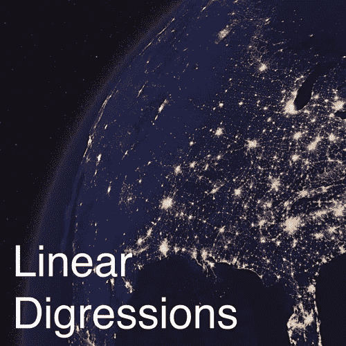
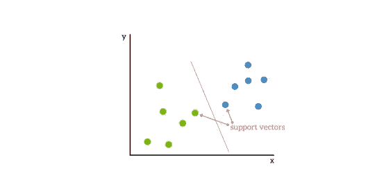
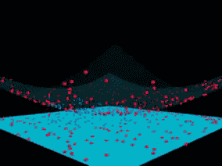
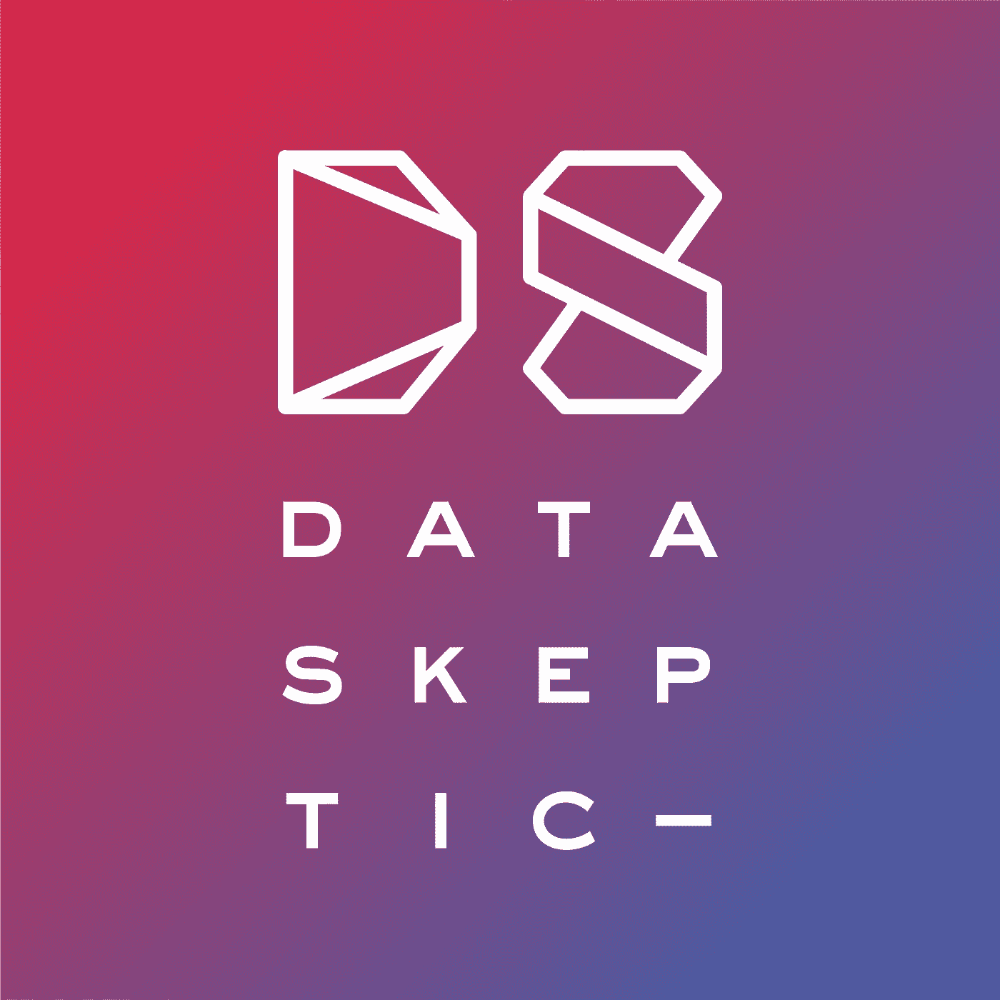

# 边听边学数据科学

> 原文：<https://towardsdatascience.com/learn-data-science-while-listening-a555811b0950?source=collection_archive---------44----------------------->

## 不知道从哪里开始播客？这是三个吸引你的播客片段。


在 [Unsplash](https://unsplash.com?utm_source=medium&utm_medium=referral) 上由 [Mohammad Metri](https://unsplash.com/@mohammadmetri?utm_source=medium&utm_medium=referral) 拍摄的照片

播客是一种有趣的方式来学习你喜欢的话题的新东西。播客主持人必须想办法用简单的术语解释复杂的想法，否则没人会理解🙂在这篇文章中，我展示了几个小插曲来让你开始。

**这里有几个你可能会感兴趣的链接:**

```
- [Labeling and Data Engineering for Conversational AI and Analytics](https://www.humanfirst.ai/)- [Data Science for Business Leaders](https://imp.i115008.net/c/2402645/880006/11298) [Course]- [Intro to Machine Learning with PyTorch](https://imp.i115008.net/c/2402645/788201/11298) [Course]- [Become a Growth Product Manager](https://imp.i115008.net/c/2402645/803127/11298) [Course]- [Deep Learning (Adaptive Computation and ML series)](https://amzn.to/3ncTG7D) [Ebook]- [Free skill tests for Data Scientists & Machine Learning Engineers](https://aigents.co/skills)
```

上面的一些链接是附属链接，如果你通过它们进行购买，我会赚取佣金。请记住，我链接课程是因为它们的质量，而不是因为我从你的购买中获得的佣金。

如果你错过了我之前关于播客的文章:

[](/top-5-apps-for-data-scientists-dc8b66886560) [## 数据科学家的五大应用

### 我如何跟上最新的研究？我如何记住领域中的复杂概念？在…的帮助下

towardsdatascience.com](/top-5-apps-for-data-scientists-dc8b66886560) 

# 你应该通过偏导数获得博士学位吗


[部分衍生自 Twitter 的标志](https://twitter.com/partiallyd)

偏导数由数据科学超级极客主持。他们谈论我们周围世界的日常数据。

[这一集](http://partiallyderivative.com/podcast/2017/04/25/should-you-get-a-phd)对于正在考虑攻读博士学位的学生来说可能会很有趣，在这一集里，克里斯从他个人的角度谈到了获得博士学位。他谈到他年轻时对数学不感兴趣，但对历史更感兴趣。大学毕业后，他受够了学校教育，不打算继续攻读博士学位。他向加州大学戴维斯分校递交了申请，面临着一项挑战。喜欢听他的冒险。

Tim 是一名两届博士退学者，现居北卡罗来纳州，是一名数据科学家，他有一个专门讨论这个话题的网站:[我应该获得博士学位吗？](https://shouldigetaphd.com/)

> 让冒险开始吧…

# 基于线性离题的核技巧和支持向量机



线性离题标志来自 [SoundCloud](https://soundcloud.com/linear-digressions)

凯蒂和本通过有趣的(通常非常不寻常的)应用程序探索机器学习和数据科学。

在这一集，凯蒂和本解释什么是支持向量机(SVM)的核心技巧。我真的很喜欢 SVM 背后的重型机械的简单解释。不知道最大边距分类器是什么？然后先听支持集[最大间隔分类器](http://lineardigressions.com/episodes/2017/12/3/maximal-margin-classifiers)。

最大边缘分类器试图在左侧和右侧之间找到一条线(决策边界),以便最大化边缘。这条线被称为超平面，因为它通常包含更多的二维。决策边界在支持向量之间。



基于支持向量的二元分类问题

## 内核绝招是什么？

当二维空间中有 3 个点时，可以用一种方式排列这些点，使它们不能被一条线分开。你总是可以通过把它们放在三维空间中来把它们分开。引入新尺寸的一种方法是计算离原点的距离:

```
z = x^2 + y^2
```

这将推动离原点更远的点，而不是更靠近原点的点。下面我们来看一个视频。这也使得线性分类器成为非线性的，因为它将边界映射到更低维度的空间。



来自 [giphy](https://giphy.com/) 的具有多项式内核可视化的 SVM

当维度多于样本时，我们总是可以用一个超平面来分隔这些点——这是 SVM 背后的主要思想。多项式核是 SVM 常用的核之一(最常见的是径向基函数)。二次多项式核寻找两个特征之间的所有交叉项，这在我们想要对交互进行建模时非常有用。

> 内核招数是什么？爆米花加入了军队，他们让他成为了核心

# 数据怀疑论者的人工智能决策



来自 https://dataskeptic.com/[的数据怀疑论者标志](https://dataskeptic.com/)

数据怀疑论播客的特色是采访和讨论与数据科学、统计学和机器学习相关的话题。

在本集的[中，Dongho Kim 讨论了他和他在 Prowler 的团队如何建立一个基于概率建模、强化学习和博弈论的自主决策平台。目的是让人工智能系统能像人类一样做出好的决策。](https://dataskeptic.com/blog/episodes/2018/ai-decision-making)

> 我们对贝叶斯过程最感兴趣，而不是深度学习

# 在你走之前

在 [Twitter](https://twitter.com/romanorac) 上关注我，在那里我定期[发布关于数据科学和机器学习的](https://twitter.com/romanorac/status/1328952374447267843)消息。


在 [Unsplash](https://unsplash.com/?utm_source=medium&utm_medium=referral) 上由[Courtney hedge](https://unsplash.com/@cmhedger?utm_source=medium&utm_medium=referral)拍摄的照片