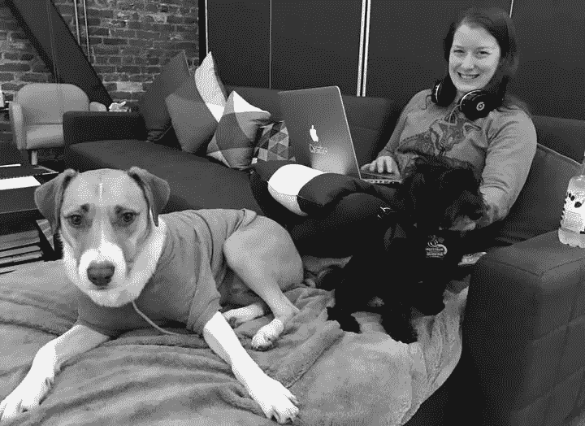

# 在实践社交距离的同时学习数据科学

> 原文：<https://towardsdatascience.com/learn-data-science-while-practicing-social-distancing-9c335006ceb9?source=collection_archive---------19----------------------->

## [在保持社交距离的同时学习数据科学](https://towardsdatascience.com/tagged/ldswsd)

## 我是如何帮助我的朋友充分利用在家的时间的

和我的朋友一起研究数据科学

# 更多在家的自由时间

在全球疫情时期，适应新的生活常态是一项挑战。在澳大利亚，我们的情况比许多其他国家好得多，至少目前是这样。然而，孤立仍然会让你沮丧。坚持“呆在他妈的家里”运动，我们都有更多的空闲时间。许多人试图通过学习新技能来明智地利用他们的独处时间。

# 学习数据科学的想法

为了这篇文章的目的，我把我朋友的名字改成了化名，以保护无辜的人。任何一起阅读的父母可能会认出我从流行的儿童电视节目 Bluey 中使用的名字😜

Bluey 别名来自两集:

1.布鲁伊的爸爸决定将布鲁伊和她的妹妹宾果重新命名为“丹尼斯”和“沙拉兰达”，这一集叫做“戏弄”。

2.布鲁和宾戈在《老奶奶》一集中扮演老奶奶“珍妮特”和“丽塔”。

我的一个朋友沙拉兰达是一名会计师，她告诉我她正考虑在疫情期间做一些研究。我问她在想什么学习？她不是很确定，但数据科学是她清单上的事情之一。我告诉她，如果她真的想学习，我很乐意帮助她。至少我可以教她足够多的东西，让她知道这是不是她想进一步追求的东西。

# 其他人加入进来

当我提出这个建议后，另一个朋友珍妮特也加入了进来。她是一名化学家和数据分析师。这些年来，她一直对学习数据科学感兴趣，并开始学习几次 python 编程。然而，生活阻碍了她，她没有继续下去。所以她问她是否可以和沙拉兰达一起学习。我说她当然可以，人越多越好。

因此，我向更多的朋友发出了做一些数据科学研究的邀请，并有更多的人接受了邀请。

我的朋友丹尼斯是一名律师，在她的工作中经常涉及技术。她想更多地了解数据科学到底是什么。对她来说，这个想法更多的是为了更好地理解数据科学，以便她在与数据科学家和技术合同互动时能够更轻松地完成工作。

另一个说愿意加入我们小学习小组的人是丽塔。她是一名研究科学家，刚刚完成生理学博士学位。我们以前在数据科学项目上合作过，并参加了政府举办的开放数据黑客马拉松 GovHack。

Rita 已经开始自学数据科学的某些方面，但是她有三个孩子，还有许多其他事情要做。所以她很难保持学习的动力。

# 小组学习

网上有很多自学的数据科学课程。然而，我从未发现我对一门客观的在线课程负有责任。你也不能总是在网络课程中提问。当我开始学习数据科学时，我希望有一群朋友一起学习。

和一群朋友一起学习数据科学似乎是完美的解决方案。我们可以互相问责。我总是发现，如果别人依赖我，保持对一个项目的热情会更容易。和朋友一起学习也比独自学习有趣得多。因此，即使我们目前不能面对面地见面，我们也可以分享这个项目来提高我们的技能。

我发现在过去，当我和朋友一起做活动时，比如学习一项新技能，我会比平时更多地看到他们。这项活动为接触和保持联系提供了动力。希望一起学习能让我们在这个几乎不可能面对面交流的困难时期保持理智和联系。

在学习复杂的概念时，有不同的观点也会很有帮助。来自不同人的问题可能会引发其他人的理解。因此，希望我们能够帮助彼此获得数据科学方面的新技能。

# 小组想从学习数据科学中获得什么

*   更好地理解什么是数据科学。
*   工作中使用的编程技巧。
*   通向新事业的可能途径。

# 我的数据科学背景

我已经做了几年的数据科学家。我的背景是神经科学，我通过免费的在线课程过渡到了数据科学。你可以在我之前的故事[“我如何在 6 个月内从零编码技能成为数据科学家”](/how-i-went-from-zero-coding-skills-to-data-scientist-in-6-months-c2207b65f2f3?source=friends_link&sk=89a5e171073c63d1eea389e80425a702)中了解我是如何进入数据科学的。我的旅程证明，如果你真的想学习数据科学，并全身心投入，你可以不读特定的大学学位。

数据科学有点像艺术，有许多方法可以达到预期的结果，对于如何解决问题也有不同的思想流派。我绝不是数据科学各个方面的专家。我不认为有人真的是。我期待在我们的旅程中学习一些新的数据科学技能。

在我们进行的过程中开发课程将会响应我的朋友们想要学习的数据科学方面。所以，任何读到这些帖子的人请不要把它们当成福音，这只是我们尽最大努力一起学习新东西。我将尽我所能提供我的专业知识，但也将根据需要利用其他资源。

# 我们将从哪里开始

虽然我的朋友不一定要在数据科学领域寻找职业，但我仍然很高兴能帮助他们学习并实现他们的目标。

为了让我们走上正轨，我想我会在媒体上记录我们的进展。我们已经建立了一个私人的 facebook 聊天平台，在那里我发布了包含这些课程的我的媒体文章的草稿链接。然后，我的朋友们在一个共享的谷歌文档中写下他们对问题和练习的答案。这样我可以看到他们在解决问题时的进展。然后在周末我会出版这个故事。

学数据科学的朋友背景千差万别。我不希望任何人在我们学习课程的过程中掉队，所以我们将从头开始。第一课假设没有编程或统计知识。

首先，我们将着手学习 SQL。这样，我们将知道如何从数据库中访问数据。所以请继续关注第一课，在 SQL 中创建一个表并用数据填充它。

# 时机

作为一个小组，我们决定每周完成一节课。这似乎是一个时间框架，既能让我们保持势头，又不会给家庭生活带来不必要的压力。当我们学习更复杂的课程时，我们可能需要修改时间框架。尽管有目标是好事。

# 如果你喜欢，就跟着去吧

如果你想加入我们，试着在这段强制的时间里提高自己的技能，请随时关注我帖子里的练习。希望我们都能玩得开心，学到新东西:)

除了数据，我的另一个爱好是绘画。你可以在 www.katemarielewis.com 找到我的野生动物艺术

# 社交距离学习数据科学的所有课程(LDSWSD)

 [## Ldswsd -走向数据科学

### 阅读《走向数据科学》中关于 Ldswsd 的文章。共享概念、想法和代码的媒体出版物。

towardsdatascience.com](https://towardsdatascience.com/tagged/ldswsd)